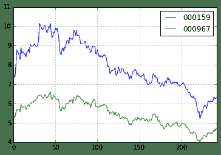
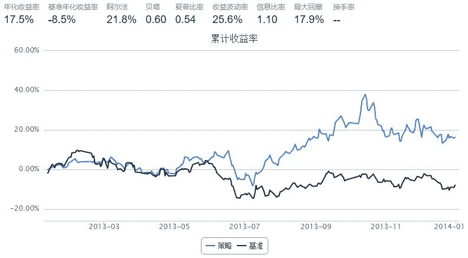

# 【统计套利】配对交易

> 来源：https://uqer.io/community/share/559c85baf9f06cb5614f190d

## 策略思路

寻找走势相关且股价相近的一对股票，根据其价格变动买卖

## 策略实现

+ 首先，历史前五日的Pearson相关系数若大于给定的阈值
+ 如果两只股票走势趋同，则按上涨（下跌）趋势买入（卖出）股票
+ 如果两只股票走势背离，则买入下跌股票，卖出上涨股票

首先需要在A股中寻找走势相关性很大的股票，这是一项很繁复的工作。为简单起见，这里直接使用了一个现成的结果：000159和000967在2012年的走势十分相似，这一点可以通过复权收盘价曲线来验证

```py
<matplotlib.axes.AxesSubplot at 0x6415790>
```



接下来我们对2013年全年的这两只股票进行配对交易策略的回测：

```py
from scipy.stats.stats import pearsonr

start = '2013-01-01'
end  = '2014-01-01'
benchmark = 'HS300'
universe = ['000159.XSHE', '000967.XSHE']
capital_base = 1000000

def initialize(account):
    account.cutoff = 0.9
    account.prev_prc1 = 0
    account.prev_prc2 = 0
    account.prev_prcb = 0

def handle_data(account):
    if len(account.universe) < 2: return
    
    clsp = account.get_attribute_history('closePrice', 5)
    stk1, stk2 = universe
    px1, px2 = clsp[stk1], clsp[stk2]
       
    prc1, prc2 = px1[-1], px2[-1]
    prcb = account.get_symbol_history('benchmark', 1)['return'][0]
    
    if account.prev_prc1 == 0:
        account.prev_prc1 = prc1
        account.prev_prc2 = prc2
        account.prev_prcb = prcb
        return

    corval, pval = pearsonr(px1, px2)
    
    if abs(corval) < account.cutoff:
        return
    
    mov1, mov2 = adj(prc1, prc2, prcb, account.prev_prc1, account.prev_prc2, account.prev_prcb)

    amount = 100000 / prc2    
    if mov1 > 0:
        order(stk2, amount)
    elif mov1 < 0:
        if account.valid_secpos.get(stk2, 0) > amount:
            order(stk2, -amount)
        else:
            order_to(stk2, 0)
            
    amount = 100000 / prc1
    if mov2 > 0:
        order(stk1, amount)
    elif mov2 < 0:
        if account.valid_secpos.get(stk1, 0) > amount:
            order(stk1, -amount)
        else:
            order_to(stk1, 0)
    
    account.prev_prc1 = prc1
    account.prev_prc2 = prc2
    account.prev_prcb = prcb

def adj(x, y, base, prev_x, prev_y, prev_base):
    dhs = base / prev_base - 1
    dx = x / prev_x - 1 - dhs
    dy = y / prev_y - 1 - dhs
    return dx, dy
```



```py
bt
```


| | tradeDate | cash | security_position | portfolio_value | benchmark_return | blotter |
| --- | --- | --- | --- | --- | --- | --- |
| 0   | 2013-01-11 |  1000000.000000 |                                                 {} |  1000000.000000 | -0.018703 |                                                 [] |
| 1   | 2013-01-14 |   802627.092268 |     {u'000159.XSHE': 16139, u'000967.XSHE': 21500} |  1008718.298268 |  0.038051 |  [Order(order_time: 2013-01-14, symbol: 000967.... |
| 2   | 2013-01-15 |   802627.092268 |     {u'000159.XSHE': 16139, u'000967.XSHE': 21500} |  1013493.762268 |  0.007033 |                                                 [] |
| 3   | 2013-01-16 |   802627.092268 |     {u'000159.XSHE': 16139, u'000967.XSHE': 21500} |  1013887.243268 | -0.007227 |                                                 [] |
| 4   | 2013-01-17 |   802627.092268 |     {u'000159.XSHE': 16139, u'000967.XSHE': 21500} |  1017193.274268 | -0.009445 |                                                 [] |
| 5   | 2013-01-18 |   601751.321172 |     {u'000159.XSHE': 31203, u'000967.XSHE': 41512} |  1019875.334172 |  0.016719 |  [Order(order_time: 2013-01-18, symbol: 000967.... |
| 6   | 2013-01-21 |   601751.321172 |     {u'000159.XSHE': 31203, u'000967.XSHE': 41512} |  1024320.333172 |  0.005957 |                                                 [] |
| 7   | 2013-01-22 |   601751.321172 |     {u'000159.XSHE': 31203, u'000967.XSHE': 41512} |  1022956.509172 | -0.005362 |                                                 [] |
| 8   | 2013-01-23 |   601751.321172 |     {u'000159.XSHE': 31203, u'000967.XSHE': 41512} |  1020170.513172 |  0.004066 |                                                 [] |
| 9   | 2013-01-24 |   601751.321172 |     {u'000159.XSHE': 31203, u'000967.XSHE': 41512} |  1010615.301172 | -0.009473 |                                                 [] |
| 10  | 2013-01-25 |   601751.321172 |     {u'000159.XSHE': 31203, u'000967.XSHE': 41512} |  1007214.174172 | -0.004290 |                                                 [] |
| 11  | 2013-01-28 |   601751.321172 |     {u'000159.XSHE': 31203, u'000967.XSHE': 41512} |  1015317.846172 |  0.031182 |                                                 [] |
| 12  | 2013-01-29 |   601751.321172 |     {u'000159.XSHE': 31203, u'000967.XSHE': 41512} |  1032167.466172 |  0.009050 |                                                 [] |
| 13  | 2013-01-30 |   601751.321172 |     {u'000159.XSHE': 31203, u'000967.XSHE': 41512} |  1037040.199172 |  0.004802 |                                                 [] |
| 14  | 2013-01-31 |   601751.321172 |     {u'000159.XSHE': 31203, u'000967.XSHE': 41512} |  1037199.250172 | -0.000681 |                                                 [] |
| 15  | 2013-02-01 |   601751.321172 |     {u'000159.XSHE': 31203, u'000967.XSHE': 41512} |  1044424.173172 |  0.021006 |                                                 [] |
| 16  | 2013-02-04 |   601751.321172 |     {u'000159.XSHE': 31203, u'000967.XSHE': 41512} |  1053929.951172 |  0.001713 |                                                 [] |
| 17  | 2013-02-05 |   601751.321172 |     {u'000159.XSHE': 31203, u'000967.XSHE': 41512} |  1042352.810172 |  0.008606 |                                                 [] |
| 18  | 2013-02-06 |   601751.321172 |     {u'000159.XSHE': 31203, u'000967.XSHE': 41512} |  1036748.235172 |  0.001505 |                                                 [] |
| 19  | 2013-02-07 |   601751.321172 |     {u'000159.XSHE': 31203, u'000967.XSHE': 41512} |  1035219.288172 | -0.005753 |                                                 [] |
| 20  | 2013-02-08 |   601751.321172 |     {u'000159.XSHE': 31203, u'000967.XSHE': 41512} |  1038390.029172 |  0.004294 |                                                 [] |
| 21  | 2013-02-18 |   601751.321172 |     {u'000159.XSHE': 31203, u'000967.XSHE': 41512} |  1040366.776172 | -0.012357 |                                                 [] |
| 22  | 2013-02-19 |   601751.321172 |     {u'000159.XSHE': 31203, u'000967.XSHE': 41512} |  1034837.773172 | -0.018948 |                                                 [] |
| 23  | 2013-02-20 |   601751.321172 |     {u'000159.XSHE': 31203, u'000967.XSHE': 41512} |  1041832.310172 |  0.006341 |                                                 [] |
| 24  | 2013-02-21 |   601751.321172 |     {u'000159.XSHE': 31203, u'000967.XSHE': 41512} |  1030863.855172 | -0.034074 |                                                 [] |
| 25  | 2013-02-22 |   601751.321172 |     {u'000159.XSHE': 31203, u'000967.XSHE': 41512} |  1031881.589172 | -0.005340 |                                                 [] |
| 26  | 2013-02-25 |   601751.321172 |     {u'000159.XSHE': 31203, u'000967.XSHE': 41512} |  1039886.408172 |  0.003220 |                                                 [] |
| 27  | 2013-02-26 |   601751.321172 |     {u'000159.XSHE': 31203, u'000967.XSHE': 41512} |  1027334.880172 | -0.014346 |                                                 [] |
| 28  | 2013-02-27 |   601751.321172 |     {u'000159.XSHE': 31203, u'000967.XSHE': 41512} |  1036669.463172 |  0.010547 |                                                 [] |
| 29  | 2013-02-28 |   601751.321172 |     {u'000159.XSHE': 31203, u'000967.XSHE': 41512} |  1049123.518172 |  0.030312 |                                                 [] |
| ... | ... | ... | ... | ... | ... | ... |
| 203 | 2013-11-20 |        4.001066 |  {u'000159.XSHE': 58955.0, u'000967.XSHE': 1104... |  1213819.901066 |  0.005261 |                                                 [] |
| 204 | 2013-11-21 |        4.001066 |  {u'000159.XSHE': 58955.0, u'000967.XSHE': 1104... |  1207170.725066 | -0.006132 |                                                 [] |
| 205 | 2013-11-22 |        4.001066 |  {u'000159.XSHE': 58955.0, u'000967.XSHE': 1104... |  1191941.099066 | -0.004988 |                                                 [] |
| 206 | 2013-11-25 |        4.001066 |  {u'000159.XSHE': 58955.0, u'000967.XSHE': 1104... |  1185756.570066 | -0.003895 |                                                 [] |
| 207 | 2013-11-26 |        4.001066 |  {u'000159.XSHE': 58955.0, u'000967.XSHE': 1104... |  1202201.685066 | -0.000507 |                                                 [] |
| 208 | 2013-11-27 |        4.001066 |  {u'000159.XSHE': 58955.0, u'000967.XSHE': 1104... |  1247942.107066 |  0.011339 |                                                 [] |
| 209 | 2013-11-28 |        4.001066 |  {u'000159.XSHE': 58955.0, u'000967.XSHE': 1104... |  1254278.937066 |  0.010375 |                                                 [] |
| 210 | 2013-11-29 |        4.001066 |  {u'000159.XSHE': 58955.0, u'000967.XSHE': 1104... |  1254572.047066 | -0.000242 |  [Order(order_time: 2013-11-29, symbol: 000967.... |
| 211 | 2013-12-02 |        4.001066 |  {u'000159.XSHE': 58955.0, u'000967.XSHE': 1104... |  1162773.529066 | -0.008266 |  [Order(order_time: 2013-12-02, symbol: 000967.... |
| 212 | 2013-12-03 |   205057.003206 |  {u'000159.XSHE': 46102.0, u'000967.XSHE': 9480... |  1203266.619206 |  0.009922 |  [Order(order_time: 2013-12-03, symbol: 000967.... |
| 213 | 2013-12-04 |     7547.120636 |  {u'000159.XSHE': 58573.0, u'000967.XSHE': 1098... |  1223800.796636 |  0.013243 |  [Order(order_time: 2013-12-04, symbol: 000967.... |
| 214 | 2013-12-05 |     7547.120636 |  {u'000159.XSHE': 58573.0, u'000967.XSHE': 1098... |  1211481.369636 | -0.002804 |                                                 [] |
| 215 | 2013-12-06 |     7547.120636 |  {u'000159.XSHE': 58573.0, u'000967.XSHE': 1098... |  1205769.229636 | -0.006446 |                                                 [] |
| 216 | 2013-12-09 |     7547.120636 |  {u'000159.XSHE': 58573.0, u'000967.XSHE': 1098... |  1212153.686636 | -0.000575 |                                                 [] |
| 217 | 2013-12-10 |     7547.120636 |  {u'000159.XSHE': 58573.0, u'000967.XSHE': 1098... |  1216462.619636 |  0.001000 |                                                 [] |
| 218 | 2013-12-11 |     7547.120636 |  {u'000159.XSHE': 58573.0, u'000967.XSHE': 1098... |  1191498.173636 | -0.016533 |                                                 [] |
| 219 | 2013-12-12 |     7547.120636 |  {u'000159.XSHE': 58573.0, u'000967.XSHE': 1098... |  1187601.796636 | -0.001140 |                                                 [] |
| 220 | 2013-12-13 |     7547.120636 |  {u'000159.XSHE': 58573.0, u'000967.XSHE': 1098... |  1180581.953636 | -0.001402 |                                                 [] |
| 221 | 2013-12-16 |     7547.120636 |  {u'000159.XSHE': 58573.0, u'000967.XSHE': 1098... |  1160961.657636 | -0.016085 |                                                 [] |
| 222 | 2013-12-17 |     7547.120636 |  {u'000159.XSHE': 58573.0, u'000967.XSHE': 1098... |  1172930.532636 | -0.004878 |                                                 [] |
| 223 | 2013-12-18 |     7547.120636 |  {u'000159.XSHE': 58573.0, u'000967.XSHE': 1098... |  1175604.134636 |  0.000361 |                                                 [] |
| 224 | 2013-12-19 |     7547.120636 |  {u'000159.XSHE': 58573.0, u'000967.XSHE': 1098... |  1176775.594636 | -0.010525 |                                                 [] |
| 225 | 2013-12-20 |     7547.120636 |  {u'000159.XSHE': 58573.0, u'000967.XSHE': 1098... |  1132028.254636 | -0.023272 |                                                 [] |
| 226 | 2013-12-23 |     7547.120636 |  {u'000159.XSHE': 58573.0, u'000967.XSHE': 1098... |  1147914.771636 |  0.002840 |                                                 [] |
| 227 | 2013-12-24 |     7547.120636 |  {u'000159.XSHE': 58573.0, u'000967.XSHE': 1098... |  1159575.888636 |  0.001593 |                                                 [] |
| 228 | 2013-12-25 |     7547.120636 |  {u'000159.XSHE': 58573.0, u'000967.XSHE': 1098... |  1178451.287636 |  0.007372 |                                                 [] |
| 229 | 2013-12-26 |     7547.120636 |  {u'000159.XSHE': 58573.0, u'000967.XSHE': 1098... |  1158503.363636 | -0.017257 |                                                 [] |
| 230 | 2013-12-27 |     7547.120636 |  {u'000159.XSHE': 58573.0, u'000967.XSHE': 1098... |  1166499.850636 |  0.016836 |                                                 [] |
| 231 | 2013-12-30 |     7547.120636 |  {u'000159.XSHE': 58573.0, u'000967.XSHE': 1098... |  1158181.598636 | -0.001745 |                                                 [] |
| 232 | 2013-12-31 |     7547.120636 |  {u'000159.XSHE': 58573.0, u'000967.XSHE': 1098... |  1162504.538636 |  0.013294 |                                                 [] |

```
233 rows × 6 columns
```

根据`bt`的表现，在仓位控制和组合管理方面应该还有着不少进一步优化的空间

