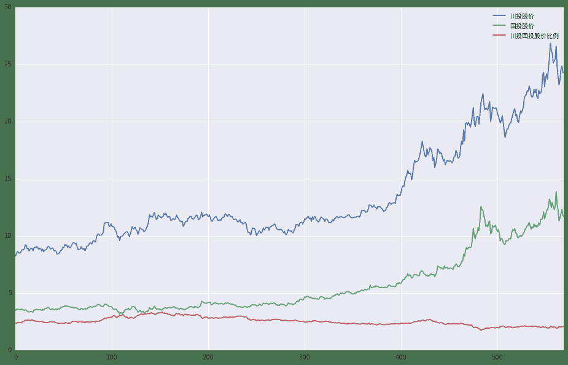
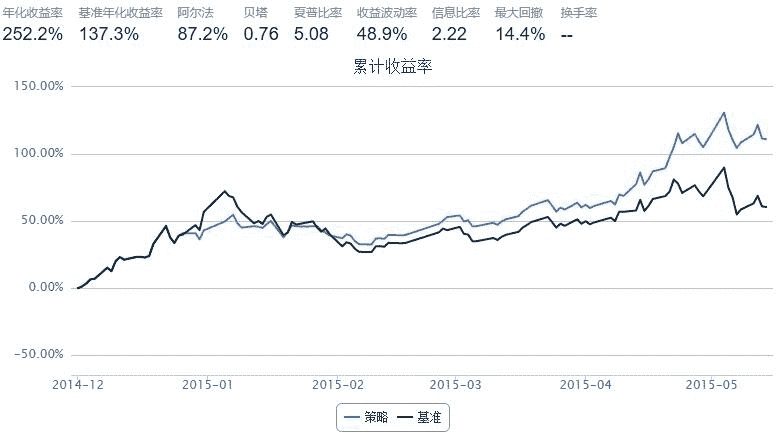

# 相似公司股票搬砖

> 来源：https://uqer.io/community/share/5555cbfaf9f06c6c7404f8ae

自从牛市来了,小老弟也去开了个户,平时常在雪球上找找票.

前段时间听到两只股票:川投能源,国投电力.

这两个公司是一对好基友, 他们的主要资产是一家水电公司的48%,52%股份, 两只股价常在两倍之间变动.

于是出现很多人在这两只股票之间搬砖, 本帖就来验证一下搬砖的效果, 看看结果会不会令人大吃一惊呢?

```py
# 首先我们简单看下两只股票的走势.

import seaborn as sns
import pandas as pd
import matplotlib.pylab as pylab

begin_date, end_date = '20130101', '20150514'
ct,gt = '600674', '600886'
ct = DataAPI.MktEqudAdjGet(ticker=ct, beginDate=begin_date, endDate=end_date)
gt = DataAPI.MktEqudAdjGet(ticker=gt, beginDate=begin_date, endDate=end_date)

liangtou =pd.DataFrame()
liangtou['川投股价'] = ct.closePrice
liangtou['国投股价'] = gt.closePrice
liangtou['川投国投股价比例'] =  ct.closePrice / gt.closePrice
liangtou.plot( figsize=(16,10))
pylab.legend([u'川投股价',u'国投股价', u'川投国投股价比例'], prop=font)

<matplotlib.legend.Legend at 0x754ce90>
```



重点来了, 利用量化实验室的strategy模式, 咱来编写一个策略.

+ 起始建仓: 全仓600886
+ 起始日期: 2014-12-01
+ 结束日期: 2015-05-14
+ 起始资金: 10w
+ 调仓频率: 1天
+ 调仓信号: 川投能源收盘价/国投能源收盘价*100%-200% 之差如果大于1%, 卖出886买入774, 如果小于-1%,则卖出774买入886

```py
start = '2014-12-01'                      # 回测起始时间
end = '2015-05-14'                        # 回测结束时间
benchmark = '600886.XSHG'                   # 策略参考标准
universe = ['600674.XSHG', '600886.XSHG']        # 证券池
capital_base = 100000                      # 起始资金
refresh_rate = 1                         # 调仓频率，即每 refresh_rate 个交易日执行一次 handle_data() 函数
ct_stk, gt_stk = universe

def initialize(account):                   # 初始化虚拟账户状态
    pass

def handle_data(account):                  # 每天执行一次
    
    if len(account.universe) < 2: # 有停牌的话, 就跳过.
        return
    
    ct_price, gt_price = account.referencePrice[ct_stk], account.referencePrice[gt_stk]    
    percent = int(100*ct_price/gt_price-200)
    
    #第一次, 满仓买入600886
    if not account.valid_secpos:
        order(gt_stk, capital_base/gt_price)
        return

    if percent>1 and account.secpos.get(ct_stk, 0): #买886, 卖774
        amount = account.secpos.get(ct_stk, 0)
        print account.current_date, '买886,数量:%s, 卖774,数量:%s' %(amount*ct_price/gt_price, amount)
        order(ct_stk, -amount)
        order(gt_stk, amount*ct_price/gt_price)
        
    elif percent<-1 and account.secpos.get(gt_stk, 0): #卖886, 买774
        amount = account.secpos.get(gt_stk, 0)
        print account.current_date, '卖886,数量:%s, 买774,数量:%s' %(amount, amount*ct_price/gt_price)
        order(gt_stk, -amount)
        order(ct_stk, amount*gt_price/ct_price)
```



```
2014-12-26 00:00:00 卖886,数量:13698, 买774,数量:27112.3136095
2015-02-03 00:00:00 买886,数量:14327.3103448, 卖774,数量:6897.0
2015-02-26 00:00:00 卖886,数量:14308.0, 买774,数量:28103.5159729
2015-03-05 00:00:00 买886,数量:14717.8178257, 卖774,数量:7284
2015-04-10 00:00:00 卖886,数量:14717, 买774,数量:28881.7914485
2015-04-14 00:00:00 买886,数量:15404.6484375, 卖774,数量:7385.0
2015-04-21 00:00:00 卖886,数量:15390.0, 买774,数量:29629.81316
2015-04-24 00:00:00 买886,数量:16527.4811393, 卖774,数量:7993
2015-05-05 00:00:00 卖886,数量:16527, 买774,数量:31706.5606061
2015-05-08 00:00:00 买886,数量:17669.7435897, 卖774,数量:8614
```

这结果真是让老弟目瞪口呆啊, 赶紧搬起.

该策略只是比较的昨日收盘价, 如果考虑日间搬砖, 简直不敢想了[口水].

