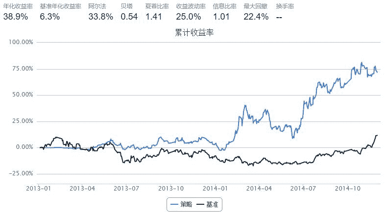

# Paired trading

> 来源：https://uqer.io/community/share/54895a8df9f06c31c3950ca0

##配对交易

策略思路

寻找走势相关且股价相近的一对股票，根据其价格变动买卖

策略实现

历史前五日的Pearson相关系数若大于给定的阈值则触发买卖操作

```py
from scipy.stats.stats import pearsonr

start = datetime(2013, 1, 1)
end   = datetime(2014, 12, 1)
benchmark = 'HS300'
universe = ['000559.XSHE', '600126.XSHG']
capital_base = 1e6 

corlen = 5

def initialize(account):
    add_history('hist', corlen)
    account.cutoff = 0.9
    account.prev_prc1 = 0
    account.prev_prc2 = 0
    account.prev_prcb = 0

def handle_data(account, data):
    stk1 = universe[0]
    stk2 = universe[1]
    
    prc1 = data[stk1]['closePrice']
    prc2 = data[stk2]['closePrice']
    prcb = data['HS300']['return']
    
    px1 = account.hist[stk1]['closePrice'].values
    px2 = account.hist[stk2]['closePrice'].values
    pxb = account.hist['HS300']['return'].values
    
    corval, pval = pearsonr(px1, px2)
    
    mov1, mov2 = adj(prc1, prc2, prcb, account.prev_prc1, account.prev_prc2, account.prev_prcb)


    amount =1e4 / prc2
    if (mov1 > 0) and (abs(corval) > account.cutoff):
        order(stk2, amount)
    elif (mov1 < 0) and (abs(corval) > account.cutoff):
        if (account.position.stkpos.get(stk2, 0) > amount):
            order(stk2, -amount)
        else:
            order_to(stk2, 0)
            
    amount =1e4 / prc1
    if (mov2 > 0) and (abs(corval) > account.cutoff):
        order(stk1, amount)
    elif (mov2 < 0) and (abs(corval) > account.cutoff):
        if (account.position.stkpos.get(stk1, 0) > amount):
            order(stk1, -amount)
        else:
            order_to(stk1, 0)
    
    account.prev_prc1 = prc1
    account.prev_prc2 = prc2
    account.prev_prcb = prcb
    
    
def dmv(curr, prev):
    delta = curr / prev - 1
    return delta

def adj(x, y, base, prev_x, prev_y, prev_base):
    dhs = dmv(base, prev_base)
    dx = dmv(x, prev_x) - dhs
    dy = dmv(y, prev_y) - dhs
    return (dx, dy)
```



```py
min(bt.cash)

232096.85369499651
```

```py
import pandas as pd
import numpy as np
from datetime import datetime

import quartz
import quartz.backtest as qb
import quartz.performance as qp
from quartz.api import *

from scipy.stats.stats import pearsonr

start = datetime(2013, 1, 1)				# 回测起始时间
end   = datetime(2014, 12, 1)				# 回测结束时间
benchmark = 'HS300'							# 使用沪深 300 作为参考标准
capital_base = 1e6                          # 起始资金

corlen = 5

def initialize(account):					# 初始化虚拟账户状态
    add_history('hist', corlen)
    account.cutoff = 0.9
    account.prev_prc1 = 0
    account.prev_prc2 = 0
    account.prev_prcb = 0

def handle_data(account, data):				# 每个交易日的买入卖出指令
    stk1 = universe[0]
    stk2 = universe[1]
    
    prc1 = data[stk1]['closePrice']
    prc2 = data[stk2]['closePrice']
    prcb = data['HS300']['return']
    
    px1 = account.hist[stk1]['closePrice'].values
    px2 = account.hist[stk2]['closePrice'].values
    pxb = account.hist['HS300']['return'].values
    
    corval, pval = pearsonr(px1, px2)
    
    mov1, mov2 = adj(prc1, prc2, prcb, account.prev_prc1, account.prev_prc2, account.prev_prcb)

    #amount = int( 0.08 * capital_base / prc2)
    amount =1e4 / prc2
    if (mov1 > 0) and (abs(corval) > account.cutoff):
        order(stk2, amount)
    elif (mov1 < 0) and (abs(corval) > account.cutoff):
        if (account.position.stkpos.get(stk2, 0) > amount):
            order(stk2, -amount)
        else:
            order_to(stk2, 0)
            
    #amount = int(0.08 * capital_base / prc1)
    amount =1e4 / prc1
    if (mov2 > 0) and (abs(corval) > account.cutoff):
        order(stk1, amount)
    elif (mov2 < 0) and (abs(corval) > account.cutoff):
        if (account.position.stkpos.get(stk1, 0) > amount):
            order(stk1, -amount)
        else:
            order_to(stk1, 0)
    
    account.prev_prc1 = prc1
    account.prev_prc2 = prc2
    account.prev_prcb = prcb
    
    
def dmv(curr, prev):
    delta = curr / prev - 1
    return delta

def adj(x, y, base, prev_x, prev_y, prev_base):
    dhs = dmv(base, prev_base)
    dx = dmv(x, prev_x) - dhs
    dy = dmv(y, prev_y) - dhs
    return (dx, dy)


pool_raw = pd.read_csv("po.pair.2012.csv")
pool = []
for i in range(len(pool_raw)):
    s1, s2 = pool_raw.loc[i].tolist()
    if [s2, s1] not in pool:
        pool.append([s1, s2])

outfile = []
for i, universe in enumerate(pool):
    print i
    try:
        bt = qb.backtest(start, end, benchmark, universe, capital_base, initialize = initialize, handle_data = handle_data)
        perf = qp.perf_parse(bt)
        outfile.append(universe + [perf["annualized_return"], perf["sharpe"]])
    except:
        pass    
    
keys = ['stock1', 'stock2', 'annualized_return', 'sharpe']
outdict = {}
outfile =  zip(*sorted(outfile, key=lambda x:x[2], reverse=True))
for i,k in enumerate(keys):
    outdict[k] = outfile[i]
outdict = pd.DataFrame(outdict).loc[:, keys]
outdict

['000066.XSHE', '000707.XSHE']
['000066.XSHE', '600117.XSHG']
['000066.XSHE', '600126.XSHG']
['000066.XSHE', '600819.XSHG']
['000089.XSHE', '600035.XSHG']
['000089.XSHE', '600037.XSHG']
['000089.XSHE', '600595.XSHG']
['000159.XSHE', '000967.XSHE']
['000159.XSHE', '600595.XSHG']
['000417.XSHE', '000541.XSHE']
['000417.XSHE', '000685.XSHE']
['000417.XSHE', '600875.XSHG']
['000425.XSHE', '000528.XSHE']
['000507.XSHE', '600391.XSHG']
['000541.XSHE', '000987.XSHE']
['000541.XSHE', '600330.XSHG']
['000541.XSHE', '600883.XSHG']
['000554.XSHE', '000707.XSHE']
['000559.XSHE', '600026.XSHG']
['000559.XSHE', '600126.XSHG']
['000559.XSHE', '600477.XSHG']
['000559.XSHE', '600581.XSHG']
['000559.XSHE', '601666.XSHG']
['000635.XSHE', '000707.XSHE']
['000635.XSHE', '600068.XSHG']
['000635.XSHE', '600117.XSHG']
['000635.XSHE', '600188.XSHG']
['000635.XSHE', '600295.XSHG']
['000635.XSHE', '600550.XSHG']
['000635.XSHE', '600819.XSHG']
['000635.XSHE', '601168.XSHG']
['000635.XSHE', '601233.XSHG']
['000650.XSHE', '600261.XSHG']
['000683.XSHE', '000936.XSHE']
['000683.XSHE', '600595.XSHG']
['000685.XSHE', '000988.XSHE']
['000685.XSHE', '601101.XSHG']
['000698.XSHE', '000949.XSHE']
['000707.XSHE', '000911.XSHE']
['000707.XSHE', '000969.XSHE']
['000707.XSHE', '000987.XSHE']
['000707.XSHE', '600117.XSHG']
['000707.XSHE', '600295.XSHG']
['000707.XSHE', '600550.XSHG']
['000707.XSHE', '600831.XSHG']
['000707.XSHE', '601168.XSHG']
['000707.XSHE', '601233.XSHG']
['000708.XSHE', '600327.XSHG']
['000709.XSHE', '601107.XSHG']
['000709.XSHE', '601618.XSHG']
['000717.XSHE', '600282.XSHG']
['000717.XSHE', '600307.XSHG']
['000717.XSHE', '600808.XSHG']
['000761.XSHE', '600320.XSHG']
['000761.XSHE', '600548.XSHG']
['000822.XSHE', '600117.XSHG']
['000830.XSHE', '600068.XSHG']
['000830.XSHE', '600320.XSHG']
['000830.XSHE', '600550.XSHG']
['000877.XSHE', '601519.XSHG']
['000898.XSHE', '600022.XSHG']
['000898.XSHE', '600808.XSHG']
['000911.XSHE', '600550.XSHG']
['000916.XSHE', '600033.XSHG']
['000916.XSHE', '600035.XSHG']
['000916.XSHE', '600126.XSHG']
['000930.XSHE', '600026.XSHG']
['000932.XSHE', '600569.XSHG']
['000933.XSHE', '600348.XSHG']
['000933.XSHE', '600595.XSHG']
['000936.XSHE', '600477.XSHG']
['000937.XSHE', '600348.XSHG']
['000937.XSHE', '600508.XSHG']
['000937.XSHE', '600997.XSHG']
['000937.XSHE', '601001.XSHG']
['000939.XSHE', '600819.XSHG']
['000967.XSHE', '600879.XSHG']
['000969.XSHE', '600831.XSHG']
['000973.XSHE', '600460.XSHG']
['000987.XSHE', '600636.XSHG']
['000987.XSHE', '600827.XSHG']
['000987.XSHE', '601001.XSHG']
['600008.XSHG', '600035.XSHG']
['600012.XSHG', '600428.XSHG']
['600020.XSHG', '600033.XSHG']
['600020.XSHG', '600035.XSHG']
['600026.XSHG', '600068.XSHG']
['600026.XSHG', '600089.XSHG']
['600026.XSHG', '600126.XSHG']
['600026.XSHG', '600307.XSHG']
['600026.XSHG', '600331.XSHG']
['600026.XSHG', '600375.XSHG']
['600026.XSHG', '600581.XSHG']
['600026.XSHG', '600963.XSHG']
['600026.XSHG', '601666.XSHG']
['600026.XSHG', '601898.XSHG']
['600033.XSHG', '600035.XSHG']
['600035.XSHG', '600126.XSHG']
['600035.XSHG', '600269.XSHG']
['600035.XSHG', '600307.XSHG']
['600035.XSHG', '600586.XSHG']
['600037.XSHG', '600327.XSHG']
['600068.XSHG', '600126.XSHG']
['600068.XSHG', '600269.XSHG']
['600068.XSHG', '600320.XSHG']
['600068.XSHG', '600550.XSHG']
['600068.XSHG', '601001.XSHG']
['600068.XSHG', '601666.XSHG']
['600089.XSHG', '600581.XSHG']
['600100.XSHG', '600117.XSHG']
['600117.XSHG', '600295.XSHG']
['600117.XSHG', '600339.XSHG']
['600117.XSHG', '601168.XSHG']
['600117.XSHG', '601233.XSHG']
['600126.XSHG', '600282.XSHG']
['600126.XSHG', '600327.XSHG']
['600126.XSHG', '600569.XSHG']
['600126.XSHG', '600581.XSHG']
['600126.XSHG', '600808.XSHG']
['600126.XSHG', '600963.XSHG']
['600160.XSHG', '600449.XSHG']
['600160.XSHG', '601216.XSHG']
['600160.XSHG', '601311.XSHG']
['600188.XSHG', '600295.XSHG']
['600188.XSHG', '601001.XSHG']
['600231.XSHG', '600282.XSHG']
['600269.XSHG', '601618.XSHG']
['600282.XSHG', '600307.XSHG']
['600282.XSHG', '600569.XSHG']
['600282.XSHG', '600808.XSHG']
['600282.XSHG', '600963.XSHG']
['600307.XSHG', '600581.XSHG']
['600307.XSHG', '600808.XSHG']
['600307.XSHG', '600963.XSHG']
['600320.XSHG', '600548.XSHG']
['600320.XSHG', '601600.XSHG']
['600330.XSHG', '600883.XSHG']
['600330.XSHG', '601268.XSHG']
['600331.XSHG', '600581.XSHG']
['600348.XSHG', '600508.XSHG']
['600348.XSHG', '600997.XSHG']
['600348.XSHG', '601001.XSHG']
['600368.XSHG', '600527.XSHG']
['600375.XSHG', '600581.XSHG']
['600391.XSHG', '601100.XSHG']
['600449.XSHG', '601311.XSHG']
['600449.XSHG', '601519.XSHG']
['600460.XSHG', '601908.XSHG']
['600477.XSHG', '600581.XSHG']
['600508.XSHG', '600546.XSHG']
['600508.XSHG', '600997.XSHG']
['600522.XSHG', '600973.XSHG']
['600550.XSHG', '600831.XSHG']
['600569.XSHG', '600808.XSHG']
['600569.XSHG', '600963.XSHG']
['600581.XSHG', '600963.XSHG']
['600581.XSHG', '601001.XSHG']
['600581.XSHG', '601168.XSHG']
['600581.XSHG', '601666.XSHG']
['600586.XSHG', '601268.XSHG']
['600595.XSHG', '601001.XSHG']
['600595.XSHG', '601168.XSHG']
['600595.XSHG', '601666.XSHG']
['600688.XSHG', '600871.XSHG']
['600785.XSHG', '600827.XSHG']
['600808.XSHG', '600963.XSHG']
['600827.XSHG', '601001.XSHG']
['600875.XSHG', '601001.XSHG']
['600883.XSHG', '601268.XSHG']
['601001.XSHG', '601101.XSHG']
['601001.XSHG', '601168.XSHG']
['601001.XSHG', '601666.XSHG']
['601101.XSHG', '601666.XSHG']
['601168.XSHG', '601666.XSHG']
```


| | stock1 | stock2 | annualized_return | sharpe |
| --- | --- | --- | --- | --- |
| 0  |  000761.XSHE |  600548.XSHG |  0.489473 |  2.411514 |
| 1  |  000708.XSHE |  600327.XSHG |  0.447337 |  2.021270 |
| 2  |  600126.XSHG |  600327.XSHG |  0.438380 |  1.946916 |
| 3  |  000554.XSHE |  000707.XSHE |  0.431123 |  1.331038 |
| 4  |  000939.XSHE |  600819.XSHG |  0.409471 |  1.919758 |
| 5  |  600026.XSHG |  600963.XSHG |  0.408791 |  1.681338 |
| 6  |  600037.XSHG |  600327.XSHG |  0.395624 |  1.691877 |
| 7  |  600808.XSHG |  600963.XSHG |  0.391988 |  1.724114 |
| 8  |  000559.XSHE |  600126.XSHG |  0.389043 |  1.413595 |
| 9  |  000761.XSHE |  600320.XSHG |  0.384325 |  1.807262 |
| 10 |  600126.XSHG |  600963.XSHG |  0.378064 |  1.662569 |
| 11 |  600126.XSHG |  600808.XSHG |  0.375825 |  1.513791 |
| 12 |  000936.XSHE |  600477.XSHG |  0.375135 |  1.707097 |
| 13 |  000930.XSHE |  600026.XSHG |  0.372924 |  1.524350 |
| 14 |  600320.XSHG |  600548.XSHG |  0.372499 |  2.083496 |
| 15 |  000507.XSHE |  600391.XSHG |  0.365637 |  1.813873 |
| 16 |  000559.XSHE |  601666.XSHG |  0.350235 |  0.925901 |
| 17 |  600012.XSHG |  600428.XSHG |  0.327834 |  1.722317 |
| 18 |  000916.XSHE |  600033.XSHG |  0.327795 |  1.406093 |
| 19 |  600035.XSHG |  600126.XSHG |  0.326167 |  1.442674 |
| 20 |  600827.XSHG |  601001.XSHG |  0.322705 |  0.957791 |
| 21 |  000717.XSHE |  600808.XSHG |  0.320737 |  1.293439 |
| 22 |  000559.XSHE |  600477.XSHG |  0.306670 |  1.218095 |
| 23 |  000685.XSHE |  000988.XSHE |  0.302593 |  1.692933 |
| 24 |  000683.XSHE |  000936.XSHE |  0.301804 |  1.550496 |
| 25 |  000559.XSHE |  600026.XSHG |  0.295510 |  1.279449 |
| 26 |  600269.XSHG |  601618.XSHG |  0.294215 |  1.486413 |
| 27 |  600026.XSHG |  600126.XSHG |  0.293884 |  1.441490 |
| 28 |  600068.XSHG |  600126.XSHG |  0.289457 |  1.261351 |
| 29 |  000159.XSHE |  600595.XSHG |  0.288982 |  0.946365 |
| 30 |  600020.XSHG |  600033.XSHG |  0.288243 |  1.489764 |
| 31 |  600126.XSHG |  600569.XSHG |  0.287607 |  1.371374 |
| 32 |  000635.XSHE |  600819.XSHG |  0.285135 |  1.364688 |
| 33 |  600068.XSHG |  600320.XSHG |  0.273513 |  1.262845 |
| 34 |  600785.XSHG |  600827.XSHG |  0.272658 |  0.842093 |
| 35 |  000089.XSHE |  600595.XSHG |  0.269903 |  1.256524 |
| 36 |  000898.XSHE |  600808.XSHG |  0.269717 |  1.074201 |
| 37 |  000717.XSHE |  600282.XSHG |  0.267478 |  1.270872 |
| 38 |  600282.XSHG |  600808.XSHG |  0.266402 |  1.181157 |
| 39 |  000916.XSHE |  600035.XSHG |  0.264325 |  1.079520 |
| 40 |  000089.XSHE |  600037.XSHG |  0.264201 |  1.467101 |
| 41 |  600026.XSHG |  600068.XSHG |  0.263959 |  1.107977 |
| 42 |  600026.XSHG |  600331.XSHG |  0.261025 |  0.977858 |
| 43 |  600020.XSHG |  600035.XSHG |  0.260176 |  1.119975 |
| 44 |  600569.XSHG |  600963.XSHG |  0.260006 |  1.154372 |
| 45 |  600307.XSHG |  600963.XSHG |  0.258488 |  1.322409 |
| 46 |  000898.XSHE |  600022.XSHG |  0.258246 |  1.100292 |
| 47 |  600282.XSHG |  600963.XSHG |  0.257496 |  1.175741 |
| 48 |  600307.XSHG |  600808.XSHG |  0.256071 |  1.062023 |
| 49 |  600126.XSHG |  600282.XSHG |  0.255657 |  1.318676 |
| 50 |  600033.XSHG |  600035.XSHG |  0.255634 |  1.055682 |
| 51 |  000709.XSHE |  601618.XSHG |  0.253129 |  1.062565 |
| 52 |  600026.XSHG |  600307.XSHG |  0.253119 |  0.985825 |
| 53 |  600026.XSHG |  600375.XSHG |  0.250793 |  1.063874 |
| 54 |  000066.XSHE |  600126.XSHG |  0.247493 |  1.469341 |
| 55 |  000830.XSHE |  600320.XSHG |  0.247001 |  1.370327 |
| 56 |  600320.XSHG |  601600.XSHG |  0.246534 |  0.966634 |
| 57 |  000717.XSHE |  600307.XSHG |  0.245805 |  1.202750 |
| 58 |  000417.XSHE |  000685.XSHE |  0.245031 |  1.189700 |
| 59 |  600330.XSHG |  600883.XSHG |  0.243437 |  1.086147 |
| ... | ... | ... | ... |

```
174 rows × 4 columns
```

```py
a = list(outfile[2])
'percentage of outperform HS300: %f' % (1.*len([x for x in a if x>0.117]) / len(a))

'percentage of outperform HS300: 0.741379'
```

