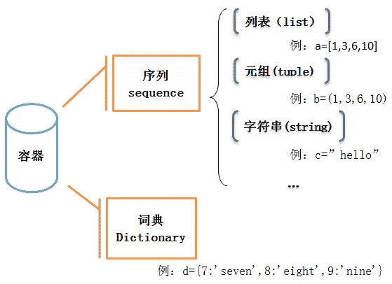
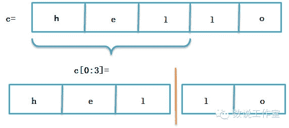
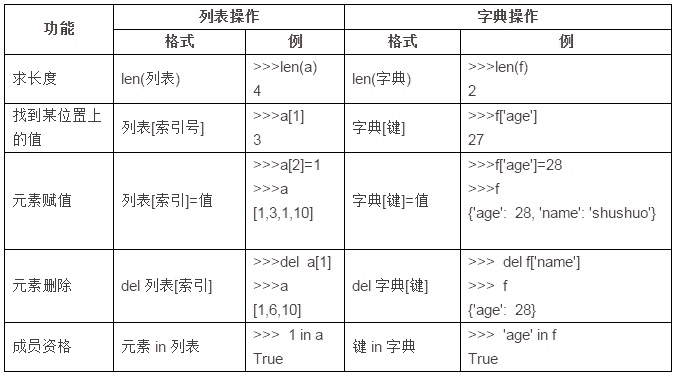

# 量化分析师的Python日记【第1天：谁来给我讲讲Python？】

> 来源：https://uqer.io/community/share/54c89443f9f06c276f651a52

## “谁来给我讲讲Python？”

作为无基础的初学者，只想先大概了解一下Python，随便编个小程序，并能看懂一般的程序，那些什么JAVA啊、C啊、继承啊、异常啊通通不懂怎么办，于是我找了很多资料，写成下面这篇日记，希望以完全初学者的角度入手来认识Python这个在量化领域日益重要的语言

## 一，熟悉基本

在正式介绍python之前，了解下面两个基本操作对后面的学习是有好处的：

1）基本的输入输出 可以在Python中使用`+`、`-`、`*`、`/`直接进行四则运算。

```py
1+3*3

10
```

（2）导入模块 使用`import`可以导入模块，导入之后，就可以使用这个模块下面的函数了。 比如导入`math`模块，然后使用`math`模块下面的`sqrt`函数：


```py
from math import sqrt
sqrt(9)

3.0
32.0
```

## 二，容器 

### 1，什么是容器

开始学Python时，被它的数据结构，什么字典、序列、元组等等搞的很混乱，估计有跟我一样的初学者，所以我梳理了一下留存： 首先要从容器说起，Python中有一种名为容器的数据结构，顾名思义，容器，就是装数据的器具，它主要包括序列和词典，其中序列又主要包括列表、元组、字符串等（见下面那张图）。



列表的基本形式比如：`[1,3,6,10]`或者`[‘yes’,’no’,’OK’]`

元组的基本形式比如：`(1,3,6,10)`或者`(‘yes’,’no’,’OK’)`

字符串的基本形式比如：`’hello’`

以上几种属于序列，序列中的每一个元素都被分配一个序号——即元素的位置，也称为“索引”，第一个索引，即第一个元素的位置是0，第二个是1，依次类推。列表和元组的区别主要在于，列表可以修改，而元组不能（注意列表用中括号而元组用括号）。序列的这个特点，使得我们可以利用索引来访问序列中的某个或某几个元素，比如：

```py
a=[1,3,6,10]
a[2]

6
```

```py
b=(1,3,6,10)
b[2]

6
```

```py
c='hello'
c[0:3]

'hel'
```

而与序列对应的“字典”则不一样，它是一个无序的容器，

它的基本形式比如：`d={7:'seven',8:'eight',9:'nine'}`

这是一个“键—值”映射的结构，因此字典不能通过索引来访问其中的元素，而要根据键来访问其中的元素：

```py
d={7:'seven',8:'eight',9:'nine'}
d[8]

'eight'
```

### 2、序列的一些通用操作

除了上面说到的索引，列表、元组、字符串等这些序列还有一些共同的操作。

（1）索引（补充上面）

序列的最后一个元素的索引，也可以是-1，倒数第二个也可以用-2，依次类推：

```py
a=[1,3,6,10]
print a[3]
print a[-1]

10
10
```

（2）分片

使用分片操作来访问一定范围内的元素，它的格式为：

```
a[开始索引:结束索引:步长]
```

那么访问的是，从开始索引号的那个元素，到结束索引号-1的那个元素，每间隔步长个元素访问一次，步长可以忽略，默认步长为1。

```py
c='hello'
c[0:3]

'hel'
```

这个就好像把一个序列给分成几片几片的，所以叫做“分片”



（3）序列相加

即两种序列合并在一起，两种相同类型的序列才能相加

```py
[1,2,3]+[4,5,6]

[1, 2, 3, 4, 5, 6]
```

```py
'hello,'+'world!'

'hello,world!'
```

（4）成员资格

为了检查一个值是否在序列中，可以用`in`运算符

```py
a='hello'
print 'o' in a
print 't' in a

True
False
```

### 3、列表操作

以上是序列共有的一些操作，列表也有一些自己独有的操作，这是其他序列所没有的

（1）`List`函数

可以通过`list`(序列)函数把一个序列转换成一个列表：

```py
list('hello')

['h', 'e', 'l', 'l', 'o']
```

（2）元素赋值、删除

元素删除——`del a[索引号]`

元素赋值——`a[索引号]=值`

```py
a

'hello'
```

```py
b=list(a)
b

['h', 'e', 'l', 'o']
```

```py
b[2]='t'
b

['h', 'e', 't', 'o']
```

分片赋值——`a[开始索引号:结束索引号]=list(值)`

为列表的某一范围内的元素赋值，即在开始索引号到结束索引号-1的区间几个元素赋值，比如，利用上面语句，如何把hello变成heyyo？

```py
b=list('hello')
b

['h', 'e', 'l', 'l', 'o']
```

```py
b[2:4]=list('yy')
b

['h', 'e', 'y', 'y', 'o']
```

注意虽然`“ll”`处于`“hello”`这个单词的第2、3号索引的位置，但赋值时是用`b[2:4]`而不是`b[2:3]`，另外注意`list()`用小括号。

（3）列表方法

上面说过`list`函数，函数这个东西在很多语言中都有，比如excel里面的`if`函数、`vlookup`函数，SQL里面的`count`函数，以及各种语言中都有的`sqrt`函数等等，python中也有很多函数。 Python中的方法，是一个“与某些对象有紧密联系的”函数，所以列表方法，就是属于列表的函数，它可以对列表实现一些比较深入的操作，方法这样调用：

```
对象.方法(参数)
```

那么列表方法的调用就理所当然是：

```
列表.方法(参数)
```

常用的列表方法这么几个，以`a=['h','e','l','l','o']`为例：

```py
a=['h','e','l','l','o']
a

['h', 'e', 'l', 'l', 'o']
```

给列表`a`的`n`索引位置插入一个元素`m`: `a.insert(n,m)`

```py
a.insert(2,'t')
a

['h', 'e', 't', 'l', 'l', 'o']
```

给列表的最后添加元素`m`: `a.append(m)`

```py
a.append('q')
a

['h', 'e', 't', 'l', 'l', 'o', 'q']
```

返回`a`列表中，元素`m`第一次出现的索引位置: `a.index(m)`

```py
a.index('e')

1
```

删除`a`中的第一个`m`元素: `a.remove(m)`

```py
a.remove('e')
a

['h', 't', 'l', 'l', 'o', 'q']
```

将列表`a`从大到小排列: `a.sort()`

```py
a.sort()
a

['h', 'l', 'l', 'o', 'q', 't']
```

### 4、字典操作

（1）`dict`函数

`dict`函数可以通过关键字参数来创建字典，格式为：

```
dict(参数1=值1,参数2=值2, …)={参数1:值1, 参数2=值2, …}
```


比如，如何创建一个名字`name`为`jiayounet`，年龄`age`为`28`的字典？

```py
dict(name='jiayounet',age=27)

{'age': 27, 'name': 'jiayounet'}
```

（2）基本操作

字典的基本行为与列表在很多地方都相似，下面的例子以序列`a=[1,3,6,10]`，字典`f={'age': 27, 'name': 'shushuo'}`为例



日记小结： 今天学习了Python的基本页面、操作，以及几种主要的容器类型，天还要学习Python的函数、循环和条件、类，然后才算是对Python有一个大致的了解。

