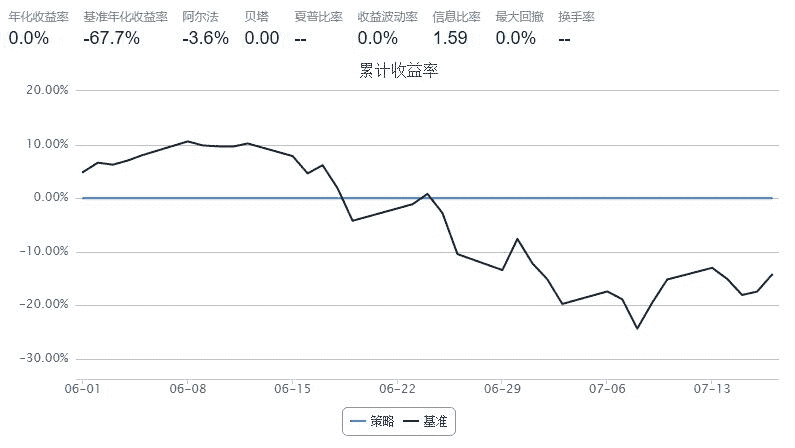

# 2.2 期现套利 • 通过股指期货的期现差与 ETF 对冲套利

> 来源：https://uqer.io/community/share/55aa5aa8f9f06c56de1b53bb

通过股指期货（IF1507）的期现差会围绕沪深300指数上下波动的原理，当期现差扩大到一定程度后，使用股指期货和ETF向对冲，以套取期现差的稳定利润。

只通过IF1507验证了一个基本可能性。还有很多细节需要完善。

还有，不知道如何通过order方法卖空股指期货和etf，了解的大神可以帮我解决一下~~

```py
import pandas as pd

start = datetime(2015, 6, 1)				# 回测起始时间
end   = datetime(2015, 7, 17)				# 回测结束时间
benchmark = 'HS300'							# 策略参考标准
universe = ['510300.XSHG','IF1507.CCFX']	# 股票池
capital_base = 1000000                      # 起始资金


maxQxc = 0.0 #最大期现差
isOrder = False #是否已经买入对冲
direction = False # 买入方向
buyPosition = 0 # 买入点位
total = 0
def initialize(account):					# 初始化虚拟账户状态
    
    pass 

def handle_data(account):                   # 每个交易日的买入卖出指令
#     log.debug(account.current_date) 
#     lowToNow = DataAPI.MktEqudAdjGet(secID = '510300', field = ['closePrice'],beginDate = lowDate, endDate = nowDate)
    global maxQxc,isOrder,direction,buyPosition,total
     
#     获取股指期货的行情数据
    if1507 = DataAPI.MktFutdGet(ticker="IF1507",
                                   beginDate=account.current_date.strftime("%Y%m%d"),endDate=account.current_date.strftime("%Y%m%d"))
#     获取etf基金的行情数据
    etf300 =  DataAPI.MktFunddGet(ticker = '510300',
                                    beginDate=account.current_date.strftime("%Y%m%d"),endDate=account.current_date.strftime("%Y%m%d"))
#     获取沪深300的行情数据
    hs300 = DataAPI.MktIdxdGet(ticker="000300",
                       beginDate=account.current_date.strftime("%Y%m%d"),endDate=account.current_date.strftime("%Y%m%d"))
    
#     计算期现差
    qxc = if1507['closePrice'].iloc[0] - hs300['closeIndex'].iloc[0]
    
#     log.debug((hs300['indexID']) + "/" + (if1507['secID']) + "/" + (etf300['secID']))
#     log.debug(str(qxc) + "/" + str(hs300['closeIndex'].iloc[0]) + "/" + str(if1507['closePrice'].iloc[0]) + "/" + str(etf300['closePrice'].iloc[0]))
#     保存期现差最大值，为后面判断买点时用
    if(abs(qxc) > abs(maxQxc)):
        maxQxc = qxc
#     判断期现差绝对值大于100，并开始从高点回落，同时账户是空仓，就买入
    if(abs(maxQxc) > 100 and abs(qxc) < abs(maxQxc) and not isOrder ):
        direction = qxc > 0
        buyPosition = qxc
        isOrder = True
#         if direction:
#             正期现差时
#             order(account.universe[1],-1) # 卖空一手期指
#             order(account.universe[0],3000) # 买入30万基金
#         else: 
#             负期现差时
#             order(account.universe[1],1) # 卖空一手期指
#             order(account.universe[0],-3000) # 买入30万基金
            
        log.debug("买入点位 = "+ str(if1507['closePrice'].iloc[0]) + "，期现差 = " + str(qxc))
        
#     判断已经持仓，并期现差已经反转，就卖出
    if(isOrder):
        if(direction):
            if(qxc < 0):
                earnings = buyPosition - qxc
                isOrder = False
                maxQxc = 0
#                 order(account.universe[1],1) # 卖空一手期指
#                 order(account.universe[0],-3000) # 买入30万基金
                account.cash = account.cash + abs(earnings)* 300
                log.debug("卖出盈利 = " + str(abs(earnings)* 300))
                
        else:
            if(qxc > 0):
                earnings = buyPosition - qxc
                isOrder = False
                maxQxc = 0
#                 order(account.universe[1],-1) # 卖空一手期指
#                 order(account.universe[0],3000) # 买入30万基金
                account.cash = account.cash + abs(earnings)* 300
                log.debug("卖出盈利 = " + str(abs(earnings) * 300 ) + "，卖出时期现差 = " + str(qxc))

#     for stock in account.universe:
#         log.debug(stock)
#     log.debug(account.cash)
    return
```



```
2015-06-01 [DEBUG] 1000000.0
2015-06-02 [DEBUG] 买入点位 = 5269.6，期现差 = 107.73
2015-06-02 [DEBUG] 1000000.0
2015-06-03 [DEBUG] 1000000.0
2015-06-04 [DEBUG] 1000000.0
2015-06-05 [DEBUG] 1000000.0
2015-06-08 [DEBUG] 卖出盈利 = 38004.0
2015-06-08 [DEBUG] 1038004.0
2015-06-09 [DEBUG] 1000000.0
2015-06-10 [DEBUG] 1000000.0
2015-06-11 [DEBUG] 1000000.0
2015-06-12 [DEBUG] 1000000.0
2015-06-15 [DEBUG] 1000000.0
2015-06-16 [DEBUG] 1000000.0
2015-06-17 [DEBUG] 1000000.0
2015-06-18 [DEBUG] 1000000.0
2015-06-19 [DEBUG] 1000000.0
2015-06-23 [DEBUG] 1000000.0
2015-06-24 [DEBUG] 1000000.0
2015-06-25 [DEBUG] 1000000.0
2015-06-26 [DEBUG] 1000000.0
2015-06-29 [DEBUG] 1000000.0
2015-06-30 [DEBUG] 买入点位 = 4381.4，期现差 = -91.598
2015-06-30 [DEBUG] 1000000.0
2015-07-01 [DEBUG] 1000000.0
2015-07-02 [DEBUG] 卖出盈利 = 34080.6，卖出时期现差 = 22.004
2015-07-02 [DEBUG] 1034080.6
2015-07-03 [DEBUG] 1000000.0
2015-07-06 [DEBUG] 1000000.0
2015-07-07 [DEBUG] 1000000.0
2015-07-08 [DEBUG] 买入点位 = 3463.4，期现差 = -199.638
2015-07-08 [DEBUG] 1000000.0
2015-07-09 [DEBUG] 1000000.0
2015-07-10 [DEBUG] 卖出盈利 = 77904.6，卖出时期现差 = 60.044
2015-07-10 [DEBUG] 1077904.6
2015-07-13 [DEBUG] 1000000.0
2015-07-14 [DEBUG] 买入点位 = 4001.6，期现差 = -110.549
2015-07-14 [DEBUG] 1000000.0
2015-07-15 [DEBUG] 1000000.0
2015-07-16 [DEBUG] 卖出盈利 = 36357.9，卖出时期现差 = 10.644
2015-07-16 [DEBUG] 1036357.9
2015-07-17 [DEBUG] 1000000.0
```

