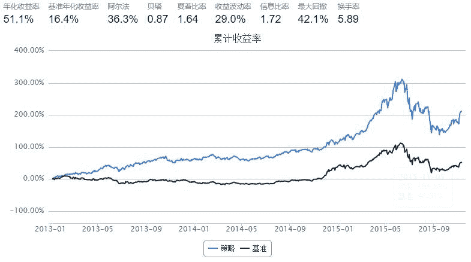
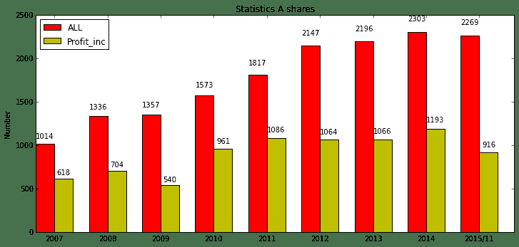
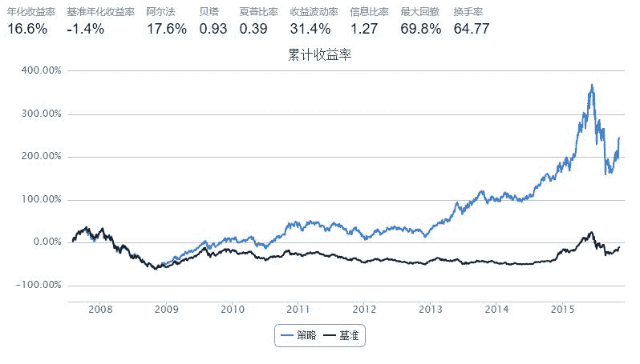

# 盈利预增事件

> 来源：https://uqer.io/community/share/5642c69af9f06c78612190b5

每次建仓等权重买入上季度净利润预增(盈利且盈利增加)的股票

```py
import pandas as pd
import numpy as np
from CAL.PyCAL import *
from pandas import DataFrame,Series
from datetime import datetime, timedelta
start = '2013-01-01'                       # 回测起始时间
end = (datetime.today() - timedelta(days=1)).strftime('%Y%m%d')  # 截止日期
benchmark = 'HS300'                        # 策略参考标准
universe = set_universe('HS300')             # 证券池，支持股票和基金
capital_base = 1000000                     # 起始资金
freq = 'd'                                 # 策略类型，'d'表示日间策略使用日线回测，'m'表示日内策略使用分钟线回测
refresh_rate = 63                          # 调仓频率，表示执行handle_data的时间间隔，若freq = 'd'时间间隔的单位为交易日，若freq = 'm'时间间隔为分钟
cal = Calendar('China.SSE')

def initialize(account):                   # 初始化虚拟账户状态
    pass

def handle_data(account):                  # 每个交易日的买入卖出指令
    
    today = account.current_date.strftime('%Y%m%d')
    yesterday = cal.advanceDate(account.current_date, '-1B', BizDayConvention.Following).strftime('%Y%m%d')
    yester_refresh_day = cal.advanceDate(account.current_date, '-62B' , BizDayConvention.Following).strftime('%Y%m%d')
    total_money = account.referencePortfolioValue    
    prices = account.referencePrice     
    # 去除新上市或复牌的股票
    opn = account.get_attribute_history('openPrice', 1)
    account.universe = [s for s in account.universe if not (np.isnan(opn.get(s, 0)[0]) or opn.get(s, 0)[0] == 0 )]
    
    buylist =[]
    for s in  account.universe : 
        try : 
            temp=DataAPI.FdmtEfGet(secID = s,forecastType ='22',publishDateBegin= yester_refresh_day , publishDateEnd = yesterday,field=['secID','publishDate','NIncAPChgrLL', 'NIncAPChgrUPL'],pandas="1")
            buylist.append(s)
        except : 
            continue    
    sell_list = [x for x in account.valid_secpos if x not in buylist]    
    for s in sell_list :
        order_to(s,0)            
    for s in buylist :  
        order_to(s, int(total_money*0.99/len(buylist)/prices[s]/100)*100)
```



```py
# 统计代码 不用看啰
from pandas import DataFrame
data = DataFrame()
for s in range(len(set_universe('A'))/100 + 1) :        
    if s == len(set_universe('A'))/100 :
        temp_list = set_universe('A')[s*100:]
    else :
        temp_list = set_universe('A')[s*100:(s+1)*100] 
    try:
        if not temp_list == 0 :    
            data_temp = DataAPI.FdmtEfGet(secID = temp_list,field=['secID','publishDate','NIncAPChgrLL', 'NIncAPChgrUPL'],pandas="1")
    except : 
        print '错误！'          
    data = pd.concat([data,data_temp]) 
data['publishDate'] = pd.to_datetime(data['publishDate']) 
list1 = [] 
data07 = data[data['publishDate'] < '20080101']
data07.drop_duplicates('secID' , inplace = True)
list1.append(len(data07))
data08 = data[(data['publishDate'] < '20090101') & (data['publishDate'] >= '20080101')]
data08.drop_duplicates('secID' , inplace = True)
list1.append(len(data08))
data09 = data[(data['publishDate'] < '20100101') & (data['publishDate'] >= '20090101')]
data09.drop_duplicates('secID' , inplace = True)
list1.append(len(data09))
data10 = data[(data['publishDate'] < '20110101') & (data['publishDate'] >= '20100101')]
data10.drop_duplicates('secID' , inplace = True)
list1.append(len(data10))
data11 = data[(data['publishDate'] < '20120101') & (data['publishDate'] >= '20110101')]
data11.drop_duplicates('secID' , inplace = True)
list1.append(len(data11))
data12 = data[(data['publishDate'] < '20130101') & (data['publishDate'] >= '20120101')]
data12.drop_duplicates('secID' , inplace = True)
list1.append(len(data12))
data13 = data[(data['publishDate'] < '20140101') & (data['publishDate'] >= '20130101')]
data13.drop_duplicates('secID' , inplace = True)
list1.append(len(data13))
data14 = data[(data['publishDate'] < '20150101') & (data['publishDate'] >= '20140101')]
data14.drop_duplicates('secID' , inplace = True)
list1.append(len(data14))
data15 = data[(data['publishDate'] < '20160101') & (data['publishDate'] >= '20150101')]
data15.drop_duplicates('secID' , inplace = True)
list1.append(len(data15))

data2 = DataFrame()
for s in range(len(set_universe('A'))/100 + 1) :        
    if s == len(set_universe('A'))/100 :
        temp_list = set_universe('A')[s*100:]
    else :
        temp_list = set_universe('A')[s*100:(s+1)*100] 
    try:
        if not temp_list == 0 :    
            data_temp = DataAPI.FdmtEfGet(secID = temp_list,forecastType= '22' ,field=['secID','publishDate','NIncAPChgrLL', 'NIncAPChgrUPL'],pandas="1")
    except : 
        print '错误！'          
    data2 = pd.concat([data2,data_temp]) 
data2['publishDate'] = pd.to_datetime(data2['publishDate'])
list2 = [] 
data07 = data2[data2['publishDate'] < '20080101']
data07.drop_duplicates('secID' , inplace = True)
list2.append(len(data07))
data08 = data2[(data2['publishDate'] < '20090101') & (data2['publishDate'] >= '20080101')]
data08.drop_duplicates('secID' , inplace = True)
list2.append(len(data08))
data09 = data2[(data2['publishDate'] < '20100101') & (data2['publishDate'] >= '20090101')]
data09.drop_duplicates('secID' , inplace = True)
list2.append(len(data09))
data10 = data2[(data2['publishDate'] < '20110101') & (data2['publishDate'] >= '20100101')]
data10.drop_duplicates('secID' , inplace = True)
list2.append(len(data10))
data11 = data2[(data2['publishDate'] < '20120101') & (data2['publishDate'] >= '20110101')]
data11.drop_duplicates('secID' , inplace = True)
list2.append(len(data11))
data12 = data2[(data2['publishDate'] < '20130101') & (data2['publishDate'] >= '20120101')]
data12.drop_duplicates('secID' , inplace = True)
list2.append(len(data12))
data13 = data2[(data2['publishDate'] < '20140101') & (data2['publishDate'] >= '20130101')]
data13.drop_duplicates('secID' , inplace = True)
list2.append(len(data13))
data14 = data2[(data2['publishDate'] < '20150101') & (data2['publishDate'] >= '20140101')]
data14.drop_duplicates('secID' , inplace = True)
list2.append(len(data14))
data15 = data2[(data2['publishDate'] < '20160101') & (data2['publishDate'] >= '20150101')]
data15.drop_duplicates('secID' , inplace = True)
list2.append(len(data15))
```

+ 红柱表示年间发布过业绩预告的公司数量
+ 黄柱表示年间发布过盈利预增的公司数量

```py
# plot Statistics
import numpy as np
import matplotlib.pyplot as plt
N = 9
ind = np.arange(N) 
width = 0.35      
fig = plt.figure(figsize=(12,12))
ax = fig.add_subplot(211)
rects1 = ax.bar(ind, list1, width, color='r')
rects2 = ax.bar(ind+width, list2, width, color='y')
# add some
ax.set_ylabel('Number')
ax.set_title('Statistics A shares')
ax.set_xticks(ind+width)
ax.set_xticklabels( ('2007', '2008', '2009', '2010', '2011','2012','2013','2014','2015/11') )
ax.legend((rects1[0], rects2[0]), ('ALL', 'Profit_inc') , loc = '1')
def autolabel(rects):
    # attach some text labels
    for rect in rects:
        height = rect.get_height()
        ax.text(rect.get_x()+rect.get_width()/2., 1.05*height, '%d'%int(height),
                ha='center', va='bottom') 
autolabel(rects1)
autolabel(rects2)
plt.show()
```



+ 构造一个事件驱动策略看下盈利预增效应是否长期有效

+ 策略思想 ： 以企业净利润预增预报为事件驱动，卖出同期持仓（上个换仓期到本次换仓）中收益率最low的股票，买入盈利预增的股票。

+ 回测区间 ： 07年 —— 今

```py
import pandas as pd
import numpy as np
from CAL.PyCAL import *
from pandas import DataFrame,Series
from datetime import datetime, timedelta
start = '20070801'                       # 回测起始时间
end = (datetime.today() - timedelta(days=1)).strftime('%Y%m%d')  # 截止日期

benchmark = 'HS300'                        # 策略参考标准
universe = set_universe('HS300')           # 证券池，支持股票和基金
capital_base = 1000000                     # 起始资金
freq = 'd'                                 # 策略类型，'d'表示日间策略使用日线回测，'m'表示日内策略使用分钟线回测
refresh_rate = 1                           # 调仓频率，表示执行handle_data的时间间隔，若freq = 'd'时间间隔的单位为交易日，若freq = 'm'时间间隔为分钟
cal = Calendar('China.SSE')

def initialize(account):                   # 初始化虚拟账户状态
    account.last_refreshtime = start

def handle_data(account):                  # 每个交易日的买入卖出指令
    
    today = account.current_date.strftime('%Y%m%d')
    yesterday = cal.advanceDate(account.current_date, '-1B', BizDayConvention.Following).strftime('%Y%m%d')
    last_day  = (account.current_date - timedelta(days=1)).strftime('%Y%m%d')
    yester_refresh_day = cal.advanceDate(account.current_date, '-62B' , BizDayConvention.Following).strftime('%Y%m%d')
    total_money = account.referencePortfolioValue    
    prices = account.referencePrice 
    buylist =[]   
    # 去除新上市或复牌的股票
    opn = account.get_attribute_history('openPrice', 1)
    account.universe = [s for s in account.universe if not (np.isnan(opn.get(s, 0)[0]) or opn.get(s, 0)[0] == 0 )]
    
    # 初始建仓(选当前净利润最高的20只股票)：
    if len(account.valid_secpos) == 0 : 
        # 净利润增长率
        NetProfitGrowRate = DataAPI.MktStockFactorsOneDayGet(tradeDate=yesterday,secID=account.universe,field=u"secID,NetProfitGrowRate",pandas="1")
        NetProfitGrowRate = NetProfitGrowRate.sort('NetProfitGrowRate',ascending = False).drop_duplicates('secID')
        buylist = list(NetProfitGrowRate['secID'].values[0:20])
        for s in buylist :  
            order_to(s, int(total_money*0.99/len(buylist)/prices[s]/100)*100)
        account.last_refreshtime = today
        return
    
    # 获取业绩预增的股票,最多取20只
    try : 
        temp = DataAPI.FdmtEfGet(secID = account.universe , forecastType ='22',publishDateBegin= yesterday , publishDateEnd = last_day , field=['secID','publishDate','NIncAPChgrLL', 'NIncAPChgrUPL'],pandas="1")
        temp['meanGrowRate'] = (temp['NIncAPChgrLL'] + temp['NIncAPChgrUPL']) / 2
        temp.sort('meanGrowRate', ascending=False).drop_duplicates('secID' ,inplace = True)        
        buylist = list(temp['secID'].values[0:20])
    except : 
        return 
                   
    change_stock = [x for x in account.valid_secpos if x not in buylist] 
    buylist = [x for x in buylist if x not in account.valid_secpos]
    # 换仓     
    price1 = DataAPI.MktEqudAdjGet(secID=change_stock, tradeDate=account.last_refreshtime , field=u"secID,openPrice",pandas="1")
    price2 = DataAPI.MktEqudAdjGet(secID=change_stock, tradeDate=yesterday , field=u"secID,closePrice",pandas="1")
    # 计算持仓股这段时间的涨幅
    price1['stock_returns'] = price2['closePrice'] / price1['openPrice']
    price1.sort('stock_returns',ascending = True,inplace = True)
    # 剔除上个换仓日到现在最挫的股票 ：
    sell_list = price1['secID'].values[0:len(buylist)]
    for s in sell_list : 
        account.cash += prices[s] * account.valid_secpos.get(s)
        order_to(s,0)            
    for s in buylist :  
        order(s, int(account.cash / len(buylist)/prices[s]/100)*100)
    #更变最新调仓日期   
    account.last_refreshtime = today
```



+ 从回测结果来看业绩预增事件在熊市中效应并不显著，12年以前跑得也没之后的好。
+ 从统计数据来看，07年后逐年有更多的上市公司以业绩预告的方式与公司股东进行互动交流,股民朋友们也越来越注重业绩预告，并在二级市场给予及时的回应。
+ 呀！才发现回测有新功能了——回测详情，有更多统计信息了！！！好棒！
+ PS：从回测详情看好多业绩预增的公司报告发布后第二天开板涨停啊！看回测详情数据~新技能get.

