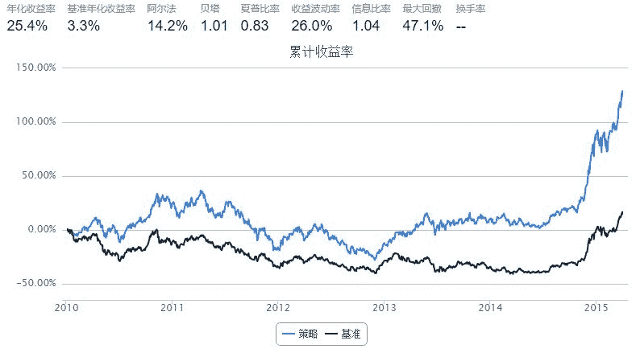

# 事件驱动策略示例——盈利预增

> 来源：https://uqer.io/community/share/54d972c1f9f06c276f651a72

## 策略思路

+   从DataAPI中获取沪深300成分股的盈利预增事件数据
+   每个交易日，将昨天发布盈利预增事件公司加入买入列表
+   根据调仓限制和买入列表进行调仓
+   调仓限制
    +   (1) 股票持有不超过50只
    +   (2) 一旦买入，持有40个交易日
    +   (3) 仅当持有数量低于50只时才买入股票，补满50只 

```py
import pandas as pd
from datetime import datetime
from functools import partial

fields_ef = ['secID', 'publishDate']
get_data = partial(DataAPI.FdmtEfGet, forecastType = 22, field = fields_ef)  # forecastType 22: 盈利预增

data_ef = []
for stock in set_universe('HS300'):
    try:
        if len(data_ef):
            data_ef = data_ef.append(get_data(secID = stock))
        else:
            data_ef = get_data(secID = stock)
    except:
        pass

data_ef['publishDate'] = pd.to_datetime(data_ef['publishDate'])
data_ef = data_ef.sort(columns = 'publishDate')
data_ef = data_ef[data_ef.publishDate >= datetime(2010, 1, 1)]
```

```py
start = '2010-01-01'
end   = '2015-04-01'
benchmark = 'HS300'
universe = set_universe('HS300')
capital_base = 1000000
longest_history = 1

max_t   = 40      # 持仓时间
max_n   = 50      # 持仓数量

def initialize(account):
    account.hold_period = {}

def handle_data(account):
    yesterday = account.get_symbol_history('tradeDate', 1)[0]
    data_sub = data_ef[data_ef.publishDate == yesterday]
    
    if len(data_sub):
        buylist = [s for s in data_sub['secID'].tolist() if s in account.universe]
        rebalance(account, buylist)

def rebalance(account, buylist):
    n = 0
    for stock, t in account.hold_period.items():
        if t == max_t:
            order_to(stock, 0)
            del account.hold_period[stock]
        else:
            account.hold_period[stock] += 1
            n += 1
    if n == max_n or buylist == []:
        return
    
    b = max_n - n
    buylist = [s for s in buylist if s not in account.hold_period]
    for stock in buylist[:b]:
        order(stock, account.referencePortfolioValue / b / account.referencePrice[stock])
        account.hold_period[stock] = 0
```



