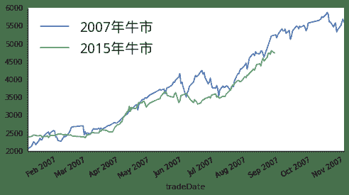

# 历史总是相似 牛市还在延续

> 来源：https://uqer.io/community/share/5541f07af9f06c1c3d687ffa

07年与15年的牛市时如此相似，你准备好继续all in 了吗？

## 话不多说，图见真章!

```py
import datetime as dt
import numpy as np
import seaborn as sns
sns.set_style('white')
from matplotlib import pyplot as plt
from CAL.PyCAL import *
font.set_size(20)

index = '000300'
data = DataAPI.MktIdxdGet(ticker = index, beginDate='20070101', endDate='20071101')
data.index = data.tradeDate.apply(lambda x: dt.datetime.strptime(x, '%Y-%m-%d'))

data2 = DataAPI.MktIdxdGet(ticker =index, beginDate='20140830', endDate='20150428')
data2.index = data2.tradeDate.apply(lambda x: dt.datetime.strptime(x, '%Y-%m-%d'))

data['2006 - 2008'] = data['closeIndex']
data = data[['2006 - 2008']]
data['2014 - 2015'] = np.nan
data['2014 - 2015'][:len(data2.closeIndex.values)] = data2.closeIndex.values
data = data[['2006 - 2008', '2014 - 2015']]
data.plot(figsize=(8,4), grid = False)
plt.legend([u'2007年牛市', u'2015年牛市'], prop = font, loc = 'best')
sns.despine()
```



