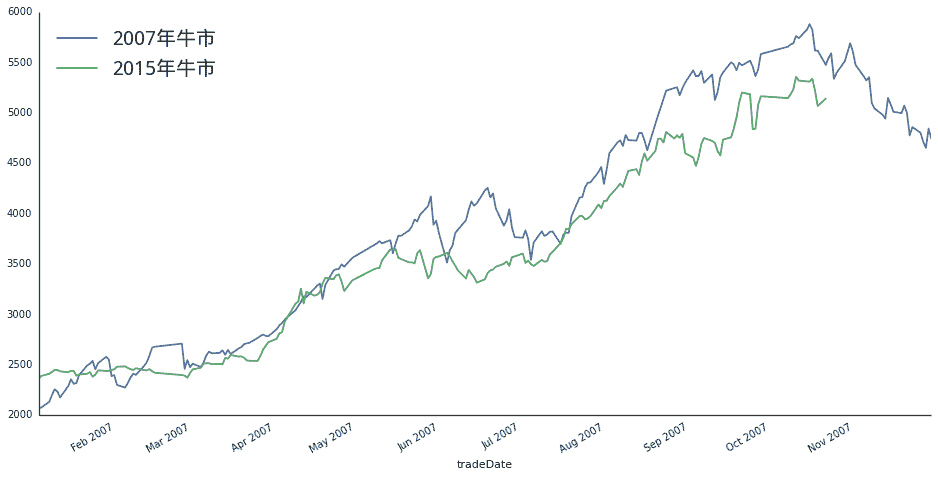
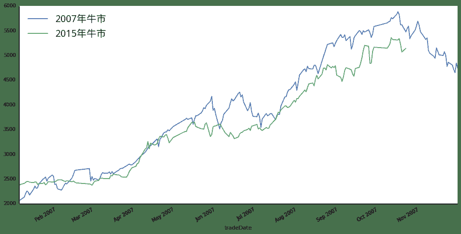

# 历史总是相似 牛市已经见顶？

> 来源：https://uqer.io/community/share/55814e7ef9f06c6519ad1522

本文是前文《历史总是相似 牛市还在延续》的续篇， 此文可点击下面的链接：历史总是相似 牛市还在延续



## 话不多说，图见真章!

这次我们把比较的周期从2015年4月28日延续到2015年6月17日。现在两个月过去了，看到大盘的走势和07年那波牛市是相似的。按照相同的时间点，07年的大牛已经见顶，15年呢？

```py
import datetime as dt
import numpy as np
import seaborn as sns
sns.set_style('white')
from matplotlib import pylab
from CAL.PyCAL import *
font.set_size(20)

index = '000300'
data = DataAPI.MktIdxdGet(ticker = index, beginDate='20070101', endDate='20071201')
data.index = data.tradeDate.apply(lambda x: dt.datetime.strptime(x, '%Y-%m-%d'))

data2 = DataAPI.MktIdxdGet(ticker =index, beginDate='20140830', endDate='20150617')
data2.index = data2.tradeDate.apply(lambda x: dt.datetime.strptime(x, '%Y-%m-%d'))

data['2006 - 2008'] = data['closeIndex']
data = data[['2006 - 2008']]
data['2014 - 2015'] = np.nan
data['2014 - 2015'][:len(data2.closeIndex.values)] = data2.closeIndex.values
data = data[['2006 - 2008', '2014 - 2015']]
data.plot(figsize=(16,8), grid = False)
pylab.legend([u'2007年牛市', u'2015年牛市'], prop = font, loc = 'best')
sns.despine()
```



