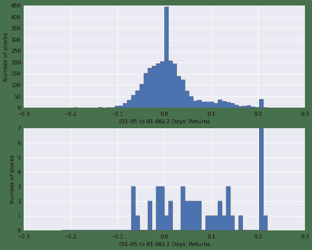
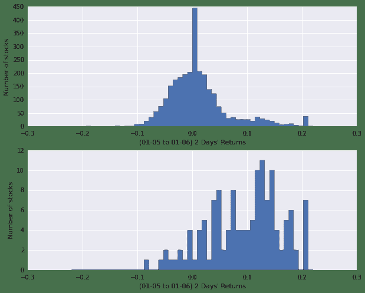

# 3.4 熔断机制 • 股海拾贝之 [熔断错杀股] 

> 来源：https://uqer.io/community/share/568e4c78228e5b18e0ba2962

新年伊始，本是普天同庆之时，A股门前却风声鹤唳；熔断机制推出4天，触发-7%熔断两次；千古跌停中，有不少标的遭遇恐慌性抛售，有人称之为熔断机制的磁石效应！

本文中，我们试图以简单的逻辑，来找到今天即7日有可能遭遇恐慌性抛售的熔断错杀股。

```py
import pandas as pd
import numpy as np
from matplotlib import pylab
import matplotlib.pyplot as plt
import seaborn
```

## 1. 今日错杀股

```py
from quartz.api import set_universe

univ = set_universe('A')
univ.remove('002778.XSHE')  # 删除2016-01-06上市新股
```

以最浅显地理解，错杀股票可能存在于以下情况中：

+ 今日开盘涨势不错，到首次熔断时仍为红盘，首次熔断结束后杀跌；
+ 今日开盘处于跌势，首次熔断之前跌的少，而首次熔断到二次熔断之间杀跌；
+ 首次熔断结束后开始交易，先杀跌，然后有明显拉升迹象，使得二次熔断时价格高于首次熔断时价格

三种情况下的走势如下图所示：

```py
# 沪深300指数今日走势
hs300PreClose = DataAPI.MktIdxdGet(tradeDate='20160106',ticker='399300').closeIndex.values[0]
hs300 = DataAPI.MktBarRTIntraDayGet(securityID='399300.XSHE',startTime='09:30',endTime='10:30')
hs300['hs300 index'] = hs300.closePrice/hs300PreClose - 1
hs300 = hs300[['barTime','hs300 index']]

# 第一种情况，例如‘山东黄金’
case1PrePrice = DataAPI.MktEqudAdjGet(tradeDate='20160106',ticker='600547').closePrice.values[0]
case1 = DataAPI.MktBarRTIntraDayGet(securityID='600547.XSHG',startTime='09:30',endTime='10:30')
case1['600547.XSHG'] = case1.closePrice/case1PrePrice - 1
case1 = case1[['barTime','600547.XSHG']]

# 第二种情况，例如‘红豆股份’
case2PrePrice = DataAPI.MktEqudAdjGet(tradeDate='20160106',ticker='600400').closePrice.values[0]
case2 = DataAPI.MktBarRTIntraDayGet(securityID='600400.XSHG',startTime='09:30',endTime='10:30')
case2['600400.XSHG'] = case2.closePrice/case2PrePrice - 1
case2 = case2[['barTime','600400.XSHG']]

# 第三种情况，例如‘天宝股份’
case3PrePrice = DataAPI.MktEqudAdjGet(tradeDate='20160106',ticker='002220').closePrice.values[0]
case3 = DataAPI.MktBarRTIntraDayGet(securityID='002220.XSHE',startTime='09:30',endTime='10:30')
case3['002220.XSHE'] = case3.closePrice/case3PrePrice - 1
case3 = case3[['barTime','002220.XSHE']]

for case in (case1,case2,case3):
    hs300 = pd.merge(hs300,case)

hs300 = hs300.set_index('barTime')
hs300.plot(figsize=(10,6))

<matplotlib.axes.AxesSubplot at 0x6e01210>
```


根据以上分析，我们拿取今日行情数据，对全A股中的股票做分析，得到表格如下，其中：

+ `preClose`： 昨日收盘价
+ `1stPrice`： 首次熔断时价格
+ `2ndPrice`： 二次熔断时价格
+ `1stCollapse`： 首次熔断时股价跌幅
+ `2ndCollapse`： 首次熔断结束，之后股价继续下跌的幅度，即首次熔断后今日股价又下跌了这么多
+ `collapseRatio`：首次熔断之后的跌幅和首次熔断之前的跌幅的比例
+ `lowBetCollapse`：首次熔断和二次熔断之间的股价低点
+ `closeToLow`： 二次熔断时的价格和lowBetCollapse的比例

```py
cols = ['preClose','1stPrice','2ndPrice','1stCollapse','2ndCollapse','collapseRatio','lowBetCollapse','closeToLow']
collapse0107 = pd.DataFrame(0.0,index=univ,columns=cols)

# 股票前收盘价
collapse0107['preClose'] = DataAPI.MktEqudGet(tradeDate='20160106',secID=univ,field='secID,closePrice',pandas='1').set_index('secID')

# 股票在-5%和-7%熔断时候的价格
for stk in collapse0107.index:
    price = DataAPI.MktBarRTIntraDayGet(securityID=stk,startTime='09:56',endTime='10:03').closePrice.values
    collapse0107['1stPrice'][stk] = price[0]
    collapse0107['2ndPrice'][stk] = price[-1]
    collapse0107['lowBetCollapse'][stk] = np.min(price)
    
# 两次熔断前的股票跌幅
collapse0107['1stCollapse'] = 1-collapse0107['1stPrice']/collapse0107['preClose']
collapse0107['2ndCollapse'] = 1-collapse0107['2ndPrice']/collapse0107['preClose'] - collapse0107['1stCollapse']

# 二次熔断跌幅和一次熔断跌幅比
collapse0107['collapseRatio'] = collapse0107['2ndCollapse']/collapse0107['1stCollapse']

# 第二次熔断时价格与两次熔断之间的最低价的比值
collapse0107['closeToLow'] = collapse0107['2ndPrice']/collapse0107['lowBetCollapse']

collapse0107.sort(columns='collapseRatio',inplace=True)
collapse0107 = collapse0107[~np.isnan(collapse0107.collapseRatio)]

collapse0107.tail()
```


| | preClose | 1stPrice | 2ndPrice | 1stCollapse | 2ndCollapse | collapseRatio | lowBetCollapse | closeToLow |
| --- | --- |
| 603398.XSHG | 123.01 | 121.00 | 110.71 | 0.016340 | 0.083652 | 5.119403 | 110.71 | 1 |
| 002750.XSHE | 40.59 | 40.05 | 37.00 | 0.013304 | 0.075142 | 5.648148 | 37.00 | 1 |
| 600569.XSHG | 3.58 | 3.55 | 3.31 | 0.008380 | 0.067039 | 8.000000 | 3.31 | 1 |
| 002768.XSHE | 71.17 | 71.00 | 66.00 | 0.002389 | 0.070254 | 29.411765 | 66.00 | 1 |
| 600782.XSHG | 5.81 | 5.80 | 5.31 | 0.001721 | 0.084337 | 49.000000 | 5.31 | 1 |

按照以上数据，综合前面的简单逻辑，我们利用以下条件来选择错杀股：

+ `collapseRatio` > 1.5
+ `collapseRatio` < -0.9
+ `closeToLow` > 1.02

得到约40只股票如下

```py
good = collapse0107[(collapse0107.collapseRatio>1.5) | (collapse0107.collapseRatio<-0.9) | (collapse0107.closeToLow>1.02)].index
good_stks = DataAPI.MktEqudGet(secID=good,tradeDate='20160107',field='secID,secShortName,tradeDate,preClosePrice,closePrice')
good_stks
```


| | secID | secShortName | tradeDate | preClosePrice | closePrice |
| --- | --- |
| 0 | 000726.XSHE | 鲁泰A | 2016-01-07 | 13.67 | 13.05 |
| 1 | 000766.XSHE | 通化金马 | 2016-01-07 | 14.04 | 12.68 |
| 2 | 000838.XSHE | 财信发展 | 2016-01-07 | 53.34 | 49.92 |
| 3 | 000856.XSHE | 冀东装备 | 2016-01-07 | 12.91 | 12.00 |
| 4 | 000937.XSHE | 冀中能源 | 2016-01-07 | 5.37 | 5.14 |
| 5 | 002155.XSHE | 湖南黄金 | 2016-01-07 | 9.39 | 9.14 |
| 6 | 002220.XSHE | 天宝股份 | 2016-01-07 | 16.46 | 15.15 |
| 7 | 002251.XSHE | 步步高 | 2016-01-07 | 14.62 | 13.62 |
| 8 | 002283.XSHE | 天润曲轴 | 2016-01-07 | 19.47 | 18.35 |
| 9 | 002291.XSHE | 星期六 | 2016-01-07 | 14.24 | 13.03 |
| 10 | 002355.XSHE | 兴民钢圈 | 2016-01-07 | 18.83 | 16.95 |
| 11 | 002444.XSHE | 巨星科技 | 2016-01-07 | 19.44 | 17.85 |
| 12 | 002506.XSHE | 协鑫集成 | 2016-01-07 | 9.85 | 9.66 |
| 13 | 002517.XSHE | 泰亚股份 | 2016-01-07 | 57.98 | 52.93 |
| 14 | 002575.XSHE | 群兴玩具 | 2016-01-07 | 17.67 | 16.87 |
| 15 | 002588.XSHE | 史丹利 | 2016-01-07 | 31.15 | 28.13 |
| 16 | 002615.XSHE | 哈尔斯 | 2016-01-07 | 29.16 | 26.64 |
| 17 | 002617.XSHE | 露笑科技 | 2016-01-07 | 23.17 | 21.12 |
| 18 | 002621.XSHE | 三垒股份 | 2016-01-07 | 20.91 | 20.00 |
| 19 | 002640.XSHE | 跨境通 | 2016-01-07 | 31.68 | 31.42 |
| 20 | 002702.XSHE | 海欣食品 | 2016-01-07 | 24.59 | 23.05 |
| 21 | 002750.XSHE | 龙津药业 | 2016-01-07 | 40.59 | 37.96 |
| 22 | 002768.XSHE | 国恩股份 | 2016-01-07 | 71.17 | 67.03 |
| 23 | 002779.XSHE | 中坚科技 | 2016-01-07 | 91.20 | 82.62 |
| 24 | 300013.XSHE | 新宁物流 | 2016-01-07 | 17.50 | 16.38 |
| 25 | 300148.XSHE | 天舟文化 | 2016-01-07 | 23.43 | 21.48 |
| 26 | 300179.XSHE | 四方达 | 2016-01-07 | 9.79 | 9.18 |
| 27 | 300320.XSHE | 海达股份 | 2016-01-07 | 12.88 | 11.95 |
| 28 | 600005.XSHG | 武钢股份 | 2016-01-07 | 3.66 | 3.30 |
| 29 | 600057.XSHG | 象屿股份 | 2016-01-07 | 12.01 | 11.25 |
| 30 | 600262.XSHG | 北方股份 | 2016-01-07 | 35.69 | 33.50 |
| 31 | 600265.XSHG | ST景谷 | 2016-01-07 | 29.81 | 28.36 |
| 32 | 600291.XSHG | 西水股份 | 2016-01-07 | 26.11 | 24.16 |
| 33 | 600298.XSHG | 安琪酵母 | 2016-01-07 | 30.30 | 29.47 |
| 34 | 600328.XSHG | 兰太实业 | 2016-01-07 | 13.63 | 12.54 |
| 35 | 600395.XSHG | 盘江股份 | 2016-01-07 | 9.10 | 8.19 |
| 36 | 600448.XSHG | 华纺股份 | 2016-01-07 | 9.01 | 8.60 |
| 37 | 600547.XSHG | 山东黄金 | 2016-01-07 | 21.89 | 21.10 |
| 38 | 600569.XSHG | 安阳钢铁 | 2016-01-07 | 3.58 | 3.38 |
| 39 | 600671.XSHG | 天目药业 | 2016-01-07 | 32.98 | 32.82 |
| 40 | 600732.XSHG | *ST新梅 | 2016-01-07 | 8.51 | 8.46 |
| 41 | 600782.XSHG | 新钢股份 | 2016-01-07 | 5.81 | 5.54 |
| 42 | 600874.XSHG | 创业环保 | 2016-01-07 | 9.63 | 9.67 |
| 43 | 601001.XSHG | 大同煤业 | 2016-01-07 | 5.78 | 5.75 |
| 44 | 603398.XSHG | 邦宝益智 | 2016-01-07 | 123.01 | 111.39 |

我们还想看一下上述股票在过去的05、06两个交易日的表现：

```py
fig = plt.figure(figsize=(10,8))

ax = fig.add_subplot(211)
fullA = DataAPI.MktEqudAdjGet(secID=univ, beginDate='20160104', endDate='20160106', field='secID,tradeDate,closePrice', pandas='1')
fullA = pd.DataFrame(fullA.groupby('secID').last().closePrice/fullA.groupby('secID').first().closePrice - 1)
ax = pylab.hist(fullA.closePrice,bins=50,histtype='stepfilled',range=(-0.22,0.22))
pylab.xlabel("(01-05 to 01-06) 2 Days' Returns")
pylab.ylabel('Number of stocks')

ax = fig.add_subplot(212)
good_stk_data = DataAPI.MktEqudAdjGet(secID=good, beginDate='20160104', endDate='20160106', field='secID,tradeDate,closePrice', pandas='1')
good_stk_data = pd.DataFrame(good_stk_data.groupby('secID').last().closePrice/good_stk_data.groupby('secID').first().closePrice - 1)
ax = pylab.hist(good_stk_data.closePrice,bins=50,histtype='stepfilled',range=(-0.22,0.22))
pylab.xlabel("(01-05 to 01-06) 2 Days' Returns")
pylab.ylabel('Number of stocks')

<matplotlib.text.Text at 0x7335050>
```



图中，上图为全A股在过去的5、6日两个交易日收益表现分布；下图为我们选出来的今日错杀股在5、6两个交易日的收益表现分布；

明显地，我们看出选出来的股票在过去两天表现比较出色；当然，过去两天的表现好不代表它们今天被错杀

## 2. 上次熔断时的4日被错杀股

利用上节中的选股条件，我们选出来4日熔断错杀股，来验证我们的逻辑

```py
cols = ['preClose','1stPrice','2ndPrice','1stCollapse','2ndCollapse','collapseRatio','lowBetCollapse','closeToLow']
collapse0104 = pd.DataFrame(0.0,index=univ,columns=cols)

# 股票前收盘价
collapse0104['preClose'] = DataAPI.MktEqudGet(tradeDate='20151231',secID=univ,field='secID,closePrice',pandas='1').set_index('secID')

# 股票在-5%和-7%熔断时候的价格
for stk in collapse0104.index:
    price = DataAPI.MktBarHistOneDayGet(securityID=stk,date='20160104',startTime='13:25',endTime='13:40').closePrice.values
    collapse0104['1stPrice'][stk] = price[0]
    collapse0104['2ndPrice'][stk] = price[-1]
    collapse0104['lowBetCollapse'][stk] = np.min(price)
    
# 两次熔断前的股票跌幅
collapse0104['1stCollapse'] = 1-collapse0104['1stPrice']/collapse0104['preClose']
collapse0104['2ndCollapse'] = 1-collapse0104['2ndPrice']/collapse0104['preClose'] - collapse0104['1stCollapse']

collapse0104['closeToLow'] = collapse0104['2ndPrice']/collapse0104['lowBetCollapse']

# 二次熔断跌幅和一次熔断跌幅比
collapse0104['collapseRatio'] = collapse0104['2ndCollapse']/collapse0104['1stCollapse']

collapse0104.sort(columns='collapseRatio',inplace=True)
collapse0104 = collapse0104[~np.isnan(collapse0104.collapseRatio)]

collapse0104.tail()
```


| | preClose | 1stPrice | 2ndPrice | 1stCollapse | 2ndCollapse | collapseRatio | lowBetCollapse | closeToLow |
| --- | --- |
| 600836.XSHG | 31.31 | 31.28 | 30.37 | 0.000958 | 0.029064 | 30.333333 | 29.47 | 1.030540 |
| 600178.XSHG | 11.23 | 11.23 | 10.60 | 0.000000 | 0.056100 | inf | 10.48 | 1.011450 |
| 600822.XSHG | 15.01 | 15.01 | 14.28 | 0.000000 | 0.048634 | inf | 14.11 | 1.012048 |
| 002686.XSHE | 17.62 | 17.62 | 16.90 | 0.000000 | 0.040863 | inf | 16.18 | 1.044499 |
| 002009.XSHE | 20.75 | 20.75 | 19.71 | 0.000000 | 0.050120 | inf | 19.20 | 1.026563 |

按照之前的选股条件，我们选出来了4日熔断被错杀的股票如下：

```py
good = collapse0104[(collapse0104.collapseRatio>1.5) | (collapse0104.collapseRatio<-0.9) | (collapse0104.closeToLow>1.02)].index
good_stks = DataAPI.MktEqudGet(secID=good,tradeDate='20160107',field='secID,secShortName,tradeDate,preClosePrice,closePrice')
good_stks
```


| | secID | secShortName | tradeDate | preClosePrice | closePrice |
| --- | --- |
| 0 | 000040.XSHE | 宝安地产 | 2016-01-07 | 15.45 | 13.91 |
| 1 | 000048.XSHE | 康达尔 | 2016-01-07 | 44.68 | 40.21 |
| 2 | 000517.XSHE | 荣安地产 | 2016-01-07 | 6.20 | 5.58 |
| 3 | 000519.XSHE | 江南红箭 | 2016-01-07 | 19.20 | 17.28 |
| 4 | 000520.XSHE | 长航凤凰 | 2016-01-07 | 13.11 | 11.80 |
| 5 | 000547.XSHE | 航天发展 | 2016-01-07 | 18.81 | 16.94 |
| 6 | 000552.XSHE | 靖远煤电 | 2016-01-07 | 9.85 | 8.87 |
| 7 | 000597.XSHE | 东北制药 | 2016-01-07 | 11.50 | 10.36 |
| 8 | 000667.XSHE | 美好集团 | 2016-01-07 | 5.62 | 5.06 |
| 9 | 000708.XSHE | 大冶特钢 | 2016-01-07 | 13.20 | 11.88 |
| 10 | 000709.XSHE | 河北钢铁 | 2016-01-07 | 3.67 | 3.30 |
| 11 | 000723.XSHE | 美锦能源 | 2016-01-07 | 14.19 | 12.77 |
| 12 | 000757.XSHE | 浩物股份 | 2016-01-07 | 10.80 | 9.72 |
| 13 | 000767.XSHE | 漳泽电力 | 2016-01-07 | 6.29 | 5.66 |
| 14 | 000795.XSHE | 太原刚玉 | 2016-01-07 | 17.12 | 15.41 |
| 15 | 000801.XSHE | 四川九洲 | 2016-01-07 | 30.26 | 27.24 |
| 16 | 000898.XSHE | 鞍钢股份 | 2016-01-07 | 5.19 | 4.68 |
| 17 | 000932.XSHE | 华菱钢铁 | 2016-01-07 | 3.85 | 4.14 |
| 18 | 000952.XSHE | 广济药业 | 2016-01-07 | 21.11 | 19.00 |
| 19 | 000990.XSHE | 诚志股份 | 2016-01-07 | 24.59 | 22.18 |
| 20 | 002009.XSHE | 天奇股份 | 2016-01-07 | 22.85 | 20.57 |
| 21 | 002013.XSHE | 中航机电 | 2016-01-07 | 24.02 | 21.62 |
| 22 | 002025.XSHE | 航天电器 | 2016-01-07 | 25.42 | 22.89 |
| 23 | 002045.XSHE | 国光电器 | 2016-01-07 | 18.10 | 16.29 |
| 24 | 002149.XSHE | 西部材料 | 2016-01-07 | 29.70 | 26.73 |
| 25 | 002157.XSHE | 正邦科技 | 2016-01-07 | 21.13 | 19.30 |
| 26 | 002179.XSHE | 中航光电 | 2016-01-07 | 37.56 | 34.11 |
| 27 | 002191.XSHE | 劲嘉股份 | 2016-01-07 | 16.71 | 15.04 |
| 28 | 002200.XSHE | 云投生态 | 2016-01-07 | 27.99 | 25.19 |
| 29 | 002220.XSHE | 天宝股份 | 2016-01-07 | 16.46 | 15.15 |
| ... | ... | ... | ... | ... | ... |
| 104 | 600655.XSHG | 豫园商城 | 2016-01-07 | 15.44 | 14.20 |
| 105 | 600662.XSHG | 强生控股 | 2016-01-07 | 17.13 | 15.42 |
| 106 | 600663.XSHG | 陆家嘴 | 2016-01-07 | 50.94 | 45.93 |
| 107 | 600685.XSHG | 中船防务 | 2016-01-07 | 41.41 | 37.27 |
| 108 | 600734.XSHG | 实达集团 | 2016-01-07 | 24.90 | 22.41 |
| 109 | 600755.XSHG | 厦门国贸 | 2016-01-07 | 8.24 | 7.43 |
| 110 | 600760.XSHG | 中航黑豹 | 2016-01-07 | 14.60 | 13.17 |
| 111 | 600774.XSHG | 汉商集团 | 2016-01-07 | 29.00 | 26.10 |
| 112 | 600822.XSHG | 上海物贸 | 2016-01-07 | 15.97 | 14.37 |
| 113 | 600826.XSHG | 兰生股份 | 2016-01-07 | 36.16 | 32.54 |
| 114 | 600833.XSHG | 第一医药 | 2016-01-07 | 18.55 | 16.71 |
| 115 | 600834.XSHG | 申通地铁 | 2016-01-07 | 20.30 | 18.27 |
| 116 | 600836.XSHG | 界龙实业 | 2016-01-07 | 34.32 | 30.89 |
| 117 | 600841.XSHG | 上柴股份 | 2016-01-07 | 18.28 | 16.45 |
| 118 | 600855.XSHG | 航天长峰 | 2016-01-07 | 45.30 | 40.77 |
| 119 | 600860.XSHG | 京城股份 | 2016-01-07 | 11.38 | 10.24 |
| 120 | 600868.XSHG | 梅雁吉祥 | 2016-01-07 | 7.61 | 6.89 |
| 121 | 600879.XSHG | 航天电子 | 2016-01-07 | 18.94 | 17.05 |
| 122 | 600893.XSHG | 中航动力 | 2016-01-07 | 42.87 | 38.58 |
| 123 | 600965.XSHG | 福成五丰 | 2016-01-07 | 14.85 | 13.66 |
| 124 | 601069.XSHG | 西部黄金 | 2016-01-07 | 23.71 | 21.97 |
| 125 | 601233.XSHG | 桐昆股份 | 2016-01-07 | 12.37 | 11.16 |
| 126 | 601636.XSHG | 旗滨集团 | 2016-01-07 | 5.18 | 4.70 |
| 127 | 601700.XSHG | 风范股份 | 2016-01-07 | 10.80 | 9.72 |
| 128 | 601888.XSHG | 中国国旅 | 2016-01-07 | 56.49 | 51.97 |
| 129 | 601890.XSHG | 亚星锚链 | 2016-01-07 | 13.43 | 12.09 |
| 130 | 601989.XSHG | 中国重工 | 2016-01-07 | 9.40 | 8.48 |
| 131 | 601998.XSHG | 中信银行 | 2016-01-07 | 6.84 | 6.39 |
| 132 | 603696.XSHG | 安记食品 | 2016-01-07 | 64.11 | 57.70 |
| 133 | 603901.XSHG | 永创智能 | 2016-01-07 | 40.84 | 36.76 |

```py
134 rows × 5 columns
```

我们选出来的4日熔断被错杀的股票，在后面的5、6两日的表现究竟如何呢？请看下图

```py
fig = plt.figure(figsize=(10,8))

ax = fig.add_subplot(211)
fullA = DataAPI.MktEqudAdjGet(secID=univ, beginDate='20160104', endDate='20160106', field='secID,tradeDate,closePrice', pandas='1')
fullA = pd.DataFrame(fullA.groupby('secID').last().closePrice/fullA.groupby('secID').first().closePrice - 1)
ax = pylab.hist(fullA.closePrice,bins=50,histtype='stepfilled',range=(-0.22,0.22))
pylab.xlabel("(01-05 to 01-06) 2 Days' Returns")
pylab.ylabel('Number of stocks')

ax = fig.add_subplot(212)
good_stk_data = DataAPI.MktEqudAdjGet(secID=good, beginDate='20160104', endDate='20160106', field='secID,tradeDate,closePrice', pandas='1')
good_stk_data = pd.DataFrame(good_stk_data.groupby('secID').last().closePrice/good_stk_data.groupby('secID').first().closePrice - 1)
ax = pylab.hist(good_stk_data.closePrice,bins=50,histtype='stepfilled',range=(-0.22,0.22))
pylab.xlabel("(01-05 to 01-06) 2 Days' Returns")
pylab.ylabel('Number of stocks')

<matplotlib.text.Text at 0x74df810>
```



图中，上图为全A股在过去的5、6日两个交易日收益表现分布；下图为我们选出来的4日熔断错杀股在5、6两个交易日的收益表现分布，可以看出选出的错杀股在过去两天均有10%左右的涨幅；

明显地，我们看出选出来的4日熔断错杀股在后面的两天表现出色

## 3. 结论

2节中对于4日熔断错杀股在5、6两个交易日的数据，似乎能够支持我们在第1节中的错杀股选股逻辑；对于1节中选出来的今天即7日错杀股，搬个板凳看后面走势究竟如何

PS：股市风险大，投资需谨慎；本文仅是研究之用，不构成任何荐股观点

