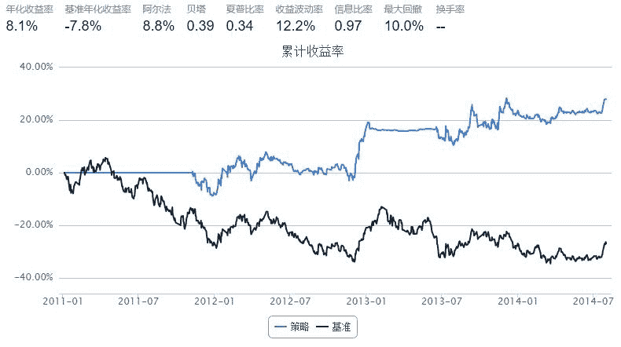
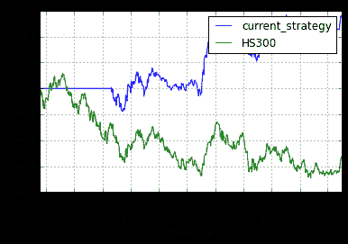

# Conservative Bollinger Bands

> 来源：https://uqer.io/community/share/548575def9f06c8e77336728

```py
import quartz
import quartz.backtest    as qb
import quartz.performance as qp
from   quartz.api         import *

import pandas as pd
import numpy  as np
from datetime   import datetime
from matplotlib import pylab

import talib
```

```py
start = datetime(2011, 1, 1)
end = datetime(2014, 8, 1)
benchmark = 'HS300'
universe = ['601398.XSHG', '600028.XSHG', '601988.XSHG', '600036.XSHG', '600030.XSHG',
            '601318.XSHG', '600000.XSHG', '600019.XSHG', '600519.XSHG', '601166.XSHG']
capital_base = 1000000
refresh_rate = 5
window = 200

def initialize(account):
    account.amount = 10000
    account.universe = universe
    add_history('hist', window)
    
def handle_data(account, data):
    
    for stk in account.universe:
        prices = account.hist[stk]['closePrice']
        if prices is None:
            return
        
        mu = prices.mean()
        sd = prices.std()
        
        upper = mu + 1*sd 
        middle = mu
        lower = mu - 1*sd
        
        
        cur_pos = account.position.stkpos.get(stk, 0)
        cur_prc = prices[-1]
        if cur_prc > upper and cur_pos >= 0:
            order_to(stk, 0)
        if cur_prc < lower and cur_pos <= 0:
            order(stk, account.amount)
```



```py
bt
```


| | tradeDate | cash | stock_position | portfolio_value | benchmark_return | blotter |
| --- | --- | --- | --- | --- | --- | --- |
| 0  | 2011-01-04 |  1000000 |  {} |  1000000 |  0.000000 |  [] |
| 1  | 2011-01-05 |  1000000 |  {} |  1000000 | -0.004395 |  [] |
| 2  | 2011-01-06 |  1000000 |  {} |  1000000 | -0.005044 |  [] |
| 3  | 2011-01-07 |  1000000 |  {} |  1000000 |  0.002209 |  [] |
| 4  | 2011-01-10 |  1000000 |  {} |  1000000 | -0.018454 |  [] |
| 5  | 2011-01-11 |  1000000 |  {} |  1000000 |  0.005384 |  [] |
| 6  | 2011-01-12 |  1000000 |  {} |  1000000 |  0.005573 |  [] |
| 7  | 2011-01-13 |  1000000 |  {} |  1000000 | -0.000335 |  [] |
| 8  | 2011-01-14 |  1000000 |  {} |  1000000 | -0.015733 |  [] |
| 9  | 2011-01-17 |  1000000 |  {} |  1000000 | -0.038007 |  [] |
| 10 | 2011-01-18 |  1000000 |  {} |  1000000 |  0.001109 |  [] |
| 11 | 2011-01-19 |  1000000 |  {} |  1000000 |  0.022569 |  [] |
| 12 | 2011-01-20 |  1000000 |  {} |  1000000 | -0.032888 |  [] |
| 13 | 2011-01-21 |  1000000 |  {} |  1000000 |  0.013157 |  [] |
| 14 | 2011-01-24 |  1000000 |  {} |  1000000 | -0.009795 |  [] |
| 15 | 2011-01-25 |  1000000 |  {} |  1000000 | -0.005273 |  [] |
| 16 | 2011-01-26 |  1000000 |  {} |  1000000 |  0.013536 |  [] |
| 17 | 2011-01-27 |  1000000 |  {} |  1000000 |  0.016128 |  [] |
| 18 | 2011-01-28 |  1000000 |  {} |  1000000 |  0.003393 |  [] |
| 19 | 2011-01-31 |  1000000 |  {} |  1000000 |  0.013097 |  [] |
| 20 | 2011-02-01 |  1000000 |  {} |  1000000 |  0.000252 |  [] |
| 21 | 2011-02-09 |  1000000 |  {} |  1000000 | -0.011807 |  [] |
| 22 | 2011-02-10 |  1000000 |  {} |  1000000 |  0.020788 |  [] |
| 23 | 2011-02-11 |  1000000 |  {} |  1000000 |  0.005410 |  [] |
| 24 | 2011-02-14 |  1000000 |  {} |  1000000 |  0.031461 |  [] |
| 25 | 2011-02-15 |  1000000 |  {} |  1000000 | -0.000457 |  [] |
| 26 | 2011-02-16 |  1000000 |  {} |  1000000 |  0.009590 |  [] |
| 27 | 2011-02-17 |  1000000 |  {} |  1000000 | -0.000807 |  [] |
| 28 | 2011-02-18 |  1000000 |  {} |  1000000 | -0.010484 |  [] |
| 29 | 2011-02-21 |  1000000 |  {} |  1000000 |  0.014332 |  [] |
| 30 | 2011-02-22 |  1000000 |  {} |  1000000 | -0.028954 |  [] |
| 31 | 2011-02-23 |  1000000 |  {} |  1000000 |  0.003529 |  [] |
| 32 | 2011-02-24 |  1000000 |  {} |  1000000 |  0.005101 |  [] |
| 33 | 2011-02-25 |  1000000 |  {} |  1000000 |  0.002094 |  [] |
| 34 | 2011-02-28 |  1000000 |  {} |  1000000 |  0.013117 |  [] |
| 35 | 2011-03-01 |  1000000 |  {} |  1000000 |  0.004733 |  [] |
| 36 | 2011-03-02 |  1000000 |  {} |  1000000 | -0.003562 |  [] |
| 37 | 2011-03-03 |  1000000 |  {} |  1000000 | -0.006654 |  [] |
| 38 | 2011-03-04 |  1000000 |  {} |  1000000 |  0.015193 |  [] |
| 39 | 2011-03-07 |  1000000 |  {} |  1000000 |  0.019520 |  [] |
| 40 | 2011-03-08 |  1000000 |  {} |  1000000 |  0.000884 |  [] |
| 41 | 2011-03-09 |  1000000 |  {} |  1000000 |  0.000420 |  [] |
| 42 | 2011-03-10 |  1000000 |  {} |  1000000 | -0.017551 |  [] |
| 43 | 2011-03-11 |  1000000 |  {} |  1000000 | -0.010025 |  [] |
| 44 | 2011-03-14 |  1000000 |  {} |  1000000 |  0.004787 |  [] |
| 45 | 2011-03-15 |  1000000 |  {} |  1000000 | -0.018069 |  [] |
| 46 | 2011-03-16 |  1000000 |  {} |  1000000 |  0.013806 |  [] |
| 47 | 2011-03-17 |  1000000 |  {} |  1000000 | -0.015730 |  [] |
| 48 | 2011-03-18 |  1000000 |  {} |  1000000 |  0.005813 |  [] |
| 49 | 2011-03-21 |  1000000 |  {} |  1000000 | -0.002667 |  [] |
| 50 | 2011-03-22 |  1000000 |  {} |  1000000 |  0.004942 |  [] |
| 51 | 2011-03-23 |  1000000 |  {} |  1000000 |  0.013021 |  [] |
| 52 | 2011-03-24 |  1000000 |  {} |  1000000 | -0.004155 |  [] |
| 53 | 2011-03-25 |  1000000 |  {} |  1000000 |  0.013263 |  [] |
| 54 | 2011-03-28 |  1000000 |  {} |  1000000 | -0.001188 |  [] |
| 55 | 2011-03-29 |  1000000 |  {} |  1000000 | -0.009905 |  [] |
| 56 | 2011-03-30 |  1000000 |  {} |  1000000 | -0.000583 |  [] |
| 57 | 2011-03-31 |  1000000 |  {} |  1000000 | -0.010071 |  [] |
| 58 | 2011-04-01 |  1000000 |  {} |  1000000 |  0.015339 |  [] |
| 59 | 2011-04-06 |  1000000 |  {} |  1000000 |  0.011714 |  [] |
| ... | ... | ... | ... | ... | ... |

```
868 rows × 6 columns
```

```py
perf = qp.perf_parse(bt)
out_keys = ['annualized_return', 'volatility', 'information',
            'sharpe', 'max_drawdown', 'alpha', 'beta']

for k in out_keys:
    print '%s: %s' % (k, perf[k])

annualized_return: 0.0806072460858
volatility: 0.121542243584
information: 0.967129870018
sharpe: 0.344919139631
max_drawdown: 0.100359317734
alpha: 0.0876204656402
beta: 0.392712356147
```

```py
perf['cumulative_return'].plot()
perf['benchmark_cumulative_return'].plot()
pylab.legend(['current_strategy','HS300'])
```



