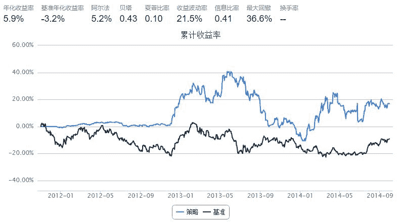
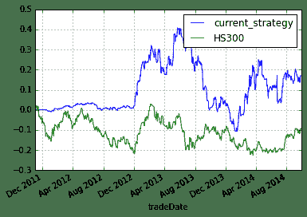

# Simple Bollinger Bands

> 来源；https://uqer.io/community/share/54b5c1b4f9f06c276f651a15

策略思路： 在一段时间内，股票价格可以认为是在一定水平上下波动。例如，可以简单认为股价在过去100天的平均值基础上，上下波动几个标准差。

策略实现： (1) 股价高于这个波动区间，说明股价虚高，故卖出 (2) 股价低于这个波动区间，说明股价虚低，故买入

PS：本策略适用于股市平稳波动时期，在大牛市或者大熊市不太适用

```py
import quartz
import quartz.backtest    as qb
import quartz.performance as qp
from   quartz.api         import *

import pandas as pd
import numpy  as np
from datetime   import datetime
from matplotlib import pylab

import talib
```

```py
start = datetime(2011, 1, 1)
end = datetime(2014, 10, 1)
benchmark = 'HS300'
universe = ['601398.XSHG', '600028.XSHG', '601988.XSHG', '600036.XSHG', '600030.XSHG',
            '601318.XSHG', '600000.XSHG', '600019.XSHG', '600519.XSHG', '601166.XSHG']
capital_base = 1000000
refresh_rate = 5
window = 200

def initialize(account):
    account.amount = 10000
    account.universe = universe
    add_history('hist', window)
    
def handle_data(account):
    
    for stk in account.universe:
        prices = account.hist[stk]['closePrice']
        if prices is None:
            return
        
        mu = prices.mean()
        sd = prices.std()
        
        upper = mu + 2*sd
        middle = mu
        lower = mu - 2*sd
        
        cur_pos = account.position.stkpos.get(stk, 0)
        cur_prc = prices[-1]
        if cur_prc > upper and cur_pos >= 0:
            order_to(stk, 0)
        if cur_prc < lower and cur_pos <= 0:
            order(stk, account.amount)
```



```py
bt
```


| | tradeDate | cash | stock_position | portfolio_value | benchmark_return | blotter |
| --- | --- |
| 0   | 2011-11-01 |  1000000.00000 |                                                 {} |  1000000.00000 |  0.000000 |                                                 [] |
| 1   | 2011-11-02 |  1000000.00000 |                                                 {} |  1000000.00000 |  0.016629 |                                                 [] |
| 2   | 2011-11-03 |  1000000.00000 |                                                 {} |  1000000.00000 |  0.000697 |                                                 [] |
| 3   | 2011-11-04 |  1000000.00000 |                                                 {} |  1000000.00000 |  0.007086 |                                                 [] |
| 4   | 2011-11-07 |  1000000.00000 |                                                 {} |  1000000.00000 | -0.009950 |                                                 [] |
| 5   | 2011-11-08 |  1000000.00000 |                                                 {} |  1000000.00000 | -0.003120 |                                                 [] |
| 6   | 2011-11-09 |  1000000.00000 |                                                 {} |  1000000.00000 |  0.008778 |                                                 [] |
| 7   | 2011-11-10 |  1000000.00000 |                                                 {} |  1000000.00000 | -0.018922 |                                                 [] |
| 8   | 2011-11-11 |  1000000.00000 |                                                 {} |  1000000.00000 | -0.001699 |                                                 [] |
| 9   | 2011-11-14 |  1000000.00000 |                                                 {} |  1000000.00000 |  0.020480 |                                                 [] |
| 10  | 2011-11-15 |  1000000.00000 |                                                 {} |  1000000.00000 | -0.002005 |                                                 [] |
| 11  | 2011-11-16 |  1000000.00000 |                                                 {} |  1000000.00000 | -0.027167 |                                                 [] |
| 12  | 2011-11-17 |  1000000.00000 |                                                 {} |  1000000.00000 | -0.003033 |                                                 [] |
| 13  | 2011-11-18 |  1000000.00000 |                                                 {} |  1000000.00000 | -0.020857 |                                                 [] |
| 14  | 2011-11-21 |  1000000.00000 |                                                 {} |  1000000.00000 |  0.001225 |                                                 [] |
| 15  | 2011-11-22 |  1000000.00000 |                                                 {} |  1000000.00000 | -0.000081 |                                                 [] |
| 16  | 2011-11-23 |  1000000.00000 |                                                 {} |  1000000.00000 | -0.009758 |                                                 [] |
| 17  | 2011-11-24 |  1000000.00000 |                                                 {} |  1000000.00000 |  0.001898 |                                                 [] |
| 18  | 2011-11-25 |  1000000.00000 |                                                 {} |  1000000.00000 | -0.007317 |                                                 [] |
| 19  | 2011-11-28 |  1000000.00000 |                                                 {} |  1000000.00000 |  0.001303 |                                                 [] |
| 20  | 2011-11-29 |  1000000.00000 |                                                 {} |  1000000.00000 |  0.013697 |                                                 [] |
| 21  | 2011-11-30 |  1000000.00000 |                                                 {} |  1000000.00000 | -0.033370 |                                                 [] |
| 22  | 2011-12-01 |  1000000.00000 |                                                 {} |  1000000.00000 |  0.024625 |                                                 [] |
| 23  | 2011-12-02 |  1000000.00000 |                                                 {} |  1000000.00000 | -0.010180 |                                                 [] |
| 24  | 2011-12-05 |  1000000.00000 |                                                 {} |  1000000.00000 | -0.014048 |                                                 [] |
| 25  | 2011-12-06 |  1000000.00000 |                                                 {} |  1000000.00000 | -0.002000 |                                                 [] |
| 26  | 2011-12-07 |  1000000.00000 |                                                 {} |  1000000.00000 |  0.004724 |                                                 [] |
| 27  | 2011-12-08 |  1000000.00000 |                                                 {} |  1000000.00000 | -0.001276 |                                                 [] |
| 28  | 2011-12-09 |  1000000.00000 |                                                 {} |  1000000.00000 | -0.008531 |                                                 [] |
| 29  | 2011-12-12 |  1000000.00000 |                                                 {} |  1000000.00000 | -0.010293 |                                                 [] |
| ... | ... | ... | ... | ... | ... | ... |
| 679 | 2014-08-19 |    96907.47989 |  {u'601166.XSHG': 3877.0, u'600036.XSHG': 0, u'... |  1149017.27989 |  0.000087 |                                                 [] |
| 680 | 2014-08-20 |    96907.47989 |  {u'601166.XSHG': 3877.0, u'600036.XSHG': 0, u'... |  1168551.04989 | -0.003633 |  [Order({'transact_price': 0.0, 'symbol': '6000... |
| 681 | 2014-08-21 |    96907.47989 |  {u'601166.XSHG': 3877.0, u'600036.XSHG': 0, u'... |  1155719.88989 | -0.005028 |                                                 [] |
| 682 | 2014-08-22 |    96907.47989 |  {u'601166.XSHG': 3877.0, u'600036.XSHG': 0, u'... |  1152026.33989 |  0.004723 |                                                 [] |
| 683 | 2014-08-25 |    96907.47989 |  {u'601166.XSHG': 3877.0, u'600036.XSHG': 0, u'... |  1148250.45989 | -0.009513 |                                                 [] |
| 684 | 2014-08-26 |    96907.47989 |  {u'601166.XSHG': 3877.0, u'600036.XSHG': 0, u'... |  1141866.53989 | -0.008012 |                                                 [] |
| 685 | 2014-08-27 |    96907.47989 |  {u'601166.XSHG': 3877.0, u'600036.XSHG': 0, u'... |  1133729.60989 |  0.001507 |                                                 [] |
| 686 | 2014-08-28 |    96907.47989 |  {u'601166.XSHG': 3877.0, u'600036.XSHG': 0, u'... |  1130309.43989 | -0.007010 |                                                 [] |
| 687 | 2014-08-29 |    96907.47989 |  {u'601166.XSHG': 3877.0, u'600036.XSHG': 0, u'... |  1144849.97989 |  0.011686 |                                                 [] |
| 688 | 2014-09-01 |    96907.47989 |  {u'601166.XSHG': 3877.0, u'600036.XSHG': 0, u'... |  1146127.24989 |  0.007283 |                                                 [] |
| 689 | 2014-09-02 |    96907.47989 |  {u'601166.XSHG': 3877.0, u'600036.XSHG': 0, u'... |  1171994.81989 |  0.013222 |                                                 [] |
| 690 | 2014-09-03 |    96907.47989 |  {u'601166.XSHG': 3877.0, u'600036.XSHG': 0, u'... |  1186363.06989 |  0.009377 |  [Order({'transact_price': 0.0, 'symbol': '6000... |
| 691 | 2014-09-04 |    96907.47989 |  {u'601166.XSHG': 3877.0, u'600036.XSHG': 0, u'... |  1188453.82989 |  0.007218 |                                                 [] |
| 692 | 2014-09-05 |    96907.47989 |  {u'601166.XSHG': 3877.0, u'600036.XSHG': 0, u'... |  1203626.03989 |  0.009494 |                                                 [] |
| 693 | 2014-09-09 |    96907.47989 |  {u'601166.XSHG': 3877.0, u'600036.XSHG': 0, u'... |  1182303.76989 | -0.001647 |                                                 [] |
| 694 | 2014-09-10 |    96907.47989 |  {u'601166.XSHG': 3877.0, u'600036.XSHG': 0, u'... |  1180321.58989 | -0.005231 |                                                 [] |
| 695 | 2014-09-11 |    96907.47989 |  {u'601166.XSHG': 3877.0, u'600036.XSHG': 0, u'... |  1168537.55989 | -0.003691 |  [Order({'transact_price': 0.0, 'symbol': '6000... |
| 696 | 2014-09-12 |    96907.47989 |  {u'601166.XSHG': 3877.0, u'600036.XSHG': 0, u'... |  1171787.86989 |  0.006150 |                                                 [] |
| 697 | 2014-09-15 |    96907.47989 |  {u'601166.XSHG': 3877.0, u'600036.XSHG': 0, u'... |  1153269.96989 | -0.000479 |                                                 [] |
| 698 | 2014-09-16 |    96907.47989 |  {u'601166.XSHG': 3877.0, u'600036.XSHG': 0, u'... |  1141194.90989 | -0.019869 |                                                 [] |
| 699 | 2014-09-17 |    96907.47989 |  {u'601166.XSHG': 3877.0, u'600036.XSHG': 0, u'... |  1145778.58989 |  0.005258 |                                                 [] |
| 700 | 2014-09-18 |    96907.47989 |  {u'601166.XSHG': 3877.0, u'600036.XSHG': 0, u'... |  1152235.30989 |  0.003056 |                                                 [] |
| 701 | 2014-09-19 |    96907.47989 |  {u'601166.XSHG': 3877.0, u'600036.XSHG': 0, u'... |  1162000.35989 |  0.006870 |                                                 [] |
| 702 | 2014-09-22 |    96907.47989 |  {u'601166.XSHG': 3877.0, u'600036.XSHG': 0, u'... |  1136441.48989 | -0.019087 |                                                 [] |
| 703 | 2014-09-23 |    96907.47989 |  {u'601166.XSHG': 3877.0, u'600036.XSHG': 0, u'... |  1139988.07989 |  0.008635 |                                                 [] |
| 704 | 2014-09-24 |    96907.47989 |  {u'601166.XSHG': 3877.0, u'600036.XSHG': 0, u'... |  1157613.46989 |  0.017671 |                                                 [] |
| 705 | 2014-09-25 |    96907.47989 |  {u'601166.XSHG': 3877.0, u'600036.XSHG': 0, u'... |  1169367.30989 | -0.002006 |                                                 [] |
| 706 | 2014-09-26 |    96907.47989 |  {u'601166.XSHG': 3877.0, u'600036.XSHG': 0, u'... |  1169791.29989 |  0.000094 |                                                 [] |
| 707 | 2014-09-29 |    96907.47989 |  {u'601166.XSHG': 3877.0, u'600036.XSHG': 0, u'... |  1170503.49989 |  0.004349 |                                                 [] |
| 708 | 2014-09-30 |    96907.47989 |  {u'601166.XSHG': 3877.0, u'600036.XSHG': 0, u'... |  1168692.07989 |  0.001303 |                                                 [] |

```
709 rows × 6 columns
```

```py
perf = qp.perf_parse(bt)
out_keys = ['annualized_return', 'volatility', 'information',
            'sharpe', 'max_drawdown', 'alpha', 'beta']

for k in out_keys:
    print '%s: %s' % (k, perf[k])
    
annualized_return: 0.0594823977045
volatility: 0.214571802928
information: 0.407163653335
sharpe: 0.102806600884
max_drawdown: 0.36585509048
alpha: 0.052294592526
beta: 0.434097117249
```

```py
perf['cumulative_return'].plot()
perf['benchmark_cumulative_return'].plot()
pylab.legend(['current_strategy','HS300'])

<matplotlib.legend.Legend at 0x568fe90>
```



