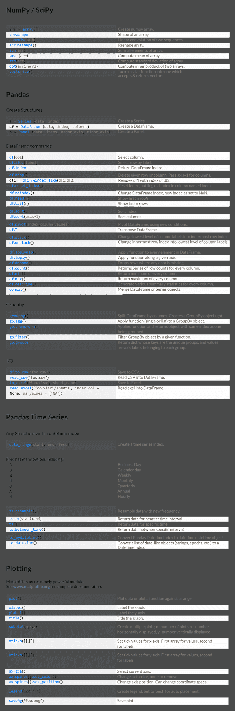

# 量化分析师的Python日记【第3天：一大波金融Library来袭之numpy篇】

> 来源：https://uqer.io/community/share/54ca15f9f9f06c276f651a56

接下来要给大家介绍的系列中包含了Python在量化金融中运用最广泛的几个Library:

+ numpy
+ scipy
+ pandas
+ matplotlib

会给初学者一一介绍

NumPy 简介

## 一、NumPy是什么？

量化分析的工作涉及到大量的数值运算，一个高效方便的科学计算工具是必不可少的。Python语言一开始并不是设计为科学计算使用的语言，随着越来越多的人发现Python的易用性，逐渐出现了关于Python的大量外部扩展，NumPy (Numeric Python)就是其中之一。NumPy提供了大量的数值编程工具，可以方便地处理向量、矩阵等运算，极大地便利了人们在科学计算方面的工作。另一方面，Python是免费，相比于花费高额的费用使用Matlab，NumPy的出现使Python得到了更多人的青睐。

我们可以简单看一下如何开始使用NumPy：

```py
import numpy
numpy.version.full_version

'1.8.0'
```

我们使用了`import`命令导入了NumPy，并使用`numpy.version.full_version`查出了量化实验室里使用的NumPy版本为1.8.0。在往后的介绍中，我们将大量使用NumPy中的函数，每次都添加`numpy`在函数前作为前缀比较费劲，在之前的介绍中，我们提及了引入外部扩展模块时的小技巧，可以使用`from numpy import *`解决这一问题。

那么问题解决了？慢！Python的外部扩展成千上万，在使用中很可能会`import`好几个外部扩展模块，如果某个模块包含的属性和方法与另一个模块同名，就必须使用`import module`来避免名字的冲突。即所谓的名字空间（namespace）混淆了，所以这前缀最好还是带上。

那有没有简单的办法呢？有的，我们可以在`import`扩展模块时添加模块在程序中的别名，调用时就不必写成全名了，例如，我们使用`np`作为别名并调用`version.full_version`函数：

```py
import numpy as np
np.version.full_version

'1.8.0'
```

## 二、初窥NumPy对象：数组

NumPy中的基本对象是同类型的多维数组（homogeneous multidimensional array），这和C++中的数组是一致的，例如字符型和数值型就不可共存于同一个数组中。先上例子：

```py
a = np.arange(20)
```

这里我们生成了一个一维数组`a`，从0开始，步长为1，长度为20。Python中的计数是从0开始的，R和Matlab的使用者需要小心。可以使用`print`查看：

```py
print a

numpy.ndarray
```

通过函数`reshape`，我们可以重新构造一下这个数组，例如，我们可以构造一个`4*5`的二维数组，其中`reshape`的参数表示各维度的大小，且按各维顺序排列（两维时就是按行排列，这和R中按列是不同的）：

```py
a = a.reshape(4, 5)
print a

[[ 0  1  2  3  4]
 [ 5  6  7  8  9]
 [10 11 12 13 14]
 [15 16 17 18 19]]
```

构造更高维的也没问题:

```py
a = a.reshape(2, 2, 5)
print a

[[[ 0  1  2  3  4]
  [ 5  6  7  8  9]]

 [[10 11 12 13 14]
  [15 16 17 18 19]]]
```

既然`a`是`array`，我们还可以调用`array`的函数进一步查看`a`的相关属性：`ndim`查看维度；`shape`查看各维度的大小；`size`查看全部的元素个数，等于各维度大小的乘积；`dtype`可查看元素类型；`dsize`查看元素占位（bytes）大小。

```py
a.ndim

3
```

```py
a.shape

(2, 2, 5)
```

```py
a.size

20
```

```py
a.dtype

dtype('int64')
```

## 三、创建数组

数组的创建可通过转换列表实现，高维数组可通过转换嵌套列表实现：

```py
raw = [0,1,2,3,4]
a = np.array(raw)
a

array([0, 1, 2, 3, 4])
```

```py
raw = [[0,1,2,3,4], [5,6,7,8,9]]
b = np.array(raw)
b

array([[0, 1, 2, 3, 4],
       [5, 6, 7, 8, 9]])
```

一些特殊的数组有特别定制的命令生成，如`4*5`的全零矩阵：

```py
d = (4, 5)
np.zeros(d)

array([[ 0.,  0.,  0.,  0.,  0.],
       [ 0.,  0.,  0.,  0.,  0.],
       [ 0.,  0.,  0.,  0.,  0.],
       [ 0.,  0.,  0.,  0.,  0.]])
```

默认生成的类型是浮点型，可以通过指定类型改为整型：

```py
d = (4, 5)
np.ones(d, dtype=int)

array([[1, 1, 1, 1, 1],
       [1, 1, 1, 1, 1],
       [1, 1, 1, 1, 1],
       [1, 1, 1, 1, 1]])
```

`[0, 1)`区间的随机数数组：

```py
np.random.rand(5)

array([ 0.93807818,  0.45307847,  0.90732828,  0.36099623,  0.71981451])
```

## 四、数组操作

简单的四则运算已经重载过了，全部的`+`，`-`，`*`，`/`运算都是基于全部的数组元素的，以加法为例：

```py
a = np.array([[1.0, 2], [2, 4]])
print "a:"
print a
b = np.array([[3.2, 1.5], [2.5, 4]])
print "b:"
print b
print "a+b:"
print a+b

a:
[[ 1.  2.]
 [ 2.  4.]]
b:
[[ 3.2  1.5]
 [ 2.5  4. ]]
a+b:
[[ 4.2  3.5]
 [ 4.5  8. ]]
```

这里可以发现，`a`中虽然仅有一个与元素是浮点数，其余均为整数，在处理中Python会自动将整数转换为浮点数（因为数组是同质的），并且，两个二维数组相加要求各维度大小相同。当然，NumPy里这些运算符也可以对标量和数组操作，结果是数组的全部元素对应这个标量进行运算，还是一个数组：

```py
print "3 * a:"
print 3 * a
print "b + 1.8:"
print b + 1.8

3 * a:
[[  3.   6.]
 [  6.  12.]]
b + 1.8:
[[ 5.   3.3]
 [ 4.3  5.8]]
```

类似C++，`+=`、`-=`、`*=`、`/=`操作符在NumPy中同样支持：

```py
a /= 2
print a

[[ 0.5  1. ]
 [ 1.   2. ]]
```

开根号求指数也很容易：

```py
print "a:"
print a
print "np.exp(a):"
print np.exp(a)
print "np.sqrt(a):"
print np.sqrt(a)
print "np.square(a):"
print np.square(a)
print "np.power(a, 3):"
print np.power(a, 3)

a:
[[ 0.5  1. ]
 [ 1.   2. ]]
np.exp(a):
[[ 1.64872127  2.71828183]
 [ 2.71828183  7.3890561 ]]
np.sqrt(a):
[[ 0.70710678  1.        ]
 [ 1.          1.41421356]]
np.square(a):
[[ 0.25  1.  ]
 [ 1.    4.  ]]
np.power(a, 3):
[[ 0.125  1.   ]
 [ 1.     8.   ]]
```

需要知道二维数组的最大最小值怎么办？想计算全部元素的和、按行求和、按列求和怎么办？`for`循环吗？不，NumPy的`ndarray`类已经做好函数了：

```py
a = np.arange(20).reshape(4,5)
print "a:"
print a
print "sum of all elements in a: " + str(a.sum())
print "maximum element in a: " + str(a.max())
print "minimum element in a: " + str(a.min())
print "maximum element in each row of a: " + str(a.max(axis=1))
print "minimum element in each column of a: " + str(a.min(axis=0))

a:
[[ 0  1  2  3  4]
 [ 5  6  7  8  9]
 [10 11 12 13 14]
 [15 16 17 18 19]]
sum of all elements in a: 190
maximum element in a: 19
minimum element in a: 0
maximum element in each row of a: [ 4  9 14 19]
minimum element in each column of a: [0 1 2 3 4]
```

科学计算中大量使用到矩阵运算，除了数组，NumPy同时提供了矩阵对象（`matrix`）。矩阵对象和数组的主要有两点差别：一是矩阵是二维的，而数组的可以是任意正整数维；二是矩阵的`*`操作符进行的是矩阵乘法，乘号左侧的矩阵列和乘号右侧的矩阵行要相等，而在数组中`*`操作符进行的是每一元素的对应相乘，乘号两侧的数组每一维大小需要一致。数组可以通过`asmatrix`或者`mat`转换为矩阵，或者直接生成也可以：

```py
a = np.arange(20).reshape(4, 5)
a = np.asmatrix(a)
print type(a)

b = np.matrix('1.0 2.0; 3.0 4.0')
print type(b)

<class 'numpy.matrixlib.defmatrix.matrix'>
<class 'numpy.matrixlib.defmatrix.matrix'>
```

再来看一下矩阵的乘法，这使用`arange`生成另一个矩阵`b`，`arange`函数还可以通过`arange(起始，终止，步长)`的方式调用生成等差数列，注意含头不含尾。

```py
b = np.arange(2, 45, 3).reshape(5, 3)
b = np.mat(b)
print b

[[ 2  5  8]
 [11 14 17]
 [20 23 26]
 [29 32 35]
 [38 41 44]]
```

有人要问了，`arange`指定的是步长，如果想指定生成的一维数组的长度怎么办？好办，`linspace`就可以做到：

```py
np.linspace(0, 2, 9)

array([ 0.  ,  0.25,  0.5 ,  0.75,  1.  ,  1.25,  1.5 ,  1.75,  2.  ])
```

回到我们的问题，矩阵`a`和`b`做矩阵乘法：

```py
print "matrix a:"
print a
print "matrix b:"
print b
c = a * b
print "matrix c:"
print c

print c
查看全部
matrix a:
[[ 0  1  2  3  4]
 [ 5  6  7  8  9]
 [10 11 12 13 14]
 [15 16 17 18 19]]
matrix b:
[[ 2  5  8]
 [11 14 17]
 [20 23 26]
 [29 32 35]
 [38 41 44]]
matrix c:
[[ 290  320  350]
 [ 790  895 1000]
 [1290 1470 1650]
 [1790 2045 2300]]
```

## 五、数组元素访问

数组和矩阵元素的访问可通过下标进行，以下均以二维数组（或矩阵）为例：

```py
a = np.array([[3.2, 1.5], [2.5, 4]])
print a[0][1]
print a[0, 1]

1.5
1.5
```

可以通过下标访问来修改数组元素的值：

```py
b = a
a[0][1] = 2.0
print "a:"
print a
print "b:"
print b

a:
[[ 3.2  2. ]
 [ 2.5  4. ]]
b:
[[ 3.2  2. ]
 [ 2.5  4. ]]
```

现在问题来了，明明改的是`a[0][1]`，怎么连`b[0][1]`也跟着变了？这个陷阱在Python编程中很容易碰上，其原因在于Python不是真正将`a`复制一份给`b`，而是将`b`指到了`a`对应数据的内存地址上。想要真正的复制一份`a`给`b`，可以使用`copy`：

```py
a = np.array([[3.2, 1.5], [2.5, 4]])
b = a.copy()
a[0][1] = 2.0
print "a:"
print a
print "b:"
print b

a:
[[ 3.2  2. ]
 [ 2.5  4. ]]
b:
[[ 3.2  1.5]
 [ 2.5  4. ]]
```

若对`a`重新赋值，即将`a`指到其他地址上，`b`仍在原来的地址上：

```py
a = np.array([[3.2, 1.5], [2.5, 4]])
b = a
a = np.array([[2, 1], [9, 3]])
print "a:"
print a
print "b:"
print b

a:
[[2 1]
 [9 3]]
b:
[[ 3.2  1.5]
 [ 2.5  4. ]]
```

利用`:`可以访问到某一维的全部数据，例如取矩阵中的指定列：

```py
a = np.arange(20).reshape(4, 5)
print "a:"
print a
print "the 2nd and 4th column of a:"
print a[:,[1,3]]

a:
[[ 0  1  2  3  4]
 [ 5  6  7  8  9]
 [10 11 12 13 14]
 [15 16 17 18 19]]
the 2nd and 4th column of a:
[[ 1  3]
 [ 6  8]
 [11 13]
 [16 18]]
```

稍微复杂一些，我们尝试取出满足某些条件的元素，这在数据的处理中十分常见，通常用在单行单列上。下面这个例子是将第一列大于5的元素（10和15）对应的第三列元素（12和17）取出来：

```py
a[:, 2][a[:, 0] > 5]

array([12, 17])
```

可使用`where`函数查找特定值在数组中的位置：

```py
loc = numpy.where(a==11)
print loc
print a[loc[0][0], loc[1][0]]

(array([2]), array([1]))
11
```

## 六、数组操作

还是拿矩阵（或二维数组）作为例子，首先来看矩阵转置：

```py
a = np.random.rand(2,4)
print "a:"
print a
a = np.transpose(a)
print "a is an array, by using transpose(a):"
print a
b = np.random.rand(2,4)
b = np.mat(b)
print "b:"
print b
print "b is a matrix, by using b.T:"
print b.T

a:
[[ 0.17571282  0.98510461  0.94864387  0.50078988]
 [ 0.09457965  0.70251658  0.07134875  0.43780173]]
a is an array, by using transpose(a):
[[ 0.17571282  0.09457965]
 [ 0.98510461  0.70251658]
 [ 0.94864387  0.07134875]
 [ 0.50078988  0.43780173]]
b:
[[ 0.09653644  0.46123468  0.50117363  0.69752578]
 [ 0.60756723  0.44492537  0.05946373  0.4858369 ]]
b is a matrix, by using b.T:
[[ 0.09653644  0.60756723]
 [ 0.46123468  0.44492537]
 [ 0.50117363  0.05946373]
 [ 0.69752578  0.4858369 ]]
```

矩阵求逆：

```py
import numpy.linalg as nlg
a = np.random.rand(2,2)
a = np.mat(a)
print "a:"
print a
ia = nlg.inv(a)
print "inverse of a:"
print ia
print "a * inv(a)"
print a * ia

a:
[[ 0.86211266  0.6885563 ]
 [ 0.28798536  0.70810425]]
inverse of a:
[[ 1.71798445 -1.6705577 ]
 [-0.69870271  2.09163573]]
a * inv(a)
[[ 1.  0.]
 [ 0.  1.]]
```

求特征值和特征向量

```py
a = np.random.rand(3,3)
eig_value, eig_vector = nlg.eig(a)
print "eigen value:"
print eig_value
print "eigen vector:"
print eig_vector

eigen value:
[ 1.35760609  0.43205379 -0.53470662]
eigen vector:
[[-0.76595379 -0.88231952 -0.07390831]
 [-0.55170557  0.21659887 -0.74213622]
 [-0.33005418  0.41784829  0.66616169]]
```

按列拼接两个向量成一个矩阵：

```py
a = np.array((1,2,3))
b = np.array((2,3,4))
print np.column_stack((a,b))

[[1 2]
 [2 3]
 [3 4]]
```

在循环处理某些数据得到结果后，将结果拼接成一个矩阵是十分有用的，可以通过`vstack`和`hstack`完成：

```py
a = np.random.rand(2,2)
b = np.random.rand(2,2)
print "a:"
print a
print "b:"
print a
c = np.hstack([a,b])
d = np.vstack([a,b])
print "horizontal stacking a and b:"
print c
print "vertical stacking a and b:"
print d

a:
[[ 0.6738195   0.4944045 ]
 [ 0.25702675  0.15422012]]
b:
[[ 0.6738195   0.4944045 ]
 [ 0.25702675  0.15422012]]
horizontal stacking a and b:
[[ 0.6738195   0.4944045   0.28058267  0.0967197 ]
 [ 0.25702675  0.15422012  0.55191041  0.04694485]]
vertical stacking a and b:
[[ 0.6738195   0.4944045 ]
 [ 0.25702675  0.15422012]
 [ 0.28058267  0.0967197 ]
 [ 0.55191041  0.04694485]]
```

## 七、缺失值

缺失值在分析中也是信息的一种，NumPy提供`nan`作为缺失值的记录，通过`isnan`判定。

```py
a = np.random.rand(2,2)
a[0, 1] = np.nan
print np.isnan(a)

[[False  True]
 [False False]]
```

`nan_to_num`可用来将`nan`替换成0，在后面会介绍到的更高级的模块`pandas`时，我们将看到`pandas`提供能指定`nan`替换值的函数。

```py
print np.nan_to_num(a)

[[ 0.58144238  0.        ]
 [ 0.26789784  0.48664306]]
```

NumPy还有很多的函数，想详细了解可参考链接 http://wiki.scipy.org/Numpy_Example_List 和 http://docs.scipy.org/doc/numpy

最后献上NumPy SciPy Pandas Cheat Sheet



