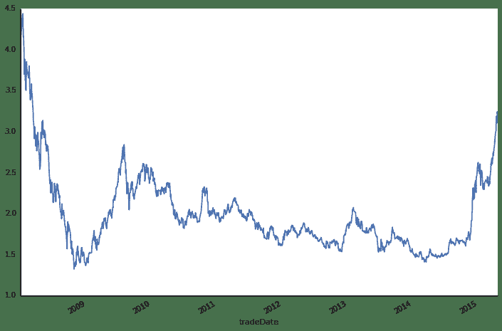
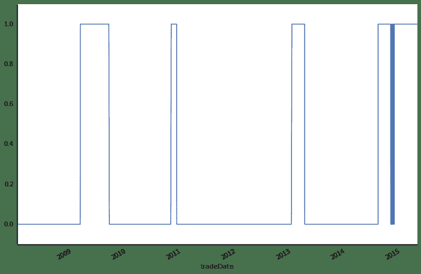
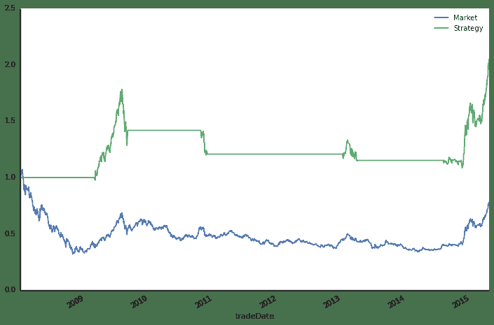
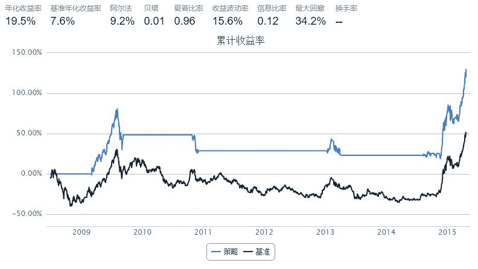

# 技术分析入门 —— 双均线策略

> 来源：https://uqer.io/community/share/554051bbf9f06c1c3d687fac

> 本篇中，我们将通过技术分析流派中经典的“双均线策略”，向大家展现如何在量化实验室中使用Python测试自己的想法，并最终将它转化为策略！

## 1. 准备工作

一大波Python库需要在使用之前被导入：

+ `matplotlib` 用于绘制图表
+ `numpy` 时间序列的计算
+ `pandas` 处理结构化的表格数据
+ `DataAPI` 通联数据提供的数据API
+ `seaborn` 用于美化matplotlib图表

```py
from matplotlib import pylab
import numpy as np
import pandas as pd
import DataAPI
import seaborn as sns
sns.set_style('white')
```

我们的关注点是关于一只ETF基金的投资：华夏上证50ETF，代码：`510050.XSHG`。我们考虑的回测周期：

+ 起始：2008年1月1日
+ 结束：2015年4月23日

这里我们使用数据API函数`MktFunddGe`t获取基金交易价格的日线数据，最后获得`security`是`pandas`下的`DataFrame`对象：

```py
secID = '510050.XSHG'
start = '20080101'
end = '20150423'

security = DataAPI.MktFunddGet(secID, beginDate=start, endDate=end, field=['tradeDate', 'closePrice'])
security['tradeDate'] = pd.to_datetime(security['tradeDate'])
security = security.set_index('tradeDate')
security.info()

<class 'pandas.core.frame.DataFrame'>
DatetimeIndex: 1775 entries, 2008-01-02 00:00:00 to 2015-04-23 00:00:00
Data columns (total 1 columns):
closePrice    1775 non-null float64
dtypes: float64(1)
```

最近5天的收盘价如下：

```py
security.tail()
```


| | closePrice |
| --- | --- |
| tradeDate |  |
| 2015-04-17 |  3.185 |
| 2015-04-20 |  3.103 |
| 2015-04-21 |  3.141 |
| 2015-04-22 |  3.241 |
| 2015-04-23 |  3.212 |

适当的图表可以帮助研究人员直观的了解标的的历史走势，这里我们直接借助`DataFrame`的`plot`成员：

```py
security['closePrice'].plot(grid=False, figsize=(12,8))
sns.despine()
```



## 2. 策略描述

> 这里我们以经典的“双均线”策略为例，讲述如何使用量化实验室进行分析研究。

这里我们使用的均线定义为：

+ 短期均线： `window_short = 20`，相当于月均线
+ 长期均线： `window_long = 120`，相当于半年线
+ 偏离度阈值： `SD = 5%`，区间宽度，这个会在后面有详细解释

计算均值我们借助了`numpy`的内置移动平均函数：`rolling_mean`

```py
window_short = 20
window_long = 120
SD = 0.05

security['short_window'] = np.round(pd.rolling_mean(security['closePrice'], window=window_short), 2)
security['long_window'] = np.round(pd.rolling_mean(security['closePrice'], window=window_long), 2)
security[['closePrice', 'short_window', 'long_window']].tail() 
```


| | closePrice | short_window | long_window |
| --- | --- | --- | --- |
| tradeDate |  |  |  |
| 2015-04-17 |  3.185 |  2.82 |  2.30 |
| 2015-04-20 |  3.103 |  2.85 |  2.31 |
| 2015-04-21 |  3.141 |  2.87 |  2.33 |
| 2015-04-22 |  3.241 |  2.90 |  2.34 |
| 2015-04-23 |  3.212 |  2.93 |  2.35 |

仍然地，我们可以把包含收盘价的三条线画到一张图上，看看有没有什么启发？

```py
security[['closePrice', 'short_window', 'long_window']].plot(grid=False, figsize=(12,8))
sns.despine()
```


### 2.1 定义信号

> 买入信号： 短期均线高于长期日均线，并且超过 `SD` 个点位；
> 
> 卖出信号： 不满足买入信号的所有情况；

我们首先计算短期均线与长期均线的差`s-l`，这样的向量级运算，在`pandas`中可以像普通标量一样计算：

```py
security['s-l'] = security['short_window'] - security['long_window']
security['s-l'].tail()

tradeDate
2015-04-17    0.52
2015-04-20    0.54
2015-04-21    0.54
2015-04-22    0.56
2015-04-23    0.58
Name: s-l, dtype: float64
```

根据`s-l`的值，我们可以定义信号：

+ `s−l>SD×long_window`，支持买入，定义`Regime`为`True`
+ 其他情形下，卖出信号，定义`Regime`为`False`

```py
security['Regime'] = np.where(security['s-l'] > security['long_window'] * SD, 1, 0)
security['Regime'].value_counts()

0    1394
1     381
dtype: int64
```

上面的统计给出了总共有多少次买入信号，多少次卖出信号。

下图给出了信号的时间分布：

```py
security['Regime'].plot(grid=False, lw=1.5, figsize=(12,8))
pylab.ylim((-0.1,1.1))
sns.despine()
```



我们可以在有了信号之后执行买入卖出操作，然后根据操作计算每日的收益。这里注意，我们计算策略收益的时候，使用的是当天的信号乘以次日的收益率。这是因为我们的决定是当天做出的，但是能享受到的收益只可能是第二天的（如果用当天信号乘以当日的收益率，那么这里面就有使用未来数据的问题）。

```py
security['Market'] = np.log(security['closePrice'] / security['closePrice'].shift(1))
security['Strategy'] = security['Regime'].shift(1) * security['Market']
security[['Market', 'Strategy', 'Regime']].tail()
```


| | Market | Strategy | Regime |
| --- | --- | --- | --- |
| tradeDate |  |  |  |
| 2015-04-17 |  0.012638 |  0.012638 |  1 |
| 2015-04-20 | -0.026083 | -0.026083 |  1 |
| 2015-04-21 |  0.012172 |  0.012172 |  1 |
| 2015-04-22 |  0.031341 |  0.031341 |  1 |
| 2015-04-23 | -0.008988 | -0.008988 |  1 |

最后我们把每天的收益率求和就得到了最后的累计收益率（这里因为我们使用的是指数收益率，所以将每日收益累加是合理的），这个累加的过程也可以通过`DataFrame`的内置函数`cumsum`轻松完成：

```py
security[['Market', 'Strategy']].cumsum().apply(np.exp).plot(grid=False, figsize=(12,8))
sns.despine()
```



## 3 使用`quartz`实现策略

上面的部分介绍了从数据出发，在量化实验室内研究策略的流程。实际上我们可以直接用量化实验室内置的`quartz`框架。`quartz`框架为用户隐藏了数据获取、数据清晰以及回测逻辑。用户可以更加专注于策略逻辑的描述：

```py
start = datetime(2008, 1, 1)				# 回测起始时间
end  = datetime(2015, 4, 23)				# 回测结束时间
benchmark = 'SH50'							# 策略参考标准
universe = ['510050.XSHG']	# 股票池
capital_base = 100000     # 起始资金
commission = Commission(0.0,0.0)

window_short = 20
window_long = 120
longest_history = window_long
SD = 0.05

def initialize(account):					# 初始化虚拟账户状态
    account.fund = universe[0]
    account.SD = SD
    account.window_short = window_short
    account.window_long = window_long

def handle_data(account):             # 每个交易日的买入卖出指令
    hist = account.get_history(longest_history)
    fund = account.fund
    short_mean = np.mean(hist[fund]['closePrice'][-account.window_short:]) # 计算短均线值
    long_mean = np.mean(hist[fund]['closePrice'][-account.window_long:])   #计算长均线值
    
    # 计算买入卖出信号
    flag = True if (short_mean - long_mean) > account.SD * long_mean else False 
    if flag:
        if account.position.secpos.get(fund, 0) == 0:
            # 空仓时全仓买入，买入股数为100的整数倍
            approximationAmount = int(account.cash / hist[fund]['closePrice'][-1]/100.0) * 100
            order(fund, approximationAmount)
    else:
        # 卖出时，全仓清空
        if account.position.secpos.get(fund, 0) >= 0:
            order_to(fund, 0)
```



