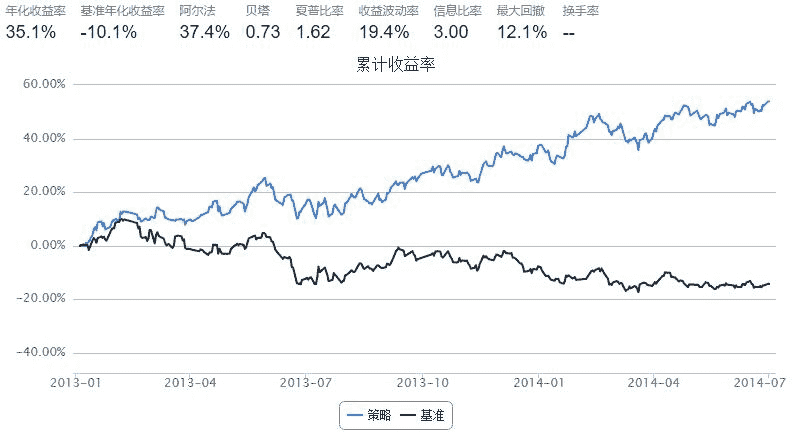

# 5日线10日线交易策略

> 来源：https://uqer.io/community/share/566526b3f9f06c6c8a91b45b

```py
from CAL.PyCAL import Date
from CAL.PyCAL import Calendar
from CAL.PyCAL import BizDayConvention
start = '2013-01-01'                       # 回测起始时间
end = '2014-07-01'                         # 回测结束时间
benchmark = 'HS300'                        # 策略参考标准
universe = set_universe('HS300')  # 证券池，支持股票和基金
capital_base = 100000                      # 起始资金
freq = 'd'                                 # 策略类型，'d'表示日间策略使用日线回测，'m'表示日内策略使用分钟线回测
refresh_rate = 1                           # 调仓频率，表示执行handle_data的时间间隔，若freq = 'd'时间间隔的单位为交易日，若freq = 'm'时间间隔为分钟
commission = Commission(buycost=0.0003, sellcost=0.002, unit='perValue')

def initialize(account):                   # 初始化虚拟账户状态
    pass

def handle_data(account):                  # 每个交易日的买入卖出指令
    buylist=[]
    selist=[]
    dt = Date.fromDateTime(account.current_date) 
    cal = Calendar('China.SSE')
    lastTDay = cal.advanceDate(dt,'-1B',BizDayConvention.Preceding)
    current_date=dt.strftime('%Y%m%d')
    last_date=lastTDay.strftime('%Y%m%d')
    
    getData_current_date=DataAPI.MktStockFactorsOneDayGet(tradeDate=current_date,secID=account.universe,field=['secID','MA5','MA10','MA20','NetProfitGrowRate'],pandas="1")
    getData_current_date.set_index('secID',inplace=True)
    getData_current_date=getData_current_date[getData_current_date.NetProfitGrowRate>=1.0].dropna()
    getData_current_date=getData_current_date.sort(columns='NetProfitGrowRate',ascending=False)
    getData_current_date=getData_current_date.head(20)
    #print  account.current_date,getData_current_date

    getData_last_date=DataAPI.MktStockFactorsOneDayGet(tradeDate=last_date,secID=list(getData_current_date.index),field=['secID','MA5','MA10','MA20','NetProfitGrowRate'],pandas="1")
    getData_last_date.set_index('secID',inplace=True)
    
    for stock in list(getData_current_date.index):
        if((getData_current_date['MA5'][stock]>getData_current_date['MA10'][stock])&(getData_last_date['MA5'][stock]<=getData_last_date['MA10'][stock])):
            buylist.append(stock)
            
    for stock in list(getData_current_date.index):
        if((getData_current_date['MA5'][stock]<=getData_current_date['MA10'][stock])&(getData_last_date['MA5'][stock]>getData_last_date['MA10'][stock])):
            selist.append(stock)
    
    
    for stock in selist:
        if(stock in account.valid_secpos):
            order_to(stock,0)
        else:
            pass
        
    for stock in buylist:
        if(stock in account.valid_secpos):
            pass
        else:
            if(len(buylist)>=5):
                order(stock,account.cash/account.referencePrice[stock]/len(buylist))
            else:
                order(stock,account.cash/account.referencePrice[stock]/5)
            
    print "日期：",account.current_date,",持仓：",account.valid_secpos
            
```



```
日期： 2013-01-04 00:00:00 ,持仓： {}
日期： 2013-01-07 00:00:00 ,持仓： {}
日期： 2013-01-08 00:00:00 ,持仓： {}
日期： 2013-01-09 00:00:00 ,持仓： {'002008.XSHE': 2489}
日期： 2013-01-10 00:00:00 ,持仓： {'002008.XSHE': 2489}
日期： 2013-01-11 00:00:00 ,持仓： {'002008.XSHE': 2489}
日期： 2013-01-14 00:00:00 ,持仓： {'002008.XSHE': 2489}
日期： 2013-01-15 00:00:00 ,持仓： {'002450.XSHE': 1546, '002008.XSHE': 2489}
日期： 2013-01-16 00:00:00 ,持仓： {'002450.XSHE': 1546, '002008.XSHE': 2489, '600108.XSHG': 1893}
日期： 2013-01-17 00:00:00 ,持仓： {'002450.XSHE': 1546, '002008.XSHE': 2489, '600108.XSHG': 1893}
日期： 2013-01-18 00:00:00 ,持仓： {'002450.XSHE': 1546, '002008.XSHE': 2489, '600108.XSHG': 1893}
日期： 2013-01-21 00:00:00 ,持仓： {'002450.XSHE': 1546, '002008.XSHE': 2489, '600108.XSHG': 1893}
日期： 2013-01-22 00:00:00 ,持仓： {'002450.XSHE': 1546, '002008.XSHE': 2489, '000046.XSHE': 2058, '600108.XSHG': 1893}
日期： 2013-01-23 00:00:00 ,持仓： {'002450.XSHE': 1546, '002008.XSHE': 2489, '000046.XSHE': 2058, '600108.XSHG': 1893}
日期： 2013-01-24 00:00:00 ,持仓： {'002450.XSHE': 1546, '002008.XSHE': 2489, '000046.XSHE': 2058, '600108.XSHG': 1893}
日期： 2013-01-25 00:00:00 ,持仓： {'002450.XSHE': 1546, '002008.XSHE': 2489, '600108.XSHG': 1893, '000046.XSHE': 2058, '600383.XSHG': 1248}
日期： 2013-01-28 00:00:00 ,持仓： {'002450.XSHE': 1546, '002008.XSHE': 2489, '600108.XSHG': 1893}
日期： 2013-01-29 00:00:00 ,持仓： {'002008.XSHE': 2489, '600383.XSHG': 1530}
日期： 2013-01-30 00:00:00 ,持仓： {'002450.XSHE': 1210, '002008.XSHE': 2489, '600383.XSHG': 1530}
日期： 2013-01-31 00:00:00 ,持仓： {'002450.XSHE': 1210, '600383.XSHG': 1530}
日期： 2013-02-01 00:00:00 ,持仓： {'002450.XSHE': 1210, '600011.XSHG': 2988, '600383.XSHG': 1530}
日期： 2013-02-04 00:00:00 ,持仓： {'002450.XSHE': 1210, '002008.XSHE': 1303, '600383.XSHG': 1530, '600011.XSHG': 2988, '000046.XSHE': 2834}
日期： 2013-02-05 00:00:00 ,持仓： {'002450.XSHE': 1210, '002008.XSHE': 1303, '600383.XSHG': 1530, '600011.XSHG': 2988, '000046.XSHE': 2834}
日期： 2013-02-06 00:00:00 ,持仓： {'002450.XSHE': 1210, '000883.XSHE': 2298, '600011.XSHG': 2988, '002008.XSHE': 1303, '000046.XSHE': 2834, '600383.XSHG': 1530}
日期： 2013-02-07 00:00:00 ,持仓： {'002008.XSHE': 1303, '000883.XSHE': 2298, '600383.XSHG': 1530, '600011.XSHG': 2988, '000046.XSHE': 2834}
日期： 2013-02-08 00:00:00 ,持仓： {'002008.XSHE': 1303, '000883.XSHE': 2298, '600383.XSHG': 1530, '600011.XSHG': 2988, '000046.XSHE': 2834}
日期： 2013-02-18 00:00:00 ,持仓： {'002008.XSHE': 1303, '000883.XSHE': 2298, '600383.XSHG': 1530, '600011.XSHG': 2988, '000046.XSHE': 2834}
日期： 2013-02-19 00:00:00 ,持仓： {'002450.XSHE': 747, '000883.XSHE': 2298, '600011.XSHG': 2988, '002008.XSHE': 1303, '000046.XSHE': 2834, '000413.XSHE': 2260, '600383.XSHG': 1530}
日期： 2013-02-20 00:00:00 ,持仓： {'002450.XSHE': 747, '000883.XSHE': 2298, '600011.XSHG': 2988, '002008.XSHE': 1303, '000046.XSHE': 2834, '000413.XSHE': 2260}
日期： 2013-02-21 00:00:00 ,持仓： {'002450.XSHE': 747, '600108.XSHG': 1123, '000883.XSHE': 2298, '002008.XSHE': 1303, '000046.XSHE': 2834, '000413.XSHE': 2260}
日期： 2013-02-22 00:00:00 ,持仓： {'002450.XSHE': 747, '600108.XSHG': 1123, '000413.XSHE': 2260, '002008.XSHE': 1303}
日期： 2013-02-25 00:00:00 ,持仓： {'002450.XSHE': 747, '600108.XSHG': 1123, '002008.XSHE': 1303}
日期： 2013-02-26 00:00:00 ,持仓： {'002450.XSHE': 747, '600108.XSHG': 1123, '002008.XSHE': 1303}
日期： 2013-02-27 00:00:00 ,持仓： {'002450.XSHE': 747, '600108.XSHG': 1123}
日期： 2013-02-28 00:00:00 ,持仓： {'002450.XSHE': 747, '600108.XSHG': 1123}
日期： 2013-03-01 00:00:00 ,持仓： {'002450.XSHE': 747, '600108.XSHG': 1123}
日期： 2013-03-04 00:00:00 ,持仓： {'002450.XSHE': 747, '600108.XSHG': 1123, '002008.XSHE': 1626}
日期： 2013-03-05 00:00:00 ,持仓： {'002450.XSHE': 747, '002008.XSHE': 1626}
日期： 2013-03-06 00:00:00 ,持仓： {'002450.XSHE': 747, '002008.XSHE': 1626, '600011.XSHG': 2825, '000413.XSHE': 4178}
日期： 2013-03-07 00:00:00 ,持仓： {'002450.XSHE': 747, '600108.XSHG': 1380, '000883.XSHE': 3007, '600011.XSHG': 2825, '002008.XSHE': 1626, '000413.XSHE': 4178}
日期： 2013-03-08 00:00:00 ,持仓： {'002450.XSHE': 747, '600108.XSHG': 1380, '000883.XSHE': 3007, '600011.XSHG': 2825, '002008.XSHE': 1626, '000413.XSHE': 4178}
日期： 2013-03-11 00:00:00 ,持仓： {'002450.XSHE': 747, '600108.XSHG': 1380, '000883.XSHE': 3007, '600011.XSHG': 2825, '002008.XSHE': 1626, '000413.XSHE': 4178}
日期： 2013-03-12 00:00:00 ,持仓： {'002450.XSHE': 747, '600108.XSHG': 1380, '000883.XSHE': 3007, '600011.XSHG': 2825, '002008.XSHE': 1626, '000413.XSHE': 4178}
日期： 2013-03-13 00:00:00 ,持仓： {'002450.XSHE': 747, '600108.XSHG': 1380, '000883.XSHE': 3007, '600011.XSHG': 2825, '002008.XSHE': 1626, '000413.XSHE': 4178}
日期： 2013-03-14 00:00:00 ,持仓： {'002450.XSHE': 747, '000883.XSHE': 3007, '600011.XSHG': 2825, '000413.XSHE': 4178}
日期： 2013-03-15 00:00:00 ,持仓： {'002450.XSHE': 747, '000883.XSHE': 3007}
日期： 2013-03-18 00:00:00 ,持仓： {'002450.XSHE': 747, '000883.XSHE': 3007}
日期： 2013-03-19 00:00:00 ,持仓： {'002450.XSHE': 747, '000883.XSHE': 3007}
日期： 2013-03-20 00:00:00 ,持仓： {'002450.XSHE': 747}
日期： 2013-03-21 00:00:00 ,持仓： {'002450.XSHE': 747, '600011.XSHG': 3208}
日期： 2013-03-22 00:00:00 ,持仓： {'002450.XSHE': 747, '002008.XSHE': 1327, '600383.XSHG': 2530, '600011.XSHG': 3208, '000046.XSHE': 3572}
日期： 2013-03-25 00:00:00 ,持仓： {'002450.XSHE': 747, '002008.XSHE': 1327, '600383.XSHG': 2530, '600011.XSHG': 3208, '000046.XSHE': 3572}
日期： 2013-03-26 00:00:00 ,持仓： {'002450.XSHE': 747, '600108.XSHG': 955, '600011.XSHG': 3208, '002008.XSHE': 1327, '000046.XSHE': 3572, '600383.XSHG': 2530}
日期： 2013-03-27 00:00:00 ,持仓： {'002450.XSHE': 747, '600108.XSHG': 955, '600011.XSHG': 3208, '002008.XSHE': 1327, '000046.XSHE': 3572, '000413.XSHE': 1276, '600383.XSHG': 2530}
日期： 2013-03-28 00:00:00 ,持仓： {'002450.XSHE': 747, '600108.XSHG': 955, '000883.XSHE': 1215, '600011.XSHG': 3208, '002008.XSHE': 1327, '000046.XSHE': 3572, '000413.XSHE': 1276, '600383.XSHG': 2530}
日期： 2013-03-29 00:00:00 ,持仓： {'002450.XSHE': 747, '002008.XSHE': 1327, '000883.XSHE': 1215, '600383.XSHG': 2530, '000413.XSHE': 1276}
日期： 2013-04-01 00:00:00 ,持仓： {'002450.XSHE': 747, '002008.XSHE': 1327, '600383.XSHG': 2530, '000413.XSHE': 1276}
日期： 2013-04-02 00:00:00 ,持仓： {'002450.XSHE': 747, '002008.XSHE': 1327, '600383.XSHG': 2530, '000413.XSHE': 1276}
日期： 2013-04-03 00:00:00 ,持仓： {'002008.XSHE': 1327, '600383.XSHG': 2530}
日期： 2013-04-08 00:00:00 ,持仓： {'002008.XSHE': 1327}
日期： 2013-04-09 00:00:00 ,持仓： {'002008.XSHE': 1327, '000046.XSHE': 4207, '600383.XSHG': 2968}
日期： 2013-04-10 00:00:00 ,持仓： {'002008.XSHE': 1327, '000046.XSHE': 4207, '600383.XSHG': 2968}
日期： 2013-04-11 00:00:00 ,持仓： {'002008.XSHE': 1327, '601991.XSHG': 2759, '000046.XSHE': 4207, '600383.XSHG': 2968}
日期： 2013-04-12 00:00:00 ,持仓： {'600027.XSHG': 2288, '601991.XSHG': 2759, '002008.XSHE': 1327, '000046.XSHE': 4207, '000413.XSHE': 2315, '600383.XSHG': 2968}
日期： 2013-04-15 00:00:00 ,持仓： {'600027.XSHG': 2288, '601991.XSHG': 2759, '002008.XSHE': 1327, '000046.XSHE': 4207, '000413.XSHE': 2315, '600383.XSHG': 2968}
日期： 2013-04-16 00:00:00 ,持仓： {'600027.XSHG': 2288, '601991.XSHG': 2759, '002008.XSHE': 1327, '000046.XSHE': 4207, '000413.XSHE': 2315, '600383.XSHG': 2968}
日期： 2013-04-17 00:00:00 ,持仓： {'600583.XSHG': 881, '600027.XSHG': 2288, '601991.XSHG': 2759, '002008.XSHE': 1327, '000046.XSHE': 4207, '000413.XSHE': 2315, '000895.XSHE': 229, '600383.XSHG': 2968}
日期： 2013-04-18 00:00:00 ,持仓： {'002450.XSHE': 239, '600583.XSHG': 881, '601991.XSHG': 2759, '002008.XSHE': 1327, '000046.XSHE': 4207, '000413.XSHE': 2315, '000895.XSHE': 229, '600383.XSHG': 2968}
日期： 2013-04-19 00:00:00 ,持仓： {'002450.XSHE': 239, '601991.XSHG': 2759, '002008.XSHE': 1327, '000046.XSHE': 4207, '000413.XSHE': 2315, '000895.XSHE': 229, '600383.XSHG': 2968}
日期： 2013-04-22 00:00:00 ,持仓： {'002450.XSHE': 239, '002008.XSHE': 1327, '601991.XSHG': 2759, '000712.XSHE': 748, '000046.XSHE': 4207, '000413.XSHE': 2315, '000895.XSHE': 229, '600383.XSHG': 2968}
日期： 2013-04-23 00:00:00 ,持仓： {'002450.XSHE': 239, '600108.XSHG': 673, '000712.XSHE': 748, '002008.XSHE': 1327, '000046.XSHE': 4207, '000413.XSHE': 2315, '000895.XSHE': 229, '002673.XSHE': 620, '600383.XSHG': 2968}
日期： 2013-04-24 00:00:00 ,持仓： {'002450.XSHE': 239, '600108.XSHG': 673, '000712.XSHE': 748, '002008.XSHE': 1327, '000046.XSHE': 4207, '002673.XSHE': 620, '000895.XSHE': 229, '600383.XSHG': 2968}
日期： 2013-04-25 00:00:00 ,持仓： {'002450.XSHE': 239, '600108.XSHG': 673, '600011.XSHG': 1175, '000712.XSHE': 748, '002008.XSHE': 1327, '000046.XSHE': 4207, '002673.XSHE': 620, '000895.XSHE': 229, '600383.XSHG': 2968}
日期： 2013-04-26 00:00:00 ,持仓： {'600108.XSHG': 673, '000883.XSHE': 1727, '600011.XSHG': 1175, '002008.XSHE': 1327, '000712.XSHE': 748, '300251.XSHE': 541, '000046.XSHE': 4207, '002673.XSHE': 620, '000895.XSHE': 229, '600383.XSHG': 2968, '600886.XSHG': 1511}
日期： 2013-05-02 00:00:00 ,持仓： {'600108.XSHG': 673, '600011.XSHG': 1175, '002008.XSHE': 1327, '000712.XSHE': 748, '300251.XSHE': 541, '000046.XSHE': 4207, '002673.XSHE': 620, '000895.XSHE': 229, '600383.XSHG': 2968, '600886.XSHG': 1511}
日期： 2013-05-03 00:00:00 ,持仓： {'600108.XSHG': 673, '600011.XSHG': 1175, '002008.XSHE': 1327, '600795.XSHG': 1589, '000712.XSHE': 748, '300251.XSHE': 541, '000046.XSHE': 4207, '002456.XSHE': 169, '000895.XSHE': 229, '600383.XSHG': 2968, '600886.XSHG': 1511}
日期： 2013-05-06 00:00:00 ,持仓： {'600108.XSHG': 673, '600583.XSHG': 511, '002008.XSHE': 1327, '600027.XSHG': 848, '600369.XSHG': 784, '600795.XSHG': 1589, '000712.XSHE': 748, '300251.XSHE': 541, '000046.XSHE': 4207, '002456.XSHE': 169, '600886.XSHG': 1511, '000895.XSHE': 229, '600383.XSHG': 2968, '600011.XSHG': 1175}
日期： 2013-05-07 00:00:00 ,持仓： {'600583.XSHG': 511, '002008.XSHE': 1327, '600027.XSHG': 848, '600369.XSHG': 784, '600795.XSHG': 1589, '000712.XSHE': 748, '300251.XSHE': 541, '000046.XSHE': 4207, '002456.XSHE': 169, '002673.XSHE': 181, '000895.XSHE': 229, '600383.XSHG': 2968, '600886.XSHG': 1511, '600011.XSHG': 1175}
日期： 2013-05-08 00:00:00 ,持仓： {'601991.XSHG': 452, '600583.XSHG': 511, '002008.XSHE': 1327, '600027.XSHG': 848, '600369.XSHG': 784, '600795.XSHG': 1589, '000712.XSHE': 748, '000625.XSHE': 171, '000046.XSHE': 4207, '000895.XSHE': 229, '300251.XSHE': 541, '002673.XSHE': 181, '600383.XSHG': 2968, '600886.XSHG': 1511, '600011.XSHG': 1175}
日期： 2013-05-09 00:00:00 ,持仓： {'601991.XSHG': 452, '600583.XSHG': 511, '002008.XSHE': 1327, '600027.XSHG': 848, '600369.XSHG': 784, '600795.XSHG': 1589, '000712.XSHE': 748, '000625.XSHE': 171, '000046.XSHE': 4207, '000895.XSHE': 229, '300251.XSHE': 541, '002673.XSHE': 181, '600383.XSHG': 2968, '000539.XSHE': 466, '600886.XSHG': 1511, '600011.XSHG': 1175}
日期： 2013-05-10 00:00:00 ,持仓： {'002450.XSHE': 93, '601991.XSHG': 452, '600583.XSHG': 511, '000712.XSHE': 748, '600027.XSHG': 848, '000625.XSHE': 171, '600369.XSHG': 784, '600795.XSHG': 1589, '600157.XSHG': 482, '002008.XSHE': 1327, '300251.XSHE': 541, '000046.XSHE': 4207, '600316.XSHG': 93, '000895.XSHE': 229, '002673.XSHE': 181, '600383.XSHG': 2968, '000539.XSHE': 466, '600886.XSHG': 1511, '600011.XSHG': 1175}
日期： 2013-05-13 00:00:00 ,持仓： {'000046.XSHE': 4207, '601991.XSHG': 452, '600583.XSHG': 511, '000712.XSHE': 748, '600027.XSHG': 848, '000625.XSHE': 171, '600369.XSHG': 784, '600795.XSHG': 1589, '600157.XSHG': 482, '002008.XSHE': 1327, '300251.XSHE': 541, '600316.XSHG': 93, '002456.XSHE': 24, '000413.XSHE': 162, '000895.XSHE': 229, '002673.XSHE': 181, '600383.XSHG': 2968, '000539.XSHE': 466, '600886.XSHG': 1511, '600011.XSHG': 1175}
日期： 2013-05-14 00:00:00 ,持仓： {'000046.XSHE': 4207, '600108.XSHG': 105, '601991.XSHG': 452, '600583.XSHG': 511, '000712.XSHE': 748, '600027.XSHG': 848, '000625.XSHE': 171, '600369.XSHG': 784, '600795.XSHG': 1589, '600157.XSHG': 482, '002008.XSHE': 1327, '300251.XSHE': 541, '600316.XSHG': 93, '002456.XSHE': 24, '000413.XSHE': 162, '000895.XSHE': 229, '002673.XSHE': 181, '600383.XSHG': 2968, '000539.XSHE': 466, '600886.XSHG': 1511, '600011.XSHG': 1175}
日期： 2013-05-15 00:00:00 ,持仓： {'000046.XSHE': 4207, '600108.XSHG': 105, '600583.XSHG': 511, '600027.XSHG': 848, '601991.XSHG': 452, '600795.XSHG': 1589, '600157.XSHG': 482, '002008.XSHE': 1327, '300251.XSHE': 541, '600316.XSHG': 93, '002456.XSHE': 24, '000413.XSHE': 162, '000895.XSHE': 229, '002673.XSHE': 181, '600383.XSHG': 2968, '000539.XSHE': 466, '600886.XSHG': 1511, '600011.XSHG': 1175}
日期： 2013-05-16 00:00:00 ,持仓： {'600108.XSHG': 105, '600011.XSHG': 1175, '601991.XSHG': 452, '600795.XSHG': 1589, '002008.XSHE': 1327, '300251.XSHE': 541, '600316.XSHG': 93, '002456.XSHE': 24, '000413.XSHE': 162, '000895.XSHE': 229, '002673.XSHE': 181, '600383.XSHG': 2968, '000539.XSHE': 466, '600886.XSHG': 1511, '600583.XSHG': 511}
日期： 2013-05-17 00:00:00 ,持仓： {'600108.XSHG': 105, '600011.XSHG': 1175, '601991.XSHG': 452, '600795.XSHG': 1589, '002008.XSHE': 1327, '300251.XSHE': 541, '600316.XSHG': 93, '002456.XSHE': 24, '000413.XSHE': 162, '000895.XSHE': 229, '002673.XSHE': 181, '600383.XSHG': 2968, '000539.XSHE': 466, '600886.XSHG': 1511, '600583.XSHG': 511}
日期： 2013-05-20 00:00:00 ,持仓： {'002450.XSHE': 441, '600108.XSHG': 105, '600011.XSHG': 1175, '000712.XSHE': 945, '601991.XSHG': 452, '600795.XSHG': 1589, '002008.XSHE': 1327, '300251.XSHE': 541, '600316.XSHG': 93, '002456.XSHE': 24, '000413.XSHE': 162, '000895.XSHE': 229, '002673.XSHE': 181, '600383.XSHG': 2968, '600886.XSHG': 1511, '600583.XSHG': 511}
日期： 2013-05-21 00:00:00 ,持仓： {'002450.XSHE': 441, '600108.XSHG': 105, '601991.XSHG': 452, '600583.XSHG': 511, '000712.XSHE': 945, '600369.XSHG': 1143, '600795.XSHG': 1589, '002008.XSHE': 1327, '300251.XSHE': 541, '000046.XSHE': 956, '002456.XSHE': 24, '600316.XSHG': 93, '000895.XSHE': 229, '002673.XSHE': 181, '600383.XSHG': 2968, '600886.XSHG': 1511, '601901.XSHG': 663, '600011.XSHG': 1175}
日期： 2013-05-22 00:00:00 ,持仓： {'600583.XSHG': 511, '002456.XSHE': 24, '000413.XSHE': 541, '000895.XSHE': 229, '000539.XSHE': 484, '002450.XSHE': 441, '600011.XSHG': 1175, '000783.XSHE': 440, '600369.XSHG': 1143, '002008.XSHE': 1327, '300251.XSHE': 541, '600316.XSHG': 93, '000046.XSHE': 956, '002673.XSHE': 181, '600383.XSHG': 2968, '600108.XSHG': 105, '601991.XSHG': 452, '600795.XSHG': 1589, '600157.XSHG': 651, '000712.XSHE': 945, '600886.XSHG': 1511, '601901.XSHG': 663}
日期： 2013-05-23 00:00:00 ,持仓： {'002450.XSHE': 441, '600108.XSHG': 105, '601991.XSHG': 452, '600583.XSHG': 511, '000712.XSHE': 945, '000783.XSHE': 440, '600369.XSHG': 1143, '600795.XSHG': 1589, '000046.XSHE': 956, '002008.XSHE': 1327, '300251.XSHE': 541, '600316.XSHG': 93, '002456.XSHE': 24, '000413.XSHE': 541, '600157.XSHG': 651, '000895.XSHE': 229, '002673.XSHE': 181, '600383.XSHG': 2968, '000539.XSHE': 484, '601901.XSHG': 663, '600011.XSHG': 1175}
日期： 2013-05-24 00:00:00 ,持仓： {'002450.XSHE': 441, '600108.XSHG': 105, '600583.XSHG': 511, '000712.XSHE': 945, '000783.XSHE': 440, '600369.XSHG': 1143, '600795.XSHG': 1589, '600157.XSHG': 651, '002008.XSHE': 1327, '300251.XSHE': 541, '600316.XSHG': 93, '002456.XSHE': 24, '000413.XSHE': 541, '000895.XSHE': 229, '002673.XSHE': 181, '600383.XSHG': 2968, '000539.XSHE': 484, '601901.XSHG': 663, '000046.XSHE': 956}
日期： 2013-05-27 00:00:00 ,持仓： {'002450.XSHE': 441, '600108.XSHG': 105, '600583.XSHG': 511, '000712.XSHE': 945, '000783.XSHE': 440, '000625.XSHE': 317, '600369.XSHG': 1143, '600795.XSHG': 1589, '600157.XSHG': 651, '002008.XSHE': 1327, '300251.XSHE': 541, '600316.XSHG': 93, '002456.XSHE': 24, '000413.XSHE': 541, '000895.XSHE': 229, '002673.XSHE': 181, '600383.XSHG': 2968, '000539.XSHE': 484, '601901.XSHG': 663, '000046.XSHE': 956}
日期： 2013-05-28 00:00:00 ,持仓： {'002450.XSHE': 441, '600108.XSHG': 105, '600583.XSHG': 511, '000712.XSHE': 945, '000783.XSHE': 440, '000625.XSHE': 317, '600369.XSHG': 1143, '600795.XSHG': 1589, '600157.XSHG': 651, '002008.XSHE': 1327, '300251.XSHE': 541, '600316.XSHG': 93, '002456.XSHE': 24, '000413.XSHE': 541, '000895.XSHE': 229, '002673.XSHE': 181, '600383.XSHG': 2968, '000046.XSHE': 956}
日期： 2013-05-29 00:00:00 ,持仓： {'002450.XSHE': 441, '600108.XSHG': 105, '600583.XSHG': 511, '000712.XSHE': 945, '000783.XSHE': 440, '000625.XSHE': 317, '600369.XSHG': 1143, '600795.XSHG': 1589, '600157.XSHG': 651, '002008.XSHE': 1327, '300251.XSHE': 541, '600316.XSHG': 93, '000413.XSHE': 541, '000895.XSHE': 229, '002673.XSHE': 181, '600383.XSHG': 2968, '601901.XSHG': 551, '000046.XSHE': 956}
日期： 2013-05-30 00:00:00 ,持仓： {'002450.XSHE': 441, '600108.XSHG': 105, '600583.XSHG': 511, '000712.XSHE': 945, '000783.XSHE': 440, '000625.XSHE': 317, '600369.XSHG': 1143, '600795.XSHG': 1589, '600157.XSHG': 651, '002008.XSHE': 1327, '300251.XSHE': 541, '600316.XSHG': 93, '000413.XSHE': 541, '000895.XSHE': 229, '002673.XSHE': 181, '600383.XSHG': 2968, '601901.XSHG': 551, '000046.XSHE': 956}
日期： 2013-05-31 00:00:00 ,持仓： {'002450.XSHE': 441, '600108.XSHG': 105, '600583.XSHG': 511, '000712.XSHE': 945, '000783.XSHE': 440, '600369.XSHG': 1143, '600795.XSHG': 1589, '002008.XSHE': 1327, '000625.XSHE': 317, '600316.XSHG': 93, '000413.XSHE': 541, '000895.XSHE': 229, '002673.XSHE': 181, '600383.XSHG': 2968, '601901.XSHG': 551, '000046.XSHE': 956}
日期： 2013-06-03 00:00:00 ,持仓： {'002450.XSHE': 441, '600108.XSHG': 105, '601991.XSHG': 1109, '600583.XSHG': 511, '000712.XSHE': 945, '000783.XSHE': 440, '600369.XSHG': 1143, '600795.XSHG': 1589, '600157.XSHG': 1552, '002008.XSHE': 1327, '000625.XSHE': 317, '600316.XSHG': 93, '000413.XSHE': 541, '000895.XSHE': 229, '002673.XSHE': 181, '600383.XSHG': 2968, '601901.XSHG': 551, '000046.XSHE': 956}
日期： 2013-06-04 00:00:00 ,持仓： {'600108.XSHG': 105, '601991.XSHG': 1109, '600583.XSHG': 511, '000712.XSHE': 945, '000783.XSHE': 440, '600369.XSHG': 1143, '600795.XSHG': 1589, '600157.XSHG': 1552, '002008.XSHE': 1327, '600316.XSHG': 93, '000413.XSHE': 541, '000895.XSHE': 229, '002673.XSHE': 181, '600383.XSHG': 2968, '000539.XSHE': 730, '601901.XSHG': 551, '000046.XSHE': 956}
日期： 2013-06-05 00:00:00 ,持仓： {'600108.XSHG': 105, '601991.XSHG': 1109, '600583.XSHG': 511, '000712.XSHE': 945, '000783.XSHE': 440, '600369.XSHG': 1143, '600795.XSHG': 1589, '600157.XSHG': 1552, '002008.XSHE': 1327, '600316.XSHG': 93, '000413.XSHE': 541, '000895.XSHE': 229, '600383.XSHG': 2968, '000539.XSHE': 730, '600886.XSHG': 1210, '601901.XSHG': 551, '000046.XSHE': 956}
日期： 2013-06-06 00:00:00 ,持仓： {'000712.XSHE': 945, '600369.XSHG': 1143, '600795.XSHG': 1589, '600157.XSHG': 1552, '002008.XSHE': 1327, '000413.XSHE': 541, '000046.XSHE': 956, '600316.XSHG': 93, '000895.XSHE': 229, '000539.XSHE': 730, '601901.XSHG': 551, '600383.XSHG': 2968}
日期： 2013-06-07 00:00:00 ,持仓： {'000712.XSHE': 945, '600795.XSHG': 1589, '600157.XSHG': 1552, '002008.XSHE': 1327, '000046.XSHE': 956, '000413.XSHE': 541, '000895.XSHE': 229, '000539.XSHE': 730, '600383.XSHG': 2968}
日期： 2013-06-13 00:00:00 ,持仓： {'000712.XSHE': 945, '600795.XSHG': 1589, '600157.XSHG': 1552, '002008.XSHE': 1327, '000046.XSHE': 956, '000413.XSHE': 541, '000895.XSHE': 229, '000539.XSHE': 730, '600383.XSHG': 2968}
日期： 2013-06-14 00:00:00 ,持仓： {'600157.XSHG': 1552, '000895.XSHE': 229, '600383.XSHG': 2968, '600795.XSHG': 1589, '002008.XSHE': 1327}
日期： 2013-06-17 00:00:00 ,持仓： {'600795.XSHG': 1589, '600157.XSHG': 1552, '002008.XSHE': 1327, '300251.XSHE': 1065, '002456.XSHE': 541, '000413.XSHE': 3121, '000895.XSHE': 229, '600383.XSHG': 2968}
日期： 2013-06-18 00:00:00 ,持仓： {'600795.XSHG': 1589, '600157.XSHG': 1552, '002008.XSHE': 1327, '300251.XSHE': 1065, '002456.XSHE': 541, '000413.XSHE': 3121, '000895.XSHE': 229, '600383.XSHG': 2968}
日期： 2013-06-19 00:00:00 ,持仓： {'601991.XSHG': 1160, '600795.XSHG': 1589, '600157.XSHG': 1552, '002008.XSHE': 1327, '300251.XSHE': 1065, '002456.XSHE': 541, '000413.XSHE': 3121, '000895.XSHE': 229, '600383.XSHG': 2968}
日期： 2013-06-20 00:00:00 ,持仓： {'002450.XSHE': 232, '601991.XSHG': 1160, '600795.XSHG': 1589, '600157.XSHG': 1552, '002008.XSHE': 1327, '300251.XSHE': 1065, '000413.XSHE': 3121, '000895.XSHE': 229, '600383.XSHG': 2968}
日期： 2013-06-21 00:00:00 ,持仓： {'002450.XSHE': 232, '601991.XSHG': 1160, '600795.XSHG': 1589, '600157.XSHG': 1552, '002008.XSHE': 1327, '300251.XSHE': 1065, '000413.XSHE': 3121, '000895.XSHE': 229, '600383.XSHG': 2968}
日期： 2013-06-24 00:00:00 ,持仓： {'002450.XSHE': 232, '601991.XSHG': 1160, '600795.XSHG': 1589, '600157.XSHG': 1552, '002008.XSHE': 1327, '300251.XSHE': 1065, '000413.XSHE': 3121, '000895.XSHE': 229, '600383.XSHG': 2968}
日期： 2013-06-25 00:00:00 ,持仓： {'002450.XSHE': 232, '601991.XSHG': 1160, '600795.XSHG': 1589, '600157.XSHG': 1552, '002008.XSHE': 1327, '300251.XSHE': 1065, '000413.XSHE': 3121, '000895.XSHE': 229, '600383.XSHG': 2968}
日期： 2013-06-26 00:00:00 ,持仓： {'002450.XSHE': 232, '601991.XSHG': 1160, '600795.XSHG': 1589, '600157.XSHG': 1552, '002008.XSHE': 1327, '300251.XSHE': 1065, '000413.XSHE': 3121, '000895.XSHE': 229, '600383.XSHG': 2968}
日期： 2013-06-27 00:00:00 ,持仓： {'601991.XSHG': 1160, '600795.XSHG': 1589, '600157.XSHG': 1552, '002008.XSHE': 1327, '300251.XSHE': 1065, '000895.XSHE': 229, '600383.XSHG': 2968}
日期： 2013-06-28 00:00:00 ,持仓： {'601991.XSHG': 1160, '600795.XSHG': 1589, '600157.XSHG': 1552, '002008.XSHE': 1327, '000895.XSHE': 229, '600383.XSHG': 2968}
日期： 2013-07-01 00:00:00 ,持仓： {'601991.XSHG': 1160, '600795.XSHG': 1589, '600157.XSHG': 1552, '002008.XSHE': 1327, '000895.XSHE': 229, '600383.XSHG': 2968}
日期： 2013-07-02 00:00:00 ,持仓： {'002450.XSHE': 664, '601991.XSHG': 1160, '600795.XSHG': 1589, '600157.XSHG': 1552, '002008.XSHE': 1327, '000625.XSHE': 1355, '002456.XSHE': 521, '000895.XSHE': 229, '600383.XSHG': 2968}
日期： 2013-07-03 00:00:00 ,持仓： {'002450.XSHE': 664, '000712.XSHE': 541, '601991.XSHG': 1160, '600795.XSHG': 1589, '600157.XSHG': 1552, '002008.XSHE': 1327, '000625.XSHE': 1355, '600886.XSHG': 1438, '002456.XSHE': 521, '000895.XSHE': 229, '600383.XSHG': 2968}
日期： 2013-07-04 00:00:00 ,持仓： {'002450.XSHE': 664, '600108.XSHG': 431, '600011.XSHG': 622, '000712.XSHE': 541, '601991.XSHG': 1160, '600795.XSHG': 1589, '600157.XSHG': 1552, '002008.XSHE': 1327, '600886.XSHG': 1438, '002456.XSHE': 521, '000895.XSHE': 229, '600383.XSHG': 2968}
日期： 2013-07-05 00:00:00 ,持仓： {'002450.XSHE': 664, '600108.XSHG': 431, '600011.XSHG': 622, '000712.XSHE': 541, '601991.XSHG': 1160, '600795.XSHG': 1589, '600157.XSHG': 1552, '002008.XSHE': 1327, '300251.XSHE': 291, '600886.XSHG': 1438, '002456.XSHE': 521, '600316.XSHG': 241, '000895.XSHE': 229, '600383.XSHG': 2968}
日期： 2013-07-08 00:00:00 ,持仓： {'002450.XSHE': 664, '600108.XSHG': 431, '601991.XSHG': 1160, '600011.XSHG': 622, '000712.XSHE': 541, '000783.XSHE': 676, '600369.XSHG': 657, '600795.XSHG': 1589, '600157.XSHG': 1552, '002008.XSHE': 1327, '300251.XSHE': 291, '600316.XSHG': 241, '002456.XSHE': 521, '000413.XSHE': 567, '000895.XSHE': 229, '002673.XSHE': 435, '600383.XSHG': 2968, '600886.XSHG': 1438, '600583.XSHG': 371.0}
日期： 2013-07-09 00:00:00 ,持仓： {'002450.XSHE': 664, '600108.XSHG': 431, '601991.XSHG': 1160, '600011.XSHG': 622, '000712.XSHE': 541, '600369.XSHG': 657, '600157.XSHG': 1552, '002008.XSHE': 1327, '300251.XSHE': 291, '600316.XSHG': 241, '002456.XSHE': 521, '000413.XSHE': 567, '000895.XSHE': 229, '002673.XSHE': 435, '600383.XSHG': 2968, '600886.XSHG': 1438, '600583.XSHG': 371.0}
日期： 2013-07-10 00:00:00 ,持仓： {'002450.XSHE': 664, '600108.XSHG': 431, '600583.XSHG': 371.0, '000712.XSHE': 541, '601991.XSHG': 1160, '600157.XSHG': 1552, '002008.XSHE': 1327, '300251.XSHE': 291, '600316.XSHG': 241, '002456.XSHE': 521, '000413.XSHE': 567, '000895.XSHE': 229, '600886.XSHG': 1438, '600383.XSHG': 2968}
日期： 2013-07-11 00:00:00 ,持仓： {'002450.XSHE': 664, '600108.XSHG': 431, '600583.XSHG': 371.0, '600369.XSHG': 729, '600157.XSHG': 1552, '002008.XSHE': 1327, '300251.XSHE': 291, '600316.XSHG': 241, '002456.XSHE': 521, '000413.XSHE': 567, '000895.XSHE': 229, '600886.XSHG': 1438, '600383.XSHG': 2968}
日期： 2013-07-12 00:00:00 ,持仓： {'002450.XSHE': 664, '600583.XSHG': 371.0, '000783.XSHE': 1123, '600369.XSHG': 729, '600157.XSHG': 1552, '002008.XSHE': 1327, '000625.XSHE': 461, '600886.XSHG': 1438, '000895.XSHE': 229, '600383.XSHG': 2968, '600011.XSHG': 863}
日期： 2013-07-15 00:00:00 ,持仓： {'002450.XSHE': 664, '600583.XSHG': 371.0, '000783.XSHE': 1123, '600369.XSHG': 729, '600157.XSHG': 1552, '002008.XSHE': 1327, '000625.XSHE': 461, '600886.XSHG': 1438, '000895.XSHE': 229, '600383.XSHG': 2968, '000539.XSHE': 1798, '600011.XSHG': 863}
日期： 2013-07-16 00:00:00 ,持仓： {'002450.XSHE': 664, '600108.XSHG': 507, '600583.XSHG': 371.0, '000712.XSHE': 374, '000783.XSHE': 1123, '600027.XSHG': 1252, '000625.XSHE': 461, '600369.XSHG': 729, '600795.XSHG': 1535.0, '600157.XSHG': 1552, '002008.XSHE': 1327, '300251.XSHE': 242, '600886.XSHG': 1438, '000413.XSHE': 781, '000895.XSHE': 229, '002673.XSHE': 583, '600383.XSHG': 2968, '000539.XSHE': 1798, '601901.XSHG': 608, '600011.XSHG': 863}
日期： 2013-07-17 00:00:00 ,持仓： {'002450.XSHE': 664, '600108.XSHG': 507, '600583.XSHG': 371.0, '000712.XSHE': 374, '000783.XSHE': 1123, '600027.XSHG': 1252, '000625.XSHE': 461, '600369.XSHG': 729, '600795.XSHG': 1535.0, '600157.XSHG': 1552, '002008.XSHE': 1327, '300251.XSHE': 242, '600886.XSHG': 1438, '000413.XSHE': 781, '000895.XSHE': 229, '002673.XSHE': 583, '600383.XSHG': 2968, '000539.XSHE': 1798, '601901.XSHG': 608, '600011.XSHG': 863}
日期： 2013-07-18 00:00:00 ,持仓： {'002450.XSHE': 664, '600108.XSHG': 507, '600583.XSHG': 371.0, '000712.XSHE': 374, '000783.XSHE': 1123, '600027.XSHG': 1252, '000625.XSHE': 461, '600369.XSHG': 729, '600795.XSHG': 1535.0, '600157.XSHG': 1552, '002008.XSHE': 1327, '300251.XSHE': 242, '600886.XSHG': 1438, '000413.XSHE': 781, '000895.XSHE': 229, '002673.XSHE': 583, '600383.XSHG': 2968, '000539.XSHE': 1798, '601901.XSHG': 608, '600011.XSHG': 863}
日期： 2013-07-19 00:00:00 ,持仓： {'002450.XSHE': 664, '600108.XSHG': 507, '600583.XSHG': 371.0, '000712.XSHE': 374, '000783.XSHE': 1123, '600027.XSHG': 1252, '000625.XSHE': 461, '600369.XSHG': 729, '600795.XSHG': 1535.0, '600157.XSHG': 1552, '002008.XSHE': 1327, '300251.XSHE': 242, '600886.XSHG': 1438, '000413.XSHE': 781, '000895.XSHE': 229, '002673.XSHE': 583, '600383.XSHG': 2968, '000539.XSHE': 1798, '601901.XSHG': 608, '600011.XSHG': 863}
日期： 2013-07-22 00:00:00 ,持仓： {'002450.XSHE': 664, '600108.XSHG': 507, '600583.XSHG': 371.0, '000712.XSHE': 374, '000783.XSHE': 1123, '600027.XSHG': 1252, '600369.XSHG': 729, '600795.XSHG': 1535.0, '600157.XSHG': 1552, '002008.XSHE': 1327, '300251.XSHE': 242, '000413.XSHE': 781, '000895.XSHE': 229, '002673.XSHE': 583, '600383.XSHG': 2968, '000539.XSHE': 1798, '601901.XSHG': 608, '600011.XSHG': 863}
日期： 2013-07-23 00:00:00 ,持仓： {'002450.XSHE': 664, '600583.XSHG': 371.0, '000712.XSHE': 374, '000783.XSHE': 1123, '600369.XSHG': 729, '600157.XSHG': 1552, '002008.XSHE': 1327, '300251.XSHE': 242, '000413.XSHE': 781, '000895.XSHE': 229, '002673.XSHE': 583, '601901.XSHG': 608, '600383.XSHG': 2968}
日期： 2013-07-24 00:00:00 ,持仓： {'002450.XSHE': 664, '000413.XSHE': 781, '002008.XSHE': 1327, '300251.XSHE': 242, '002673.XSHE': 583, '000895.XSHE': 229, '600383.XSHG': 2968}
日期： 2013-07-25 00:00:00 ,持仓： {'002450.XSHE': 664, '002008.XSHE': 1327, '300251.XSHE': 242, '000413.XSHE': 781, '000895.XSHE': 229, '600383.XSHG': 2968}
日期： 2013-07-26 00:00:00 ,持仓： {'002450.XSHE': 664, '600583.XSHG': 1459, '002008.XSHE': 1327, '300251.XSHE': 242, '000413.XSHE': 781, '000895.XSHE': 229, '002673.XSHE': 1716, '600383.XSHG': 2968}
日期： 2013-07-29 00:00:00 ,持仓： {'002450.XSHE': 664, '600108.XSHG': 920, '600583.XSHG': 1459, '000712.XSHE': 678, '002008.XSHE': 1327, '300251.XSHE': 242, '000413.XSHE': 781, '000895.XSHE': 229, '002673.XSHE': 1716, '601901.XSHG': 1041, '600383.XSHG': 2968}
日期： 2013-07-30 00:00:00 ,持仓： {'002450.XSHE': 664, '600108.XSHG': 920, '600583.XSHG': 1459, '000712.XSHE': 678, '600369.XSHG': 629, '002008.XSHE': 1327, '300251.XSHE': 242, '000413.XSHE': 781, '000895.XSHE': 229, '002673.XSHE': 1716, '601901.XSHG': 1041, '600383.XSHG': 2968}
日期： 2013-07-31 00:00:00 ,持仓： {'002450.XSHE': 664, '600108.XSHG': 920, '600583.XSHG': 1459, '000712.XSHE': 678, '600369.XSHG': 629, '002008.XSHE': 1327, '300251.XSHE': 242, '000413.XSHE': 781, '000895.XSHE': 229, '002673.XSHE': 1716, '601901.XSHG': 1041, '600383.XSHG': 2968}
日期： 2013-08-01 00:00:00 ,持仓： {'002450.XSHE': 664, '600108.XSHG': 920, '600583.XSHG': 1459, '000712.XSHE': 678, '600369.XSHG': 629, '002008.XSHE': 1327, '000413.XSHE': 781, '000895.XSHE': 229, '002673.XSHE': 1716, '600383.XSHG': 2968, '601901.XSHG': 1041, '600011.XSHG': 421}
日期： 2013-08-02 00:00:00 ,持仓： {'002450.XSHE': 664, '601991.XSHG': 489, '600583.XSHG': 1459, '000712.XSHE': 678, '600369.XSHG': 629, '002008.XSHE': 1327, '000413.XSHE': 781, '000895.XSHE': 229, '002673.XSHE': 1716, '600383.XSHG': 2968, '601901.XSHG': 1041, '600011.XSHG': 421}
日期： 2013-08-05 00:00:00 ,持仓： {'002450.XSHE': 664, '601991.XSHG': 489, '600011.XSHG': 421, '000712.XSHE': 678, '600369.XSHG': 629, '002008.XSHE': 1327, '000413.XSHE': 781, '000895.XSHE': 229, '002673.XSHE': 1716, '600383.XSHG': 2968}
日期： 2013-08-06 00:00:00 ,持仓： {'002450.XSHE': 664, '600108.XSHG': 530, '601991.XSHG': 489, '600583.XSHG': 492, '000712.XSHE': 678, '000783.XSHE': 915, '600027.XSHG': 1342, '600369.XSHG': 629, '600663.XSHG': 352, '600157.XSHG': 1571, '002008.XSHE': 1327, '000046.XSHE': 735, '000413.XSHE': 781, '000895.XSHE': 229, '002673.XSHE': 1716, '600383.XSHG': 2968, '000539.XSHE': 992.0, '600886.XSHG': 1104, '600011.XSHG': 421}
日期： 2013-08-07 00:00:00 ,持仓： {'002450.XSHE': 664, '600108.XSHG': 530, '601991.XSHG': 489, '600583.XSHG': 492, '000712.XSHE': 678, '000783.XSHE': 915, '600027.XSHG': 1342, '600369.XSHG': 629, '600663.XSHG': 352, '600157.XSHG': 1571, '002008.XSHE': 1327, '000046.XSHE': 735, '000413.XSHE': 781, '000895.XSHE': 229, '002673.XSHE': 1716, '600383.XSHG': 2968, '000539.XSHE': 992.0, '600886.XSHG': 1104, '600011.XSHG': 421}
日期： 2013-08-08 00:00:00 ,持仓： {'002450.XSHE': 664, '600108.XSHG': 530, '601991.XSHG': 489, '600583.XSHG': 492, '000712.XSHE': 678, '000783.XSHE': 915, '600027.XSHG': 1342, '600369.XSHG': 629, '600663.XSHG': 352, '600157.XSHG': 1571, '002008.XSHE': 1327, '000046.XSHE': 735, '000413.XSHE': 781, '000895.XSHE': 229, '002673.XSHE': 1716, '600383.XSHG': 2968, '000539.XSHE': 992.0, '600886.XSHG': 1104, '600011.XSHG': 421}
日期： 2013-08-09 00:00:00 ,持仓： {'002450.XSHE': 664, '600108.XSHG': 530, '601991.XSHG': 489, '600583.XSHG': 492, '000712.XSHE': 678, '000783.XSHE': 915, '600027.XSHG': 1342, '600369.XSHG': 629, '600663.XSHG': 352, '600157.XSHG': 1571, '002008.XSHE': 1327, '000046.XSHE': 735, '000413.XSHE': 781, '000895.XSHE': 229, '002673.XSHE': 1716, '600383.XSHG': 2968, '000539.XSHE': 992.0, '600886.XSHG': 1104, '600011.XSHG': 421}
日期： 2013-08-12 00:00:00 ,持仓： {'002450.XSHE': 664, '600108.XSHG': 530, '601991.XSHG': 489, '600583.XSHG': 492, '000712.XSHE': 678, '000783.XSHE': 915, '600027.XSHG': 1342, '600369.XSHG': 629, '600663.XSHG': 352, '600157.XSHG': 1571, '002008.XSHE': 1327, '000046.XSHE': 735, '000413.XSHE': 781, '000895.XSHE': 229, '002673.XSHE': 1716, '600383.XSHG': 2968, '000539.XSHE': 992.0, '600886.XSHG': 1104, '600011.XSHG': 421}
日期： 2013-08-13 00:00:00 ,持仓： {'002450.XSHE': 664, '600108.XSHG': 530, '600583.XSHG': 492, '000712.XSHE': 678, '000783.XSHE': 915, '600027.XSHG': 1342, '600369.XSHG': 629, '600663.XSHG': 352, '600157.XSHG': 1571, '002008.XSHE': 1327, '000046.XSHE': 735, '000413.XSHE': 781, '000895.XSHE': 229, '002673.XSHE': 1716, '600383.XSHG': 2968, '000539.XSHE': 992.0, '600886.XSHG': 1104, '600011.XSHG': 421}
日期： 2013-08-14 00:00:00 ,持仓： {'002450.XSHE': 664, '600108.XSHG': 530, '600011.XSHG': 421, '000712.XSHE': 678, '000783.XSHE': 915, '600027.XSHG': 1342, '600369.XSHG': 629, '600663.XSHG': 352, '600157.XSHG': 1571, '002008.XSHE': 1327, '000046.XSHE': 735, '000413.XSHE': 781, '000895.XSHE': 229, '002673.XSHE': 1716, '000539.XSHE': 992.0, '600886.XSHG': 1104, '600383.XSHG': 2968}
日期： 2013-08-15 00:00:00 ,持仓： {'002450.XSHE': 664, '600108.XSHG': 530, '600011.XSHG': 421, '000712.XSHE': 678, '000783.XSHE': 915, '600027.XSHG': 1342, '600369.XSHG': 629, '600663.XSHG': 352, '600157.XSHG': 1571, '002008.XSHE': 1327, '000046.XSHE': 735, '002673.XSHE': 1716, '000895.XSHE': 229, '000539.XSHE': 992.0, '600886.XSHG': 1104, '600383.XSHG': 2968}
日期： 2013-08-16 00:00:00 ,持仓： {'002450.XSHE': 664, '600108.XSHG': 530, '600011.XSHG': 421, '000712.XSHE': 678, '000783.XSHE': 915, '600027.XSHG': 1342, '600369.XSHG': 629, '600663.XSHG': 352, '600157.XSHG': 1571, '002008.XSHE': 1327, '000046.XSHE': 735, '002673.XSHE': 1716, '000895.XSHE': 229, '000539.XSHE': 992.0, '600886.XSHG': 1104, '600383.XSHG': 2968}
日期： 2013-08-19 00:00:00 ,持仓： {'002450.XSHE': 664, '600108.XSHG': 530, '000712.XSHE': 678, '000783.XSHE': 915, '600027.XSHG': 1342, '600369.XSHG': 629, '600663.XSHG': 352, '600157.XSHG': 1571, '002008.XSHE': 1327, '000046.XSHE': 735, '002673.XSHE': 1716, '000895.XSHE': 229, '000539.XSHE': 992.0, '600886.XSHG': 1104, '600383.XSHG': 2968}
日期： 2013-08-20 00:00:00 ,持仓： {'000783.XSHE': 915, '600369.XSHG': 629, '600663.XSHG': 352, '600157.XSHG': 1571, '002008.XSHE': 1327, '600886.XSHG': 1104, '002673.XSHE': 1716, '000895.XSHE': 229, '000539.XSHE': 992.0, '600383.XSHG': 2968}
日期： 2013-08-21 00:00:00 ,持仓： {'000783.XSHE': 915, '600369.XSHG': 629, '600663.XSHG': 352, '600157.XSHG': 1571, '002008.XSHE': 1327, '000413.XSHE': 1486, '000895.XSHE': 229, '002673.XSHE': 1716, '000539.XSHE': 992.0, '600383.XSHG': 2968}
日期： 2013-08-22 00:00:00 ,持仓： {'000783.XSHE': 915, '000413.XSHE': 1486, '600663.XSHG': 352, '600157.XSHG': 1571, '002008.XSHE': 1327, '002673.XSHE': 1716, '000895.XSHE': 229, '000539.XSHE': 992.0, '600383.XSHG': 2968}
日期： 2013-08-23 00:00:00 ,持仓： {'000783.XSHE': 915, '600663.XSHG': 352, '002008.XSHE': 1327, '300251.XSHE': 573, '000413.XSHE': 1486, '000895.XSHE': 229, '002673.XSHE': 1716, '000539.XSHE': 992.0, '600383.XSHG': 2968}
日期： 2013-08-26 00:00:00 ,持仓： {'000783.XSHE': 915, '300027.XSHE': 356, '600663.XSHG': 352, '002008.XSHE': 1327, '300251.XSHE': 573, '000413.XSHE': 1486, '000895.XSHE': 229, '002673.XSHE': 1716, '000539.XSHE': 992.0, '600383.XSHG': 2968}
日期： 2013-08-27 00:00:00 ,持仓： {'000783.XSHE': 915, '300027.XSHE': 356, '600663.XSHG': 352, '002008.XSHE': 1327, '300251.XSHE': 573, '002456.XSHE': 243, '000413.XSHE': 1486, '000895.XSHE': 229, '002673.XSHE': 1716, '000539.XSHE': 992.0, '600383.XSHG': 2968}
日期： 2013-08-28 00:00:00 ,持仓： {'000783.XSHE': 915, '300027.XSHE': 356, '600663.XSHG': 352, '002008.XSHE': 1327, '300251.XSHE': 573, '000046.XSHE': 951, '002456.XSHE': 243, '000413.XSHE': 1486, '000895.XSHE': 229, '002673.XSHE': 1716, '000539.XSHE': 992.0, '600252.XSHG': 952, '600383.XSHG': 2968}
日期： 2013-08-29 00:00:00 ,持仓： {'002450.XSHE': 150, '000783.XSHE': 915, '000625.XSHE': 279, '601555.XSHG': 382, '600663.XSHG': 352, '002008.XSHE': 1327, '300027.XSHE': 356, '300251.XSHE': 573, '000046.XSHE': 951, '002456.XSHE': 243, '000413.XSHE': 1486, '000895.XSHE': 229, '002673.XSHE': 1716, '000539.XSHE': 992.0, '600886.XSHG': 786, '600252.XSHG': 952, '600383.XSHG': 2968}
日期： 2013-08-30 00:00:00 ,持仓： {'002450.XSHE': 150, '600583.XSHG': 79, '000712.XSHE': 57, '000783.XSHE': 915, '000625.XSHE': 279, '601555.XSHG': 382, '600663.XSHG': 352, '002008.XSHE': 1327, '300027.XSHE': 356, '300251.XSHE': 573, '000046.XSHE': 951, '002456.XSHE': 243, '000413.XSHE': 1486, '000895.XSHE': 229, '002673.XSHE': 1716, '000539.XSHE': 992.0, '600886.XSHG': 786, '600252.XSHG': 952, '600383.XSHG': 2968}
日期： 2013-09-02 00:00:00 ,持仓： {'600583.XSHG': 79, '000712.XSHE': 57, '000783.XSHE': 915, '000625.XSHE': 279, '300027.XSHE': 356, '600663.XSHG': 352, '002008.XSHE': 1327, '300251.XSHE': 573, '000046.XSHE': 951, '002456.XSHE': 243, '601555.XSHG': 382, '000895.XSHE': 229, '002673.XSHE': 1716, '000539.XSHE': 992.0, '600886.XSHG': 786, '600252.XSHG': 952, '600383.XSHG': 2968}
日期： 2013-09-03 00:00:00 ,持仓： {'600108.XSHG': 349, '600583.XSHG': 79, '000712.XSHE': 57, '000783.XSHE': 915, '600027.XSHG': 892, '000625.XSHE': 279, '300027.XSHE': 356, '600663.XSHG': 352, '002008.XSHE': 1327, '300251.XSHE': 573, '600886.XSHG': 786, '601555.XSHG': 382, '000895.XSHE': 229, '002673.XSHE': 1716, '600383.XSHG': 2968, '000539.XSHE': 992.0, '600252.XSHG': 952, '600011.XSHG': 508}
日期： 2013-09-04 00:00:00 ,持仓： {'600108.XSHG': 349, '600583.XSHG': 79, '000783.XSHE': 915, '600027.XSHG': 892, '300027.XSHE': 356, '600663.XSHG': 352, '002008.XSHE': 1327, '000625.XSHE': 279, '600886.XSHG': 786, '601555.XSHG': 382, '000895.XSHE': 229, '002673.XSHE': 1716, '600383.XSHG': 2968, '000539.XSHE': 992.0, '600011.XSHG': 508}
日期： 2013-09-05 00:00:00 ,持仓： {'600108.XSHG': 349, '600583.XSHG': 79, '000712.XSHE': 544, '000783.XSHE': 915, '600027.XSHG': 892, '300027.XSHE': 356, '600663.XSHG': 352, '002008.XSHE': 1327, '000625.XSHE': 279, '600886.XSHG': 786, '601555.XSHG': 382, '000895.XSHE': 229, '002673.XSHE': 1716, '600383.XSHG': 2968, '000539.XSHE': 992.0, '600011.XSHG': 508}
日期： 2013-09-06 00:00:00 ,持仓： {'600108.XSHG': 349, '600583.XSHG': 79, '000712.XSHE': 544, '000783.XSHE': 915, '600027.XSHG': 892, '300027.XSHE': 356, '600663.XSHG': 352, '002008.XSHE': 1327, '000625.XSHE': 279, '600886.XSHG': 786, '601555.XSHG': 382, '000895.XSHE': 229, '002673.XSHE': 1716, '600383.XSHG': 2968, '000539.XSHE': 992.0, '600011.XSHG': 508}
日期： 2013-09-09 00:00:00 ,持仓： {'600108.XSHG': 349, '601991.XSHG': 1024, '000712.XSHE': 544, '000783.XSHE': 915, '600027.XSHG': 892, '000625.XSHE': 279, '300027.XSHE': 356, '600663.XSHG': 352, '002008.XSHE': 1327, '300251.XSHE': 281, '600886.XSHG': 786, '002456.XSHE': 187, '601555.XSHG': 382, '000895.XSHE': 229, '002673.XSHE': 1716, '000539.XSHE': 992.0, '600383.XSHG': 2968}
日期： 2013-09-10 00:00:00 ,持仓： {'600108.XSHG': 349, '000503.XSHE': 126, '601991.XSHG': 1024, '000712.XSHE': 544, '000783.XSHE': 915, '600027.XSHG': 892, '000625.XSHE': 279, '300027.XSHE': 356, '600663.XSHG': 352, '002008.XSHE': 1327, '300251.XSHE': 281, '000046.XSHE': 507, '002456.XSHE': 187, '601555.XSHG': 382, '000895.XSHE': 229, '002673.XSHE': 1716, '000539.XSHE': 992.0, '600886.XSHG': 786, '600383.XSHG': 2968}
日期： 2013-09-11 00:00:00 ,持仓： {'002450.XSHE': 83, '000503.XSHE': 126, '601991.XSHG': 1024, '600583.XSHG': 202, '000712.XSHE': 544, '000783.XSHE': 915, '600027.XSHG': 892, '000625.XSHE': 279, '300027.XSHE': 356, '600663.XSHG': 352, '600108.XSHG': 349, '002008.XSHE': 1327, '300251.XSHE': 281, '000046.XSHE': 507, '002456.XSHE': 187, '601555.XSHG': 382, '000895.XSHE': 229, '002673.XSHE': 1716, '000539.XSHE': 992.0, '600886.XSHG': 786, '600383.XSHG': 2968}
日期： 2013-09-12 00:00:00 ,持仓： {'600583.XSHG': 202, '600027.XSHG': 892, '002456.XSHE': 187, '000895.XSHE': 229, '000539.XSHE': 992.0, '600011.XSHG': 174, '000783.XSHE': 915, '002008.XSHE': 1327, '300251.XSHE': 281, '601555.XSHG': 382, '000725.XSHE': 409, '000503.XSHE': 126, '000046.XSHE': 507, '002673.XSHE': 1716, '600383.XSHG': 2968, '600108.XSHG': 349, '300027.XSHE': 356, '601991.XSHG': 1024, '600663.XSHG': 352, '000712.XSHE': 544, '000625.XSHE': 279, '600886.XSHG': 786}
日期： 2013-09-13 00:00:00 ,持仓： {'600108.XSHG': 349, '000503.XSHE': 126, '601991.XSHG': 1024, '600583.XSHG': 202, '600383.XSHG': 2968, '000783.XSHE': 915, '600027.XSHG': 892, '000625.XSHE': 279, '300027.XSHE': 356, '000712.XSHE': 544, '600663.XSHG': 352, '002008.XSHE': 1327, '300251.XSHE': 281, '000046.XSHE': 507, '601555.XSHG': 382, '000895.XSHE': 229, '002673.XSHE': 1716, '000725.XSHE': 409, '000539.XSHE': 992.0, '600886.XSHG': 786, '600011.XSHG': 174}
日期： 2013-09-16 00:00:00 ,持仓： {'600583.XSHG': 202, '600027.XSHG': 892, '000895.XSHE': 229, '000539.XSHE': 992.0, '600011.XSHG': 174, '600674.XSHG': 288, '000783.XSHE': 915, '002008.XSHE': 1327, '300251.XSHE': 281, '601555.XSHG': 382, '000725.XSHE': 409, '000503.XSHE': 126, '000046.XSHE': 507, '002673.XSHE': 1716, '600383.XSHG': 2968, '600108.XSHG': 349, '300027.XSHE': 356, '601991.XSHG': 1024, '600663.XSHG': 352, '000712.XSHE': 544, '000625.XSHE': 279, '600886.XSHG': 786}
日期： 2013-09-17 00:00:00 ,持仓： {'600583.XSHG': 202, '600027.XSHG': 892, '000413.XSHE': 244, '000895.XSHE': 229, '000539.XSHE': 992.0, '600011.XSHG': 174, '600674.XSHG': 288, '000783.XSHE': 915, '002008.XSHE': 1327, '300251.XSHE': 281, '601555.XSHG': 382, '000725.XSHE': 409, '000503.XSHE': 126, '000046.XSHE': 507, '002673.XSHE': 1716, '600383.XSHG': 2968, '600108.XSHG': 349, '300027.XSHE': 356, '601991.XSHG': 1024, '600663.XSHG': 352, '000712.XSHE': 544, '000625.XSHE': 279}
日期： 2013-09-18 00:00:00 ,持仓： {'600108.XSHG': 349, '000503.XSHE': 126, '601991.XSHG': 1024, '600583.XSHG': 202, '600674.XSHG': 288, '000783.XSHE': 915, '600027.XSHG': 892, '600383.XSHG': 2968, '601555.XSHG': 382, '600663.XSHG': 352, '002008.XSHE': 1327, '300027.XSHE': 356, '300251.XSHE': 281, '000046.XSHE': 507, '000413.XSHE': 244, '000895.XSHE': 229, '002673.XSHE': 1716, '000725.XSHE': 409, '000539.XSHE': 992.0, '600011.XSHG': 174}
日期： 2013-09-23 00:00:00 ,持仓： {'000503.XSHE': 126, '601991.XSHG': 1024, '600011.XSHG': 174, '600674.XSHG': 288, '000783.XSHE': 915, '600027.XSHG': 892, '601555.XSHG': 382, '600663.XSHG': 352, '002008.XSHE': 1327, '300027.XSHE': 356, '300251.XSHE': 281, '000413.XSHE': 244, '000895.XSHE': 229, '002673.XSHE': 1716, '000725.XSHE': 409, '000539.XSHE': 992.0, '600383.XSHG': 2968}
日期： 2013-09-24 00:00:00 ,持仓： {'000503.XSHE': 126, '600011.XSHG': 174, '600674.XSHG': 288, '000783.XSHE': 915, '300027.XSHE': 356, '600663.XSHG': 352, '002008.XSHE': 1327, '300251.XSHE': 281, '000413.XSHE': 244, '000895.XSHE': 229, '002673.XSHE': 1716, '000725.XSHE': 409, '000539.XSHE': 992.0, '600252.XSHG': 1019, '600383.XSHG': 2968}
日期： 2013-09-25 00:00:00 ,持仓： {'000503.XSHE': 126, '000783.XSHE': 915, '300027.XSHE': 356, '600663.XSHG': 352, '002008.XSHE': 1327, '300251.XSHE': 281, '000413.XSHE': 244, '000895.XSHE': 229, '002673.XSHE': 1716, '000539.XSHE': 992.0, '600252.XSHG': 1019, '600383.XSHG': 2968}
日期： 2013-09-26 00:00:00 ,持仓： {'002450.XSHE': 385, '000783.XSHE': 915, '300027.XSHE': 356, '600663.XSHG': 352, '002008.XSHE': 1327, '300251.XSHE': 281, '000413.XSHE': 244, '000895.XSHE': 229, '002673.XSHE': 1716, '000539.XSHE': 992.0, '600252.XSHG': 1019, '600383.XSHG': 2968}
日期： 2013-09-27 00:00:00 ,持仓： {'000783.XSHE': 915, '300027.XSHE': 356, '600663.XSHG': 352, '002008.XSHE': 1327, '300251.XSHE': 281, '000413.XSHE': 244, '000895.XSHE': 229, '002673.XSHE': 1716, '000539.XSHE': 992.0, '600252.XSHG': 1019, '600383.XSHG': 2968}
日期： 2013-09-30 00:00:00 ,持仓： {'000783.XSHE': 915, '300027.XSHE': 356, '600663.XSHG': 352, '002008.XSHE': 1327, '300251.XSHE': 281, '002673.XSHE': 1716, '000895.XSHE': 229, '000539.XSHE': 992.0, '600252.XSHG': 1019, '600383.XSHG': 2968}
日期： 2013-10-08 00:00:00 ,持仓： {'600108.XSHG': 863, '000783.XSHE': 915, '300027.XSHE': 356, '600663.XSHG': 352, '002008.XSHE': 1327, '300251.XSHE': 281, '002673.XSHE': 1716, '000895.XSHE': 229, '000539.XSHE': 992.0, '600252.XSHG': 1019, '600383.XSHG': 2968}
日期： 2013-10-09 00:00:00 ,持仓： {'600108.XSHG': 863, '000783.XSHE': 915, '300027.XSHE': 356, '600663.XSHG': 352, '002008.XSHE': 1327, '300251.XSHE': 281, '002673.XSHE': 1716, '000895.XSHE': 229, '000539.XSHE': 992.0, '600252.XSHG': 1019, '600383.XSHG': 2968}
日期： 2013-10-10 00:00:00 ,持仓： {'600108.XSHG': 863, '600583.XSHG': 778, '000783.XSHE': 915, '300027.XSHE': 356, '600663.XSHG': 352, '002008.XSHE': 1327, '300251.XSHE': 281, '002673.XSHE': 1716, '000895.XSHE': 229, '000539.XSHE': 992.0, '600252.XSHG': 1019, '600383.XSHG': 2968}
日期： 2013-10-11 00:00:00 ,持仓： {'600108.XSHG': 863, '000503.XSHE': 214, '600583.XSHG': 778, '600674.XSHG': 821, '000783.XSHE': 915, '000625.XSHE': 425, '002008.XSHE': 1327, '300251.XSHE': 281, '000413.XSHE': 762, '000895.XSHE': 229, '002673.XSHE': 1716, '000539.XSHE': 992.0, '600252.XSHG': 1019, '600383.XSHG': 2968}
日期： 2013-10-14 00:00:00 ,持仓： {'600108.XSHG': 863, '000503.XSHE': 214, '600583.XSHG': 778, '600674.XSHG': 821, '000783.XSHE': 915, '000625.XSHE': 425, '002008.XSHE': 1327, '300251.XSHE': 281, '600886.XSHG': 1476, '000413.XSHE': 762, '000895.XSHE': 229, '002673.XSHE': 1716, '000539.XSHE': 992.0, '600252.XSHG': 1019, '600383.XSHG': 2968}
日期： 2013-10-15 00:00:00 ,持仓： {'002450.XSHE': 221.0, '000503.XSHE': 214, '000625.XSHE': 425, '600583.XSHG': 778, '600674.XSHG': 821, '000783.XSHE': 915, '600027.XSHG': 1257, '600383.XSHG': 2968, '601555.XSHG': 465, '600108.XSHG': 863, '002008.XSHE': 1327, '300251.XSHE': 281, '000046.XSHE': 745, '000413.XSHE': 762, '000895.XSHE': 229, '002673.XSHE': 1716, '000725.XSHE': 1637, '000539.XSHE': 992.0, '600886.XSHG': 1476, '600252.XSHG': 1019, '600011.XSHG': 710}
日期： 2013-10-16 00:00:00 ,持仓： {'600108.XSHG': 863, '000503.XSHE': 214, '600583.XSHG': 778, '600674.XSHG': 821, '000783.XSHE': 915, '600027.XSHG': 1257, '600383.XSHG': 2968, '601555.XSHG': 465, '002008.XSHE': 1327, '000625.XSHE': 425, '000046.XSHE': 745, '000413.XSHE': 762, '000895.XSHE': 229, '002673.XSHE': 1716, '000725.XSHE': 1637, '000539.XSHE': 992.0, '600886.XSHG': 1476, '600011.XSHG': 710}
日期： 2013-10-17 00:00:00 ,持仓： {'600108.XSHG': 863, '000503.XSHE': 214, '600583.XSHG': 778, '600674.XSHG': 821, '000783.XSHE': 915, '600027.XSHG': 1257, '600383.XSHG': 2968, '002008.XSHE': 1327, '000625.XSHE': 425, '000046.XSHE': 745, '000413.XSHE': 762, '000895.XSHE': 229, '002673.XSHE': 1716, '000725.XSHE': 1637, '000539.XSHE': 992.0, '600886.XSHG': 1476, '600011.XSHG': 710}
日期： 2013-10-18 00:00:00 ,持仓： {'600108.XSHG': 863, '000503.XSHE': 214, '600583.XSHG': 778, '600674.XSHG': 821, '000783.XSHE': 915, '600027.XSHG': 1257, '600383.XSHG': 2968, '600663.XSHG': 156, '002008.XSHE': 1327, '000625.XSHE': 425, '000046.XSHE': 745, '000413.XSHE': 762, '000895.XSHE': 229, '002673.XSHE': 1716, '000725.XSHE': 1637, '000539.XSHE': 992.0, '600886.XSHG': 1476, '600011.XSHG': 710}
日期： 2013-10-21 00:00:00 ,持仓： {'600108.XSHG': 863, '000503.XSHE': 214, '600583.XSHG': 778, '600674.XSHG': 821, '000783.XSHE': 915, '600027.XSHG': 1257, '002008.XSHE': 1327, '000625.XSHE': 425, '000046.XSHE': 745, '002456.XSHE': 121, '000413.XSHE': 762, '000895.XSHE': 229, '002673.XSHE': 1716, '600383.XSHG': 2968, '000539.XSHE': 992.0, '600886.XSHG': 1476, '600011.XSHG': 710}
日期： 2013-10-22 00:00:00 ,持仓： {'000712.XSHE': 334, '000503.XSHE': 214, '600011.XSHG': 710, '600674.XSHG': 821, '000783.XSHE': 915, '600027.XSHG': 1257, '002008.XSHE': 1327, '000625.XSHE': 425, '000046.XSHE': 745, '002456.XSHE': 121, '000413.XSHE': 762, '000895.XSHE': 229, '002673.XSHE': 1716, '000539.XSHE': 992.0, '600886.XSHG': 1476, '600383.XSHG': 2968}
日期： 2013-10-23 00:00:00 ,持仓： {'000712.XSHE': 334, '000503.XSHE': 214, '600011.XSHG': 710, '600674.XSHG': 821, '000783.XSHE': 915, '600027.XSHG': 1257, '002008.XSHE': 1327, '000625.XSHE': 425, '000046.XSHE': 745, '002456.XSHE': 121, '000413.XSHE': 762, '000895.XSHE': 229, '002673.XSHE': 1716, '000539.XSHE': 992.0, '600886.XSHG': 1476, '600383.XSHG': 2968}
日期： 2013-10-24 00:00:00 ,持仓： {'002450.XSHE': 339, '000503.XSHE': 214, '600583.XSHG': 721, '600674.XSHG': 821, '000783.XSHE': 915, '600027.XSHG': 1257, '000712.XSHE': 334, '002008.XSHE': 1327, '000625.XSHE': 425, '002456.XSHE': 121, '000413.XSHE': 762, '000895.XSHE': 229, '002673.XSHE': 1716, '600383.XSHG': 2968, '000539.XSHE': 992.0, '600011.XSHG': 710}
日期： 2013-10-25 00:00:00 ,持仓： {'002450.XSHE': 339, '000503.XSHE': 214, '600583.XSHG': 721, '600674.XSHG': 821, '000783.XSHE': 915, '000712.XSHE': 334, '002008.XSHE': 1327, '002456.XSHE': 121, '000413.XSHE': 762, '000895.XSHE': 229, '002673.XSHE': 1716, '600383.XSHG': 2968, '000539.XSHE': 992.0, '600011.XSHG': 710}
日期： 2013-10-28 00:00:00 ,持仓： {'002450.XSHE': 339, '600583.XSHG': 721, '600674.XSHG': 821, '000783.XSHE': 915, '000712.XSHE': 334, '002008.XSHE': 1327, '002456.XSHE': 121, '000413.XSHE': 762, '000895.XSHE': 229, '002673.XSHE': 1716, '000725.XSHE': 3262, '000539.XSHE': 992.0, '600383.XSHG': 2968}
日期： 2013-10-29 00:00:00 ,持仓： {'002450.XSHE': 339, '600583.XSHG': 721, '600674.XSHG': 821, '000783.XSHE': 915, '000712.XSHE': 334, '002008.XSHE': 1327, '002456.XSHE': 121, '000413.XSHE': 762, '000895.XSHE': 229, '002673.XSHE': 1716, '000725.XSHE': 3262, '000539.XSHE': 992.0, '600383.XSHG': 2968}
日期： 2013-10-30 00:00:00 ,持仓： {'002450.XSHE': 339, '600583.XSHG': 721, '600674.XSHG': 821, '000783.XSHE': 915, '000712.XSHE': 334, '002008.XSHE': 1327, '600886.XSHG': 1941, '002456.XSHE': 121, '000413.XSHE': 762, '000895.XSHE': 229, '002673.XSHE': 1716, '000725.XSHE': 3262, '000539.XSHE': 992.0, '600383.XSHG': 2968}
日期： 2013-10-31 00:00:00 ,持仓： {'002450.XSHE': 339, '600583.XSHG': 721, '600674.XSHG': 821, '000783.XSHE': 915, '600027.XSHG': 1955, '002008.XSHE': 1327, '600886.XSHG': 1941, '002456.XSHE': 121, '000413.XSHE': 762, '000895.XSHE': 229, '002673.XSHE': 1716, '000725.XSHE': 3262, '000539.XSHE': 992.0, '600383.XSHG': 2968}
日期： 2013-11-01 00:00:00 ,持仓： {'002450.XSHE': 339, '601628.XSHG': 393, '600583.XSHG': 721, '600674.XSHG': 821, '000783.XSHE': 915, '600027.XSHG': 1955, '002008.XSHE': 1327, '600886.XSHG': 1941, '002456.XSHE': 121, '000413.XSHE': 762, '000895.XSHE': 229, '002673.XSHE': 1716, '000725.XSHE': 3262, '000539.XSHE': 992.0, '600383.XSHG': 2968}
日期： 2013-11-04 00:00:00 ,持仓： {'002450.XSHE': 339, '601628.XSHG': 393, '600369.XSHG': 967, '600583.XSHG': 721, '600674.XSHG': 821, '601601.XSHG': 259, '600027.XSHG': 1955, '600383.XSHG': 2968, '000783.XSHE': 915, '002008.XSHE': 1327, '000046.XSHE': 907, '002456.XSHE': 121, '000413.XSHE': 762, '000895.XSHE': 229, '002673.XSHE': 1716, '000725.XSHE': 3262, '000539.XSHE': 992.0, '600886.XSHG': 1941, '600011.XSHG': 815}
日期： 2013-11-05 00:00:00 ,持仓： {'600583.XSHG': 721, '601601.XSHG': 259, '600027.XSHG': 1955, '002456.XSHE': 121, '000413.XSHE': 762, '000895.XSHE': 229, '000539.XSHE': 992.0, '002450.XSHE': 339, '600011.XSHG': 815, '600674.XSHG': 821, '000783.XSHE': 915, '600369.XSHG': 967, '002008.XSHE': 1327, '000686.XSHE': 106, '000725.XSHE': 3262, '000046.XSHE': 907, '002673.XSHE': 1716, '600383.XSHG': 2968, '601628.XSHG': 393, '000625.XSHE': 70, '600886.XSHG': 1941, '300017.XSHE': 51}
日期： 2013-11-06 00:00:00 ,持仓： {'600583.XSHG': 721, '601601.XSHG': 259, '600027.XSHG': 1955, '002456.XSHE': 121, '000413.XSHE': 762, '000895.XSHE': 229, '000539.XSHE': 992.0, '002450.XSHE': 339, '600011.XSHG': 815, '600674.XSHG': 821, '000783.XSHE': 915, '600369.XSHG': 967, '002008.XSHE': 1327, '000686.XSHE': 106, '000725.XSHE': 3262, '000046.XSHE': 907, '002673.XSHE': 1716, '600383.XSHG': 2968, '601628.XSHG': 393, '000625.XSHE': 70, '600886.XSHG': 1941, '300017.XSHE': 51}
日期： 2013-11-07 00:00:00 ,持仓： {'002450.XSHE': 339, '601628.XSHG': 393, '600369.XSHG': 967, '600583.XSHG': 721, '600674.XSHG': 821, '601601.XSHG': 259, '600027.XSHG': 1955, '600352.XSHG': 59, '000783.XSHE': 915, '002008.XSHE': 1327, '600383.XSHG': 2968, '000625.XSHE': 70, '600886.XSHG': 1941, '002456.XSHE': 121, '000413.XSHE': 762, '300017.XSHE': 51, '000895.XSHE': 229, '002673.XSHE': 1716, '000725.XSHE': 3262, '000539.XSHE': 992.0, '600011.XSHG': 815}
日期： 2013-11-08 00:00:00 ,持仓： {'002450.XSHE': 339, '601628.XSHG': 393, '600369.XSHG': 967, '600583.XSHG': 721, '600674.XSHG': 821, '601601.XSHG': 259, '600027.XSHG': 1955, '600352.XSHG': 59, '000783.XSHE': 915, '002008.XSHE': 1327, '600383.XSHG': 2968, '000625.XSHE': 70, '600886.XSHG': 1941, '002456.XSHE': 121, '000413.XSHE': 762, '300017.XSHE': 51, '000895.XSHE': 229, '002673.XSHE': 1716, '000725.XSHE': 3262, '000539.XSHE': 992.0, '600011.XSHG': 815}
日期： 2013-11-11 00:00:00 ,持仓： {'002450.XSHE': 339, '600583.XSHG': 721, '600674.XSHG': 821, '000783.XSHE': 915, '002202.XSHE': 162, '600369.XSHG': 967, '002008.XSHE': 1327, '600383.XSHG': 2968, '000625.XSHE': 70, '600886.XSHG': 1941, '002456.XSHE': 121, '000413.XSHE': 762, '300017.XSHE': 51, '000895.XSHE': 229, '002673.XSHE': 1716, '000725.XSHE': 3262, '000539.XSHE': 992.0, '600011.XSHG': 815}
日期： 2013-11-12 00:00:00 ,持仓： {'002450.XSHE': 339, '600583.XSHG': 721, '000783.XSHE': 915, '002202.XSHE': 162, '002008.XSHE': 1327, '600886.XSHG': 1941, '002456.XSHE': 121, '000413.XSHE': 762, '300017.XSHE': 51, '000895.XSHE': 229, '002673.XSHE': 1716, '000725.XSHE': 3262, '000539.XSHE': 992.0, '600383.XSHG': 2968}
日期： 2013-11-13 00:00:00 ,持仓： {'002450.XSHE': 339, '600583.XSHG': 721, '000783.XSHE': 915, '002008.XSHE': 1327, '002456.XSHE': 121, '000413.XSHE': 762, '000895.XSHE': 229, '002673.XSHE': 1716, '000725.XSHE': 3262, '000539.XSHE': 992.0, '600383.XSHG': 2968}
日期： 2013-11-14 00:00:00 ,持仓： {'002450.XSHE': 339, '600583.XSHG': 721, '000783.XSHE': 915, '600648.XSHG': 234, '002008.XSHE': 1327, '002456.XSHE': 121, '000413.XSHE': 762, '000895.XSHE': 229, '002673.XSHE': 1716, '000725.XSHE': 3262, '000539.XSHE': 992.0, '600383.XSHG': 2968}
日期： 2013-11-15 00:00:00 ,持仓： {'002450.XSHE': 339, '000783.XSHE': 915, '002008.XSHE': 1327, '002456.XSHE': 121, '000413.XSHE': 762, '000895.XSHE': 229, '002673.XSHE': 1716, '000725.XSHE': 3262, '000539.XSHE': 992.0, '600383.XSHG': 2968}
日期： 2013-11-18 00:00:00 ,持仓： {'002450.XSHE': 339, '601628.XSHG': 752, '601601.XSHG': 611, '000783.XSHE': 915, '002008.XSHE': 1327, '002456.XSHE': 121, '000413.XSHE': 762, '000895.XSHE': 229, '002673.XSHE': 1716, '000725.XSHE': 3262, '000539.XSHE': 992.0, '600383.XSHG': 2968}
日期： 2013-11-19 00:00:00 ,持仓： {'002450.XSHE': 339, '000917.XSHE': 393, '601628.XSHG': 752, '000712.XSHE': 573, '601601.XSHG': 611, '600352.XSHG': 1021.0, '000783.XSHE': 915, '002008.XSHE': 1327, '300017.XSHE': 360, '002456.XSHE': 121, '000413.XSHE': 762, '601099.XSHG': 1772, '000895.XSHE': 229, '002673.XSHE': 1716, '000725.XSHE': 3262, '000539.XSHE': 992.0, '600383.XSHG': 2968}
日期： 2013-11-20 00:00:00 ,持仓： {'002450.XSHE': 339, '000917.XSHE': 393, '601628.XSHG': 752, '000712.XSHE': 573, '601601.XSHG': 611, '600352.XSHG': 1021.0, '000783.XSHE': 915, '002008.XSHE': 1327, '300017.XSHE': 360, '002456.XSHE': 121, '000413.XSHE': 762, '601099.XSHG': 1772, '000895.XSHE': 229, '002673.XSHE': 1716, '000725.XSHE': 3262, '000539.XSHE': 992.0, '600383.XSHG': 2968}
日期： 2013-11-21 00:00:00 ,持仓： {'002450.XSHE': 339, '000917.XSHE': 393, '601628.XSHG': 752, '000712.XSHE': 573, '601601.XSHG': 611, '600352.XSHG': 1021.0, '000783.XSHE': 915, '002008.XSHE': 1327, '300017.XSHE': 360, '002456.XSHE': 121, '000413.XSHE': 762, '601099.XSHG': 1772, '000895.XSHE': 229, '002673.XSHE': 1716, '000725.XSHE': 3262, '000539.XSHE': 992.0, '600383.XSHG': 2968}
日期： 2013-11-22 00:00:00 ,持仓： {'002450.XSHE': 339, '000917.XSHE': 393, '601628.XSHG': 752, '000712.XSHE': 573, '601601.XSHG': 611, '600352.XSHG': 1021.0, '000783.XSHE': 915, '002008.XSHE': 1327, '300017.XSHE': 360, '002456.XSHE': 121, '000413.XSHE': 762, '601099.XSHG': 1772, '000895.XSHE': 229, '002673.XSHE': 1716, '000725.XSHE': 3262, '000539.XSHE': 992.0, '600383.XSHG': 2968}
日期： 2013-11-25 00:00:00 ,持仓： {'002450.XSHE': 339, '000917.XSHE': 393, '601628.XSHG': 752, '000712.XSHE': 573, '601601.XSHG': 611, '600352.XSHG': 1021.0, '000783.XSHE': 915, '002008.XSHE': 1327, '300017.XSHE': 360, '002456.XSHE': 121, '000413.XSHE': 762, '601099.XSHG': 1772, '000895.XSHE': 229, '002673.XSHE': 1716, '000725.XSHE': 3262, '000539.XSHE': 992.0, '600383.XSHG': 2968}
日期： 2013-11-26 00:00:00 ,持仓： {'002450.XSHE': 339, '000917.XSHE': 393, '601628.XSHG': 752, '000712.XSHE': 573, '601601.XSHG': 611, '600352.XSHG': 1021.0, '000783.XSHE': 915, '002008.XSHE': 1327, '002456.XSHE': 121, '000413.XSHE': 762, '601099.XSHG': 1772, '000895.XSHE': 229, '002673.XSHE': 1716, '000725.XSHE': 3262, '000539.XSHE': 992.0, '600383.XSHG': 2968}
日期： 2013-11-27 00:00:00 ,持仓： {'002450.XSHE': 339, '000917.XSHE': 393, '601628.XSHG': 752, '000712.XSHE': 573, '601601.XSHG': 611, '600352.XSHG': 1021.0, '000783.XSHE': 915, '002008.XSHE': 1327, '002456.XSHE': 121, '000413.XSHE': 762, '601099.XSHG': 1772, '000895.XSHE': 229, '002673.XSHE': 1716, '000725.XSHE': 3262, '000539.XSHE': 992.0, '600252.XSHG': 266, '600383.XSHG': 2968}
日期： 2013-11-28 00:00:00 ,持仓： {'002450.XSHE': 339, '601628.XSHG': 752, '601601.XSHG': 611, '600352.XSHG': 1021.0, '000783.XSHE': 915, '002008.XSHE': 1327, '002456.XSHE': 121, '000413.XSHE': 762, '601099.XSHG': 1772, '000895.XSHE': 229, '002673.XSHE': 1716, '000725.XSHE': 3262, '000539.XSHE': 992.0, '600252.XSHG': 266, '600383.XSHG': 2968}
日期： 2013-11-29 00:00:00 ,持仓： {'002450.XSHE': 339, '601628.XSHG': 752, '601601.XSHG': 611, '600352.XSHG': 1021.0, '000783.XSHE': 915, '002008.XSHE': 1327, '002456.XSHE': 121, '000413.XSHE': 762, '601099.XSHG': 1772, '000895.XSHE': 229, '002673.XSHE': 1716, '000725.XSHE': 3262, '000539.XSHE': 992.0, '600252.XSHG': 266, '600383.XSHG': 2968}
日期： 2013-12-02 00:00:00 ,持仓： {'002450.XSHE': 339, '300017.XSHE': 188, '601628.XSHG': 752, '000783.XSHE': 915, '600352.XSHG': 1021.0, '002008.XSHE': 1327, '002456.XSHE': 121, '000413.XSHE': 762, '601099.XSHG': 1772, '000895.XSHE': 229, '002673.XSHE': 1716, '000725.XSHE': 3262, '000539.XSHE': 992.0, '600252.XSHG': 266, '600383.XSHG': 2968}
日期： 2013-12-03 00:00:00 ,持仓： {'002450.XSHE': 339, '000917.XSHE': 308, '601628.XSHG': 752, '000783.XSHE': 915, '600352.XSHG': 1021.0, '002008.XSHE': 1327, '300017.XSHE': 188, '002456.XSHE': 121, '000413.XSHE': 762, '601099.XSHG': 1772, '000895.XSHE': 229, '002673.XSHE': 1716, '000725.XSHE': 3262, '000539.XSHE': 992.0, '600252.XSHG': 266, '600383.XSHG': 2968}
日期： 2013-12-04 00:00:00 ,持仓： {'002450.XSHE': 339, '000917.XSHE': 308, '601628.XSHG': 752, '600011.XSHG': 736.0, '600674.XSHG': 672, '000783.XSHE': 915, '600027.XSHG': 1324, '002202.XSHE': 485, '002673.XSHE': 1716, '000712.XSHE': 357, '002008.XSHE': 1327, '300017.XSHE': 188, '002456.XSHE': 121, '000413.XSHE': 762, '601099.XSHG': 1772, '000895.XSHE': 229, '600352.XSHG': 1021.0, '000725.XSHE': 3262, '000539.XSHE': 992.0, '600252.XSHG': 266, '600383.XSHG': 2968}
日期： 2013-12-05 00:00:00 ,持仓： {'002450.XSHE': 339, '000917.XSHE': 308, '601628.XSHG': 752, '600011.XSHG': 736.0, '600674.XSHG': 672, '000783.XSHE': 915, '600027.XSHG': 1324, '002202.XSHE': 485, '002673.XSHE': 1716, '000712.XSHE': 357, '002008.XSHE': 1327, '300017.XSHE': 188, '002456.XSHE': 121, '000413.XSHE': 762, '601099.XSHG': 1772, '000895.XSHE': 229, '600352.XSHG': 1021.0, '000725.XSHE': 3262, '000539.XSHE': 992.0, '600252.XSHG': 266, '600383.XSHG': 2968}
日期： 2013-12-06 00:00:00 ,持仓： {'002450.XSHE': 339, '000917.XSHE': 308, '601628.XSHG': 752, '600011.XSHG': 736.0, '600674.XSHG': 672, '000783.XSHE': 915, '600027.XSHG': 1324, '002202.XSHE': 485, '002673.XSHE': 1716, '000712.XSHE': 357, '002008.XSHE': 1327, '300017.XSHE': 188, '002456.XSHE': 121, '000413.XSHE': 762, '601099.XSHG': 1772, '000895.XSHE': 229, '600352.XSHG': 1021.0, '000725.XSHE': 3262, '000539.XSHE': 992.0, '600252.XSHG': 266, '600383.XSHG': 2968}
日期： 2013-12-09 00:00:00 ,持仓： {'002450.XSHE': 339, '000917.XSHE': 308, '601628.XSHG': 752, '600011.XSHG': 736.0, '600674.XSHG': 672, '000783.XSHE': 915, '600027.XSHG': 1324, '002202.XSHE': 485, '002673.XSHE': 1716, '000712.XSHE': 357, '002008.XSHE': 1327, '300017.XSHE': 188, '002456.XSHE': 121, '000413.XSHE': 762, '601099.XSHG': 1772, '000895.XSHE': 229, '600352.XSHG': 1021.0, '000725.XSHE': 3262, '000539.XSHE': 992.0, '600252.XSHG': 266, '600383.XSHG': 2968}
日期： 2013-12-10 00:00:00 ,持仓： {'002450.XSHE': 339, '000917.XSHE': 308, '601628.XSHG': 752, '600011.XSHG': 736.0, '600674.XSHG': 672, '000783.XSHE': 915, '600027.XSHG': 1324, '002202.XSHE': 485, '002673.XSHE': 1716, '000712.XSHE': 357, '002008.XSHE': 1327, '002456.XSHE': 121, '000413.XSHE': 762, '601099.XSHG': 1772, '000895.XSHE': 229, '600352.XSHG': 1021.0, '000725.XSHE': 3262, '000539.XSHE': 992.0, '600252.XSHG': 266, '600383.XSHG': 2968}
日期： 2013-12-11 00:00:00 ,持仓： {'002450.XSHE': 339, '000917.XSHE': 308, '601628.XSHG': 752, '600011.XSHG': 736.0, '600674.XSHG': 672, '601601.XSHG': 30, '600027.XSHG': 1324, '002202.XSHE': 485, '000783.XSHE': 915, '000712.XSHE': 357, '002008.XSHE': 1327, '002456.XSHE': 121, '000413.XSHE': 762, '000895.XSHE': 229, '002673.XSHE': 1716, '000725.XSHE': 3262, '000539.XSHE': 992.0, '600252.XSHG': 266, '600383.XSHG': 2968}
日期： 2013-12-12 00:00:00 ,持仓： {'002450.XSHE': 339, '000917.XSHE': 308, '601628.XSHG': 752, '600674.XSHG': 672, '000783.XSHE': 915, '600027.XSHG': 1324, '002202.XSHE': 485, '000712.XSHE': 357, '002008.XSHE': 1327, '002456.XSHE': 121, '000413.XSHE': 762, '000895.XSHE': 229, '002673.XSHE': 1716, '000725.XSHE': 3262, '000539.XSHE': 992.0, '600252.XSHG': 266, '600383.XSHG': 2968}
日期： 2013-12-13 00:00:00 ,持仓： {'002450.XSHE': 339, '000917.XSHE': 308, '000712.XSHE': 357, '000783.XSHE': 915, '002202.XSHE': 485, '002008.XSHE': 1327, '002456.XSHE': 121, '000413.XSHE': 762, '000895.XSHE': 229, '002673.XSHE': 1716, '000725.XSHE': 3262, '000539.XSHE': 992.0, '600252.XSHG': 266, '600383.XSHG': 2968}
日期： 2013-12-16 00:00:00 ,持仓： {'002450.XSHE': 339, '000917.XSHE': 308, '000783.XSHE': 915, '002008.XSHE': 1327, '002456.XSHE': 121, '000413.XSHE': 762, '000895.XSHE': 229, '002673.XSHE': 1716, '000725.XSHE': 3262, '000539.XSHE': 992.0, '600252.XSHG': 266, '600383.XSHG': 2968}
日期： 2013-12-17 00:00:00 ,持仓： {'002450.XSHE': 339, '000917.XSHE': 308, '000783.XSHE': 915, '002008.XSHE': 1327, '002456.XSHE': 121, '000413.XSHE': 762, '300017.XSHE': 558, '000895.XSHE': 229, '002673.XSHE': 1716, '000725.XSHE': 3262, '000539.XSHE': 992.0, '600383.XSHG': 2968}
日期： 2013-12-18 00:00:00 ,持仓： {'002450.XSHE': 339, '000783.XSHE': 915, '002008.XSHE': 1327, '002456.XSHE': 121, '000413.XSHE': 762, '300017.XSHE': 558, '000895.XSHE': 229, '002673.XSHE': 1716, '000725.XSHE': 3262, '000539.XSHE': 992.0, '600383.XSHG': 2968}
日期： 2013-12-19 00:00:00 ,持仓： {'002450.XSHE': 339, '000783.XSHE': 915, '002008.XSHE': 1327, '002456.XSHE': 121, '000413.XSHE': 762, '300017.XSHE': 558, '000895.XSHE': 229, '002673.XSHE': 1716, '000725.XSHE': 3262, '000539.XSHE': 992.0, '600383.XSHG': 2968}
日期： 2013-12-20 00:00:00 ,持仓： {'002450.XSHE': 339, '000783.XSHE': 915, '002008.XSHE': 1327, '002456.XSHE': 121, '000413.XSHE': 762, '300017.XSHE': 558, '000895.XSHE': 229, '002673.XSHE': 1716, '000725.XSHE': 3262, '000539.XSHE': 992.0, '600383.XSHG': 2968}
日期： 2013-12-23 00:00:00 ,持仓： {'002450.XSHE': 339, '000783.XSHE': 915, '002008.XSHE': 1327, '002456.XSHE': 121, '000413.XSHE': 762, '300017.XSHE': 558, '000895.XSHE': 229, '002673.XSHE': 1716, '000725.XSHE': 3262, '000539.XSHE': 992.0, '600383.XSHG': 2968}
日期： 2013-12-24 00:00:00 ,持仓： {'002450.XSHE': 339, '000783.XSHE': 915, '002008.XSHE': 1327, '002456.XSHE': 121, '000413.XSHE': 762, '300017.XSHE': 558, '000895.XSHE': 229, '002673.XSHE': 1716, '000725.XSHE': 3262, '000539.XSHE': 992.0, '600383.XSHG': 2968}
日期： 2013-12-25 00:00:00 ,持仓： {'002450.XSHE': 339, '000783.XSHE': 915, '002008.XSHE': 1327, '002456.XSHE': 121, '000413.XSHE': 762, '300017.XSHE': 558, '000895.XSHE': 229, '002673.XSHE': 1716, '000725.XSHE': 3262, '000539.XSHE': 992.0, '600383.XSHG': 2968}
日期： 2013-12-26 00:00:00 ,持仓： {'002450.XSHE': 339, '000783.XSHE': 915, '002008.XSHE': 1327, '002456.XSHE': 121, '000413.XSHE': 762, '300017.XSHE': 558, '000895.XSHE': 229, '002673.XSHE': 1716, '000725.XSHE': 3262, '000539.XSHE': 992.0, '600383.XSHG': 2968}
日期： 2013-12-27 00:00:00 ,持仓： {'002450.XSHE': 339, '000783.XSHE': 915, '002008.XSHE': 1327, '002456.XSHE': 121, '000413.XSHE': 762, '300017.XSHE': 558, '000895.XSHE': 229, '002673.XSHE': 1716, '000725.XSHE': 3262, '000539.XSHE': 992.0, '600252.XSHG': 2001, '600383.XSHG': 2968}
日期： 2013-12-30 00:00:00 ,持仓： {'002450.XSHE': 339, '000917.XSHE': 434, '000783.XSHE': 915, '600352.XSHG': 1137, '002008.XSHE': 1327, '000046.XSHE': 1569, '002456.XSHE': 121, '000413.XSHE': 762, '300017.XSHE': 558, '000895.XSHE': 229, '002673.XSHE': 1716, '000725.XSHE': 3262, '000539.XSHE': 992.0, '600252.XSHG': 2001, '600383.XSHG': 2968}
日期： 2013-12-31 00:00:00 ,持仓： {'002450.XSHE': 339, '000917.XSHE': 434, '601628.XSHG': 189, '000783.XSHE': 915, '600352.XSHG': 1137, '002008.XSHE': 1327, '000625.XSHE': 244, '000046.XSHE': 1569, '002456.XSHE': 121, '000413.XSHE': 762, '300017.XSHE': 558, '000895.XSHE': 229, '002673.XSHE': 1716, '000725.XSHE': 3262, '000539.XSHE': 992.0, '600252.XSHG': 2001, '600383.XSHG': 2968}
日期： 2014-01-02 00:00:00 ,持仓： {'002456.XSHE': 121, '000413.XSHE': 762, '601099.XSHG': 368, '000895.XSHE': 229, '000539.XSHE': 992.0, '600252.XSHG': 2001, '002450.XSHE': 339, '000783.XSHE': 915, '002202.XSHE': 179, '600369.XSHG': 295, '002008.XSHE': 1327, '000686.XSHE': 183, '000725.XSHE': 3262, '000917.XSHE': 434, '600352.XSHG': 1137, '000046.XSHE': 1569, '002673.XSHE': 1716, '600383.XSHG': 2968, '000009.XSHE': 183, '601628.XSHG': 189, '000712.XSHE': 129, '000625.XSHE': 244, '300017.XSHE': 558}
日期： 2014-01-03 00:00:00 ,持仓： {'002456.XSHE': 121, '000413.XSHE': 762, '601099.XSHG': 368, '000895.XSHE': 229, '000539.XSHE': 992.0, '600252.XSHG': 2001, '002450.XSHE': 339, '000783.XSHE': 915, '002202.XSHE': 179, '600369.XSHG': 295, '002008.XSHE': 1327, '000686.XSHE': 183, '000725.XSHE': 3262, '000917.XSHE': 434, '600352.XSHG': 1137, '000046.XSHE': 1569, '002673.XSHE': 1716, '600383.XSHG': 2968, '000009.XSHE': 183, '601628.XSHG': 189, '000712.XSHE': 129, '000625.XSHE': 244, '300017.XSHE': 558}
日期： 2014-01-06 00:00:00 ,持仓： {'002456.XSHE': 121, '000413.XSHE': 762, '601099.XSHG': 368, '000895.XSHE': 229, '000539.XSHE': 992.0, '600252.XSHG': 2001, '002450.XSHE': 339, '000783.XSHE': 915, '002202.XSHE': 179, '600369.XSHG': 295, '002008.XSHE': 1327, '000686.XSHE': 183, '000725.XSHE': 3262, '000917.XSHE': 434, '600352.XSHG': 1137, '000046.XSHE': 1569, '002673.XSHE': 1716, '600383.XSHG': 2968, '000009.XSHE': 183, '601628.XSHG': 189, '000712.XSHE': 129, '000625.XSHE': 244, '300017.XSHE': 558}
日期： 2014-01-07 00:00:00 ,持仓： {'002456.XSHE': 121, '000413.XSHE': 762, '601099.XSHG': 368, '000895.XSHE': 229, '000539.XSHE': 992.0, '600252.XSHG': 2001, '002450.XSHE': 339, '000783.XSHE': 915, '002202.XSHE': 179, '600369.XSHG': 295, '002008.XSHE': 1327, '000686.XSHE': 183, '000725.XSHE': 3262, '000917.XSHE': 434, '600352.XSHG': 1137, '002673.XSHE': 1716, '600383.XSHG': 2968, '000009.XSHE': 183, '601628.XSHG': 189, '000712.XSHE': 129, '000625.XSHE': 244, '300017.XSHE': 558}
日期： 2014-01-08 00:00:00 ,持仓： {'002450.XSHE': 339, '000009.XSHE': 183, '300017.XSHE': 558, '000712.XSHE': 129, '000783.XSHE': 915, '002202.XSHE': 179, '002673.XSHE': 1716, '002008.XSHE': 1327, '000686.XSHE': 183, '000625.XSHE': 244, '002456.XSHE': 121, '000413.XSHE': 762, '601099.XSHG': 368, '000895.XSHE': 229, '600352.XSHG': 1137, '000725.XSHE': 3262, '000539.XSHE': 992.0, '600252.XSHG': 2001, '600383.XSHG': 2968}
日期： 2014-01-09 00:00:00 ,持仓： {'002450.XSHE': 339, '300017.XSHE': 558, '000783.XSHE': 915, '002202.XSHE': 179, '002008.XSHE': 1327, '000686.XSHE': 183, '000625.XSHE': 244, '002456.XSHE': 121, '000413.XSHE': 762, '601099.XSHG': 368, '000895.XSHE': 229, '002673.XSHE': 1716, '000725.XSHE': 3262, '000539.XSHE': 992.0, '600252.XSHG': 2001, '600383.XSHG': 2968}
日期： 2014-01-10 00:00:00 ,持仓： {'002450.XSHE': 339, '300017.XSHE': 558, '000783.XSHE': 915, '002202.XSHE': 179, '002008.XSHE': 1327, '000625.XSHE': 244, '002456.XSHE': 121, '000413.XSHE': 762, '601099.XSHG': 368, '000895.XSHE': 229, '002673.XSHE': 1716, '000725.XSHE': 3262, '000539.XSHE': 992.0, '600252.XSHG': 2001, '600383.XSHG': 2968}
日期： 2014-01-13 00:00:00 ,持仓： {'002450.XSHE': 339, '000783.XSHE': 915, '002202.XSHE': 179, '002008.XSHE': 1327, '000625.XSHE': 244, '002456.XSHE': 121, '000413.XSHE': 762, '300017.XSHE': 558, '000895.XSHE': 229, '002673.XSHE': 1716, '000725.XSHE': 3262, '000539.XSHE': 992.0, '600383.XSHG': 2968}
日期： 2014-01-14 00:00:00 ,持仓： {'002450.XSHE': 339, '600583.XSHG': 962, '000783.XSHE': 915, '002008.XSHE': 1327, '000625.XSHE': 244, '002456.XSHE': 121, '000413.XSHE': 762, '300017.XSHE': 558, '000895.XSHE': 229, '002673.XSHE': 1716, '000725.XSHE': 3262, '000539.XSHE': 992.0, '600383.XSHG': 2968}
日期： 2014-01-15 00:00:00 ,持仓： {'002450.XSHE': 339, '600583.XSHG': 962, '000783.XSHE': 915, '600648.XSHG': 196, '002008.XSHE': 1327, '000625.XSHE': 244, '002456.XSHE': 121, '000413.XSHE': 762, '300017.XSHE': 558, '000895.XSHE': 229, '002673.XSHE': 1716, '000725.XSHE': 3262, '000539.XSHE': 992.0, '600383.XSHG': 2968}
日期： 2014-01-16 00:00:00 ,持仓： {'002450.XSHE': 339, '600583.XSHG': 962, '000783.XSHE': 915, '600648.XSHG': 196, '600663.XSHG': 307, '002008.XSHE': 1327, '000625.XSHE': 244, '002456.XSHE': 121, '000413.XSHE': 762, '300017.XSHE': 558, '000895.XSHE': 229, '002673.XSHE': 1716, '000725.XSHE': 3262, '000539.XSHE': 992.0, '600383.XSHG': 2968}
日期： 2014-01-17 00:00:00 ,持仓： {'002450.XSHE': 339, '600583.XSHG': 962, '600383.XSHG': 2968, '000783.XSHE': 915, '600648.XSHG': 196, '002202.XSHE': 482, '600663.XSHG': 307, '002008.XSHE': 1327, '000625.XSHE': 244, '000046.XSHE': 981, '002456.XSHE': 121, '000413.XSHE': 762, '300017.XSHE': 558, '000895.XSHE': 229, '002673.XSHE': 1716, '000725.XSHE': 3262, '000539.XSHE': 992.0, '000712.XSHE': 388, '600011.XSHG': 937}
日期： 2014-01-20 00:00:00 ,持仓： {'600583.XSHG': 962, '600027.XSHG': 307, '600648.XSHG': 196, '002456.XSHE': 121, '000413.XSHE': 762, '601099.XSHG': 200, '000895.XSHE': 229, '000539.XSHE': 992.0, '002450.XSHE': 339, '600011.XSHG': 937, '600674.XSHG': 153, '000783.XSHE': 915, '002202.XSHE': 482, '002008.XSHE': 1327, '000725.XSHE': 3262, '000046.XSHE': 981, '002673.XSHE': 1716, '600383.XSHG': 2968, '600663.XSHG': 307, '000712.XSHE': 388, '000625.XSHE': 244, '300017.XSHE': 558}
日期： 2014-01-21 00:00:00 ,持仓： {'600583.XSHG': 962, '601601.XSHG': 19, '600027.XSHG': 307, '600648.XSHG': 196, '002456.XSHE': 121, '000413.XSHE': 762, '601099.XSHG': 200, '000895.XSHE': 229, '000539.XSHE': 992.0, '002450.XSHE': 339, '600674.XSHG': 153, '000783.XSHE': 915, '002202.XSHE': 482, '002008.XSHE': 1327, '000725.XSHE': 3262, '000046.XSHE': 981, '002673.XSHE': 1716, '600383.XSHG': 2968, '600663.XSHG': 307, '000712.XSHE': 388, '000625.XSHE': 244, '300017.XSHE': 558}
日期： 2014-01-22 00:00:00 ,持仓： {'002450.XSHE': 339, '300017.XSHE': 558, '601628.XSHG': 77, '600583.XSHG': 962, '000712.XSHE': 388, '601601.XSHG': 19, '600027.XSHG': 307, '002202.XSHE': 482, '000783.XSHE': 915, '002008.XSHE': 1327, '000625.XSHE': 244, '002456.XSHE': 121, '000413.XSHE': 762, '601099.XSHG': 200, '000895.XSHE': 229, '002673.XSHE': 1716, '000725.XSHE': 3262, '000539.XSHE': 992.0, '600383.XSHG': 2968}
日期： 2014-01-23 00:00:00 ,持仓： {'600583.XSHG': 962, '601601.XSHG': 19, '600027.XSHG': 307, '002456.XSHE': 121, '000413.XSHE': 762, '601099.XSHG': 200, '000895.XSHE': 229, '000539.XSHE': 992.0, '002450.XSHE': 339, '000783.XSHE': 915, '002202.XSHE': 482, '600369.XSHG': 891, '002008.XSHE': 1327, '000686.XSHE': 521, '000725.XSHE': 3262, '600352.XSHG': 712, '002673.XSHE': 1716, '600383.XSHG': 2968, '601628.XSHG': 77, '000712.XSHE': 388, '000625.XSHE': 244, '300017.XSHE': 558}
日期： 2014-01-24 00:00:00 ,持仓： {'600583.XSHG': 962, '601601.XSHG': 19, '600027.XSHG': 307, '002456.XSHE': 121, '000413.XSHE': 762, '601099.XSHG': 200, '000895.XSHE': 229, '000539.XSHE': 992.0, '002450.XSHE': 339, '000783.XSHE': 915, '002202.XSHE': 482, '600369.XSHG': 891, '002008.XSHE': 1327, '000686.XSHE': 521, '000725.XSHE': 3262, '000917.XSHE': 107, '600352.XSHG': 712, '000046.XSHE': 375, '002673.XSHE': 1716, '600383.XSHG': 2968, '601628.XSHG': 77, '000712.XSHE': 388, '000625.XSHE': 244, '300017.XSHE': 558}
日期： 2014-01-27 00:00:00 ,持仓： {'600583.XSHG': 962, '601601.XSHG': 19, '600027.XSHG': 307, '600648.XSHG': 28, '002456.XSHE': 121, '000413.XSHE': 762, '601099.XSHG': 200, '000895.XSHE': 229, '000539.XSHE': 992.0, '002450.XSHE': 339, '600011.XSHG': 213, '000783.XSHE': 915, '002202.XSHE': 482, '600369.XSHG': 891, '002008.XSHE': 1327, '000686.XSHE': 521, '000725.XSHE': 3262, '000917.XSHE': 107, '600352.XSHG': 712, '000046.XSHE': 375, '002673.XSHE': 1716, '600383.XSHG': 2968, '000009.XSHE': 128, '601628.XSHG': 77, '600663.XSHG': 58, '000712.XSHE': 388, '000625.XSHE': 244, '300017.XSHE': 558}
日期： 2014-01-28 00:00:00 ,持仓： {'600583.XSHG': 962, '600027.XSHG': 307, '600648.XSHG': 28, '002456.XSHE': 121, '000413.XSHE': 762, '601099.XSHG': 200, '000895.XSHE': 229, '000539.XSHE': 992.0, '600252.XSHG': 49, '002450.XSHE': 339, '600011.XSHG': 213, '000783.XSHE': 915, '002202.XSHE': 482, '600369.XSHG': 891, '002008.XSHE': 1327, '000686.XSHE': 521, '000725.XSHE': 3262, '000917.XSHE': 107, '600352.XSHG': 712, '000046.XSHE': 375, '002673.XSHE': 1716, '600383.XSHG': 2968, '000009.XSHE': 128, '600663.XSHG': 58, '000712.XSHE': 388, '000625.XSHE': 244, '300017.XSHE': 558}
日期： 2014-01-29 00:00:00 ,持仓： {'600583.XSHG': 962, '600027.XSHG': 307, '600648.XSHG': 28, '002456.XSHE': 121, '000413.XSHE': 762, '601099.XSHG': 200, '000895.XSHE': 229, '000539.XSHE': 992.0, '600252.XSHG': 49, '002450.XSHE': 339, '600011.XSHG': 213, '000783.XSHE': 915, '002202.XSHE': 482, '600369.XSHG': 891, '002008.XSHE': 1327, '000686.XSHE': 521, '000725.XSHE': 3262, '000917.XSHE': 107, '600352.XSHG': 712, '000046.XSHE': 375, '002673.XSHE': 1716, '600383.XSHG': 2968, '000009.XSHE': 128, '600663.XSHG': 58, '000712.XSHE': 388, '000625.XSHE': 244, '600886.XSHG': 113, '300017.XSHE': 558}
日期： 2014-01-30 00:00:00 ,持仓： {'600583.XSHG': 962, '600027.XSHG': 307, '600648.XSHG': 28, '002456.XSHE': 121, '000413.XSHE': 762, '601099.XSHG': 200, '000895.XSHE': 229, '000539.XSHE': 992.0, '600252.XSHG': 49, '002450.XSHE': 339, '600011.XSHG': 213, '600674.XSHG': 67, '000783.XSHE': 915, '002202.XSHE': 482, '600369.XSHG': 891, '002008.XSHE': 1327, '000686.XSHE': 521, '000725.XSHE': 3262, '000917.XSHE': 107, '600352.XSHG': 712, '000046.XSHE': 375, '002673.XSHE': 1716, '600383.XSHG': 2968, '000009.XSHE': 128, '600663.XSHG': 58, '000712.XSHE': 388, '000625.XSHE': 244, '600886.XSHG': 113, '300017.XSHE': 558}
日期： 2014-02-07 00:00:00 ,持仓： {'600583.XSHG': 962, '600027.XSHG': 307, '600648.XSHG': 28, '002456.XSHE': 121, '000413.XSHE': 762, '601099.XSHG': 200, '000895.XSHE': 229, '000539.XSHE': 992.0, '600252.XSHG': 49, '002450.XSHE': 339, '600011.XSHG': 213, '600674.XSHG': 67, '000783.XSHE': 915, '002202.XSHE': 482, '600369.XSHG': 891, '002008.XSHE': 1327, '000686.XSHE': 521, '000725.XSHE': 3262, '000917.XSHE': 107, '600352.XSHG': 712, '000046.XSHE': 375, '002673.XSHE': 1716, '600383.XSHG': 2968, '000009.XSHE': 128, '600663.XSHG': 58, '000712.XSHE': 388, '000625.XSHE': 244, '600886.XSHG': 113, '300017.XSHE': 558}
日期： 2014-02-10 00:00:00 ,持仓： {'600583.XSHG': 962, '600027.XSHG': 307, '600648.XSHG': 28, '002456.XSHE': 121, '000413.XSHE': 762, '601099.XSHG': 200, '000895.XSHE': 229, '000539.XSHE': 992.0, '600252.XSHG': 49, '002450.XSHE': 339, '600011.XSHG': 213, '600674.XSHG': 67, '000783.XSHE': 915, '002202.XSHE': 482, '002008.XSHE': 1327, '000686.XSHE': 521, '000725.XSHE': 3262, '000917.XSHE': 107, '600352.XSHG': 712, '002673.XSHE': 1716, '600383.XSHG': 2968, '000009.XSHE': 128, '600663.XSHG': 58, '000712.XSHE': 388, '000625.XSHE': 244, '600886.XSHG': 113, '300017.XSHE': 558}
日期： 2014-02-11 00:00:00 ,持仓： {'600583.XSHG': 962, '600027.XSHG': 307, '600648.XSHG': 28, '002456.XSHE': 121, '000413.XSHE': 762, '601099.XSHG': 200, '000895.XSHE': 229, '000539.XSHE': 992.0, '600252.XSHG': 49, '002450.XSHE': 339, '600674.XSHG': 67, '000783.XSHE': 915, '002202.XSHE': 482, '002008.XSHE': 1327, '000686.XSHE': 521, '000725.XSHE': 3262, '000917.XSHE': 107, '002673.XSHE': 1716, '600383.XSHG': 2968, '000009.XSHE': 128, '600663.XSHG': 58, '000712.XSHE': 388, '600886.XSHG': 113, '300017.XSHE': 558}
日期： 2014-02-12 00:00:00 ,持仓： {'600583.XSHG': 962, '600027.XSHG': 307, '600648.XSHG': 28, '002456.XSHE': 121, '000413.XSHE': 762, '601099.XSHG': 200, '000895.XSHE': 229, '000539.XSHE': 992.0, '600252.XSHG': 49, '002450.XSHE': 339, '600674.XSHG': 67, '000783.XSHE': 915, '002202.XSHE': 482, '002008.XSHE': 1327, '000686.XSHE': 521, '000725.XSHE': 3262, '000917.XSHE': 107, '002673.XSHE': 1716, '600383.XSHG': 2968, '000009.XSHE': 128, '600663.XSHG': 58, '000712.XSHE': 388, '600886.XSHG': 113, '300017.XSHE': 558}
日期： 2014-02-13 00:00:00 ,持仓： {'600583.XSHG': 962, '600027.XSHG': 307, '600648.XSHG': 28, '002456.XSHE': 121, '000413.XSHE': 762, '601099.XSHG': 200, '000895.XSHE': 229, '000539.XSHE': 992.0, '600252.XSHG': 49, '002450.XSHE': 339, '600674.XSHG': 67, '000783.XSHE': 915, '002202.XSHE': 482, '002008.XSHE': 1327, '000686.XSHE': 521, '000725.XSHE': 3262, '000917.XSHE': 107, '600352.XSHG': 492, '002673.XSHE': 1716, '600383.XSHG': 2968, '000009.XSHE': 128, '600663.XSHG': 58, '000712.XSHE': 388, '600886.XSHG': 113, '300017.XSHE': 558}
日期： 2014-02-14 00:00:00 ,持仓： {'600583.XSHG': 962, '600027.XSHG': 307, '600648.XSHG': 28, '002456.XSHE': 121, '000413.XSHE': 762, '601099.XSHG': 200, '000895.XSHE': 229, '000539.XSHE': 992.0, '600252.XSHG': 49, '002450.XSHE': 339, '600674.XSHG': 67, '000783.XSHE': 915, '002202.XSHE': 482, '600369.XSHG': 494, '002008.XSHE': 1327, '000686.XSHE': 521, '000725.XSHE': 3262, '000917.XSHE': 107, '600352.XSHG': 492, '002673.XSHE': 1716, '600383.XSHG': 2968, '000009.XSHE': 128, '600663.XSHG': 58, '000712.XSHE': 388, '600886.XSHG': 113, '300017.XSHE': 558}
日期： 2014-02-17 00:00:00 ,持仓： {'600583.XSHG': 962, '600027.XSHG': 307, '600648.XSHG': 28, '002456.XSHE': 121, '000413.XSHE': 762, '000895.XSHE': 229, '000539.XSHE': 992.0, '600252.XSHG': 49, '002450.XSHE': 339, '600011.XSHG': 416, '600674.XSHG': 67, '000783.XSHE': 915, '002202.XSHE': 482, '600369.XSHG': 494, '002008.XSHE': 1327, '000686.XSHE': 521, '000725.XSHE': 3262, '000917.XSHE': 107, '600352.XSHG': 492, '000046.XSHE': 431, '002673.XSHE': 1716, '600383.XSHG': 2968, '000009.XSHE': 128, '601628.XSHG': 136, '600663.XSHG': 58, '000712.XSHE': 388, '000625.XSHE': 170, '600886.XSHG': 113, '300017.XSHE': 558}
日期： 2014-02-18 00:00:00 ,持仓： {'600583.XSHG': 962, '600027.XSHG': 307, '600648.XSHG': 28, '002456.XSHE': 121, '000413.XSHE': 762, '000895.XSHE': 229, '000539.XSHE': 992.0, '600252.XSHG': 49, '002450.XSHE': 339, '600011.XSHG': 416, '600674.XSHG': 67, '000783.XSHE': 915, '002202.XSHE': 482, '600369.XSHG': 494, '002008.XSHE': 1327, '000686.XSHE': 521, '000725.XSHE': 3262, '000917.XSHE': 107, '600352.XSHG': 492, '000046.XSHE': 431, '002673.XSHE': 1716, '600383.XSHG': 2968, '000009.XSHE': 128, '601628.XSHG': 136, '600663.XSHG': 58, '000712.XSHE': 388, '000625.XSHE': 170, '600886.XSHG': 113, '300017.XSHE': 558}
日期： 2014-02-19 00:00:00 ,持仓： {'600583.XSHG': 962, '600648.XSHG': 28, '002456.XSHE': 121, '000413.XSHE': 762, '000895.XSHE': 229, '000539.XSHE': 992.0, '600252.XSHG': 49, '002450.XSHE': 339, '600011.XSHG': 416, '600674.XSHG': 67, '000783.XSHE': 915, '002202.XSHE': 482, '600369.XSHG': 494, '002008.XSHE': 1327, '000725.XSHE': 3262, '000917.XSHE': 107, '600352.XSHG': 492, '000046.XSHE': 431, '002673.XSHE': 1716, '600383.XSHG': 2968, '000009.XSHE': 128, '601628.XSHG': 136, '600663.XSHG': 58, '000712.XSHE': 388, '000625.XSHE': 170, '300017.XSHE': 558}
日期： 2014-02-20 00:00:00 ,持仓： {'002450.XSHE': 339, '000009.XSHE': 128, '601628.XSHG': 136, '600011.XSHG': 416, '600674.XSHG': 67, '000783.XSHE': 915, '600648.XSHG': 28, '002673.XSHE': 1716, '002202.XSHE': 482, '600663.XSHG': 58, '002008.XSHE': 1327, '000046.XSHE': 431, '002456.XSHE': 121, '000413.XSHE': 762, '000895.XSHE': 229, '600352.XSHG': 492, '000725.XSHE': 3262, '000539.XSHE': 992.0, '000712.XSHE': 388, '600252.XSHG': 49, '600383.XSHG': 2968}
日期： 2014-02-21 00:00:00 ,持仓： {'002450.XSHE': 339, '000009.XSHE': 128, '601628.XSHG': 136, '600011.XSHG': 416, '600674.XSHG': 67, '000783.XSHE': 915, '600648.XSHG': 28, '002673.XSHE': 1716, '600663.XSHG': 58, '002008.XSHE': 1327, '000046.XSHE': 431, '002456.XSHE': 121, '000413.XSHE': 762, '000895.XSHE': 229, '600352.XSHG': 492, '000725.XSHE': 3262, '000539.XSHE': 992.0, '600886.XSHG': 1951, '600252.XSHG': 49, '600383.XSHG': 2968}
日期： 2014-02-24 00:00:00 ,持仓： {'002450.XSHE': 339, '000009.XSHE': 128, '601628.XSHG': 136, '600674.XSHG': 67, '000783.XSHE': 915, '600352.XSHG': 492, '002008.XSHE': 1327, '000046.XSHE': 431, '002456.XSHE': 121, '000413.XSHE': 762, '300017.XSHE': 277, '000895.XSHE': 229, '002673.XSHE': 1716, '000725.XSHE': 3262, '000539.XSHE': 992.0, '600886.XSHG': 1951, '600252.XSHG': 49, '600383.XSHG': 2968}
日期： 2014-02-25 00:00:00 ,持仓： {'002450.XSHE': 339, '000009.XSHE': 128, '601628.XSHG': 136, '600674.XSHG': 67, '000783.XSHE': 915, '600352.XSHG': 492, '002008.XSHE': 1327, '000046.XSHE': 431, '002456.XSHE': 121, '000413.XSHE': 762, '300017.XSHE': 277, '000895.XSHE': 229, '002673.XSHE': 1716, '000725.XSHE': 3262, '000539.XSHE': 992.0, '600886.XSHG': 1951, '600383.XSHG': 2968}
日期： 2014-02-26 00:00:00 ,持仓： {'002450.XSHE': 339, '600674.XSHG': 67, '000783.XSHE': 915, '600352.XSHG': 492, '002008.XSHE': 1327, '002456.XSHE': 121, '000413.XSHE': 762, '000895.XSHE': 229, '002673.XSHE': 1716, '000725.XSHE': 3262, '000539.XSHE': 992.0, '600383.XSHG': 2968}
日期： 2014-02-27 00:00:00 ,持仓： {'002450.XSHE': 339, '600674.XSHG': 67, '000783.XSHE': 915, '600352.XSHG': 492, '002008.XSHE': 1327, '002456.XSHE': 121, '000413.XSHE': 762, '000895.XSHE': 229, '002673.XSHE': 1716, '000725.XSHE': 3262, '000539.XSHE': 992.0, '600383.XSHG': 2968}
日期： 2014-02-28 00:00:00 ,持仓： {'002450.XSHE': 339, '000712.XSHE': 767, '000783.XSHE': 915, '002008.XSHE': 1327, '002456.XSHE': 121, '000413.XSHE': 762, '000895.XSHE': 229, '002673.XSHE': 1716, '000725.XSHE': 3262, '000539.XSHE': 992.0, '600383.XSHG': 2968}
日期： 2014-03-03 00:00:00 ,持仓： {'002450.XSHE': 339, '000712.XSHE': 767, '000783.XSHE': 915, '002008.XSHE': 1327, '002456.XSHE': 121, '000413.XSHE': 762, '000895.XSHE': 229, '002673.XSHE': 1716, '000725.XSHE': 3262, '000539.XSHE': 992.0, '600383.XSHG': 2968}
日期： 2014-03-04 00:00:00 ,持仓： {'002450.XSHE': 339, '000712.XSHE': 767, '000783.XSHE': 915, '002008.XSHE': 1327, '002456.XSHE': 121, '000413.XSHE': 762, '000895.XSHE': 229, '002673.XSHE': 1716, '000725.XSHE': 3262, '000539.XSHE': 992.0, '600383.XSHG': 2968}
日期： 2014-03-05 00:00:00 ,持仓： {'002450.XSHE': 339, '000009.XSHE': 1072, '000712.XSHE': 767, '000783.XSHE': 915, '600027.XSHG': 3602, '002202.XSHE': 1012, '002008.XSHE': 1327, '002456.XSHE': 121, '000413.XSHE': 762, '000895.XSHE': 229, '002673.XSHE': 1716, '000725.XSHE': 3262, '000539.XSHE': 992.0, '600383.XSHG': 2968}
日期： 2014-03-06 00:00:00 ,持仓： {'002450.XSHE': 339, '000009.XSHE': 1072, '600011.XSHG': 906, '000712.XSHE': 767, '000783.XSHE': 915, '600027.XSHG': 3602, '002202.XSHE': 1012, '002008.XSHE': 1327, '002456.XSHE': 121, '000413.XSHE': 762, '000895.XSHE': 229, '002673.XSHE': 1716, '000725.XSHE': 3262, '000539.XSHE': 992.0, '600383.XSHG': 2968}
日期： 2014-03-07 00:00:00 ,持仓： {'002450.XSHE': 339, '000009.XSHE': 1072, '601628.XSHG': 242, '600011.XSHG': 906, '000712.XSHE': 767, '000783.XSHE': 915, '600027.XSHG': 3602, '002202.XSHE': 1012, '002008.XSHE': 1327, '000686.XSHE': 448, '600886.XSHG': 817, '002456.XSHE': 121, '000413.XSHE': 762, '601099.XSHG': 664, '000895.XSHE': 229, '002673.XSHE': 1716, '000725.XSHE': 3262, '000539.XSHE': 992.0, '600383.XSHG': 2968}
日期： 2014-03-10 00:00:00 ,持仓： {'600027.XSHG': 3602, '002456.XSHE': 121, '000413.XSHE': 762, '601099.XSHG': 664, '000895.XSHE': 229, '000539.XSHE': 992.0, '002450.XSHE': 339, '600011.XSHG': 906, '000783.XSHE': 915, '002202.XSHE': 1012, '002008.XSHE': 1327, '000725.XSHE': 3262, '000917.XSHE': 43, '600352.XSHG': 97, '000046.XSHE': 151, '002673.XSHE': 1716, '600383.XSHG': 2968, '000009.XSHE': 1072, '601628.XSHG': 242, '000712.XSHE': 767, '000625.XSHE': 70, '600886.XSHG': 817}
日期： 2014-03-11 00:00:00 ,持仓： {'002450.XSHE': 339, '000917.XSHE': 43, '300017.XSHE': 29, '000009.XSHE': 1072, '000712.XSHE': 767, '000783.XSHE': 915, '600027.XSHG': 3602, '002202.XSHE': 1012, '002673.XSHE': 1716, '002008.XSHE': 1327, '000625.XSHE': 70, '000046.XSHE': 151, '002456.XSHE': 121, '000413.XSHE': 762, '601099.XSHG': 664, '000895.XSHE': 229, '600352.XSHG': 97, '000725.XSHE': 3262, '000539.XSHE': 992.0, '600886.XSHG': 817, '600383.XSHG': 2968}
日期： 2014-03-12 00:00:00 ,持仓： {'002450.XSHE': 339, '000917.XSHE': 43, '300017.XSHE': 29, '000712.XSHE': 767, '000783.XSHE': 915, '002202.XSHE': 1012, '002673.XSHE': 1716, '002008.XSHE': 1327, '000625.XSHE': 70, '000046.XSHE': 151, '002456.XSHE': 121, '000413.XSHE': 762, '601099.XSHG': 664, '000895.XSHE': 229, '600352.XSHG': 97, '000725.XSHE': 3262, '000539.XSHE': 992.0, '600383.XSHG': 2968}
日期： 2014-03-13 00:00:00 ,持仓： {'002450.XSHE': 339, '300017.XSHE': 29, '000783.XSHE': 915, '002202.XSHE': 1012, '002673.XSHE': 1716, '002008.XSHE': 1327, '000625.XSHE': 70, '000046.XSHE': 151, '002456.XSHE': 121, '000413.XSHE': 762, '601099.XSHG': 664, '000895.XSHE': 229, '600352.XSHG': 97, '000725.XSHE': 3262, '000539.XSHE': 992.0, '600383.XSHG': 2968}
日期： 2014-03-14 00:00:00 ,持仓： {'002450.XSHE': 339, '300017.XSHE': 29, '000783.XSHE': 915, '600352.XSHG': 97, '002008.XSHE': 1327, '000625.XSHE': 70, '000046.XSHE': 151, '002456.XSHE': 121, '000413.XSHE': 762, '601099.XSHG': 664, '000895.XSHE': 229, '002673.XSHE': 1716, '000725.XSHE': 3262, '000539.XSHE': 992.0, '600383.XSHG': 2968}
日期： 2014-03-17 00:00:00 ,持仓： {'002450.XSHE': 339, '000783.XSHE': 915, '600352.XSHG': 97, '002008.XSHE': 1327, '000625.XSHE': 70, '002456.XSHE': 121, '000413.XSHE': 762, '300017.XSHE': 29, '000895.XSHE': 229, '002673.XSHE': 1716, '000725.XSHE': 3262, '000539.XSHE': 992.0, '600383.XSHG': 2968}
日期： 2014-03-18 00:00:00 ,持仓： {'002450.XSHE': 339, '600583.XSHG': 1496, '600674.XSHG': 2204, '000783.XSHE': 915, '600352.XSHG': 97, '002008.XSHE': 1327, '000686.XSHE': 1500, '000625.XSHE': 70, '600886.XSHG': 2867, '002456.XSHE': 121, '000413.XSHE': 762, '300017.XSHE': 29, '000895.XSHE': 229, '002673.XSHE': 1716, '000725.XSHE': 3262, '000539.XSHE': 992.0, '600383.XSHG': 2968}
日期： 2014-03-19 00:00:00 ,持仓： {'002450.XSHE': 339, '000009.XSHE': 244, '600583.XSHG': 1496, '600674.XSHG': 2204, '000783.XSHE': 915, '600352.XSHG': 97, '002008.XSHE': 1327, '000686.XSHE': 1500, '000625.XSHE': 70, '000046.XSHE': 544, '002456.XSHE': 121, '000413.XSHE': 762, '300017.XSHE': 29, '000895.XSHE': 229, '002673.XSHE': 1716, '000725.XSHE': 3262, '000539.XSHE': 992.0, '600886.XSHG': 2867, '600383.XSHG': 2968}
日期： 2014-03-20 00:00:00 ,持仓： {'002450.XSHE': 339, '000009.XSHE': 244, '000625.XSHE': 70, '600583.XSHG': 1496, '600674.XSHG': 2204, '000783.XSHE': 915, '600027.XSHG': 507, '600352.XSHG': 97, '002008.XSHE': 1327, '000686.XSHE': 1500, '600867.XSHG': 129, '000046.XSHE': 544, '002456.XSHE': 121, '000413.XSHE': 762, '300017.XSHE': 29, '000895.XSHE': 229, '002673.XSHE': 1716, '000725.XSHE': 3262, '000539.XSHE': 992.0, '600886.XSHG': 2867, '600383.XSHG': 2968}
日期： 2014-03-21 00:00:00 ,持仓： {'600583.XSHG': 1496, '600027.XSHG': 507, '002456.XSHE': 121, '000413.XSHE': 762, '000895.XSHE': 229, '000539.XSHE': 992.0, '002450.XSHE': 339, '600674.XSHG': 2204, '000783.XSHE': 915, '002202.XSHE': 83, '002008.XSHE': 1327, '000686.XSHE': 1500, '000725.XSHE': 3262, '600352.XSHG': 97, '600867.XSHG': 129, '000046.XSHE': 544, '002673.XSHE': 1716, '600383.XSHG': 2968, '000009.XSHE': 244, '601628.XSHG': 64, '300027.XSHE': 31, '600886.XSHG': 2867, '300017.XSHE': 29}
日期： 2014-03-24 00:00:00 ,持仓： {'600583.XSHG': 1496, '600027.XSHG': 507, '002456.XSHE': 121, '000413.XSHE': 762, '000895.XSHE': 229, '000539.XSHE': 992.0, '002450.XSHE': 339, '600674.XSHG': 2204, '000783.XSHE': 915, '002202.XSHE': 83, '002008.XSHE': 1327, '000686.XSHE': 1500, '002594.XSHE': 9, '000725.XSHE': 3262, '000917.XSHE': 33, '600352.XSHG': 97, '600867.XSHG': 129, '000046.XSHE': 544, '002673.XSHE': 1716, '600383.XSHG': 2968, '000009.XSHE': 244, '601628.XSHG': 64, '300027.XSHE': 31, '600886.XSHG': 2867, '300017.XSHE': 29}
日期： 2014-03-25 00:00:00 ,持仓： {'601601.XSHG': 18, '600027.XSHG': 507, '002456.XSHE': 121, '000413.XSHE': 762, '000895.XSHE': 229, '000539.XSHE': 992.0, '002450.XSHE': 339, '600674.XSHG': 2204, '000783.XSHE': 915, '002202.XSHE': 83, '002008.XSHE': 1327, '000686.XSHE': 1500, '002594.XSHE': 9, '000725.XSHE': 3262, '600352.XSHG': 97, '600867.XSHG': 129, '000046.XSHE': 544, '002673.XSHE': 1716, '600383.XSHG': 2968, '000009.XSHE': 244, '601628.XSHG': 64, '300027.XSHE': 31, '600886.XSHG': 2867, '300017.XSHE': 29}
日期： 2014-03-26 00:00:00 ,持仓： {'601601.XSHG': 18, '600027.XSHG': 507, '600648.XSHG': 90, '002456.XSHE': 121, '000413.XSHE': 762, '000895.XSHE': 229, '000539.XSHE': 992.0, '002450.XSHE': 339, '600674.XSHG': 2204, '000783.XSHE': 915, '002202.XSHE': 83, '002008.XSHE': 1327, '000686.XSHE': 1500, '000725.XSHE': 3262, '600352.XSHG': 97, '600867.XSHG': 129, '000046.XSHE': 544, '002673.XSHE': 1716, '600383.XSHG': 2968, '601628.XSHG': 64, '600886.XSHG': 2867, '300017.XSHE': 29}
日期： 2014-03-27 00:00:00 ,持仓： {'601601.XSHG': 18, '600027.XSHG': 507, '600648.XSHG': 90, '002456.XSHE': 121, '000413.XSHE': 762, '000895.XSHE': 229, '000539.XSHE': 992.0, '002450.XSHE': 339, '600674.XSHG': 2204, '000783.XSHE': 915, '002202.XSHE': 83, '002008.XSHE': 1327, '000686.XSHE': 1500, '000725.XSHE': 3262, '600352.XSHG': 97, '600867.XSHG': 129, '000046.XSHE': 544, '002673.XSHE': 1716, '600383.XSHG': 2968, '601628.XSHG': 64, '600886.XSHG': 2867, '300017.XSHE': 29}
日期： 2014-03-28 00:00:00 ,持仓： {'601601.XSHG': 18, '600027.XSHG': 507, '600648.XSHG': 90, '002456.XSHE': 121, '000413.XSHE': 762, '000895.XSHE': 229, '000539.XSHE': 992.0, '002450.XSHE': 339, '600674.XSHG': 2204, '000783.XSHE': 915, '002202.XSHE': 83, '002008.XSHE': 1327, '000686.XSHE': 1500, '000725.XSHE': 3262, '600352.XSHG': 97, '600867.XSHG': 129, '000046.XSHE': 544, '002673.XSHE': 1716, '600383.XSHG': 2968, '601628.XSHG': 64, '000712.XSHE': 178, '600804.XSHG': 191, '600886.XSHG': 2867, '300017.XSHE': 29}
日期： 2014-03-31 00:00:00 ,持仓： {'601601.XSHG': 18, '600027.XSHG': 507, '600648.XSHG': 90, '002456.XSHE': 121, '000413.XSHE': 762, '000895.XSHE': 229, '000539.XSHE': 992.0, '002450.XSHE': 339, '600674.XSHG': 2204, '000783.XSHE': 915, '002008.XSHE': 1327, '000686.XSHE': 1500, '000725.XSHE': 3262, '600352.XSHG': 97, '600867.XSHG': 129, '000046.XSHE': 544, '002673.XSHE': 1716, '600383.XSHG': 2968, '601628.XSHG': 64, '000712.XSHE': 178, '600886.XSHG': 2867, '300017.XSHE': 29}
日期： 2014-04-01 00:00:00 ,持仓： {'601601.XSHG': 18, '600027.XSHG': 507, '600648.XSHG': 90, '002456.XSHE': 121, '000413.XSHE': 762, '000895.XSHE': 229, '000539.XSHE': 992.0, '002450.XSHE': 339, '600674.XSHG': 2204, '000783.XSHE': 915, '002008.XSHE': 1327, '000686.XSHE': 1500, '000725.XSHE': 3262, '600352.XSHG': 97, '600867.XSHG': 129, '000046.XSHE': 544, '002673.XSHE': 1716, '600383.XSHG': 2968, '601628.XSHG': 64, '000712.XSHE': 178, '600804.XSHG': 172, '000625.XSHE': 249, '600886.XSHG': 2867, '300017.XSHE': 29}
日期： 2014-04-02 00:00:00 ,持仓： {'601601.XSHG': 18, '600027.XSHG': 507, '002456.XSHE': 121, '000413.XSHE': 762, '000895.XSHE': 229, '000539.XSHE': 992.0, '002450.XSHE': 339, '600674.XSHG': 2204, '000783.XSHE': 915, '002008.XSHE': 1327, '000686.XSHE': 1500, '000725.XSHE': 3262, '600352.XSHG': 97, '600867.XSHG': 129, '000046.XSHE': 544, '002673.XSHE': 1716, '600383.XSHG': 2968, '601628.XSHG': 64, '000712.XSHE': 178, '000625.XSHE': 249, '600886.XSHG': 2867, '300017.XSHE': 29}
日期： 2014-04-03 00:00:00 ,持仓： {'002450.XSHE': 339, '601628.XSHG': 64, '600674.XSHG': 2204, '601601.XSHG': 18, '600027.XSHG': 507, '600352.XSHG': 97, '000783.XSHE': 915, '000712.XSHE': 178, '002008.XSHE': 1327, '000686.XSHE': 1500, '000625.XSHE': 249, '000046.XSHE': 544, '002456.XSHE': 121, '000413.XSHE': 762, '300017.XSHE': 29, '000895.XSHE': 229, '002673.XSHE': 1716, '000725.XSHE': 3262, '000539.XSHE': 992.0, '600886.XSHG': 2867, '600383.XSHG': 2968}
日期： 2014-04-04 00:00:00 ,持仓： {'002450.XSHE': 339, '601628.XSHG': 64, '600674.XSHG': 2204, '601601.XSHG': 18, '600027.XSHG': 507, '600352.XSHG': 97, '000783.XSHE': 915, '000712.XSHE': 178, '002008.XSHE': 1327, '000625.XSHE': 249, '000046.XSHE': 544, '002456.XSHE': 121, '000413.XSHE': 762, '300017.XSHE': 29, '000895.XSHE': 229, '002673.XSHE': 1716, '000725.XSHE': 3262, '000539.XSHE': 992.0, '600886.XSHG': 2867, '600383.XSHG': 2968}
日期： 2014-04-08 00:00:00 ,持仓： {'002450.XSHE': 339, '601628.XSHG': 64, '600674.XSHG': 2204, '601601.XSHG': 18, '600027.XSHG': 507, '600352.XSHG': 97, '000783.XSHE': 915, '000712.XSHE': 178, '002008.XSHE': 1327, '000686.XSHE': 641, '000625.XSHE': 249, '000046.XSHE': 544, '002456.XSHE': 121, '000413.XSHE': 762, '300017.XSHE': 29, '000895.XSHE': 229, '002673.XSHE': 1716, '000725.XSHE': 3262, '000539.XSHE': 992.0, '600886.XSHG': 2867, '600383.XSHG': 2968}
日期： 2014-04-09 00:00:00 ,持仓： {'600583.XSHG': 531, '601601.XSHG': 18, '600027.XSHG': 507, '002456.XSHE': 121, '000413.XSHE': 762, '000895.XSHE': 229, '000539.XSHE': 992.0, '002450.XSHE': 339, '600674.XSHG': 2204, '000783.XSHE': 915, '002008.XSHE': 1327, '000686.XSHE': 641, '000725.XSHE': 3262, '600352.XSHG': 97, '000046.XSHE': 544, '002673.XSHE': 1716, '600383.XSHG': 2968, '601628.XSHG': 64, '000712.XSHE': 178, '000625.XSHE': 249, '600886.XSHG': 2867, '300017.XSHE': 29}
日期： 2014-04-10 00:00:00 ,持仓： {'600583.XSHG': 531, '601601.XSHG': 18, '600027.XSHG': 507, '002456.XSHE': 121, '000413.XSHE': 762, '601099.XSHG': 734, '000895.XSHE': 229, '000539.XSHE': 992.0, '002450.XSHE': 339, '600674.XSHG': 2204, '000783.XSHE': 915, '002008.XSHE': 1327, '000686.XSHE': 641, '002594.XSHE': 64, '000725.XSHE': 3262, '000917.XSHE': 231, '600352.XSHG': 97, '000046.XSHE': 544, '002673.XSHE': 1716, '600383.XSHG': 2968, '000009.XSHE': 358, '601628.XSHG': 64, '000712.XSHE': 178, '000625.XSHE': 249, '600886.XSHG': 2867, '300017.XSHE': 29}
日期： 2014-04-11 00:00:00 ,持仓： {'600583.XSHG': 531, '601601.XSHG': 18, '600027.XSHG': 507, '600648.XSHG': 22, '002456.XSHE': 121, '000413.XSHE': 762, '601099.XSHG': 734, '000895.XSHE': 229, '000539.XSHE': 992.0, '002450.XSHE': 339, '600674.XSHG': 2204, '000783.XSHE': 915, '002008.XSHE': 1327, '000686.XSHE': 641, '002594.XSHE': 64, '000725.XSHE': 3262, '000917.XSHE': 231, '600352.XSHG': 97, '601179.XSHG': 177, '600867.XSHG': 61, '000046.XSHE': 544, '002673.XSHE': 1716, '600383.XSHG': 2968, '000009.XSHE': 358, '601628.XSHG': 64, '300027.XSHE': 26, '000712.XSHE': 178, '600804.XSHG': 46, '000625.XSHE': 249, '600886.XSHG': 2867, '300017.XSHE': 29}
日期： 2014-04-14 00:00:00 ,持仓： {'600583.XSHG': 531, '601601.XSHG': 18, '600027.XSHG': 507, '600648.XSHG': 22, '002456.XSHE': 121, '000413.XSHE': 762, '601099.XSHG': 734, '000895.XSHE': 229, '000539.XSHE': 992.0, '002450.XSHE': 339, '600674.XSHG': 2204, '000783.XSHE': 915, '002202.XSHE': 1, '002008.XSHE': 1327, '000686.XSHE': 641, '002594.XSHE': 64, '000725.XSHE': 3262, '000917.XSHE': 231, '600352.XSHG': 97, '601179.XSHG': 177, '600867.XSHG': 61, '000046.XSHE': 544, '002673.XSHE': 1716, '600383.XSHG': 2968, '000009.XSHE': 358, '601628.XSHG': 64, '300027.XSHE': 26, '000712.XSHE': 178, '600804.XSHG': 46, '000625.XSHE': 249, '600886.XSHG': 2867, '300017.XSHE': 29}
日期： 2014-04-15 00:00:00 ,持仓： {'600583.XSHG': 531, '601601.XSHG': 18, '600027.XSHG': 507, '600648.XSHG': 22, '002456.XSHE': 121, '000413.XSHE': 762, '601099.XSHG': 734, '000895.XSHE': 229, '000539.XSHE': 992.0, '002450.XSHE': 339, '600674.XSHG': 2204, '000783.XSHE': 915, '002202.XSHE': 1, '002008.XSHE': 1327, '000686.XSHE': 641, '002594.XSHE': 64, '000725.XSHE': 3262, '000917.XSHE': 231, '600352.XSHG': 97, '601179.XSHG': 177, '600867.XSHG': 61, '000046.XSHE': 544, '002673.XSHE': 1716, '600383.XSHG': 2968, '000009.XSHE': 358, '601628.XSHG': 64, '300027.XSHE': 26, '000712.XSHE': 178, '600804.XSHG': 46, '000625.XSHE': 249, '600886.XSHG': 2867, '300017.XSHE': 29}
日期： 2014-04-16 00:00:00 ,持仓： {'600583.XSHG': 531, '601601.XSHG': 18, '600027.XSHG': 507, '600648.XSHG': 22, '002456.XSHE': 121, '000413.XSHE': 762, '601099.XSHG': 734, '000895.XSHE': 229, '000539.XSHE': 992.0, '002450.XSHE': 339, '600674.XSHG': 2204, '000783.XSHE': 915, '002202.XSHE': 1, '002008.XSHE': 1327, '000686.XSHE': 641, '002594.XSHE': 64, '000725.XSHE': 3262, '000917.XSHE': 231, '600352.XSHG': 97, '601179.XSHG': 177, '600867.XSHG': 61, '000046.XSHE': 544, '002673.XSHE': 1716, '600383.XSHG': 2968, '000009.XSHE': 358, '601628.XSHG': 64, '300027.XSHE': 26, '000712.XSHE': 178, '600804.XSHG': 46, '000625.XSHE': 249, '600886.XSHG': 2867, '300017.XSHE': 29}
日期： 2014-04-17 00:00:00 ,持仓： {'600583.XSHG': 531, '601601.XSHG': 18, '600027.XSHG': 507, '600648.XSHG': 22, '002456.XSHE': 121, '000413.XSHE': 762, '601099.XSHG': 734, '000895.XSHE': 229, '000539.XSHE': 992.0, '002450.XSHE': 339, '600674.XSHG': 2204, '000783.XSHE': 915, '002008.XSHE': 1327, '002594.XSHE': 64, '000725.XSHE': 3262, '000917.XSHE': 231, '600352.XSHG': 97, '601179.XSHG': 177, '600867.XSHG': 61, '000046.XSHE': 544, '002673.XSHE': 1716, '600383.XSHG': 2968, '000009.XSHE': 358, '601628.XSHG': 64, '300027.XSHE': 26, '000712.XSHE': 178, '600804.XSHG': 46, '000625.XSHE': 249, '600886.XSHG': 2867, '300017.XSHE': 29}
日期： 2014-04-18 00:00:00 ,持仓： {'601601.XSHG': 18, '600027.XSHG': 507, '600648.XSHG': 22, '002456.XSHE': 121, '000413.XSHE': 762, '601099.XSHG': 734, '000895.XSHE': 229, '000539.XSHE': 992.0, '002450.XSHE': 339, '600674.XSHG': 2204, '000783.XSHE': 915, '002008.XSHE': 1327, '000725.XSHE': 3262, '000917.XSHE': 231, '600352.XSHG': 97, '601179.XSHG': 177, '600867.XSHG': 61, '000046.XSHE': 544, '002673.XSHE': 1716, '600383.XSHG': 2968, '000009.XSHE': 358, '601628.XSHG': 64, '000712.XSHE': 178, '600804.XSHG': 46, '000625.XSHE': 249, '600886.XSHG': 2867}
日期： 2014-04-21 00:00:00 ,持仓： {'601601.XSHG': 18, '600027.XSHG': 507, '600648.XSHG': 22, '002456.XSHE': 121, '000413.XSHE': 762, '601099.XSHG': 734, '000895.XSHE': 229, '000539.XSHE': 992.0, '002450.XSHE': 339, '600674.XSHG': 2204, '000783.XSHE': 915, '002008.XSHE': 1327, '000725.XSHE': 3262, '000917.XSHE': 231, '600352.XSHG': 97, '601179.XSHG': 177, '600867.XSHG': 61, '000046.XSHE': 544, '002673.XSHE': 1716, '600383.XSHG': 2968, '000712.XSHE': 178, '600804.XSHG': 46, '000625.XSHE': 249, '300017.XSHE': 113}
日期： 2014-04-22 00:00:00 ,持仓： {'002450.XSHE': 339, '000917.XSHE': 231, '300017.XSHE': 113, '000625.XSHE': 249, '000712.XSHE': 178, '601601.XSHG': 18, '600648.XSHG': 22, '002673.XSHE': 1716, '000783.XSHE': 915, '002008.XSHE': 1327, '600804.XSHG': 46, '600867.XSHG': 61, '000046.XSHE': 544, '002456.XSHE': 121, '000413.XSHE': 762, '601099.XSHG': 734, '000895.XSHE': 229, '600352.XSHG': 97, '000725.XSHE': 3262, '000539.XSHE': 992.0, '600383.XSHG': 2968}
日期： 2014-04-23 00:00:00 ,持仓： {'002450.XSHE': 339, '000917.XSHE': 231, '300017.XSHE': 113, '000712.XSHE': 178, '601601.XSHG': 18, '600648.XSHG': 22, '002673.XSHE': 1716, '000783.XSHE': 915, '002008.XSHE': 1327, '600804.XSHG': 46, '000625.XSHE': 249, '000046.XSHE': 544, '002456.XSHE': 121, '000413.XSHE': 762, '601099.XSHG': 734, '000895.XSHE': 229, '600352.XSHG': 97, '000725.XSHE': 3262, '000539.XSHE': 992.0, '600383.XSHG': 2968}
日期： 2014-04-24 00:00:00 ,持仓： {'002450.XSHE': 339, '000917.XSHE': 231, '000712.XSHE': 178, '601601.XSHG': 18, '600648.XSHG': 22, '002673.XSHE': 1716, '000783.XSHE': 915, '002008.XSHE': 1327, '600804.XSHG': 46, '000625.XSHE': 249, '000046.XSHE': 544, '002456.XSHE': 121, '000413.XSHE': 762, '300017.XSHE': 113, '000895.XSHE': 229, '600352.XSHG': 97, '000725.XSHE': 3262, '000539.XSHE': 992.0, '600383.XSHG': 2968}
日期： 2014-04-25 00:00:00 ,持仓： {'002450.XSHE': 339, '000917.XSHE': 231, '600674.XSHG': 1602, '601601.XSHG': 18, '600648.XSHG': 22, '002673.XSHE': 1716, '000783.XSHE': 915, '000712.XSHE': 178, '002008.XSHE': 1327, '600804.XSHG': 46, '000625.XSHE': 249, '000046.XSHE': 544, '002456.XSHE': 121, '000413.XSHE': 762, '300017.XSHE': 113, '000895.XSHE': 229, '600352.XSHG': 97, '000725.XSHE': 3262, '000539.XSHE': 992.0, '600383.XSHG': 2968}
日期： 2014-04-28 00:00:00 ,持仓： {'002450.XSHE': 339, '000917.XSHE': 231, '000712.XSHE': 178, '601601.XSHG': 18, '600648.XSHG': 22, '002673.XSHE': 1716, '000783.XSHE': 915, '002008.XSHE': 1327, '600804.XSHG': 46, '000046.XSHE': 544, '002456.XSHE': 121, '000413.XSHE': 762, '300017.XSHE': 113, '000895.XSHE': 229, '600352.XSHG': 97, '000725.XSHE': 3262, '000539.XSHE': 992.0, '600383.XSHG': 2968}
日期： 2014-04-29 00:00:00 ,持仓： {'002450.XSHE': 339, '000917.XSHE': 231, '000712.XSHE': 178, '601601.XSHG': 18, '600648.XSHG': 22, '000783.XSHE': 915, '002008.XSHE': 1327, '600804.XSHG': 46, '000046.XSHE': 544, '002456.XSHE': 121, '000413.XSHE': 762, '300017.XSHE': 113, '000895.XSHE': 229, '002673.XSHE': 1716, '000725.XSHE': 3262, '000539.XSHE': 992.0, '600383.XSHG': 2968}
日期： 2014-04-30 00:00:00 ,持仓： {'002450.XSHE': 339, '000917.XSHE': 231, '000712.XSHE': 178, '601601.XSHG': 18, '002202.XSHE': 1162, '000783.XSHE': 915, '002008.XSHE': 1327, '600804.XSHG': 46, '000046.XSHE': 544, '002456.XSHE': 121, '000413.XSHE': 762, '300017.XSHE': 113, '000895.XSHE': 229, '002673.XSHE': 1716, '000725.XSHE': 3262, '000539.XSHE': 992.0, '600383.XSHG': 2968}
日期： 2014-05-05 00:00:00 ,持仓： {'002450.XSHE': 339, '000917.XSHE': 231, '600369.XSHG': 1811, '000712.XSHE': 178, '601601.XSHG': 18, '002202.XSHE': 1162, '000783.XSHE': 915, '002008.XSHE': 1327, '600804.XSHG': 46, '000046.XSHE': 544, '002456.XSHE': 121, '000413.XSHE': 762, '300017.XSHE': 113, '000895.XSHE': 229, '002673.XSHE': 1716, '000725.XSHE': 3262, '000539.XSHE': 992.0, '600383.XSHG': 2968}
日期： 2014-05-06 00:00:00 ,持仓： {'002450.XSHE': 339, '000917.XSHE': 231, '600369.XSHG': 1811, '000712.XSHE': 178, '601601.XSHG': 18, '002202.XSHE': 1162, '000728.XSHE': 686, '000783.XSHE': 915, '002008.XSHE': 1327, '600804.XSHG': 46, '000625.XSHE': 554, '000046.XSHE': 544, '002456.XSHE': 121, '000413.XSHE': 762, '300017.XSHE': 113, '000895.XSHE': 229, '002673.XSHE': 1716, '000725.XSHE': 3262, '000539.XSHE': 992.0, '600886.XSHG': 1406, '600383.XSHG': 2968}
日期： 2014-05-07 00:00:00 ,持仓： {'601601.XSHG': 18, '002456.XSHE': 121, '000413.XSHE': 762, '000895.XSHE': 229, '000539.XSHE': 992.0, '000728.XSHE': 686, '002450.XSHE': 339, '600887.XSHG': 215, '000783.XSHE': 915, '002202.XSHE': 1162, '600369.XSHG': 1811, '002008.XSHE': 1327, '000725.XSHE': 3262, '000917.XSHE': 231, '000046.XSHE': 544, '002673.XSHE': 1716, '600383.XSHG': 2968, '000712.XSHE': 178, '600804.XSHG': 46, '000625.XSHE': 554, '600886.XSHG': 1406, '300017.XSHE': 113}
日期： 2014-05-08 00:00:00 ,持仓： {'601601.XSHG': 18, '600027.XSHG': 721, '002456.XSHE': 121, '000413.XSHE': 762, '000895.XSHE': 229, '000539.XSHE': 992.0, '000728.XSHE': 686, '002450.XSHE': 339, '600887.XSHG': 215, '000783.XSHE': 915, '002202.XSHE': 1162, '600369.XSHG': 1811, '002008.XSHE': 1327, '000725.XSHE': 3262, '000917.XSHE': 231, '000046.XSHE': 544, '002673.XSHE': 1716, '600383.XSHG': 2968, '600674.XSHG': 361, '000712.XSHE': 178, '600804.XSHG': 46, '000625.XSHE': 554, '600886.XSHG': 1406, '300017.XSHE': 113, '300058.XSHE': 152}
日期： 2014-05-09 00:00:00 ,持仓： {'601601.XSHG': 18, '600027.XSHG': 721, '002456.XSHE': 121, '000413.XSHE': 762, '000895.XSHE': 229, '000539.XSHE': 992.0, '002450.XSHE': 339, '600887.XSHG': 215, '000783.XSHE': 915, '002202.XSHE': 1162, '600369.XSHG': 1811, '002008.XSHE': 1327, '600649.XSHG': 133, '000725.XSHE': 3262, '000917.XSHE': 231, '000046.XSHE': 544, '002673.XSHE': 1716, '600383.XSHG': 2968, '600633.XSHG': 68, '600674.XSHG': 361, '000728.XSHE': 686, '000712.XSHE': 178, '600804.XSHG': 46, '000625.XSHE': 554, '600886.XSHG': 1406, '300017.XSHE': 113, '300058.XSHE': 152}
日期： 2014-05-12 00:00:00 ,持仓： {'601601.XSHG': 18, '600027.XSHG': 721, '002456.XSHE': 121, '000413.XSHE': 762, '000895.XSHE': 229, '000728.XSHE': 686, '002450.XSHE': 339, '600887.XSHG': 215, '000783.XSHE': 915, '000539.XSHE': 992.0, '600369.XSHG': 1811, '002008.XSHE': 1327, '000725.XSHE': 3262, '000917.XSHE': 231, '000046.XSHE': 544, '002673.XSHE': 1716, '600383.XSHG': 2968, '600633.XSHG': 68, '600674.XSHG': 361, '000712.XSHE': 178, '600804.XSHG': 46, '000625.XSHE': 554, '600886.XSHG': 1406, '300017.XSHE': 113, '300058.XSHE': 152}
日期： 2014-05-13 00:00:00 ,持仓： {'600583.XSHG': 367, '601601.XSHG': 18, '600027.XSHG': 721, '600111.XSHG': 201, '002456.XSHE': 121, '000413.XSHE': 762, '000895.XSHE': 229, '000539.XSHE': 992.0, '002450.XSHE': 339, '600674.XSHG': 361, '000783.XSHE': 915, '000728.XSHE': 686, '600369.XSHG': 1811, '002008.XSHE': 1327, '000725.XSHE': 3262, '000917.XSHE': 231, '000046.XSHE': 544, '002673.XSHE': 1716, '600383.XSHG': 2968, '600633.XSHG': 68, '600887.XSHG': 215, '300027.XSHE': 119, '600166.XSHG': 532, '000712.XSHE': 178, '600804.XSHG': 46, '600886.XSHG': 1406, '300017.XSHE': 113, '300058.XSHE': 152}
日期： 2014-05-14 00:00:00 ,持仓： {'600583.XSHG': 367, '601601.XSHG': 18, '600027.XSHG': 721, '600111.XSHG': 201, '002456.XSHE': 121, '000413.XSHE': 762, '000895.XSHE': 229, '000728.XSHE': 686, '002450.XSHE': 339, '000783.XSHE': 915, '000539.XSHE': 992.0, '600369.XSHG': 1811, '002008.XSHE': 1327, '000725.XSHE': 3262, '000917.XSHE': 231, '000046.XSHE': 544, '002673.XSHE': 1716, '600383.XSHG': 2968, '600633.XSHG': 68, '300027.XSHE': 119, '600166.XSHG': 532, '000712.XSHE': 178, '600804.XSHG': 46, '300058.XSHE': 152}
日期： 2014-05-15 00:00:00 ,持仓： {'600583.XSHG': 367, '601601.XSHG': 18, '600027.XSHG': 721, '600111.XSHG': 201, '002456.XSHE': 121, '000413.XSHE': 762, '000895.XSHE': 229, '000728.XSHE': 686, '002450.XSHE': 339, '000783.XSHE': 915, '000539.XSHE': 992.0, '600369.XSHG': 1811, '002008.XSHE': 1327, '000725.XSHE': 3262, '000917.XSHE': 231, '000046.XSHE': 544, '002673.XSHE': 1716, '600383.XSHG': 2968, '600633.XSHG': 68, '300027.XSHE': 119, '600166.XSHG': 532, '000712.XSHE': 178, '600804.XSHG': 46, '300058.XSHE': 152}
日期： 2014-05-16 00:00:00 ,持仓： {'600583.XSHG': 367, '601601.XSHG': 18, '600027.XSHG': 721, '600111.XSHG': 201, '002456.XSHE': 121, '000413.XSHE': 762, '000895.XSHE': 229, '000728.XSHE': 686, '002450.XSHE': 339, '000783.XSHE': 915, '000539.XSHE': 992.0, '600369.XSHG': 1811, '002008.XSHE': 1327, '000725.XSHE': 3262, '000917.XSHE': 231, '600352.XSHG': 548, '000046.XSHE': 544, '002673.XSHE': 1716, '600383.XSHG': 2968, '600633.XSHG': 68, '300027.XSHE': 119, '600166.XSHG': 532, '000712.XSHE': 178, '600804.XSHG': 46}
日期： 2014-05-19 00:00:00 ,持仓： {'600583.XSHG': 367, '601601.XSHG': 18, '600027.XSHG': 721, '600111.XSHG': 201, '002456.XSHE': 121, '000413.XSHE': 762, '000895.XSHE': 229, '000539.XSHE': 992.0, '002450.XSHE': 339, '000783.XSHE': 915, '000728.XSHE': 686, '600369.XSHG': 1811, '002008.XSHE': 1327, '600839.XSHG': 1287, '600649.XSHG': 643, '000725.XSHE': 3262, '000917.XSHE': 231, '600352.XSHG': 548, '000046.XSHE': 544, '002673.XSHE': 1716, '600383.XSHG': 2968, '600633.XSHG': 68, '600166.XSHG': 532, '000712.XSHE': 178, '600804.XSHG': 46}
日期： 2014-05-20 00:00:00 ,持仓： {'002450.XSHE': 339, '000917.XSHE': 231, '600633.XSHG': 68, '000712.XSHE': 178, '601601.XSHG': 18, '600027.XSHG': 721, '000728.XSHE': 686, '000783.XSHE': 915, '002008.XSHE': 1327, '600111.XSHG': 201, '600804.XSHG': 46, '000046.XSHE': 544, '002456.XSHE': 121, '000413.XSHE': 762, '000895.XSHE': 229, '002673.XSHE': 1716, '000539.XSHE': 992.0, '600383.XSHG': 2968}
日期： 2014-05-21 00:00:00 ,持仓： {'002450.XSHE': 339, '000917.XSHE': 231, '000712.XSHE': 178, '601601.XSHG': 18, '600027.XSHG': 721, '002202.XSHE': 1096, '002673.XSHE': 1716, '000783.XSHE': 915, '002008.XSHE': 1327, '600804.XSHG': 46, '000046.XSHE': 544, '002456.XSHE': 121, '000413.XSHE': 762, '000895.XSHE': 229, '600352.XSHG': 1198, '000539.XSHE': 992.0, '600383.XSHG': 2968}
日期： 2014-05-22 00:00:00 ,持仓： {'002450.XSHE': 339, '000917.XSHE': 231, '000712.XSHE': 178, '601601.XSHG': 18, '600027.XSHG': 721, '000783.XSHE': 915, '002008.XSHE': 1327, '600804.XSHG': 46, '000046.XSHE': 544, '002456.XSHE': 121, '000413.XSHE': 762, '000895.XSHE': 229, '002673.XSHE': 1716, '000539.XSHE': 992.0, '600886.XSHG': 1673, '600383.XSHG': 2968}
日期： 2014-05-23 00:00:00 ,持仓： {'002450.XSHE': 339, '000917.XSHE': 231, '000712.XSHE': 178, '601601.XSHG': 18, '600027.XSHG': 721, '000783.XSHE': 915, '002008.XSHE': 1327, '600804.XSHG': 46, '000046.XSHE': 544, '002456.XSHE': 121, '000413.XSHE': 762, '000895.XSHE': 229, '002673.XSHE': 1716, '000725.XSHE': 4514, '000539.XSHE': 992.0, '600886.XSHG': 1673, '600383.XSHG': 2968}
日期： 2014-05-26 00:00:00 ,持仓： {'002450.XSHE': 339, '000917.XSHE': 231, '000712.XSHE': 178, '601601.XSHG': 18, '600027.XSHG': 721, '002202.XSHE': 913, '002673.XSHE': 1716, '000783.XSHE': 915, '002008.XSHE': 1327, '600804.XSHG': 46, '000046.XSHE': 544, '002456.XSHE': 121, '000413.XSHE': 762, '000895.XSHE': 229, '600649.XSHG': 1232, '000539.XSHE': 992.0, '600886.XSHG': 1673, '600383.XSHG': 2968}
日期： 2014-05-27 00:00:00 ,持仓： {'601601.XSHG': 18, '600027.XSHG': 721, '002456.XSHE': 121, '000413.XSHE': 762, '000895.XSHE': 229, '000539.XSHE': 992.0, '002450.XSHE': 339, '600674.XSHG': 970, '000783.XSHE': 915, '002202.XSHE': 913, '002008.XSHE': 1327, '002594.XSHE': 131, '600649.XSHG': 1232, '000725.XSHE': 2559, '000917.XSHE': 231, '600352.XSHG': 688, '000046.XSHE': 544, '002673.XSHE': 1716, '600383.XSHG': 2968, '000712.XSHE': 178, '600804.XSHG': 46, '000625.XSHE': 494, '600886.XSHG': 1673, '300058.XSHE': 376.0}
日期： 2014-05-28 00:00:00 ,持仓： {'601601.XSHG': 18, '600027.XSHG': 721, '002456.XSHE': 121, '000413.XSHE': 762, '000895.XSHE': 229, '000539.XSHE': 992.0, '002450.XSHE': 339, '600674.XSHG': 970, '000783.XSHE': 915, '002202.XSHE': 913, '002008.XSHE': 1327, '002594.XSHE': 131, '600649.XSHG': 1232, '000725.XSHE': 2559, '000917.XSHE': 231, '600352.XSHG': 688, '000046.XSHE': 544, '002673.XSHE': 1716, '600383.XSHG': 2968, '000712.XSHE': 178, '600804.XSHG': 46, '000625.XSHE': 494, '600886.XSHG': 1673, '300058.XSHE': 376.0}
日期： 2014-05-29 00:00:00 ,持仓： {'601601.XSHG': 18, '600027.XSHG': 721, '002456.XSHE': 121, '000413.XSHE': 762, '000895.XSHE': 229, '000539.XSHE': 992.0, '002450.XSHE': 339, '600674.XSHG': 970, '000783.XSHE': 915, '002202.XSHE': 913, '002008.XSHE': 1327, '002594.XSHE': 131, '600649.XSHG': 1232, '000725.XSHE': 2559, '000917.XSHE': 231, '600352.XSHG': 688, '000046.XSHE': 544, '002673.XSHE': 1716, '600383.XSHG': 2968, '000712.XSHE': 178, '600804.XSHG': 46, '000625.XSHE': 494, '600886.XSHG': 1673, '300058.XSHE': 376.0}
日期： 2014-05-30 00:00:00 ,持仓： {'601601.XSHG': 18, '002456.XSHE': 121, '000413.XSHE': 762, '000895.XSHE': 229, '000539.XSHE': 992.0, '002450.XSHE': 339, '600674.XSHG': 970, '000783.XSHE': 915, '002202.XSHE': 913, '002008.XSHE': 1327, '002594.XSHE': 131, '600649.XSHG': 1232, '000725.XSHE': 2559, '000917.XSHE': 231, '600352.XSHG': 688, '000046.XSHE': 544, '002673.XSHE': 1716, '600383.XSHG': 2968, '000712.XSHE': 178, '600804.XSHG': 46, '000625.XSHE': 494, '600886.XSHG': 1673, '300058.XSHE': 376.0}
日期： 2014-06-03 00:00:00 ,持仓： {'601601.XSHG': 18, '002456.XSHE': 121, '000413.XSHE': 762, '000895.XSHE': 229, '000539.XSHE': 992.0, '002450.XSHE': 339, '600674.XSHG': 970, '000783.XSHE': 915, '002202.XSHE': 913, '002008.XSHE': 1327, '002594.XSHE': 131, '600649.XSHG': 1232, '000725.XSHE': 2559, '000917.XSHE': 231, '000046.XSHE': 544, '002673.XSHE': 1716, '600383.XSHG': 2968, '000712.XSHE': 178, '600804.XSHG': 46, '000625.XSHE': 494, '600886.XSHG': 1673, '300017.XSHE': 16}
日期： 2014-06-04 00:00:00 ,持仓： {'601601.XSHG': 18, '002456.XSHE': 121, '000413.XSHE': 762, '000895.XSHE': 229, '000539.XSHE': 992.0, '002450.XSHE': 339, '600674.XSHG': 970, '000783.XSHE': 915, '002202.XSHE': 913, '002008.XSHE': 1327, '002594.XSHE': 131, '000725.XSHE': 2559, '000917.XSHE': 231, '000046.XSHE': 544, '002673.XSHE': 1716, '600383.XSHG': 2968, '600633.XSHG': 181, '000712.XSHE': 178, '600804.XSHG': 46, '000625.XSHE': 494, '600886.XSHG': 1673, '300017.XSHE': 16}
日期： 2014-06-05 00:00:00 ,持仓： {'002450.XSHE': 339, '000917.XSHE': 231, '600633.XSHG': 181, '600674.XSHG': 970, '601601.XSHG': 18, '002202.XSHE': 913, '000783.XSHE': 915, '000712.XSHE': 178, '002008.XSHE': 1327, '600804.XSHG': 46, '000625.XSHE': 494, '002594.XSHE': 131, '002456.XSHE': 121, '000413.XSHE': 762, '300017.XSHE': 16, '000895.XSHE': 229, '002673.XSHE': 1716, '600383.XSHG': 2968, '000539.XSHE': 992.0, '600886.XSHG': 1673, '000046.XSHE': 544}
日期： 2014-06-06 00:00:00 ,持仓： {'002450.XSHE': 339, '000917.XSHE': 231, '600674.XSHG': 970, '601601.XSHG': 18, '002202.XSHE': 913, '000783.XSHE': 915, '000712.XSHE': 178, '002008.XSHE': 1327, '600804.XSHG': 46, '000625.XSHE': 494, '002594.XSHE': 131, '002456.XSHE': 121, '000413.XSHE': 762, '300017.XSHE': 16, '000895.XSHE': 229, '002673.XSHE': 1716, '600383.XSHG': 2968, '000539.XSHE': 992.0, '600886.XSHG': 1673, '000046.XSHE': 544}
日期： 2014-06-09 00:00:00 ,持仓： {'002450.XSHE': 339, '000917.XSHE': 231, '600674.XSHG': 970, '601601.XSHG': 18, '600027.XSHG': 1705, '002202.XSHE': 913, '000783.XSHE': 915, '000712.XSHE': 178, '002008.XSHE': 1327, '600804.XSHG': 46, '000046.XSHE': 544, '002456.XSHE': 121, '000413.XSHE': 762, '300017.XSHE': 16, '000895.XSHE': 229, '002673.XSHE': 1716, '000539.XSHE': 992.0, '600886.XSHG': 1673, '600383.XSHG': 2968}
日期： 2014-06-10 00:00:00 ,持仓： {'002450.XSHE': 339, '000917.XSHE': 231, '600674.XSHG': 970, '601601.XSHG': 18, '600027.XSHG': 1705, '002202.XSHE': 913, '000783.XSHE': 915, '000712.XSHE': 178, '002008.XSHE': 1327, '600804.XSHG': 46, '000046.XSHE': 544, '002456.XSHE': 121, '000413.XSHE': 762, '000895.XSHE': 229, '002673.XSHE': 1716, '000539.XSHE': 992.0, '600886.XSHG': 1673, '600383.XSHG': 2968}
日期： 2014-06-11 00:00:00 ,持仓： {'002450.XSHE': 339, '000917.XSHE': 231, '600633.XSHG': 466, '000712.XSHE': 178, '601601.XSHG': 18, '600027.XSHG': 1705, '002202.XSHE': 913, '000783.XSHE': 915, '002008.XSHE': 1327, '600804.XSHG': 46, '000625.XSHE': 557, '000046.XSHE': 544, '002456.XSHE': 121, '000413.XSHE': 762, '000895.XSHE': 229, '002673.XSHE': 1716, '000539.XSHE': 992.0, '600886.XSHG': 1673, '600383.XSHG': 2968}
日期： 2014-06-12 00:00:00 ,持仓： {'002450.XSHE': 339, '000917.XSHE': 231, '600633.XSHG': 466, '000712.XSHE': 178, '601601.XSHG': 18, '600027.XSHG': 1705, '002202.XSHE': 913, '000783.XSHE': 915, '002008.XSHE': 1327, '600111.XSHG': 387, '600804.XSHG': 46, '000625.XSHE': 557, '000046.XSHE': 544, '002456.XSHE': 121, '000413.XSHE': 762, '000895.XSHE': 229, '002673.XSHE': 1716, '000539.XSHE': 992.0, '600886.XSHG': 1673, '600383.XSHG': 2968}
日期： 2014-06-13 00:00:00 ,持仓： {'002450.XSHE': 339, '000917.XSHE': 231, '600633.XSHG': 466, '600674.XSHG': 684, '601601.XSHG': 18, '600027.XSHG': 1705, '002202.XSHE': 913, '000783.XSHE': 915, '000712.XSHE': 178, '002008.XSHE': 1327, '600111.XSHG': 387, '600804.XSHG': 46, '000625.XSHE': 557, '000046.XSHE': 544, '002456.XSHE': 121, '000413.XSHE': 762, '000895.XSHE': 229, '002673.XSHE': 1716, '000539.XSHE': 992.0, '600886.XSHG': 1673, '600383.XSHG': 2968}
日期： 2014-06-16 00:00:00 ,持仓： {'601601.XSHG': 18, '600027.XSHG': 1705, '600111.XSHG': 387, '002456.XSHE': 121, '000413.XSHE': 762, '000895.XSHE': 229, '000539.XSHE': 992.0, '002450.XSHE': 339, '600887.XSHG': 300, '000783.XSHE': 915, '002202.XSHE': 913, '002008.XSHE': 1327, '002594.XSHE': 70, '600649.XSHG': 507, '000725.XSHE': 1478, '000917.XSHE': 231, '000046.XSHE': 544, '002673.XSHE': 1716, '600383.XSHG': 2968, '600633.XSHG': 466, '600674.XSHG': 684, '000712.XSHE': 178, '600804.XSHG': 46, '000625.XSHE': 557, '600886.XSHG': 1673}
日期： 2014-06-17 00:00:00 ,持仓： {'600583.XSHG': 90, '601601.XSHG': 18, '600027.XSHG': 1705, '600111.XSHG': 387, '002456.XSHE': 121, '000413.XSHE': 762, '000895.XSHE': 229, '000539.XSHE': 992.0, '002450.XSHE': 339, '600674.XSHG': 684, '000783.XSHE': 915, '002202.XSHE': 913, '002008.XSHE': 1327, '600839.XSHG': 200, '002594.XSHE': 70, '600649.XSHG': 507, '000725.XSHE': 1478, '000917.XSHE': 231, '000046.XSHE': 544, '002673.XSHE': 1716, '600383.XSHG': 2968, '600633.XSHG': 466, '600887.XSHG': 300, '600166.XSHG': 129, '000728.XSHE': 64, '000712.XSHE': 178, '600804.XSHG': 46, '000625.XSHE': 557, '600886.XSHG': 1673}
日期： 2014-06-18 00:00:00 ,持仓： {'600583.XSHG': 90, '601601.XSHG': 18, '600111.XSHG': 387, '002456.XSHE': 121, '000413.XSHE': 762, '000895.XSHE': 229, '000539.XSHE': 992.0, '002450.XSHE': 339, '600674.XSHG': 684, '000783.XSHE': 915, '002202.XSHE': 913, '002008.XSHE': 1327, '600839.XSHG': 200, '002594.XSHE': 70, '600649.XSHG': 507, '000725.XSHE': 1478, '000917.XSHE': 231, '600867.XSHG': 11, '000046.XSHE': 544, '002673.XSHE': 1716, '600383.XSHG': 2968, '600633.XSHG': 466, '600887.XSHG': 300, '600166.XSHG': 129, '000728.XSHE': 64, '000712.XSHE': 178, '600804.XSHG': 46, '000625.XSHE': 557, '600886.XSHG': 1673}
日期： 2014-06-19 00:00:00 ,持仓： {'600583.XSHG': 90, '601601.XSHG': 18, '002456.XSHE': 121, '000413.XSHE': 762, '000895.XSHE': 229, '000539.XSHE': 992.0, '002450.XSHE': 339, '600674.XSHG': 684, '000783.XSHE': 915, '002202.XSHE': 913, '002008.XSHE': 1327, '600839.XSHG': 200, '002594.XSHE': 70, '000725.XSHE': 1478, '000917.XSHE': 231, '600867.XSHG': 11, '000046.XSHE': 544, '002673.XSHE': 1716, '600383.XSHG': 2968, '600633.XSHG': 466, '600887.XSHG': 300, '000712.XSHE': 178, '600804.XSHG': 46, '000625.XSHE': 557, '600886.XSHG': 1673}
日期： 2014-06-20 00:00:00 ,持仓： {'600583.XSHG': 90, '601601.XSHG': 18, '002456.XSHE': 121, '000413.XSHE': 762, '000895.XSHE': 229, '000539.XSHE': 992.0, '002450.XSHE': 339, '600674.XSHG': 684, '000783.XSHE': 915, '002202.XSHE': 913, '002008.XSHE': 1327, '002594.XSHE': 70, '000725.XSHE': 1478, '000917.XSHE': 231, '600867.XSHG': 11, '000046.XSHE': 544, '002673.XSHE': 1716, '600383.XSHG': 2968, '600633.XSHG': 466, '600887.XSHG': 300, '000712.XSHE': 178, '600804.XSHG': 46, '000625.XSHE': 557, '600886.XSHG': 1673, '300017.XSHE': 118}
日期： 2014-06-23 00:00:00 ,持仓： {'002450.XSHE': 339, '000917.XSHE': 231, '000625.XSHE': 557, '600583.XSHG': 90, '600383.XSHG': 2968, '601601.XSHG': 18, '002202.XSHE': 913, '000783.XSHE': 915, '000712.XSHE': 178, '002008.XSHE': 1327, '600804.XSHG': 46, '600867.XSHG': 11, '002594.XSHE': 70, '002456.XSHE': 121, '000413.XSHE': 762, '300017.XSHE': 118, '000895.XSHE': 229, '002673.XSHE': 1716, '000725.XSHE': 1478, '000539.XSHE': 992.0, '000046.XSHE': 544}
日期： 2014-06-24 00:00:00 ,持仓： {'002450.XSHE': 339, '000917.XSHE': 231, '600383.XSHG': 2968, '601601.XSHG': 18, '000783.XSHE': 915, '000712.XSHE': 178, '002008.XSHE': 1327, '600804.XSHG': 46, '600867.XSHG': 11, '002594.XSHE': 70, '002456.XSHE': 121, '000413.XSHE': 762, '300017.XSHE': 118, '000895.XSHE': 229, '002673.XSHE': 1716, '000725.XSHE': 1478, '000539.XSHE': 992.0, '000046.XSHE': 544}
日期： 2014-06-25 00:00:00 ,持仓： {'002450.XSHE': 339, '000917.XSHE': 231, '600583.XSHG': 1373, '600383.XSHG': 2968, '601601.XSHG': 18, '000783.XSHE': 915, '000712.XSHE': 178, '002008.XSHE': 1327, '600111.XSHG': 767, '600804.XSHG': 46, '600867.XSHG': 11, '002594.XSHE': 70, '002456.XSHE': 121, '000413.XSHE': 762, '300017.XSHE': 118, '000895.XSHE': 229, '002673.XSHE': 1716, '000725.XSHE': 1478, '000539.XSHE': 992.0, '000046.XSHE': 544}
日期： 2014-06-26 00:00:00 ,持仓： {'002450.XSHE': 339, '000917.XSHE': 231, '600583.XSHG': 1373, '601601.XSHG': 18, '000783.XSHE': 915, '002008.XSHE': 1327, '600111.XSHG': 767, '600804.XSHG': 46, '600867.XSHG': 11, '002594.XSHE': 70, '002456.XSHE': 121, '000413.XSHE': 762, '300017.XSHE': 118, '000895.XSHE': 229, '002673.XSHE': 1716, '600383.XSHG': 2968, '000539.XSHE': 992.0, '000046.XSHE': 544}
日期： 2014-06-27 00:00:00 ,持仓： {'002450.XSHE': 339, '000917.XSHE': 231, '600583.XSHG': 1373, '601601.XSHG': 18, '000783.XSHE': 915, '002008.XSHE': 1327, '600111.XSHG': 767, '600804.XSHG': 46, '600867.XSHG': 11, '002594.XSHE': 70, '002456.XSHE': 121, '000413.XSHE': 762, '300017.XSHE': 118, '000895.XSHE': 229, '002673.XSHE': 1716, '600383.XSHG': 2968, '000539.XSHE': 992.0, '000046.XSHE': 544}
日期： 2014-06-30 00:00:00 ,持仓： {'002450.XSHE': 339, '000917.XSHE': 231, '600583.XSHG': 1373, '600887.XSHG': 665, '601601.XSHG': 18, '000783.XSHE': 915, '002008.XSHE': 1327, '600111.XSHG': 767, '600804.XSHG': 46, '600867.XSHG': 11, '002594.XSHE': 70, '002456.XSHE': 121, '000413.XSHE': 762, '300017.XSHE': 118, '000895.XSHE': 229, '002673.XSHE': 1716, '600383.XSHG': 2968, '000539.XSHE': 992.0, '000046.XSHE': 544}
日期： 2014-07-01 00:00:00 ,持仓： {'600583.XSHG': 1373, '601601.XSHG': 18, '600027.XSHG': 1602, '600111.XSHG': 767, '002456.XSHE': 121, '000413.XSHE': 762, '000895.XSHE': 229, '000539.XSHE': 992.0, '002450.XSHE': 339, '600674.XSHG': 813, '000783.XSHE': 915, '002008.XSHE': 1327, '600839.XSHG': 1500.0, '002594.XSHE': 70, '000917.XSHE': 231, '600352.XSHG': 615, '600867.XSHG': 11, '000046.XSHE': 544, '002673.XSHE': 1716, '600383.XSHG': 2968, '600887.XSHG': 665, '600166.XSHG': 968, '600804.XSHG': 46, '000625.XSHE': 399, '300017.XSHE': 118}
```

