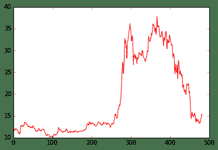
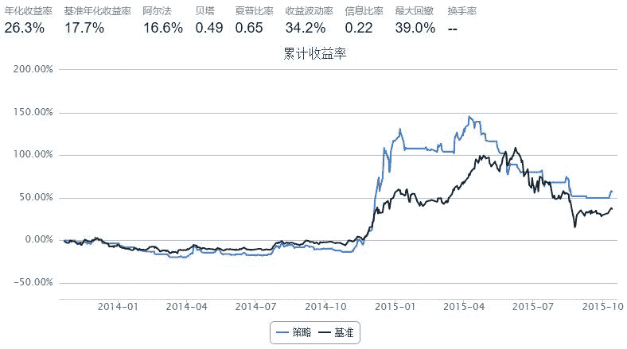

# 用5日均线和10日均线进行判断 --- 改进版

> 来源：https://uqer.io/community/share/561e3a65f9f06c4ca82fb5ec

## 1、 修改Adobe同学的代码

```py
data=DataAPI.MktEqudGet(ticker="600030",beginDate="20131001")    #选取600030股票

a = data.closePrice
B = []
n = len(a)
for i in range(10, n):
    x5 = a[i-5:i].mean()                 #5日均线值
    x10 = a[i-10:i].mean()               #10日均线值
    B.append(x5 > x10)
```

```py
import matplotlib.pyplot as plt

o = data.openPrice
m = len(B)
w = 0                   #利润

cash = 1000000          #操作金额1亿，但考虑买的份额为100的整数，取1百万
amount = 0
            
PL = []              #利润w的数组
for i in range(1, m):
    k = i + 10
    if B[i-1] == 0 and B[i] == 1 and not amount:            
        amount = cash // o[k]     #买入份额
        cash -= o[k] * amount
    elif B[i-1] == 1 and B[i]==0 and amount:
        cash += o[k] * amount      #卖出的金额
        amount = 0
#     print cash, amount
    
    PL.append(cash + o[k] * amount)
        
print("利润：{}".format(PL[-1]))

plt.plot(PL,color="green",label="Profit and Loss")
plt.xlabel("Date")
plt.ylabel("Price")
plt.show()

plt.plot(a[10:], color="red",label="Profit and Loss")
plt.show()

利润：1559132.78
```




## 2、 Uqer框架相同策略

```py
import numpy as np

start = '2013-10-01'				# 回测起始时间
end  =  '2015-10-13'				# 回测结束时间
benchmark = 'SH50'							# 策略参考标准
universe = ['600030.XSHG']	                # 股票池  中信证券
capital_base = 100000                       # 起始资金
commission = Commission(0.0,0.0)

window_short = 5  # 短均线周期
window_long = 10  # 长均线周期

def initialize(account):					# 初始化虚拟账户状态
    account.fund = universe[0]

def handle_data(account):             # 每个交易日的买入卖出指令
    cp_hist = account.get_attribute_history('closePrice', window_long)[account.fund]
    short_mean = np.mean(cp_hist[-window_short:]) # 计算短均线值
    long_mean = np.mean(cp_hist[-window_long:])   #计算长均线值
    
    # 计算买入卖出信号
    if short_mean - long_mean > 0:
        if account.fund not in account.valid_secpos:
            # 空仓时全仓买入，买入股数为100的整数倍
            approximationAmount = int(account.cash / account.referencePrice[account.fund] / 100) * 100
            order(account.fund, approximationAmount)
    else:
        # 卖出时，全仓清空
        if account.fund in account.valid_secpos:
            order_to(account.fund, 0)
```



