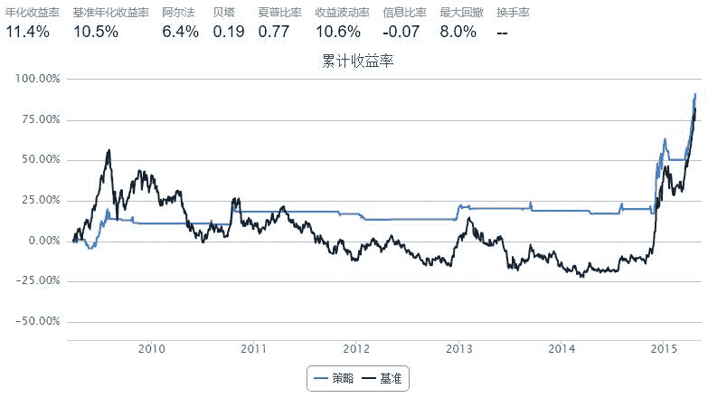

# macross

> 来源：https://uqer.io/community/share/55a92cdcf9f06c57a11b53be

```py
#第一次写大家帮看看有问题么
#策略 ： 日收盘价高于ma20 买入； 低于ma20 卖出清仓
from matplotlib import pylab
import numpy as np
import pandas as pd
import DataAPI
import seaborn as sns
sns.set_style('white')
################

start = datetime(2008, 1, 1)				# 回测起始时间
end  = datetime(2015, 4, 23)				# 回测结束时间
benchmark = 'SH50'							# 策略参考标准
universe = ['510050.XSHG']	# 股票池
#benchmark = 'HS300'
#universe = ['510300.XSHG']
capital_base = 100000     # 起始资金
commission = Commission(0.0,0.0)

window_short = 20
window_long = 300
longest_history = window_long
#longest_history = window_short
SD = 0.05

def initialize(account):					# 初始化虚拟账户状态
    account.fund = universe[0]
    account.SD = SD
    account.window_short = window_short
    account.window_long = window_long

def handle_data(account):             # 每个交易日的买入卖出指令
    hist = account.get_history(longest_history)
    fund = account.fund
    short_mean = np.mean(hist[fund]['closePrice'][-account.window_short:]) # 计算短均线值
    long_mean = np.mean(hist[fund]['closePrice'][-account.window_long:])   #计算长均线值
    now_price = hist[fund]['closePrice'][-1:]
    #print len(short_mean)
    #print type(now_price)
    #print(now_price)
    
    #now_price.plot
    #all_close_prices = account.get_attribute_history('closePrice', 1)
    
    # 计算买入卖出信号
 #   flag = True if (short_mean - long_mean) > account.SD * long_mean else False 
    flag = True if (now_price - short_mean) > account.SD * short_mean else False 
    if flag:
        if account.position.secpos.get(fund, 0) == 0:
            # 空仓时全仓买入，买入股数为100的整数倍
            approximationAmount = int(account.cash / hist[fund]['closePrice'][-1]/100.0) * 100
            order(fund, approximationAmount)
    else:
        # 卖出时，全仓清空
        if account.position.secpos.get(fund, 0) >= 0:
            order_to(fund, 0)
```



