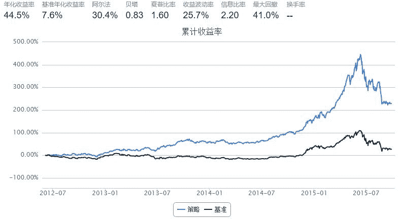

# Simple MACD

> 来源：https://uqer.io/community/share/560a3007f9f06c597665ef61

MACD 公式算法:

+ 短期EMA： 短期（例如12日）的收盘价指数移动平均值（Exponential Moving Average）
+ 长期EMA： 长期（例如26日）的收盘价指数移动平均值（Exponential Moving Average）
+ DIF线：　（Difference）短期EMA和长期EMA的离差值
+ DEA线：　（Difference Exponential Average）DIF线的M日指数平滑移动平均线
+ MACD线：　DIF线与DEA线的差

策略实现：

+ DIF从下而上穿过DEA，买进；
+ 相反，如DIF从上往下穿过DEA，卖出。

## 策略中使用`talib`计算MACD

```py
import pandas as pd
import numpy as np
import talib

start = '2012-01-01'
end = '2015-09-28'
benchmark = 'HS300'
universe = set_universe('HS300')
capital_base = 1000000
refresh_rate = 5

## 使用talib计算MACD的参数
short_win = 12    # 短期EMA平滑天数
long_win  = 26    # 长期EMA平滑天数
macd_win  = 20     # DEA线平滑天数
  
stk_num = 20      # 持仓股票数量
    
longest_history = 100
def initialize(account):
    account.universe = universe
    
def handle_data(account):
    all_close_prices = account.get_attribute_history('closePrice', longest_history)
    
    long_bucket = []
    short_bucket = []
    for stk in account.universe:
        prices = all_close_prices[stk]
        if prices is None:
            continue
        try:
            # talib计算MACD
            macd_tmp = talib.MACD(prices, fastperiod=short_win, slowperiod=long_win, signalperiod=macd_win)
            DIF = macd_tmp[0]
            DEA = macd_tmp[1]
            MACD = macd_tmp[2]
        except:
            continue
            
        # 判断MACD走向
        if MACD[-1] > 0 and MACD[-4] < 0:
            long_bucket.append(stk)
        elif MACD[-1] < 0 and MACD[-4] > 0:
            short_bucket.append(stk)
    
    hold = []
    # 处理持仓中的股票
    for stk in account.valid_secpos:
        # 在short_bucket中的，卖出
        if stk in short_bucket:
            order_to(stk, 0) 
        # 不在short_bucket中的，留着
        else:
            hold.append(stk)
            
    buy_list = hold
    for stk in long_bucket:
        if stk not in hold:
            buy_list.append(stk)
            
    if len(buy_list) > 0:
        # 无论buy_list中有多少只股票，都将仓位分成stk_num份，每份买入一只股票
        amount_per_stk = account.referencePortfolioValue/stk_num
        for stk in buy_list:
            amount = int(amount_per_stk/account.referencePrice[stk] / 100.0) * 100
            order_to(stk, amount)   
```



