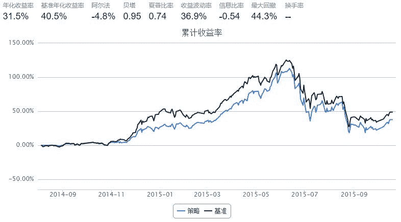

# MACD quantization trade

> 来源：https://uqer.io/community/share/56265ed3f9f06c4ca62fb618

```py
import talib
import copy
from numpy import arange, array, isnan

#本策略的目的在于对常见的MACD指标策略进行验证
start = '2014-01-01'  #start time
end = '2015-10-19' #end time
benchmark = 'HS300'
#universe = ['000001.XSHE', '600000.XSHG']
universe = set_universe('HS300')           # 证券池，支持股票和基金
capital_base = 1000000
freq = 'd'
refresh_rate = 1

def dea_deviate_from_k_line(k_line, dea):
    #判断k线和dea走势是否背离，主要思路是
    #从最新一天开始往回寻找几个极值点，然后
    #进行极值比较
    #然后是从当前点到第一个极值点进行比对
    #最后按照权重返回对应数值
    #对数组进行翻转
    k_line_re = k_line[::-1]
    dea_re = dea[::-1]
    k_line_extremum = []
    #获取极值点的索引，只统计近似区间的情况
    k_line_extremum_inx = {}
    dea_extremum = []
    dea_extremum_inx = {}
    for c in xrange(1, len(k_line_re) - 1):
        if not isnan(k_line_re[c - 1]) and not isnan(k_line_re[c]) and not isnan(k_line_re[c + 1]):
            if k_line_re[c - 1] < k_line_re[c] and k_line_re[c + 1] < k_line_re[c]:
                #获取到极值点
                k_line_extremum.append(k_line_re[c])
                k_line_extremum_inx[k_line_re[c]] = c
    for c in xrange(1, len(dea_re) - 1):
        if not isnan(dea_re[c - 1]) and not isnan(dea_re[c]) and not isnan(dea_re[c + 1]):
            if dea_re[c - 1] < dea_re[c] and dea_re[c + 1] < dea_re[c]:
                dea_extremum.append(dea_re[c])
                dea_extremum_inx[dea_re[c]] = c
    #对极值点进行筛选判断趋势
    sig_extremum = 0
    if len(k_line_extremum) >= 2 and len(dea_extremum)  >= 2:
        k_line_first_deviate = k_line_extremum[0] - k_line_extremum[1]
        dea_first_deviate = dea_extremum[0] - dea_extremum[1]
        k_and_dea_start_deviate = k_line_extremum_inx[k_line_extremum[0]] - dea_extremum_inx[dea_extremum[0]]
        k_and_dea_end_deviate = k_line_extremum_inx[k_line_extremum[1]] - dea_extremum_inx[dea_extremum[1]]
        #k线和dea的同时启动差距要小于２天
        if abs(k_and_dea_start_deviate) < 2:
            #超过３天的背离趋势被确定为趋势
            k_deviate_dates = abs(k_line_extremum_inx[k_line_extremum[0]]) - abs(k_line_extremum_inx[k_line_extremum[1]])
            dea_deviate_date = abs(dea_extremum_inx[dea_extremum[0]]) - abs(dea_extremum_inx[dea_extremum[1]])
            #最好是能同时停止，如果k线和dea线持续时间差值过大，说明应该以大的线为主要趋势
            dea_k_deviate = abs(k_deviate_dates) - abs(dea_deviate_date)
            if abs(k_deviate_dates) >= 3 and abs(dea_deviate_date) >= 3 and dea_k_deviate < 3:
                if k_line_first_deviate < 0 and dea_first_deviate > 0 :
                    #k线下降，dea上升说明是变盘上涨信号
                    sig_extremum = 1;
                elif k_line_first_deviate > 0 and dea_first_deviate < 0:
                    #k线上升，dea下降说明是变盘下跌信号
                    sig_extremum = -1
            else:
                #需要看是以那个线为准
                if abs(k_deviate_dates) > abs(dea_deviate_date):
                    if k_line_first_deviate < 0:
                        sig_extremum = -1
                    else:
                        sig_extremum = 1
                else:
                    if dea_first_deviate < 0:
                        sig_extremum = -1
                    else:
                        sig_extremum = 1
    return sig_extremum

def initialize(account):
    pass

def handle_data(account):
    fibonacci_sequence_date1 = 144
    fibonacci_sequence_date2 = 143
    hist = account.get_attribute_history('closePrice', fibonacci_sequence_date1)
    for stock in account.universe:
        s_num = 0
        for c in hist[stock]:
            if isnan(c):
                s_num += 1
        if s_num >= len(hist[stock]) - 10:
            #说明数据太少直接放过
            continue
        macd, macdsignal, macdhist = talib.MACD(hist[stock])
        trade_signal = 0
        for c in range(fibonacci_sequence_date2, len(macd) - 1):
            #1.DIFF、DEA均为正，DIFF向上突破DEA，买入信号
            if not isnan(macd[c]) and not isnan(macdsignal[c]) and macd[c] > 0 and macdsignal[c] > 0:
                if not isnan(macd[c - 1]) and not isnan(macdsignal[c - 1]) and macd[c - 1] < macdsignal[c - 1]:
                    if not isnan(macd[c + 1]) and not isnan(macdsignal[c + 1]) and macd[c + 1] > macdsignal[c + 1]:
                        trade_signal += 1
            #2.DIFF、DEA均为负，DIFF向下跌破DEA，卖出信号
            if not isnan(macd[c]) and not isnan(macdsignal[c]) and macd[c] < 0 and macdsignal[c] < 0:
                if not isnan(macd[c - 1]) and not isnan(macdsignal[c - 1]) and macd[c - 1] > macdsignal[c - 1]:
                    if not isnan(macd[c + 1]) and not isnan(macdsignal[c + 1]) and macd[c + 1] < macdsignal[c + 1]:
                        trade_signal -= 1
            #4.分析MACD柱状线，由负变正，买入信号
            if not isnan(macdhist[c - 1]) and not isnan(macdhist[c]) and not isnan(macdhist[c + 1]):
                if macdhist[c] > macdhist[c - 1] and macdhist[c + 1] > macdhist[c] and macdhist[c] > 0 and macdhist[c - 1] < 0:
                    trade_signal += 1
            #5.分析MACD柱状线，由正变负，卖出信号
            if not isnan(macdhist[c - 1]) and not isnan(macdhist[c]) and not isnan(macdhist[c + 1]):
                if macdhist[c] < macdhist[c - 1] and macdhist[c + 1] < macdhist[c] and macdhist[c] < 0 and macdhist[c - 1] > 0:
                    trade_signal -= 1
        #3.DEA线与K线发生背离，行情反转信号
        #如果返回0则代表不对信号进行叠加
        trade_signal += dea_deviate_from_k_line(hist[stock], macdsignal)
        if trade_signal > 0 and trade_signal <= 1:
            order(stock, 100)
        elif trade_signal > 1:
            order(stock, 200)
        elif trade_signal < 0 and trade_signal >= -1:
            order(stock, -100)
        elif trade_signal < -1:
            order(stock, -200)
```



