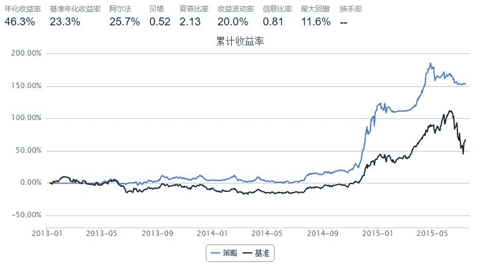

# MACD平滑异同移动平均线方法

> 来源：https://uqer.io/community/share/55a4e581f9f06c6dd0e17efa

策略思路：

MACD（Moving Average Convergence and Divergence)是Geral Appel 于1979年提出的，利用收盘价的短期（常用为12日）指数移动平均线与长期（常用为26日）指数移动平均线之间的聚合与分离状况，对买进、卖出时机作出研判的技术指标。

公式算法:

+ 短期EMA： 短期（例如12日）的收盘价指数移动平均值（Exponential Moving Average）
+ 长期EMA： 长期（例如26日）的收盘价指数移动平均值（Exponential Moving Average）
+ DIF线：　（Difference）短期EMA和长期EMA的离差值
+ DEA线：　（Difference Exponential Average）DIF线的M日指数平滑移动平均线
+ MACD线：　DIF线与DEA线的差

参数：SHORT(短期)、LONG(长期)、M天数，一般为12、26、9。指数加权平滑系数为：

+ 短期EMA平滑系数： 2/(SHORT+1)
+ 长期EMA平滑系数： 2/(LONG+1)
+ DEA线平滑系数： 2/(M+1)

策略实现：

+ DIF从下而上穿过DEA，买进；
+ 相反，如DIF从上往下穿过DEA，卖出。

```py
import pandas as pd

start = datetime(2013, 1, 1)
end = datetime(2015, 7, 13)
benchmark = 'HS300'
#universe = ['601398.XSHG', '600028.XSHG', '601988.XSHG', '600036.XSHG', '600030.XSHG',
            #'601318.XSHG', '600000.XSHG', '600019.XSHG', '600519.XSHG', '601166.XSHG']
universe = set_universe('SH50')
capital_base = 200000
refresh_rate = 1
window = 1

initMACD = -10000.0
histMACD = pd.DataFrame(initMACD, index = universe, columns = ['preShortEMA', 'preLongEMA', 'preDIF', 'preDEA'])
shortWin = 26    # 短期EMA平滑天数
longWin  = 52    # 长期EMA平滑天数
macdWin  = 15    # DEA线平滑天数

longest_history = window

def initialize(account):
    account.amount = 10000
    account.universe = universe
    account.days = 0
    
def handle_data(account):
    account.days = account.days+1
    
    for stk in account.universe:
        all_close_prices = account.get_attribute_history('closePrice', 1)
        prices = all_close_prices[stk]
        if prices is None:
            continue
        
        preShortEMA = histMACD.at[stk, 'preShortEMA']
        preLongEMA = histMACD.at[stk, 'preLongEMA']
        preDIF = histMACD.at[stk, 'preDIF']
        preDEA = histMACD.at[stk, 'preDEA']
        if preShortEMA == initMACD or preLongEMA == initMACD:
            histMACD.at[stk, 'preShortEMA'] = prices[-1]
            histMACD.at[stk, 'preLongEMA'] = prices[-1]
            histMACD.at[stk, 'preDIF'] = 0
            histMACD.at[stk, 'preDEA'] = 0
            return
            
        shortEMA = preShortEMA*1.0*(shortWin-1)/(shortWin+1) + prices[-1]*2.0/(shortWin+1)
        longEMA = preLongEMA*1.0*(longWin-1)/(longWin+1) + prices[-1]*2.0/(longWin+1)
        DIF = shortEMA - longEMA
        DEA = preDEA*1.0*(macdWin-1)/(macdWin+1) + DIF*2.0/(macdWin+1)
        
        histMACD.at[stk, 'preShortEMA'] = shortEMA
        histMACD.at[stk, 'preLongEMA'] = longEMA
        histMACD.at[stk, 'preDIF'] = DIF
        histMACD.at[stk, 'preDEA'] = DEA
            
        if account.days > longWin and account.days%1 == 0:
            #if DIF > 0 and DEA > 0 and preDIF > preDEA and DIF < DEA:
            if preDIF > preDEA and DIF < DEA:
                order_to(stk, 0)
            #if DIF < 0 and DEA < 0 and preDIF < preDEA and DIF > DEA:
            if preDIF < preDEA and DIF > DEA:
                amount = account.amount/prices[-1]
                order_to(stk, amount)
```



