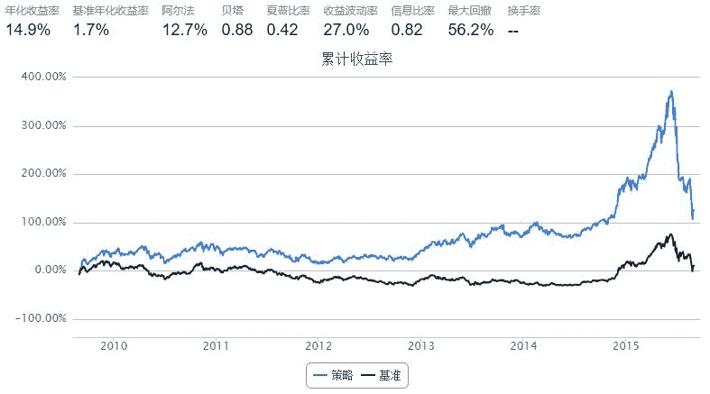
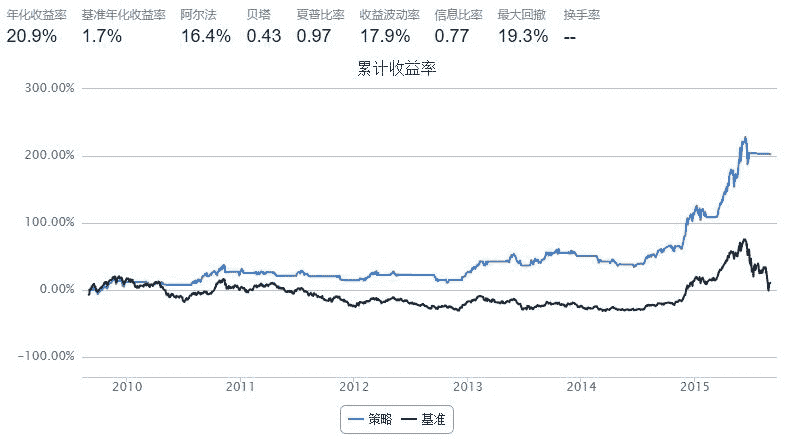
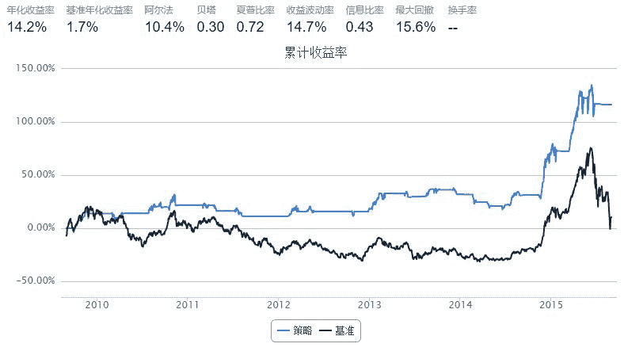

# 4.4 阿隆指标 • 技术指标阿隆（ Aroon ）全解析

> 来源：https://uqer.io/community/share/55e69497f9f06c1eaa81f9d4

## 一、阿隆指标(Aroon)简介

阿隆指标（Aroon）是由图莎尔·钱德（Tushar Chande)1995 年发明的，它通过计算自价格达到近期最高值和最低值以来所经过的期间数，帮助投资者预测证券价格从趋势到区域、区域或反转的变化。在技术分析领域中，有一个说法，一个指标使用的人越多，其效力越低。这个技术指标还挺冷门的，我们一同来看看它的效果。

```py
from CAL.PyCAL import *
import numpy as np
import pandas as pd
from pandas import DataFrame 
from heapq import nlargest
from heapq import nsmallest
```

## 二、Aroon计算方法

Aroon指标分为两个具体指标，分别`AroonUp`和`AroonDown`。其具体计算方式为：

+ `AroonUp = [(计算期天数-最高价后的天数)/计算期天数]*100`
+ `AroonDown = [(计算期天数-最低价后的天数)/计算期天数]*100`
+ `AroonOsc = AroonUp - AroonDown`

计算期天数通常取20天

```py
def aroonUp(account,timeLength=20):
    #运用heapq包的nlargest函数，可以轻松获得：计算期天数-最高价后的天数
    eq_AroonUp = {}
    history = account.get_attribute_history('closePrice',timeLength)
    for stk in account.universe:
        priceSeries = pd.Series(history[stk])
        eq_AroonUp[stk] = (nlargest(1,range(len(priceSeries)),key=priceSeries.get)[0]+1)*100/timeLength # eq_AroonUp[stk]范围在[5,100]之间
    return eq_AroonUp

def aroonDown(account,timeLength=20):
    #运用heapq包的nsmallest函数，可以轻松获得:计算期天数-最低价后的天数
    eq_AroonDown = {}
    history = account.get_attribute_history('closePrice',timeLength)
    for stk in account.universe:
        priceSeries = pd.Series(history[stk])
        eq_AroonDown[stk] = (nsmallest(1,range(len(priceSeries)),key=priceSeries.get)[0]+1)*100/timeLength # eq_AroonDown[stk]范围在[5,100]之间
    return eq_AroonDown
```

三、Aroon指标的基本用法

+ 当`AroonUp`指标向下跌破50 时，表示向上的趋势正在失去动力；当`AroonDown`指标向下跌破50时，表示向下的趋势正在失去动力；如果两个指标都在低位，表示股价没有明确的趋势；如果指标在70 以上，表示趋势十分强烈；如果在30 以下，表明相反的趋势正在酝酿。通常来说，`AroonOsc`在0附近时，是典型的无趋势特征，股票处于盘整阶段。
+ 参考研报[《技术指标系列（三）——加入“二次确认”的AROON 阿隆优化指标》](http://www.doc88.com/p-396145162466.html)中的方法，我们买入`AroonOsc > 50`的股票。

```py
start = '2009-08-01'                       # 回测起始时间
end = '2015-08-31'                         # 回测结束时间
benchmark = 'HS300'                        # 策略参考标准
universe = set_universe('HS300')             # 证券池，支持股票和基金
capital_base = 100000                      # 起始资金
freq = 'd'                                 # 策略类型，'d'表示日间策略使用日线回测，'m'表示日内策略使用分钟线回测
refresh_rate = 10                          # 调仓频率，表示执行handle_data的时间间隔，若freq = 'd'时间间隔的单位为交易日，若freq = 'm'时间间隔为分钟

def initialize(account):                   # 初始化虚拟账户状态
    
    pass

def handle_data(account):                  # 每个交易日的买入卖出指令
    eq_AroonUp = aroonUp(account,20)
    eq_AroonDown = aroonDown(account,20)
    buyList = []
    for stk in account.valid_secpos:
            order_to(stk, 0)

    for stk in account.universe:
        if  eq_AroonUp[stk] - eq_AroonDown[stk] > 50:
            buyList.append(stk)

    for stk in buyList[:]:
        if stk not in account.universe or account.referencePrice[stk] == 0 or np.isnan(account.referencePrice[stk]):
            buyList.remove(stk)

    for stk in buyList:
        order(stk, account.referencePortfolioValue/account.referencePrice[stk]/len(buyList))  
```



可以看出，策略在股市处于震荡市和牛市中，表现很好；而在熊市和暴跌中，表现的非常差，最大回撤很大。这从阿隆指标的构造中，就可以理解，阿隆指标是一个跟踪趋势的指标，在震荡市和牛市中，都能精选出股票，超越指数；然而在暴跌中，处于上升趋势的股票可能跌的更惨，倾巢之下，焉有完卵。。。

## 四、运用Aroon指标来择时

前文说到阿隆指标是一个跟踪趋势的指标，既然如此，我们为什么不把它用来择时呢？

```py
def aroonIndex(account,timeLength=20):
    #构建指数阿隆指标
    indexSeries = pd.Series(account.get_symbol_history('benchmark', timeLength)['closeIndex'])
    indexAronUp = (nlargest(1,range(len(indexSeries)),key=indexSeries.get)[0]+1)*100/timeLength
    indexAronDown = (nsmallest(1,range(len(indexSeries)),key=indexSeries.get)[0]+1)*100/timeLength
    indexOsc = indexAronUp - indexAronDown
    return indexOsc
```

当`indexOsc > 0`时，我们大致认为现在的市场环境没有那么差，可以考虑开仓，编写如下策略。

```py
start = '2009-08-01'                       # 回测起始时间
end = '2015-08-31'                         # 回测结束时间
benchmark = 'HS300'                        # 策略参考标准
universe = set_universe('HS300')             # 证券池，支持股票和基金
capital_base = 100000                      # 起始资金
freq = 'd'                                 # 策略类型，'d'表示日间策略使用日线回测，'m'表示日内策略使用分钟线回测
refresh_rate = 10                          # 调仓频率，表示执行handle_data的时间间隔，若freq = 'd'时间间隔的单位为交易日，若freq = 'm'时间间隔为分钟

def initialize(account):                   # 初始化虚拟账户状态
    
    pass

def handle_data(account):                  # 每个交易日的买入卖出指令
    eq_AroonUp = aroonUp(account,20)
    eq_AroonDown = aroonDown(account,20)
    index_osc = aroonIndex(account,20)
    buyList = []
    for stk in account.valid_secpos:
            order_to(stk, 0)

    if index_osc > 0:
        for stk in account.universe:
            if  eq_AroonUp[stk] - eq_AroonDown[stk] > 50:
                buyList.append(stk)

        for stk in buyList[:]:
            if stk not in account.universe or account.referencePrice[stk] == 0 or np.isnan(account.referencePrice[stk]):
                buyList.remove(stk)

        for stk in buyList:
            order(stk, account.referencePortfolioValue/account.referencePrice[stk]/len(buyList))  
```



可以看出运用阿隆指标来择时的效果还是不错的，震荡市能跑赢指数，牛市的收益基本可以吃到，暴跌也几乎完美的规避了！缺点就是最大回测还是偏大，可以考虑让条件更严格，让`indexOsc > 50`。

```py
start = '2009-08-01'                       # 回测起始时间
end = '2015-08-31'                         # 回测结束时间
benchmark = 'HS300'                        # 策略参考标准
universe = set_universe('HS300')             # 证券池，支持股票和基金
capital_base = 100000                      # 起始资金
freq = 'd'                                 # 策略类型，'d'表示日间策略使用日线回测，'m'表示日内策略使用分钟线回测
refresh_rate = 10                          # 调仓频率，表示执行handle_data的时间间隔，若freq = 'd'时间间隔的单位为交易日，若freq = 'm'时间间隔为分钟

def initialize(account):                   # 初始化虚拟账户状态
    
    pass

def handle_data(account):                  # 每个交易日的买入卖出指令
    eq_AroonUp = aroonUp(account,20)
    eq_AroonDown = aroonDown(account,20)
    index_osc = aroonIndex(account,20)
    buyList = []
    for stk in account.valid_secpos:
            order_to(stk, 0)

    if index_osc > 50:
        for stk in account.universe:
            if  eq_AroonUp[stk] - eq_AroonDown[stk] > 50:
                buyList.append(stk)

        for stk in buyList[:]:
            if stk not in account.universe or account.referencePrice[stk] == 0 or np.isnan(account.referencePrice[stk]):
                buyList.remove(stk)

        for stk in buyList:
            order(stk, account.referencePortfolioValue/account.referencePrice[stk]/len(buyList))  
```



将择时条件设置更严格后，最大回撤果然有所下降，但年化收益率也有大幅下降。从回测图形中，也可以明显看到，指标具有很强的滞后性，往往是指数开始涨了一段时间，策略才开始开仓买入。将`indexOsc`条件设置的越严格，滞后性表现的就越明显，这样虽然可以提高正确率，减小最大回撤，但有许多收益也错过了。

