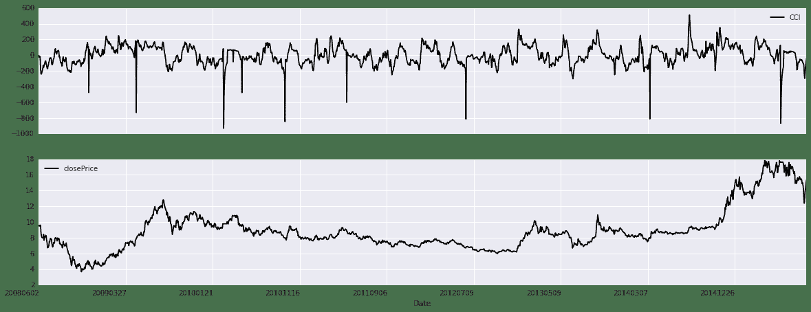
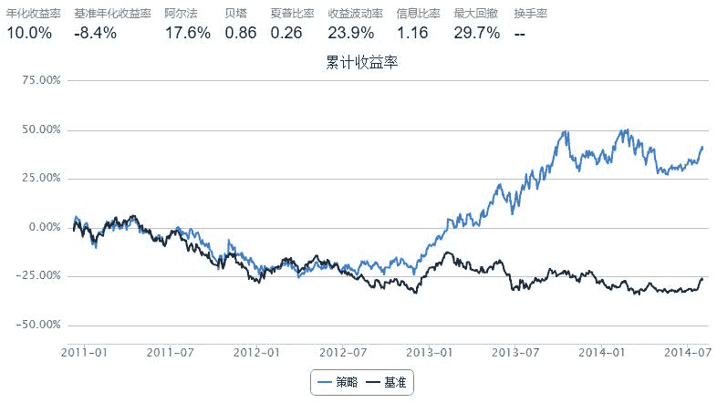
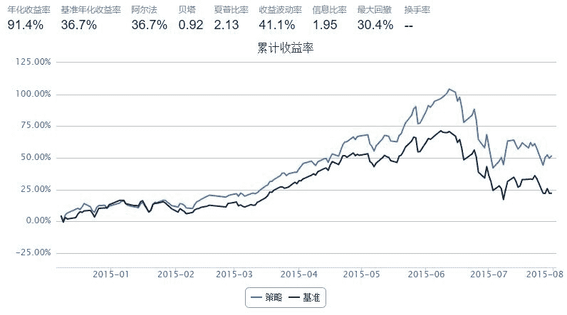

# 4.5 CCI •  CCI 顺势指标探索

> 来源：https://uqer.io/community/share/55f28179f9f06c1ea681fa40

## 一、CCI指标简介与构造

顺势指标CCI由唐纳德拉姆伯特所创，是通过测量股价的波动是否已超出其正常范围，来预测股价变化趋势的技术分析指标。计算方法参考[《技术指标系列（五）——CCI的顺势而为 》](https://uqer.io/community/share/55f28179f9f06c1ea681fa40)。

下面描绘出CCI与股价时序图走势

```py
def cci(stock,start_date,end_date,windows):   #设置股票，起始时间，以及CCI指标多少日
    import pandas as pd
    import numpy as np
    from CAL.PyCAL import *
    Alpha = 0.015
    eq_TP = {}
    eq_MATP = {}
    eq_meanDev = {}
    eq_CCI = {}
    cal = Calendar('China.SSE')
    windows = '-'+str(windows)+'B'
    start_date = Date.strptime(start_date,"%Y%m%d")
    end_date = Date.strptime(end_date,"%Y%m%d")
    timeLength = cal.bizDatesList(start_date, end_date)
    
    for i in xrange(len(timeLength)):
        
        begin_date = cal.advanceDate(timeLength[i],windows,BizDayConvention.Unadjusted)
        begin_date =begin_date.strftime("%Y%m%d")
        timeLength[i] = timeLength[i].strftime("%Y%m%d")
        eq_static = DataAPI.MktEqudAdjGet(secID=stock,beginDate=begin_date,endDate=timeLength[i],field=['secID','highestPrice','lowestPrice','closePrice'],pandas="1")
        for stk in stock:
            try:
                eq_TP[stk] = np.array(eq_static[eq_static['secID'] == stk].mean(axis=1))
                eq_MATP[stk] = sum(eq_TP[stk])/len(eq_TP[stk])
                eq_meanDev[stk] = sum(abs(eq_TP[stk] - eq_MATP[stk]))/len(eq_TP[stk])
                eq_CCI[stk].append((eq_TP[stk][-1] - eq_MATP[stk])/(Alpha * eq_meanDev[stk]))    
            except:
                eq_CCI[stk] = []
                
    Date = pd.DataFrame(timeLength)
    eq_CCI = pd.DataFrame(eq_CCI)
    cciSeries = pd.concat([Date,eq_CCI],axis =1)
    cciSeries.columns = ['Date','CCI']
    return cciSeries
    
def cci_price_Plot(stock,start_date,end_date,windows):
    cciSeries = cci(stock,start_date,end_date,windows)
    closePrice = DataAPI.MktEqudAdjGet(secID=stock,beginDate=start_date,endDate=end_date,field=['closePrice'],pandas="1")
    table = pd.merge(cciSeries,closePrice, left_index=True, right_index=True, how = 'inner')
    return table
```

```py
import pandas as pd
import numpy as np
from CAL.PyCAL import *
cal = Calendar('China.SSE')
table = cci_price_Plot(['600000.XSHG'],'20080531','20150901',30)  #绘制浦发银行的CCI与股价对比图
tableDate = table.set_index('Date')
tableDate.plot(figsize=(20,8),subplots = 1)


array([<matplotlib.axes.AxesSubplot object at 0x60037d0>,
       <matplotlib.axes.AxesSubplot object at 0x602fa90>], dtype=object)
```



## 二、CCI指标简单应用

选取CCI处于100和150之间，开始处于上涨趋势的股票。关于windows，我们用quick_backtest做一个简单的优化

```py
def cci(account,N=20):
    Alpha = 0.015
    eq_TP = {}
    eq_MATP = {}
    eq_meanDev = {}
    eq_CCI = {}
    eq_highPrice = account.get_attribute_history('highPrice',N)
    eq_closePrice = account.get_attribute_history('closePrice',N)
    eq_lowPrice = account.get_attribute_history('lowPrice',N)
    for stk in account.universe:
        eq_TP[stk] = (eq_highPrice[stk] + eq_closePrice[stk] + eq_lowPrice[stk])/3
        eq_MATP[stk] = sum(eq_TP[stk])/len(eq_TP[stk])
        eq_meanDev[stk] = sum(abs(eq_TP[stk] - eq_MATP[stk]))/len(eq_TP[stk])
        eq_CCI[stk] = (eq_TP[stk][-1] - eq_MATP[stk])/(Alpha * eq_meanDev[stk])
    return eq_CCI
```

```py
start = '2010-08-01'                       # 回测起始时间
end = '2014-08-01'                         # 回测结束时间
benchmark = 'HS300'                        # 策略参考标准
universe = set_universe('HS300')           # 证券池，支持股票和基金
capital_base = 100000                      # 起始资金
freq = 'd'                                 # 策略类型，'d'表示日间策略使用日线回测，'m'表示日内策略使用分钟线回测
refresh_rate = 20                          # 调仓频率，表示执行handle_data的时间间隔，若freq = 'd'时间间隔的单位为交易日，若freq = 'm'时间间隔为分钟

sim_params = quartz.sim_condition.env.SimulationParameters(start, end, benchmark, universe, capital_base)
idxmap_all, data_all = quartz.sim_condition.data_generator.get_daily_data(sim_params)
```

```py
from CAL.PyCAL import *
import pandas as pd
import numpy as np


def initialize(account):                   # 初始化虚拟账户状态
    pass

def handle_data(account):                  # 每个交易日的买入卖出指令    
    eq_CCI = cci(account,window)
    buylist = []        
    for stk in account.universe:
        try:
            if eq_CCI[stk] > 100 and eq_CCI[stk] < 150:
                buylist.append(stk)
        except:
            pass
    
    for stk in account.valid_secpos:
        order_to(stk, 0)
        
    for stk in buylist[:]:
            if stk not in account.universe or account.referencePrice[stk] == 0 or np.isnan(account.referencePrice[stk]):
                bulist.remove(stk)
    
    for stk in buylist:
        order(stk, account.referencePortfolioValue/account.referencePrice[stk]/len(buylist))  
print 'window   annualized_return   sharpe   max_drawdown'
for window in range(10, 100, 5):
    strategy = quartz.sim_condition.strategy.TradingStrategy(initialize, handle_data)        
    bt_test, acct = quartz.quick_backtest(sim_params, strategy, idxmap_all, data_all,refresh_rate = refresh_rate)
    perf = quartz.perf_parse(bt_test, acct)
    print '  {0:2d}        {1:>7.4f}          {2:>7.4f}    {3:>7.4f}'.format(window, perf['annualized_return'], perf['sharpe'], perf['max_drawdown'])  

window   annualized_return   sharpe   max_drawdown
  10         0.0186          -0.0610     0.4161
  15        -0.0367          -0.2818     0.5448
  20         0.0753           0.1734     0.4531
  25         0.0268          -0.0254     0.3098
  30        -0.0440          -0.3198     0.5640
  35         0.0481           0.0599     0.4794
  40         0.1117           0.3270     0.4057
  45         0.0619           0.1176     0.2353
  50        -0.0425          -0.3442     0.4226
  55         0.0227          -0.0577     0.3355
  60         0.0513           0.0540     0.4461
  65         0.0860           0.1969     0.2304
  70         0.0434           0.0218     0.3005
  75         0.0126          -0.1176     0.3672
  80         0.0891           0.2084     0.3728
  85         0.1002           0.2554     0.2971
  90         0.0768           0.1687     0.2710
  95         0.0243          -0.0588     0.3461    
```

```py
from CAL.PyCAL import *
import pandas as pd
import numpy as np

start = '2010-08-01'                       # 回测起始时间
end = '2014-08-01'                         # 回测结束时间
benchmark = 'HS300'                        # 策略参考标准
universe = set_universe('HS300')           # 证券池，支持股票和基金
capital_base = 100000                      # 起始资金
freq = 'd'                                 # 策略类型，'d'表示日间策略使用日线回测，'m'表示日内策略使用分钟线回测
refresh_rate = 20                          # 调仓频率，表示执行handle_data的时间间隔，若freq = 'd'时间间隔的单位为交易日，若freq = 'm'时间间隔为分钟

def initialize(account):                   # 初始化虚拟账户状态
    pass

def handle_data(account):                  # 每个交易日的买入卖出指令    
    eq_CCI = cci(account,85)
    buylist = []        
    for stk in account.universe:
        try:
            if eq_CCI[stk] > 100 and eq_CCI[stk] < 150:
                buylist.append(stk)
        except:
            pass
    
    
    for stk in account.valid_secpos:
        order_to(stk, 0)
        
    for stk in buylist[:]:
            if stk not in account.universe or account.referencePrice[stk] == 0 or np.isnan(account.referencePrice[stk]):
                bulist.remove(stk)
    
    for stk in buylist:
        order(stk, account.referencePortfolioValue/account.referencePrice[stk]/len(buylist)) 
```



样本外测试

```py
from CAL.PyCAL import *
import pandas as pd
import numpy as np

start = '2014-08-01'                       # 回测起始时间
end = '2015-08-01'                         # 回测结束时间
benchmark = 'HS300'                        # 策略参考标准
universe = set_universe('HS300')           # 证券池，支持股票和基金
capital_base = 100000                      # 起始资金
freq = 'd'                                 # 策略类型，'d'表示日间策略使用日线回测，'m'表示日内策略使用分钟线回测
refresh_rate = 20                          # 调仓频率，表示执行handle_data的时间间隔，若freq = 'd'时间间隔的单位为交易日，若freq = 'm'时间间隔为分钟

def initialize(account):                   # 初始化虚拟账户状态
    pass

def handle_data(account):                  # 每个交易日的买入卖出指令    
    eq_CCI = cci(account,85)
    buylist = []        
    for stk in account.universe:
        try:
            if eq_CCI[stk] > 100 and eq_CCI[stk] < 150:
                buylist.append(stk)
        except:
            pass
    
    
    for stk in account.valid_secpos:
        order_to(stk, 0)
        
    for stk in buylist[:]:
            if stk not in account.universe or account.referencePrice[stk] == 0 or np.isnan(account.referencePrice[stk]):
                bulist.remove(stk)
    
    for stk in buylist:
        order(stk, account.referencePortfolioValue/account.referencePrice[stk]/len(buylist)) 
```



