# 量化分析师的Python日记【第4天：一大波金融Library来袭之scipy篇】

> 来源：https://uqer.io/community/share/54d83bb3f9f06c276f651a6e

上一篇介绍了`numpy`,本篇中着重介绍一下另一个量化金融中常用的库 `scipy`

## 一、SciPy概述

前篇已经大致介绍了NumPy，接下来让我们看看SciPy能做些什么。NumPy替我们搞定了向量和矩阵的相关操作，基本上算是一个高级的科学计算器。SciPy基于NumPy提供了更为丰富和高级的功能扩展，在统计、优化、插值、数值积分、时频转换等方面提供了大量的可用函数，基本覆盖了基础科学计算相关的问题。

在量化分析中，运用最广泛的是统计和优化的相关技术，本篇重点介绍SciPy中的统计和优化模块，其他模块在随后系列文章中用到时再做详述。

本篇会涉及到一些矩阵代数，如若感觉不适，可考虑跳过第三部分或者在理解时简单采用一维的标量代替高维的向量。

首先还是导入相关的模块，我们使用的是SciPy里面的统计和优化部分：

```py
import numpy as np
import scipy.stats as stats
import scipy.optimize as opt
```

## 二、统计部分

### 2.1 生成随机数

我们从生成随机数开始，这样方便后面的介绍。生成n个随机数可用`rv_continuous.rvs(size=n)`或`rv_discrete.rvs(size=n)`，其中`rv_continuous`表示连续型的随机分布，如均匀分布（uniform）、正态分布（norm）、贝塔分布（beta）等；`rv_discrete`表示离散型的随机分布，如伯努利分布（bernoulli）、几何分布（geom）、泊松分布（poisson）等。我们生成10个`[0, 1]`区间上的随机数和10个服从参数`a=4`，`b=2`的贝塔分布随机数：

```py
rv_unif = stats.uniform.rvs(size=10)
print rv_unif
rv_beta = stats.beta.rvs(size=10, a=4, b=2)
print rv_beta

[ 0.6419336   0.48403001  0.89548809  0.73837498  0.65744886  0.41845577
  0.3823512   0.0985301   0.66785949  0.73163835]
[ 0.82164685  0.69563836  0.74207073  0.94348192  0.82979411  0.87013796
  0.78412952  0.47508183  0.29296073  0.52551156]
```

在每个随机分布的生成函数里，都内置了默认的参数，如均匀分布的上下界默认是0和1。可是一旦需要修改这些参数，每次生成随机都要敲这么老长一串有点麻烦，能不能简单点？SciPy里头有一个Freezing的功能，可以提供简便版本的命令。`SciPy.stats`支持定义出某个具体的分布的对象，我们可以做如下的定义，让`beta`直接指代具体参数`a=4`和`b=2`的贝塔分布。为让结果具有可比性，这里指定了随机数的生成种子，由NumPy提供。

```py
np.random.seed(seed=2015)
rv_beta = stats.beta.rvs(size=10, a=4, b=2)
print "method 1:"
print rv_beta

np.random.seed(seed=2015)
beta = stats.beta(a=4, b=2)
print "method 2:"
print beta.rvs(size=10)

method 1:
[ 0.43857338  0.9411551   0.75116671  0.92002864  0.62030521  0.56585548
  0.41843548  0.5953096   0.88983036  0.94675351]
method 2:
[ 0.43857338  0.9411551   0.75116671  0.92002864  0.62030521  0.56585548
  0.41843548  0.5953096   0.88983036  0.94675351]
```

### 2.2 假设检验

好了，现在我们生成一组数据，并查看相关的统计量（相关分布的参数可以在[这里](http://docs.scipy.org/doc/scipy/reference/stats.html)查到）：

```py
norm_dist = stats.norm(loc=0.5, scale=2)
n = 200
dat = norm_dist.rvs(size=n)
print "mean of data is: " + str(np.mean(dat))
print "median of data is: " + str(np.median(dat))
print "standard deviation of data is: " + str(np.std(dat))

mean of data is: 0.383309149888
median of data is: 0.394980561217
standard deviation of data is: 2.00589851641
```

假设这个数据是我们获取到的实际的某些数据，如股票日涨跌幅，我们对数据进行简单的分析。最简单的是检验这一组数据是否服从假设的分布，如正态分布。这个问题是典型的单样本假设检验问题，最为常见的解决方案是采用K-S检验（ Kolmogorov-Smirnov test）。单样本K-S检验的原假设是给定的数据来自和原假设分布相同的分布，在SciPy中提供了`kstest`函数，参数分别是数据、拟检验的分布名称和对应的参数：

```py
mu = np.mean(dat)
sigma = np.std(dat)
stat_val, p_val = stats.kstest(dat, 'norm', (mu, sigma))
print 'KS-statistic D = %6.3f p-value = %6.4f' % (stat_val, p_val)

KS-statistic D =  0.037 p-value = 0.9428
```

假设检验的p-value值很大（在原假设下，p-value是服从`[0, 1]`区间上的均匀分布的随机变量，可参考 http://en.wikipedia.org/wiki/P-value ），因此我们接受原假设，即该数据通过了正态性的检验。在正态性的前提下，我们可进一步检验这组数据的均值是不是0。典型的方法是t检验（t-test），其中单样本的t检验函数为`ttest_1samp`：

```py
stat_val, p_val = stats.ttest_1samp(dat, 0)
print 'One-sample t-statistic D = %6.3f, p-value = %6.4f' % (stat_val, p_val)

One-sample t-statistic D =  2.696, p-value = 0.0076
```

我们看到`p-value<0.05`，即给定显著性水平0.05的前提下，我们应拒绝原假设：数据的均值为0。我们再生成一组数据，尝试一下双样本的t检验（`ttest_ind`）：

```py
norm_dist2 = stats.norm(loc=-0.2, scale=1.2)
dat2 = norm_dist2.rvs(size=n/2)
stat_val, p_val = stats.ttest_ind(dat, dat2, equal_var=False)
print 'Two-sample t-statistic D = %6.3f, p-value = %6.4f' % (stat_val, p_val)

Two-sample t-statistic D =  3.572, p-value = 0.0004
```

注意，这里我们生成的第二组数据样本大小、方差和第一组均不相等，在运用t检验时需要使用Welch's t-test，即指定`ttest_ind`中的`equal_var=False`。我们同样得到了比较小的`p-value$`，在显著性水平0.05的前提下拒绝原假设，即认为两组数据均值不等。

`stats`还提供其他大量的假设检验函数，如`bartlett`和`levene`用于检验方差是否相等；`anderson_ksam`p用于进行Anderson-Darling的K-样本检验等。

### 2.3 其他函数

有时需要知道某数值在一个分布中的分位，或者给定了一个分布，求某分位上的数值。这可以通过`cdf`和`ppf`函数完成：

```py
g_dist = stats.gamma(a=2)
print "quantiles of 2, 4 and 5:"
print g_dist.cdf([2, 4, 5])
print "Values of 25%, 50% and 90%:"
print g_dist.pdf([0.25, 0.5, 0.95])

quantiles of 2, 4 and 5:
[ 0.59399415  0.90842181  0.95957232]
Values of 25%, 50% and 90%:
[ 0.1947002   0.30326533  0.36740397]
```

对于一个给定的分布，可以用`moment`很方便的查看分布的矩信息，例如我们查看`N(0,1)`的六阶原点矩：

```py
stats.norm.moment(6, loc=0, scale=1)

15.000000000895332
```

`describe`函数提供对数据集的统计描述分析，包括数据样本大小，极值，均值，方差，偏度和峰度：

```py
norm_dist = stats.norm(loc=0, scale=1.8)
dat = norm_dist.rvs(size=100)
info = stats.describe(dat)
print "Data size is: " + str(info[0])
print "Minimum value is: " + str(info[1][0])
print "Maximum value is: " + str(info[1][1])
print "Arithmetic mean is: " + str(info[2])
print "Unbiased variance is: " + str(info[3])
print "Biased skewness is: " + str(info[4])
print "Biased kurtosis is: " + str(info[5])

Data size is: 100
Minimum value is: -5.73556523159
Maximum value is: 3.77439818033
Arithmetic mean is: -0.00559348382755
Unbiased variance is: 3.64113204268
Biased skewness is: -0.600615731841
Biased kurtosis is: 0.432147856587
```

当我们知道一组数据服从某些分布的时候，可以调用`fit`函数来得到对应分布参数的极大似然估计（MLE, maximum-likelihood estimation）。以下代码示例了假设数据服从正态分布，用极大似然估计分布参数：

```py
norm_dist = stats.norm(loc=0, scale=1.8)
dat = norm_dist.rvs(size=100)
mu, sigma = stats.norm.fit(dat)
print "MLE of data mean:" + str(mu)
print "MLE of data standard deviation:" + str(sigma)

MLE of data mean:0.00712958665203
MLE of data standard deviation:1.71228079199
```

`pearsonr`和`spearmanr`可以计算`Pearson`和`Spearman`相关系数，这两个相关系数度量了两组数据的相互线性关联程度：

```py
norm_dist = stats.norm()
dat1 = norm_dist.rvs(size=100)
exp_dist = stats.expon()
dat2 = exp_dist.rvs(size=100)
cor, pval = stats.pearsonr(dat1, dat2)
print "Pearson correlation coefficient: " + str(cor)
cor, pval = stats.pearsonr(dat1, dat2)
print "Spearman's rank correlation coefficient: " + str(cor)

Pearson correlation coefficient: -0.0345336831321
Spearman's rank correlation coefficient: -0.0345336831321
```

其中的p-value表示原假设（两组数据不相关）下，相关系数的显著性。

最后，在分析金融数据中使用频繁的线性回归在SciPy中也有提供，我们来看一个例子：

```py
x = stats.chi2.rvs(3, size=50)
y = 2.5 + 1.2 * x + stats.norm.rvs(size=50, loc=0, scale=1.5)
slope, intercept, r_value, p_value, std_err = stats.linregress(x, y)
print "Slope of fitted model is:" , slope
print "Intercept of fitted model is:", intercept
print "R-squared:", r_value**2

Slope of fitted model is: 1.20010505908
Intercept of fitted model is: 2.04778311819
R-squared: 0.781316678233
```

在前面的链接中，可以查到大部分`stat`中的函数，本节权作简单介绍，挖掘更多功能的最好方法还是直接读原始的文档。另外，StatsModels（ http://statsmodels.sourceforge.net ）模块提供了更为专业，更多的统计相关函数。若在SciPy没有满足需求，可以采用StatsModels。

## 三、优化部分

优化问题在投资中可谓是根本问题，如果手上有众多可选的策略，应如何从中选择一个“最好”的策略进行投资呢？这时就需要用到一些优化技术针对给定的指标进行寻优。随着越来越多金融数据的出现，机器学习逐渐应用在投资领域，在机器学习中，优化也是十分重要的一个部分。以下介绍一些常见的优化方法，虽然例子是人工生成的，不直接应用于实际金融数据，我们希望读者在后面遇到优化问题时，能够从这些简单例子迅速上手解决。

### 3.1 无约束优化问题

所谓的无约束优化问题指的是一个优化问题的寻优可行集合是目标函数自变量的定义域，即没有外部的限制条件。例如，求解优化问题

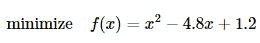

就是一个无约束优化问题，而求解

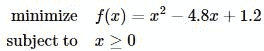

则是一个带约束的优化问题。更进一步，我们假设考虑的问题全部是凸优化问题，即目标函数是凸函数，其自变量的可行集是凸集。（详细定义可参考斯坦福大学Stephen Boyd教授的教材convex optimization，下载链接：http://stanford.edu/~boyd/cvxbook ）

我们以Rosenbrock函数

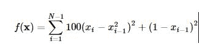

作为寻优的目标函数来简要介绍在SciPy中使用优化模块`scipy.optimize`。

首先需要定义一下这个Rosenbrock函数：

```py
def rosen(x):
    """The Rosenbrock function"""
    return sum(100.0*(x[1:]-x[:-1]**2.0)**2.0 + (1-x[:-1])**2.0)
```

3.1.1 Nelder-Mead单纯形法

单纯形法是运筹学中介绍的求解线性规划问题的通用方法，这里的Nelder-Mead单纯形法与其并不相同，只是用到单纯形的概念。设定起始点`x0=(1.3,0.7,0.8,1.9,1.2)`，并进行最小化的寻优。这里`xtol`表示迭代收敛的容忍误差上界：

```py
x_0 = np.array([0.5, 1.6, 1.1, 0.8, 1.2])
res = opt.minimize(rosen, x_0, method='nelder-mead', options={'xtol': 1e-8, 'disp': True})
print "Result of minimizing Rosenbrock function via Nelder-Mead Simplex algorithm:"
print res

Optimization terminated successfully.
         Current function value: 0.000000
         Iterations: 436
         Function evaluations: 706
Result of minimizing Rosenbrock function via Nelder-Mead Simplex algorithm:
  status: 0
    nfev: 706
 success: True
     fun: 1.6614969876635003e-17
       x: array([ 1.,  1.,  1.,  1.,  1.])
 message: 'Optimization terminated successfully.'
     nit: 436
```

Rosenbrock函数的性质比较好，简单的优化方法就可以处理了，还可以在`minimize`中使用`method='powell'`来指定使用Powell's method。这两种简单的方法并不使用函数的梯度，在略微复杂的情形下收敛速度比较慢，下面让我们来看一下用到函数梯度进行寻优的方法。

3.1.2 Broyden-Fletcher-Goldfarb-Shanno法

Broyden-Fletcher-Goldfarb-Shanno（BFGS）法用到了梯度信息，首先求一下Rosenbrock函数的梯度：

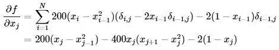

其中当`i=j`时，`δi,j=1`，否则`δi,j=0`。

边界的梯度是特例，有如下形式：

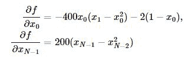

我们可以如下定义梯度向量的计算函数了：

```py
def rosen_der(x):
    xm = x[1:-1]
    xm_m1 = x[:-2]
    xm_p1 = x[2:]
    der = np.zeros_like(x)
    der[1:-1] = 200*(xm-xm_m1**2) - 400*(xm_p1 - xm**2)*xm - 2*(1-xm)
    der[0] = -400*x[0]*(x[1]-x[0]**2) - 2*(1-x[0])
    der[-1] = 200*(x[-1]-x[-2]**2)
    return der
```

梯度信息的引入在`minimize`函数中通过参数`jac`指定：

```py
res = opt.minimize(rosen, x_0, method='BFGS', jac=rosen_der, options={'disp': True})
print "Result of minimizing Rosenbrock function via Broyden-Fletcher-Goldfarb-Shanno algorithm:"
print res

Optimization terminated successfully.
         Current function value: 0.000000
         Iterations: 52
         Function evaluations: 63
         Gradient evaluations: 63
Result of minimizing Rosenbrock function via Broyden-Fletcher-Goldfarb-Shanno algorithm:
   status: 0
  success: True
     njev: 63
     nfev: 63
 hess_inv: array([[ 0.00726515,  0.01195827,  0.0225785 ,  0.04460906,  0.08923649],
       [ 0.01195827,  0.02417936,  0.04591135,  0.09086889,  0.18165604],
       [ 0.0225785 ,  0.04591135,  0.09208689,  0.18237695,  0.36445491],
       [ 0.04460906,  0.09086889,  0.18237695,  0.36609277,  0.73152922],
       [ 0.08923649,  0.18165604,  0.36445491,  0.73152922,  1.46680958]])
      fun: 3.179561068096293e-14
        x: array([ 1.        ,  0.99999998,  0.99999996,  0.99999992,  0.99999983])
  message: 'Optimization terminated successfully.'
      jac: array([  4.47207141e-06,   1.30357917e-06,  -1.86454207e-07,
        -2.00564982e-06,   4.98799446e-07])
```

3.1.3 牛顿共轭梯度法（Newton-Conjugate-Gradient algorithm）

用到梯度的方法还有牛顿法，牛顿法是收敛速度最快的方法，其缺点在于要求Hessian矩阵（二阶导数矩阵）。牛顿法大致的思路是采用泰勒展开的二阶近似：

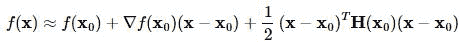

其中`H(x0)`表示二阶导数矩阵。若Hessian矩阵是正定的，函数的局部最小值可以通过使上面的二次型的一阶导数等于0来获取，我们有：

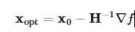

这里可使用共轭梯度近似Hessian矩阵的逆矩阵。下面给出Rosenbrock函数的Hessian矩阵元素通式：

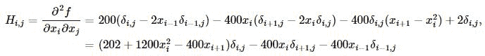

其中`i,j∈[1,N−2]`。其他边界上的元素通式为：

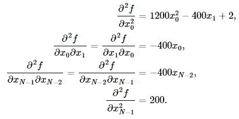

例如，当`N=5`时的Hessian矩阵为：

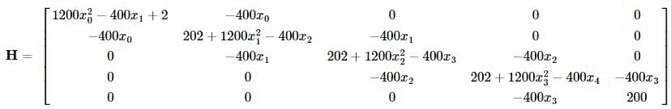

为使用牛顿共轭梯度法，我们需要提供一个计算Hessian矩阵的函数：

```py
def rosen_hess(x):
    x = np.asarray(x)
    H = np.diag(-400*x[:-1],1) - np.diag(400*x[:-1],-1)
    diagonal = np.zeros_like(x)
    diagonal[0] = 1200*x[0]**2-400*x[1]+2
    diagonal[-1] = 200
    diagonal[1:-1] = 202 + 1200*x[1:-1]**2 - 400*x[2:]
    H = H + np.diag(diagonal)
    return H
```

```py
res = opt.minimize(rosen, x_0, method='Newton-CG', jac=rosen_der, hess=rosen_hess, options={'xtol': 1e-8, 'disp': True})
print "Result of minimizing Rosenbrock function via Newton-Conjugate-Gradient algorithm (Hessian):"
print res

Optimization terminated successfully.
         Current function value: 0.000000
         Iterations: 20
         Function evaluations: 22
         Gradient evaluations: 41
         Hessian evaluations: 20
Result of minimizing Rosenbrock function via Newton-Conjugate-Gradient algorithm:
  status: 0
 success: True
    njev: 41
    nfev: 22
     fun: 1.47606641102778e-19
       x: array([ 1.,  1.,  1.,  1.,  1.])
 message: 'Optimization terminated successfully.'
    nhev: 20
     jac: array([ -3.62847530e-11,   2.68148992e-09,   1.16637362e-08,
         4.81693414e-08,  -2.76999090e-08])
```

对于一些大型的优化问题，Hessian矩阵将异常大，牛顿共轭梯度法用到的仅是Hessian矩阵和一个任意向量的乘积，为此，用户可以提供两个向量，一个是Hessian矩阵和一个任意向量`p`的乘积，另一个是向量`p`，这就减少了存储的开销。记向量`p=(p1,…,pN−1)`，可有

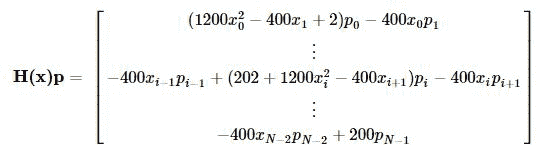

我们定义如下函数并使用牛顿共轭梯度方法寻优：

```py
def rosen_hess_p(x, p):
    x = np.asarray(x)
    Hp = np.zeros_like(x)
    Hp[0] = (1200*x[0]**2 - 400*x[1] + 2)*p[0] - 400*x[0]*p[1]
    Hp[1:-1] = -400*x[:-2]*p[:-2]+(202+1200*x[1:-1]**2-400*x[2:])*p[1:-1] \
               -400*x[1:-1]*p[2:]
    Hp[-1] = -400*x[-2]*p[-2] + 200*p[-1]
    return Hp

res = opt.minimize(rosen, x_0, method='Newton-CG', jac=rosen_der, hessp=rosen_hess_p, options={'xtol': 1e-8, 'disp': True})
print "Result of minimizing Rosenbrock function via Newton-Conjugate-Gradient algorithm (Hessian times arbitrary vector):"
print res

Optimization terminated successfully.
         Current function value: 0.000000
         Iterations: 20
         Function evaluations: 22
         Gradient evaluations: 41
         Hessian evaluations: 58
Result of minimizing Rosenbrock function via Newton-Conjugate-Gradient algorithm (Hessian times arbitrary vector):
  status: 0
 success: True
    njev: 41
    nfev: 22
     fun: 1.47606641102778e-19
       x: array([ 1.,  1.,  1.,  1.,  1.])
 message: 'Optimization terminated successfully.'
    nhev: 58
     jac: array([ -3.62847530e-11,   2.68148992e-09,   1.16637362e-08,
         4.81693414e-08,  -2.76999090e-08])
```

### 3.2. 约束优化问题

无约束优化问题的一种标准形式为：

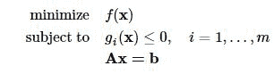

其中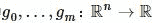为空间上的二次可微的凸函数；`A`为`p×n`矩阵且秩`rankA=p<n`。

我们考察如下一个例子：

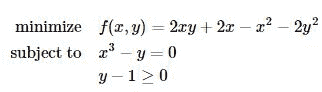

定义目标函数及其导数为：

```py
def func(x, sign=1.0):
    """ Objective function """
    return sign*(2*x[0]*x[1] + 2*x[0] - x[0]**2 - 2*x[1]**2)

def func_deriv(x, sign=1.0):
    """ Derivative of objective function """
    dfdx0 = sign*(-2*x[0] + 2*x[1] + 2)
    dfdx1 = sign*(2*x[0] - 4*x[1])
    return np.array([ dfdx0, dfdx1 ])
```

其中`sign`表示求解最小或者最大值，我们进一步定义约束条件：

```py
cons = ({'type': 'eq',  'fun': lambda x: np.array([x[0]**3 - x[1]]), 'jac': lambda x: np.array([3.0*(x[0]**2.0), -1.0])},
      {'type': 'ineq', 'fun': lambda x: np.array([x[1] - 1]), 'jac': lambda x: np.array([0.0, 1.0])})
```

最后我们使用SLSQP（Sequential Least SQuares Programming optimization algorithm）方法进行约束问题的求解（作为比较，同时列出了无约束优化的求解）：

```py
res = opt.minimize(func, [-1.0, 1.0], args=(-1.0,), jac=func_deriv, method='SLSQP', options={'disp': True})
print "Result of unconstrained optimization:"
print res
res = opt.minimize(func, [-1.0, 1.0], args=(-1.0,), jac=func_deriv, constraints=cons, method='SLSQP', options={'disp': True})
print "Result of constrained optimization:"
print res

Optimization terminated successfully.    (Exit mode 0)
            Current function value: -2.0
            Iterations: 4
            Function evaluations: 5
            Gradient evaluations: 4
Result of unconstrained optimization:
  status: 0
 success: True
    njev: 4
    nfev: 5
     fun: -1.9999999999999996
       x: array([ 2.,  1.])
 message: 'Optimization terminated successfully.'
     jac: array([ -2.22044605e-16,  -0.00000000e+00,   0.00000000e+00])
     nit: 4
Optimization terminated successfully.    (Exit mode 0)
            Current function value: -1.00000018311
            Iterations: 9
            Function evaluations: 14
            Gradient evaluations: 9
Result of constrained optimization:
  status: 0
 success: True
    njev: 9
    nfev: 14
     fun: -1.0000001831052137
       x: array([ 1.00000009,  1.        ])
 message: 'Optimization terminated successfully.'
     jac: array([-1.99999982,  1.99999982,  0.        ])
     nit: 9
```

和统计部分一样，Python也有专门的优化扩展模块，CVXOPT（ http://cvxopt.org ）专门用于处理凸优化问题，在约束优化问题上提供了更多的备选方法。CVXOPT是著名的凸优化教材convex optimization的作者之一，加州大学洛杉矶分校Lieven Vandenberghe教授的大作，是处理优化问题的利器。

SciPy中的优化模块还有一些特殊定制的函数，专门处理能够转化为优化求解的一些问题，如方程求根、最小方差拟合等，可到SciPy优化部分的指引页面查看。

