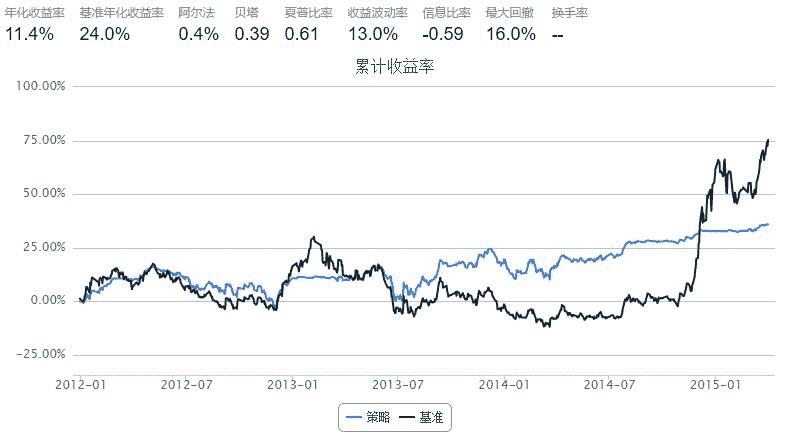

# RSI指标策略

> 来源：https://uqer.io/community/share/549ccfd2f9f06c4bb886323d

## 策略思路

+ 使用talib中的RSI函数计算每只股票过去20天的rsi
+ 当rsi低于30是买入，高于70时卖出
+ 每只股票仓位最多不超过总资金的10%

```py
import talib as ta

start = '2011-12-01'
end   = '2015-04-01'

benchmark = 'SH50'
universe = set_universe('SH50')
capital_base = 5000000
longest_history = 21

def initialize(account):
    account.lower_rsi = 30
    account.upper_rsi = 70
      
def handle_data(account):
    all_close_prices = account.get_attribute_history('closePrice', longest_history)
    
    rsi, c_price, c_amount = {}, {}, {}
    for stock in account.universe:
        rsi[stock] = ta.RSI(all_close_prices[stock], longest_history-1)[-1]
        c_amount[stock] = account.secpos.get(stock, 0)
    
    for stock in account.universe:
        max_amount = int(0.1 * account.referencePortfolioValue / account.referencePrice[stock])  
        amount = min(int(25000./account.referencePrice[stock]), max_amount - c_amount[stock])
        if   (rsi[stock] < account.lower_rsi) and (c_amount[stock] < max_amount):
            order(stock, amount)
        elif (rsi[stock] > account.upper_rsi) and (c_amount[stock] >  0):
            order_to(stock, 0)
```



