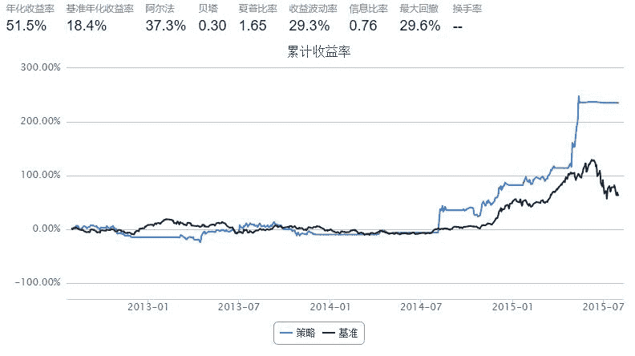

# 4.7 DMI • DMI 指标体系的构建及简单应用

> 来源：https://uqer.io/community/share/561727aaf9f06c4ca92fb5a4

DMI指标又叫动向指标或趋向指标，是通过分析股票价格在涨跌过程中买卖双方力量均衡点的变化情况，即多空双方的力量的变化受价格波动的影响而发生由均衡到失衡的循环过程，从而提供对趋势判断依据的一种技术指标。其由美国技术分析大师威尔斯·威尔德（Wells Wilder）所创造，是一种中长期股市技术分析方法。

DMI指标体系的构建：

```
TR = SUM(MAX(MAX(HIGH - LOW, ABS(HIGH-REF(CLOSE,1))), ABS(LOW - REF(CLOSE, 1))), N)
HD = HIGH - REF(HIGH, 1)
LD = REF(LOW, 1) - LOW
DMP = SUM(IF(HD>0 AND HD>LD, HD, 0), N)
DMM = SUM(IF(LD>0 AND LD>HD, LD, 0), N)
PDI = DMP*100/TR
MDI = DMM*100/TR
DX = ABS(MDI - PDI)/(MDI + PDI)*100
ADX = MA(ABS(MDI - PDI)/(MDI + PDI)*100, M)
```

其中变量与函数定义如下：


+ `CLOSE`：引用收盘价(在盘中指最新价)
+ `HIGH`：引用最高价
+ `LOW`：引用最低价
+ `REF(X, N)`：引用X在N个周期前的值
+ `ABS(X)`：求X的绝对值
+ `MAX(A, B)`：求A，B中的较大者
+ `SUM(X, N)`：得到X在N周期内的总和
+ `IF(C, A, B)`：如果C成立返回A，否则返回B

此外，`PDI`简记为`+DI`，`MDI`简记为`-DI`；参数：`N=14`(默认)，`M=14` (默认)。

实际上从数学上看，`DX`或`ADX`的构建并不一定需要`PDI`与`MDI`，有`DMP`和`DMM`就行了。计算`PDI`与`MDI`是将指标数值控制在0到100之间。

```py
#计算某一天的股票DMP与DMM值
def eq_DMPandDMM(stk_list,current_date,N=14):
    
    cal = Calendar('China.SSE')
    period = '-' + str(N+1) + 'B'
    begin_date = cal.advanceDate(current_date,period,BizDayConvention.Unadjusted)
    end_date = cal.advanceDate(current_date,'-1B',BizDayConvention.Unadjusted)
    
    eq_hd = {}
    eq_ld = {}
    dmp_sum = 0
    dmm_sum = 0
    eq_dmp = {}
    eq_dmm = {}
    
    eq_Price = DataAPI.MktEqudAdjGet(secID=stk_list,beginDate=begin_date.strftime('%Y%m%d'),endDate=end_date.strftime('%Y%m%d'),field=['secID','highestPrice','lowestPrice'],pandas="1")
    
    avaiable_list = eq_Price['secID'].drop_duplicates().tolist()
    
    eq_Price.set_index('secID',inplace=True)
    
    for stk in avaiable_list:
        if len(eq_Price.ix[stk]) == (N+1):
            eq_hd[stk] = np.array(eq_Price.ix[stk]['highestPrice'][1:] - eq_Price.ix[stk]['highestPrice'][:-1])
            eq_ld[stk] = np.array(eq_Price.ix[stk]['lowestPrice'][:-1] - eq_Price.ix[stk]['lowestPrice'][1:])
            for i in xrange(len(eq_ld[stk])):

                if eq_hd[stk][i] > 0 and eq_hd[stk][i] > eq_ld[stk][i]:
                    dmp_sum = dmp_sum + eq_hd[stk][i]
                if eq_ld[stk][i] > 0 and eq_ld[stk][i] > eq_hd[stk][i]:
                    dmm_sum = dmm_sum + eq_ld[stk][i]
                
            eq_dmp[stk] = dmp_sum
            eq_dmm[stk] = dmm_sum
            dmm_sum = 0
            dmp_sum = 0
    return eq_dmp,eq_dmm        
```

```py
#计算某一天股票的TR值
def eq_TR(stk_list,current_date,N=14):
    
    cal = Calendar('China.SSE')
    period = '-' + str(N+1) + 'B'
    begin_date = cal.advanceDate(current_date,period,BizDayConvention.Unadjusted)
    end_date = cal.advanceDate(current_date,'-1B',BizDayConvention.Unadjusted)
    
    eq_hl = {} #HIGH - LOW
    eq_hc = {} #HIGH - CLOSE
    eq_lc = {} #LOW - CLOSE
    eq_tr = {}
    tr_sum = 0
    
    eq_Price = DataAPI.MktEqudAdjGet(secID=stk_list,beginDate=begin_date.strftime('%Y%m%d'),endDate=end_date.strftime('%Y%m%d'),field=['secID','highestPrice','lowestPrice','closePrice'],pandas="1")
    
    avaiable_list = eq_Price['secID'].drop_duplicates().tolist()
    
    eq_Price.set_index('secID',inplace=True)
    
    for stk in avaiable_list:
        if len(eq_Price.ix[stk]) == (N+1):
            eq_hl[stk] = np.array(eq_Price.ix[stk]['highestPrice'][1:] - eq_Price.ix[stk]['lowestPrice'][1:])
            eq_hc[stk] = np.array(eq_Price.ix[stk]['highestPrice'][1:] - eq_Price.ix[stk]['closePrice'][:-1])
            eq_lc[stk] = np.array(eq_Price.ix[stk]['lowestPrice'][:-1] - eq_Price.ix[stk]['closePrice'][1:])
            for i in xrange(len(eq_hl[stk])):
                
                tr_sum = tr_sum + max(max(eq_hl[stk][i],abs(eq_hc[stk][i])),abs(eq_lc[stk][i]))
            
            eq_tr[stk] = tr_sum
            tr_sum = 0
    return eq_tr    
```

```py
#计算某一天股票的ADX
def eq_ADX(stk_list,current_date,N=14):
    cal = Calendar('China.SSE')
    period = '-' + str(N) + 'B'
    begin_date = cal.advanceDate(current_date,period,BizDayConvention.Unadjusted)
    end_date = cal.advanceDate(current_date,'-1B',BizDayConvention.Unadjusted)
    
    timeSeries = cal.bizDatesList(begin_date,end_date)
    
    eq_adx = {}
    adx_sum = 0
    
    #初始化eq_adx
    eq_Price = DataAPI.MktEqudAdjGet(secID=stk_list,beginDate=begin_date.strftime('%Y%m%d'),endDate=end_date.strftime('%Y%m%d'),field=['secID','highestPrice','lowestPrice'],pandas="1")
    
    avaiable_list = eq_Price['secID'].drop_duplicates().tolist()
    
    eq_Price.set_index('secID',inplace=True)
    
    for stk in avaiable_list:
        if len(eq_Price.ix[stk]) == N:
            eq_adx[stk] = 0
            
    #计算ADX
    for i in xrange(len(timeSeries)):
        eq_dmp,eq_dmm = eq_DMPandDMM(stk_list,timeSeries[i],N)
        for stk in eq_dmp:
            if eq_dmp[stk] == 0 and eq_dmm[stk] == 0: #当DMP与DMM都为零时，认为无趋势DX=0
                pass
            else:
                eq_adx[stk] = eq_adx[stk] + abs(eq_dmp[stk] - eq_dmm[stk])/(eq_dmp[stk] + eq_dmm[stk])*100
        
    for stk in eq_adx:
        eq_adx[stk] = eq_adx[stk] / len(timeSeries)
    return eq_adx
```


## 简单应用：

当`DMP`上穿`DMM`时，意味着，上涨倾向强于下跌倾向，一个买入信号生成。反之则反。而`ADX`用于反映趋向变动的程度，在买入信号时，`ADX`伴随上升，则预示股价的涨势可能更强劲。

```py
import numpy as np
import pandas as pd
from CAL.PyCAL import *
start = '2012-08-01'                       # 回测起始时间
end = '2015-08-01'                         # 回测结束时间
benchmark = 'HS300'                        # 策略参考标准
universe = set_universe('HS300')  # 证券池，支持股票和基金
capital_base = 1000000                      # 起始资金
freq = 'd'                                 # 策略类型，'d'表示日间策略使用日线回测，'m'表示日内策略使用分钟线回测
refresh_rate = 20                           # 调仓频率，表示执行handle_data的时间间隔，若freq = 'd'时间间隔的单位为交易日，若freq = 'm'时间间隔为分钟
cal = Calendar('China.SSE')

def initialize(account):                   # 初始化虚拟账户状态
    pass

def handle_data(account):                  # 每个交易日的买入卖出指令
    
    eq_dmp_now,eq_dmm_now = eq_DMPandDMM(account.universe,account.current_date,14)
    eq_adx = eq_ADX(account.universe,account.current_date,14)
    
    yestoday = cal.advanceDate(account.current_date,'-1B',BizDayConvention.Unadjusted)
    
    eq_dmp_before,eq_dmm_before = eq_DMPandDMM(account.universe,yestoday,14)
    eq_adx_before = eq_ADX(account.universe,yestoday,14)
    
    long_bucket = []
    short_bucket = []
    
    for stk in account.universe:
        try:            
            if eq_dmp_now[stk] > eq_dmm_now[stk] and eq_dmp_before[stk] < eq_dmm_before[stk] and eq_adx[stk] > eq_adx_before[stk]:
                long_bucket.append(stk)   
            else:
                short_bucket.append(stk)
        except:
            pass
    

    #调仓逻辑是调仓时将所有满足条件的股票等权
    stk_num = len(account.valid_secpos) + len(long_bucket)
    for stk in account.valid_secpos:
        if stk in short_bucket:
            order_to(stk,0)
            stk_num = stk_num - 1
    
    for stk in account.valid_secpos:
        if stk not in short_bucket:
            order_to(stk,account.referencePortfolioValue/account.referencePrice[stk]/stk_num)
            
    for stk in long_bucket:
        if stk not in account.avail_secpos:
            order_to(stk,account.referencePortfolioValue/account.referencePrice[stk]/stk_num)
```



