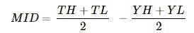
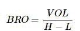
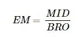
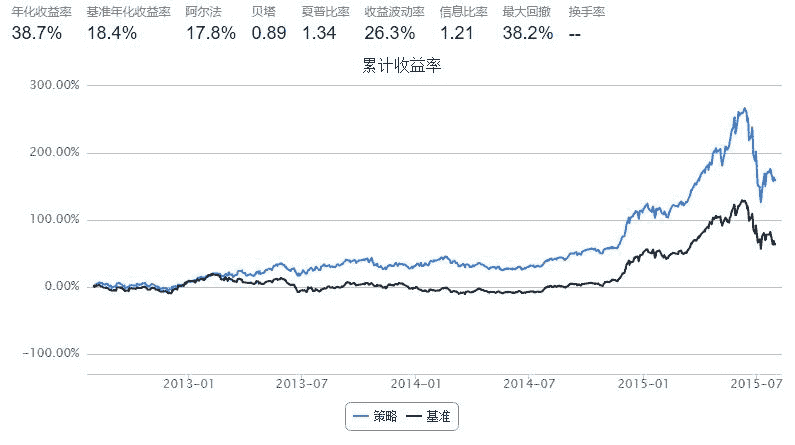
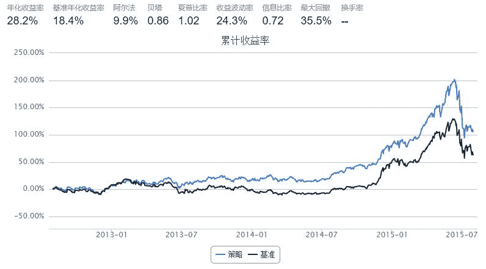

# 4.8 EMV •  EMV 技术指标的构建及应用

简易波动指标（EMV），是为数不多的考虑价量关系的技术指标。它刻画了股价在下跌的过程当中，由于买气不断的萎靡退缩，致使成交量逐渐的减少，EMV 数值也因而尾随下降，直到股价下跌至某一个合理支撑区，捡便宜货的买单促使成交量再度活跃，EMV 数值于是作相对反应向上攀升，当EMV 数值由负值向上趋近于零时，表示部分信心坚定的资金，成功的扭转了股价的跌势，行情不断反转上扬，并且形成另一次的买进讯号。

计算方法：

第一步



这里`TH` 为当天最高价，`TL` 为当天最低价，`YH `为前日最高价，`YL` 为前日最低价。`MID > 0`意味着今天的平均价高于昨天的平均价。

第二步



其中`VOL`代表交易量，`H`、`L`代表同一天的最高价与最低价

第三步



第四步

`EMV = EM`的N日简单移动平均

第五步

`MAEMV = EMV`的M日简单移动平均

```py
def emv(stk_list,current_date,N=14):
    
    cal = Calendar('China.SSE')
    period = '-' + str(N+1) + 'B'
    begin_date = cal.advanceDate(current_date,period,BizDayConvention.Unadjusted)
    end_date = cal.advanceDate(current_date,'-1B',BizDayConvention.Unadjusted)
    
    eq_emv = {}
    eq_mid = {}
    eq_bro = {}

    eq_Market = DataAPI.MktEqudAdjGet(secID=stk_list,beginDate=begin_date.strftime('%Y%m%d'),endDate=end_date.strftime('%Y%m%d'),field=['secID','highestPrice','lowestPrice','turnoverVol'],pandas="1")
    
    avaiable_list = eq_Market['secID'].drop_duplicates().tolist()
    
    eq_Market.set_index('secID',inplace=True)
    
    for stk in avaiable_list:
        if len(eq_Market.ix[stk]) == (N+1):
            eq_mid[stk] = (np.array(eq_Market.ix[stk]['highestPrice'][1:] + eq_Market.ix[stk]['lowestPrice'][1:]) - np.array(eq_Market.ix[stk]['highestPrice'][:-1] + eq_Market.ix[stk]['lowestPrice'][:-1]))/2
            eq_bro[stk] = np.array(eq_Market.ix[stk]['turnoverVol'][1:])/np.array(eq_Market.ix[stk]['highestPrice'][1:] + eq_Market.ix[stk]['lowestPrice'][1:])
            eq_emv[stk] = np.mean(eq_mid[stk]/eq_bro[stk])

    return eq_emv       
```

```py
def maemv(stk_list,current_date,N=14):
    cal = Calendar('China.SSE')
    period = '-' + str(N+1) + 'B'
    end_date = cal.advanceDate(current_date,'-1B',BizDayConvention.Unadjusted)
    start_date =  cal.advanceDate(current_date,period,BizDayConvention.Unadjusted)
    timeSeries = cal.bizDatesList(start_date, end_date)
    eq_maemv = {}
    #初始化eq_maemv字典
    eq_emv = emv(stk_list,end_date,N)
    for stk in eq_emv:
        eq_maemv[stk] = 0
    #仅调用N次emv函数
    for i in xrange(len(timeSeries)):
        eq_emv = emv(stk_list,timeSeries[i],N)
        for stk in eq_emv:
            eq_maemv[stk] = eq_maemv[stk] + eq_emv[stk]
            
    for stk in eq_maemv:
        eq_maemv[stk] = eq_maemv[stk]/N
        
    return eq_maemv
```

## `EMV`指标基本用法

`EMV` 在0 以下表示弱势，在0 以上表示强势；`EMV` 由负转正应买进，由正转负应卖出。

```py
import numpy as np
import pandas as pd
from CAL.PyCAL import *
start = '2012-08-01'                       # 回测起始时间
end = '2015-08-01'                         # 回测结束时间
benchmark = 'HS300'                        # 策略参考标准
universe = set_universe('HS300')  # 证券池，支持股票和基金
capital_base = 1000000                      # 起始资金
freq = 'd'                                 # 策略类型，'d'表示日间策略使用日线回测，'m'表示日内策略使用分钟线回测
refresh_rate = 10                           # 调仓频率，表示执行handle_data的时间间隔，若freq = 'd'时间间隔的单位为交易日，若freq = 'm'时间间隔为分钟
cal = Calendar('China.SSE')

def initialize(account):                   # 初始化虚拟账户状态
    pass

def handle_data(account):                  # 每个交易日的买入卖出指令
    
    eq_emv = emv(account.universe,account.current_date,N=14)
    buylist = []
    for stk in eq_emv:
        if eq_emv[stk] > 0:
            buylist.append(stk)
    
    for stk in account.valid_secpos:
        if stk not in eq_emv or eq_emv[stk] <= 0:
            order_to(stk,0)
        else:
            if stk not in buylist[:]:
                buylist.append(stk)
                
    for stk in buylist:
        order_to(stk,account.referencePortfolioValue/account.referencePrice[stk]/len(buylist))
```



## `EMV`结合`MAEMV`使用

`EMV `上穿`MAEMV` 则买入，`EMV` 下穿`MAEMV` 则卖出。

```py
import numpy as np
import pandas as pd
from CAL.PyCAL import *
start = '2012-08-01'                       # 回测起始时间
end = '2015-08-01'                         # 回测结束时间
benchmark = 'HS300'                        # 策略参考标准
universe = set_universe('HS300')  # 证券池，支持股票和基金
capital_base = 1000000                      # 起始资金
freq = 'd'                                 # 策略类型，'d'表示日间策略使用日线回测，'m'表示日内策略使用分钟线回测
refresh_rate = 10                           # 调仓频率，表示执行handle_data的时间间隔，若freq = 'd'时间间隔的单位为交易日，若freq = 'm'时间间隔为分钟
cal = Calendar('China.SSE')

def initialize(account):                   # 初始化虚拟账户状态
    pass

def handle_data(account):                  # 每个交易日的买入卖出指令
    
    eq_emv = emv(account.universe,account.current_date,14)
    eq_maemv = maemv(account.universe,account.current_date,14)
    buylist = []
    for stk in eq_emv:
        try:
            if eq_emv[stk] > eq_maemv[stk]:
                buylist.append(stk)
        except:
            pass
    
    for stk in account.valid_secpos:
        if stk not in eq_emv or stk not in eq_maemv or eq_emv[stk] <= eq_maemv[stk]:
            order_to(stk,0)
        else:
            if stk not in buylist[:]:
                buylist.append(stk)
                
    for stk in buylist:
        order_to(stk,account.referencePortfolioValue/account.referencePrice[stk]/len(buylist))
```



