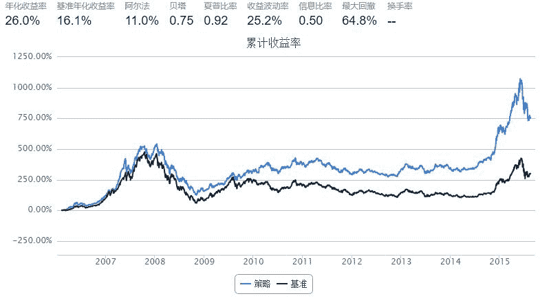

# 4.9 KDJ •  KDJ 策略

> 来源：https://uqer.io/community/share/55d20b3bf9f06c91f818c6ac

```py
import numpy as np
import pandas as pd
from pandas import DataFrame
import talib as ta

start = '2006-01-01'                        # 回测起始时间
end = '2015-08-17'                          # 回测结束时间
benchmark = 'HS300'                         # 策略参考标准
universe = set_universe('HS300')
capital_base = 100000                        # 起始资金
refresh_rate = 1                           # 调仓频率，即每 refresh_rate 个交易日执行一次 handle_data() 函数
longest_history=20
MA=[5,10,20,30,60,120]                       #移动均线参数

def initialize(account):
    account.kdj=[]
    
def handle_data(account):  
   
    # 每个交易日的买入卖出指令
    
    sell_pool=[]
    hist = account.get_history(longest_history)
        #data=DataFrame(hist['600006.XSHG'])
    stock_pool,all_data=Get_all_indicators(hist)
    pool_num=len(stock_pool)
    if account.secpos==None:
        print 'null'
        for i in stock_pool:
            buy_num=int(float(account.cash/pool_num)/account.referencePrice[i]/100.0)*100 
            order(i, buy_num)
    else:
        
        for x in account.valid_secpos:
            if all_data[x].iloc[-1]['closePrice']<all_data[x].iloc[-1]['ma1'] and (all_data[x].iloc[-1]['ma1']-all_data[x].iloc[-1]['closePrice'])/all_data[x].iloc[-1]['ma1']>0.05 :
                sell_pool.append(x)
                order_to(x, 0)
        
        
        
        if account.cash>500 and pool_num>0:
            
            try:
                sim_buy_money=float(account.cash)/pool_num
                for l in stock_pool:
                    #print sim_buy_money,account.referencePrice[l]
            
                    buy_num=int(sim_buy_money/account.referencePrice[l]/100.0)*100
           
                    #buy_num=10000
                    order(l, buy_num)
            except Exception as e:
                #print e
                pass
           

        
def Get_kd_ma(data):
    indicators={}
    #计算kd指标
    indicators['k'],indicators['d']=ta.STOCH(np.array(data['highPrice']),np.array(data['lowPrice']),np.array(data['closePrice']),\
    fastk_period=9,slowk_period=3,slowk_matype=0,slowd_period=3,slowd_matype=0)
    indicators['ma1']=pd.rolling_mean(data['closePrice'], MA[0])
    indicators['ma2']=pd.rolling_mean(data['closePrice'], MA[1])
    indicators['ma3']=pd.rolling_mean(data['closePrice'], MA[2])
    indicators['ma4']=pd.rolling_mean(data['closePrice'], MA[3])
    indicators['ma5']=pd.rolling_mean(data['closePrice'], MA[4])
    indicators['closePrice']=data['closePrice']
    indicators=pd.DataFrame(indicators)
    return indicators

def Get_all_indicators(hist):
    stock_pool=[]
    all_data={}
    for i in hist:
        try:
            indicators=Get_kd_ma(hist[i])
            all_data[i]=indicators
        except Exception as e:
            #print 'error:%s'%e
            pass
        if indicators.iloc[-2]['k']<indicators.iloc[-2]['d'] and indicators.iloc[-1]['k']>indicators.iloc[-2]['d']:
            stock_pool.append(i)
        elif indicators.iloc[-1]['k']>=10 and indicators.iloc[-1]['d']<=20 and indicators.iloc[-1]['k']>indicators.iloc[-2]['k'] and indicators.iloc[-2]['k']<indicators.iloc[-3]['k']:
            stock_pool.append(i)
    return stock_pool,all_data
```



