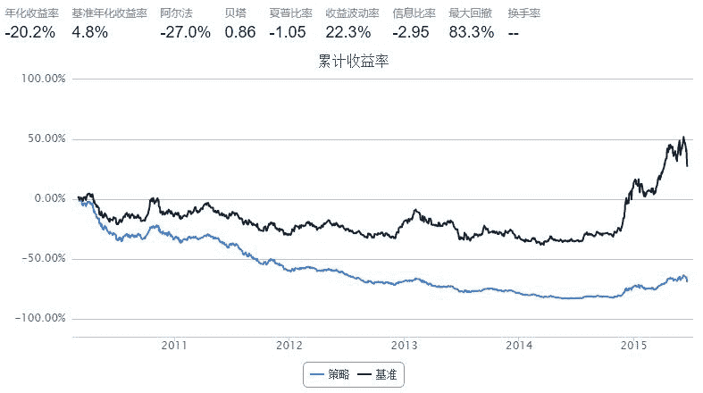

# CMO策略模仿练习2

> 来源：https://uqer.io/community/share/55b4e523f9f06c91f918c5db

```py
import numpy as np

start='2010-01-01'
end='2015-06-20'
benchmark='SH50'
universe=set_universe('SH50')
capital_base=1000000
window=35   # 参数，CMO指标计算周期
def initialize(account):
    pass
def handle_data(account):
    clp=account.get_attribute_history("closePrice",window)
    prc=account.get_attribute_history("preClosePrice",window)
    p=account.referencePrice
    # 计算CMO
    CMO= {}
    for s in account.universe:
        diff=clp[s]-prc[s]
        u=sum(n for n in diff if n>0)
        d=sum(-n for n in diff if n<0)
        if u+d==0: continue
        CMO[s]=(u-d)/(u+d)*100
    # 根据CMO卖出目前持有股票 
    v=account.cash
    for s,a in account.valid_secpos.items():
        if CMO.get(s,0)<0 and s in account.universe:
            order_to(s,0)
            v+=a*p[s]
    # 根据CMO确定买入列表
    buylist= []
    for s in account.universe:
        if CMO.get(s,0)<0 and not np.isnan(p[s]) and s not in account.valid_secpos:
            buylist.append(s) 
    if v > account.referencePortfolioValue * 0.33: # 为了避免调仓过于频繁，仅当可用现金超过账户市值1/3时买入
        for s in buylist:
            order(s, v/len(buylist)/ p[s])
```



