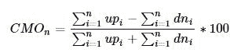
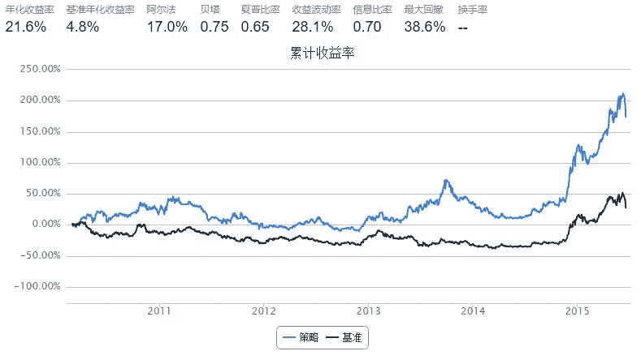
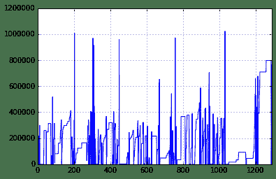
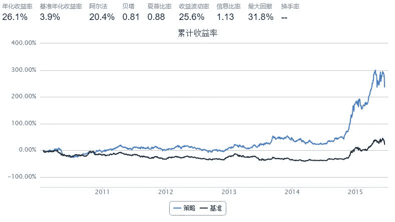

#  [技术指标] CMO 

> 来源：https://uqer.io/community/share/5590d8bdf9f06cb5604f1881

## 指标介绍

+   CMO(Chande Momentum Oscillator)动量震荡指标是由Tushar S. Chande提出的类似于RSI的指标

+    `CMOn`是一个n天滚动指标，在这n天中的第i天计算每天的 收盘价 - 前收盘价 ，如果为正则赋给`upi`（`dni`为0），为负则将绝对值赋给`dni`（`upi`为0）

+   其计算公式为：

    
    
## 策略思路

+ 计算上证50成分股当中所有股票过去n天的CMO

+ CMO大于0时买入，小于0时卖出

+ 根据一定的调仓原则进行调仓，细节见代码

## 可进一步挖掘的点

+ 考虑CMO的形态，如上/下穿0线作为买卖信号

+ 扩大股票池范围，观察CMO与股票池的关系，比如区分大小盘股观察CMO的有效性

+ 股票权重的分配方式

+ 其他调仓原则

## 先来看看最简单的情况

```py
import numpy as np

start = '2010-01-01'
end = '2015-06-20'
benchmark = 'SH50'
universe = set_universe('SH50')
capital_base = 1000000

window = 35    # 参数，CMO指标计算周期

def initialize(account):
    pass

def handle_data(account):
    clp = account.get_attribute_history('closePrice', window)
    prc = account.get_attribute_history('preClosePrice', window)
    p = account.referencePrice

    # 计算CMO
    CMO = {}
    for s in account.universe:
        diff = clp[s] - prc[s]
        u = sum(n for n in diff if n > 0)
        d = sum(-n for n in diff if n < 0)
        if u + d == 0: continue
        CMO[s] = (u - d) / (u + d) * 100
   
    # 根据CMO卖出目前持有股票
    v = account.cash
    for s,a in account.valid_secpos.items():
        if CMO.get(s, 0) < 0 and s in account.universe:
            order_to(s, 0)
            v += a * p[s]
            
    # 根据CMO确定买入列表
    buylist = []
    for s in account.universe:
        if CMO.get(s, 0) > 0 and not np.isnan(p[s]) and s not in account.valid_secpos:
            buylist.append(s)
    
    # 根据买入列表和可用现金买入股票
    if v > account.referencePortfolioValue * 0.33: # 为了避免调仓过于频繁，仅当可用现金超过账户市值1/3时买入
        for s in buylist:
            order(s, v / len(buylist) / p[s])
```



上面的策略实现了策略思路所表述的意思，使用了非常简单的调仓原则，其表现还不错

但是，其中的关键参数 `window` 为什么设置为 35 呢？

这当然不是拍脑袋拍出来的，而是通过参数调试出来的:

```
window   annualized_return   sharpe   max_drawdown
  10         0.0052          -0.1377     0.4944
  15         0.1817           0.5284     0.3388
  20         0.1925           0.5850     0.3404
  25         0.1914           0.5835     0.2956
  30         0.2094           0.6053     0.4516
  35         0.2156           0.6468     0.3856
  40         0.0610           0.0970     0.5264
  45         0.1980           0.5728     0.4872
  50         0.1730           0.4632     0.5166
```

从上面的调试结果中可以看到，当 `window = 35` 时，夏普和最大回撤相对而言最好，因此有了最上面的那个策略

然而调试完了`window`，这个策略就没有优化空间了吗？不，我们还可以根据这个策略的表现来分析一下这个策略的缺陷在哪里，并加以改进

因为该策略的调仓原则是买入所有产生的信号，并没有对持仓进行限制，这会造成两个方面的影响：

1.  仓位中的股票可能会有很多只，这样资金会比较分散，削弱信号的效果

1.  如果买入信号比较少，而卖出信号比较多的话，现金的利用率会比较低

那么到底是否存在上述问题呢？我们可以通过最大持仓数量和现金走势来加以判断

```py
x = map(len, bt['security_position'].tolist())
max(x)

42
```

```py
bt.cash.plot()

<matplotlib.axes.AxesSubplot at 0x6053cd0>
```



从上面的两个cell中可以看出这两个问题还是比较明显的。为了解决这两个问题，我们对策略进行优化：一是限制最大持仓位10只股票，二是每次卖出的现金都平均分配给目前仓位中的股票和即将买入的股票

```py
import numpy as np
from heapq import nlargest

start = '2010-01-01'
end = '2015-06-20'
benchmark = 'SH50'
universe = set_universe('SH50')
capital_base = 1000000

max_n  = 10    # 参数，最大持仓数量 
window = 15    # 参数，CMO指标计算周期

def initialize(account):
    pass

def handle_data(account):
    clp = account.get_attribute_history('closePrice', window)
    prc = account.get_attribute_history('preClosePrice', window)
    p = account.referencePrice

    # 计算CMO
    CMO = {}
    for s in account.universe:
        diff = clp[s] - prc[s]
        u = sum(n for n in diff if n > 0)
        d = sum(-n for n in diff if n < 0)
        if u + d == 0: continue
        CMO[s] = (u - d) / (u + d) * 100
   
    # 根据CMO卖出目前持有股票
    n = len(account.valid_secpos)
    sellist = []
    for s,a in account.valid_secpos.items():
        if CMO.get(s, 0) < 0 and s in account.universe:
            order_to(s, 0)
            n -= 1
            sellist.append(s)
            
    if n >= max_n: # 如果超过最大持仓，则不买入
        return
             
    # 根据CMO确定买入列表
    buylist = []
    for s in account.universe:
        if CMO.get(s, 0) > 0 and not np.isnan(p[s]) and s not in account.valid_secpos:
            buylist.append(s)
    
    # 根据最大持仓数量确定买入列表数量，按CMO排序选较大的部分
    if len(buylist) + n > max_n:
        buylist = nlargest(max_n - n, buylist, key=CMO.get)
    
    # 将资金重新分配到新买入的与已持有的股票中
    buylist += [s for s in account.valid_secpos if s not in sellist]
    amount = {}
    for s in buylist:
        amount[s] = account.referencePortfolioValue / len(buylist) / p[s] - account.valid_secpos.get(s, 0)
    
    # 根据应调数量买卖股票，先卖出后买入
    for s in sorted(amount, key=amount.get):
        order(s, amount[s])
```



```
window   annualized_return   sharpe   max_drawdown
  10         0.0830           0.1789     0.4101
  15         0.2606           0.8783     0.3182
  20         0.1726           0.5180     0.3689
  25         0.2190           0.6762     0.3508
  30         0.2067           0.6376     0.3725
  35         0.1676           0.5040     0.3550
  40         0.1416           0.4086     0.4478
  45         0.1927           0.5926     0.4001
  50         0.1183           0.3215     0.4030
```

从上面的图表可以看出其表现相比最初的策略有了不少改善。其中 `window = 15` 是最适合目前调仓原则的参数。

但是这些优化的初衷是为了解决股票数量和资金利用率的问题，我们仍然通过最大持仓数量和现金走势来判断

```py
x = map(len, bt['security_position'].tolist())
max(x)

10
```

```py
bt.cash.plot()

<matplotlib.axes.AxesSubplot at 0x5a48fd0>
```

!](img/8DjEAXQMXIa20AAAAASUVORK5CYII=.png)

以上是对CMO这个技术指标进行的一些简单的回测，并且针对策略本身的特点进行了一定的优化。在最前面列出了一些可挖掘的点，如果想进行更深入的研究还是有很多东西可以做的。

