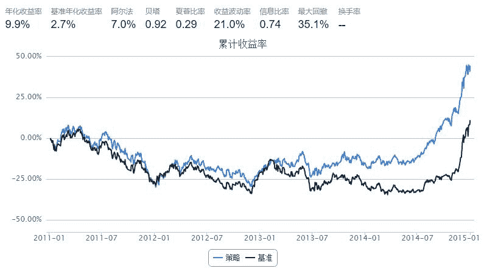

# 4.11 FPC •  FPC 指标选股

> 来源：https://uqer.io/community/share/55a4bcb4f9f06c6dd1e17f19

```py
import pandas as pd
fields = ['tradeDate', 'secID', 'OperatingProfitRatio', 'ROE', 'InventoryTRate', 'ARTRate', 'TotalAssetsTRate', 'OperatingRevenueGrowRate', 'OperatingProfitGrowRate', 'NetProfitGrowRate', 'NetAssetGrowRate', 'DebtsAssetRatio', 'CurrentRatio', 'QuickRatio']

weights = [15.0, 20.0, 0.07, 0.07, 0.06, 8.0, 8.0, 8.0, 8.0, 0.07, 0.07, 0.07]

def FPCCalculator(x):
    sumRes = 0
    for name, weight in zip(fields[2:], weights):
        sumRes += x[name] * weight
    return sumRes

start = '2011-01-01'                       # 回测起始时间
end = '2015-01-01'                         # 回测结束时间
benchmark = 'HS300'                        # 策略参考标准
universe = set_universe('HS300', start)  # 证券池，回测支持股票和基金
capital_base = 100000000                  # 起始资金
refresh_rate = 60                         # 调仓频率，即每 refresh_rate 个交易日执行一次 handle_data() 函数

def initialize(account):                   # 初始化虚拟账户状态
    pass

def handle_data(account):                  # 每个交易日的买入卖出指令
    
    hist = account.get_attribute_history('closePrice',1)
    print account.current_date
    today = account.current_date
    cal = Calendar('China.SSE')
    referenceDate = cal.advanceDate(today, '-1b', BizDayConvention.Preceding).strftime('%Y%m%d')
    res = pd.DataFrame()
    for stock in account.universe:
        data = DataAPI.MktStockFactorsDateRangeGet(secID=stock, beginDate=referenceDate, endDate=referenceDate, field=fields)
        res = res.append(data.dropna())
    res = res.reset_index(drop=True)
    res = res.set_index('secID')
    ind = DataAPI.EquIndustryGet(secID=res.index.values, industryVersionCD='010303', intoDate=referenceDate)
    ind = ind.set_index('secID')
    res['industry'] = ind.industryName1
    res['score'] = res.apply(FPCCalculator, 1)
    grouped = res[['industry', 'score']].groupby('industry')
    
    buyList = []
    # 只选行业中股票个数大于5个行业分类
    for key, group in grouped:
        if len(group) >= 5:
            group['score'] = group['score'] - group['score'].mean() 
            group = group.sort('score', ascending=False)
            buyList.append((key, group.index[0], group.score[0]))
        
    # 先卖出
    for stock in account.valid_secpos:
        order_to(stock, 0)
        
    # 再买入
    totalValue = account.referencePortfolioValue
    cashForEachStock = totalValue / (len(buyList) + 1)
    
    for key, name, score in buyList:
        amount = int(cashForEachStock / hist[name] / 100) * 100
        print "{0:<20s}: {1:s}, {2:f}, {3:d}".format(key, name, score, amount) 
        order(name, amount)
```



```
2011-01-05 00:00:00
交运设备        : 600418.XSHG, 277.876645, 640800
交通运输        : 600350.XSHG, 33.614389, 1559300
信息服务        : 600271.XSHG, 19.515397, 249400
公用事业        : 600863.XSHG, 261.666837, 1671100
农林牧渔        : 000061.XSHE, 15.004222, 658100
化工              : 000422.XSHE, 187.995211, 475200
医药生物        : 002007.XSHE, 67.818000, 135500
商业贸易        : 002024.XSHE, 12.686739, 495900
家用电器        : 000651.XSHE, 6.061078, 822600
建筑建材        : 600528.XSHG, 33.795187, 709800
房地产           : 600266.XSHG, 44.695256, 637600
有色金属        : 600547.XSHG, 417.523861, 120400
机械设备        : 000039.XSHE, 35.414604, 295900
采掘              : 000933.XSHE, 46.406670, 398200
食品饮料        : 000858.XSHE, 19.308545, 203000
2011-04-08 00:00:00
交运设备        : 000927.XSHE, 128.086565, 783700
交通运输        : 601111.XSHG, 40.021770, 609200
信息服务        : 600271.XSHG, 18.897618, 284900
公用事业        : 600863.XSHG, 264.298228, 1622300
农林牧渔        : 000061.XSHE, 15.004222, 649600
化工              : 000422.XSHE, 11.132274, 421800
医药生物        : 600216.XSHG, 15.584448, 335300
商业贸易        : 002024.XSHE, 10.290995, 481100
家用电器        : 000651.XSHE, 5.837902, 623700
建筑建材        : 601117.XSHG, 19.892445, 838900
房地产           : 000897.XSHE, 32.173353, 1113200
有色金属        : 600547.XSHG, 949.914380, 118200
机械设备        : 000157.XSHE, 30.560292, 526900
采掘              : 600188.XSHG, 19.870549, 179800
钢铁              : 000709.XSHE, 130.212328, 1520200
食品饮料        : 600300.XSHG, 100.285020, 1076800
2011-07-05 00:00:00
交运设备        : 600104.XSHG, 30.278670, 359900
交通运输        : 600029.XSHG, 159.996161, 804300
信息服务        : 600271.XSHG, 18.554824, 256400
公用事业        : 600900.XSHG, 30.288765, 964700
农林牧渔        : 000876.XSHE, 16.770247, 314800
化工              : 000059.XSHE, 52.574421, 440800
医药生物        : 600518.XSHG, 14.594103, 904600
商业贸易        : 002024.XSHE, 10.591486, 474500
家用电器        : 000651.XSHE, 10.057383, 595800
建筑建材        : 600585.XSHG, 19.600357, 231400
房地产           : 000631.XSHE, 40.536041, 1370900
有色金属        : 600111.XSHG, 109.240872, 255400
机械设备        : 000039.XSHE, 57.594695, 290000
采掘              : 601001.XSHG, 15.730951, 350000
钢铁              : 600516.XSHG, 407.299490, 551700
食品饮料        : 600132.XSHG, 17.648762, 105700
2011-09-28 00:00:00
交运设备        : 600104.XSHG, 21.918292, 381800
交通运输        : 600221.XSHG, 63.193351, 1851600
信息服务        : 600271.XSHG, 14.206672, 211700
公用事业        : 600674.XSHG, 25.243519, 1662700
农林牧渔        : 000876.XSHE, 24.967820, 279200
化工              : 000059.XSHE, 25.787124, 568800
医药生物        : 600518.XSHG, 15.576307, 793800
商业贸易        : 002024.XSHE, 8.403357, 528100
家用电器        : 000651.XSHE, 9.330746, 631900
建筑建材        : 600585.XSHG, 306.156492, 316400
房地产           : 000631.XSHE, 31.578629, 1362600
有色金属        : 600111.XSHG, 200.004115, 290700
机械设备        : 000039.XSHE, 53.399231, 348500
采掘              : 600188.XSHG, 28.178807, 194500
钢铁              : 000898.XSHE, 2738.223747, 1032200
食品饮料        : 600809.XSHG, 18.768502, 156500
2011-12-28 00:00:00
交运设备        : 600104.XSHG, 17.063323, 385900
交通运输        : 000089.XSHE, 35.753107, 1126000
信息服务        : 600588.XSHG, 14.781967, 473400
公用事业        : 000685.XSHE, 46.858354, 805300
农林牧渔        : 000876.XSHE, 26.901091, 281600
化工              : 000422.XSHE, 26.961147, 393900
医药生物        : 600518.XSHG, 16.171002, 839200
商业贸易        : 600694.XSHG, 34.616035, 158900
建筑建材        : 600585.XSHG, 34.849863, 325600
房地产           : 000631.XSHE, 36.914683, 1842100
有色金属        : 000807.XSHE, 263.555174, 958000
机械设备        : 600031.XSHG, 29.957499, 410900
采掘              : 601001.XSHG, 12.862060, 383400
钢铁              : 600307.XSHG, 26.649657, 1276300
食品饮料        : 600300.XSHG, 25.273663, 1180800
2012-03-30 00:00:00
交运设备        : 600104.XSHG, 18.909886, 426800
交通运输        : 000089.XSHE, 35.166259, 1278400
信息服务        : 600271.XSHG, 16.981212, 314400
公用事业        : 000685.XSHE, 48.707469, 871200
化工              : 000422.XSHE, 28.601842, 413000
医药生物        : 600518.XSHG, 15.576615, 867900
商业贸易        : 600694.XSHG, 32.895471, 212700
建筑建材        : 600585.XSHG, 20.132624, 371300
房地产           : 000402.XSHE, 36.743106, 936400
有色金属        : 000612.XSHE, 3797.404448, 760600
机械设备        : 600031.XSHG, 27.121428, 466400
采掘              : 601001.XSHG, 11.694587, 432800
钢铁              : 600010.XSHG, 81.043473, 1722100
食品饮料        : 600300.XSHG, 24.462883, 813200
2012-07-02 00:00:00
交运设备        : 600066.XSHG, 28.154927, 670000
交通运输        : 000089.XSHE, 39.622036, 1276300
信息服务        : 600588.XSHG, 34.751230, 504100
公用事业        : 000685.XSHE, 35.456503, 856900
化工              : 600251.XSHG, 24.002774, 567000
医药生物        : 600196.XSHG, 14.593144, 512900
商业贸易        : 600694.XSHG, 17.596119, 168100
家用电器        : 000100.XSHE, 162.404051, 2648600
建筑建材        : 600585.XSHG, 22.135445, 368200
房地产           : 600663.XSHG, 59.464286, 431300
有色金属        : 600456.XSHG, 186.015637, 274800
机械设备        : 600031.XSHG, 28.231175, 399400
采掘              : 600123.XSHG, 8.183554, 307700
钢铁              : 600307.XSHG, 31.022309, 1541900
食品饮料        : 600519.XSHG, 23.296690, 25300
2012-09-24 00:00:00
交运设备        : 600150.XSHG, 86.708491, 234500
交通运输        : 000089.XSHE, 39.383480, 1313100
信息服务        : 600271.XSHG, 80.422510, 337800
公用事业        : 000685.XSHE, 35.061598, 963300
化工              : 000422.XSHE, 20.686581, 413900
医药生物        : 600518.XSHG, 18.695275, 634200
商业贸易        : 600694.XSHG, 34.618859, 136600
家用电器        : 000651.XSHE, 14.583746, 537700
建筑建材        : 601117.XSHG, 11.177778, 773300
房地产           : 000046.XSHE, 907.969889, 1432000
有色金属        : 600456.XSHG, 57.602414, 290200
机械设备        : 000157.XSHE, 27.342064, 635600
采掘              : 600123.XSHG, 9.754217, 290300
钢铁              : 000825.XSHE, 43.268790, 1516400
食品饮料        : 002304.XSHE, 19.892648, 63800
2012-12-24 00:00:00
交运设备        : 600066.XSHG, 26.100632, 614600
交通运输        : 601107.XSHG, 116.863379, 1556200
信息服务        : 600271.XSHG, 48.157093, 378300
公用事业        : 600008.XSHG, 58.545444, 1219100
化工              : 000422.XSHE, 16.611969, 460200
医药生物        : 600518.XSHG, 25.176992, 777700
商业贸易        : 600694.XSHG, 24.983091, 170800
家用电器        : 000651.XSHE, 18.691066, 433900
建筑建材        : 601117.XSHG, 15.471286, 647900
房地产           : 600895.XSHG, 294.473466, 754600
有色金属        : 601899.XSHG, 147.629408, 1435300
机械设备        : 600312.XSHG, 325.920975, 680700
采掘              : 600123.XSHG, 9.751122, 266000
钢铁              : 000825.XSHE, 88.335062, 1438800
食品饮料        : 600519.XSHG, 21.102387, 25900
2013-03-28 00:00:00
交运设备        : 600150.XSHG, 38.141684, 255100
交通运输        : 601107.XSHG, 124.017399, 1667100
信息服务        : 600271.XSHG, 37.765484, 379400
公用事业        : 600011.XSHG, 70.219799, 848200
农林牧渔        : 000876.XSHE, 126.213409, 422400
化工              : 600309.XSHG, 20.922440, 309400
医药生物        : 600518.XSHG, 23.752800, 585800
商业贸易        : 002024.XSHE, 17.212139, 796100
家用电器        : 000651.XSHE, 17.939662, 408700
建筑建材        : 601117.XSHG, 15.867114, 552900
房地产           : 600895.XSHG, 294.490930, 811000
有色金属        : 601899.XSHG, 144.656562, 1639000
机械设备        : 600312.XSHG, 304.909865, 581300
采掘              : 600583.XSHG, 55.129969, 802800
钢铁              : 000825.XSHE, 123.683741, 1554900
食品饮料        : 600519.XSHG, 21.180904, 36000
2013-07-02 00:00:00
交运设备        : 000625.XSHE, 114.535214, 552700
交通运输        : 000089.XSHE, 41.398885, 1385600
信息服务        : 600804.XSHG, 7.150407, 422300
公用事业        : 601139.XSHG, 271.722329, 581200
化工              : 600309.XSHG, 34.933967, 311000
医药生物        : 600518.XSHG, 8.240444, 498800
商业贸易        : 600694.XSHG, 25.571651, 184100
家用电器        : 000651.XSHE, 11.454882, 447500
建筑建材        : 601668.XSHG, 20.426365, 1637400
房地产           : 000046.XSHE, 35.341020, 1079900
有色金属        : 601899.XSHG, 139.891359, 2220300
机械设备        : 600312.XSHG, 97.669502, 512400
采掘              : 600583.XSHG, 33.244083, 748900
钢铁              : 600019.XSHG, 93.875140, 1296600
食品饮料        : 000895.XSHE, 17.037947, 193200
2013-09-26 00:00:00
交运设备        : 000625.XSHE, 142.122140, 558000
交通运输        : 000089.XSHE, 44.337186, 1395800
信息服务        : 600804.XSHG, 13.150377, 303700
公用事业        : 600886.XSHG, 36.863455, 1607000
化工              : 600309.XSHG, 25.442594, 367000
医药生物        : 600196.XSHG, 11.686152, 438500
商业贸易        : 600655.XSHG, 6.632367, 651100
建筑建材        : 600528.XSHG, 25.614124, 1033400
房地产           : 002244.XSHE, 48.302567, 1420900
有色金属        : 600489.XSHG, 876.140851, 584300
机械设备        : 600312.XSHG, 118.116765, 585800
采掘              : 600583.XSHG, 36.158939, 793600
钢铁              : 000825.XSHE, 10.851036, 2157800
食品饮料        : 600519.XSHG, 13.133058, 47600
2013-12-26 00:00:00
交运设备        : 000625.XSHE, 89.622325, 495200
交通运输        : 000089.XSHE, 41.127229, 1326900
信息服务        : 600804.XSHG, 18.757929, 406600
公用事业        : 600027.XSHG, 111.988911, 2078600
化工              : 600352.XSHG, 27.120396, 908000
医药生物        : 600161.XSHG, 20.161769, 262600
商业贸易        : 600500.XSHG, 9.151041, 810200
建筑建材        : 600585.XSHG, 40.048519, 347000
房地产           : 000046.XSHE, 31.540756, 1305800
有色金属        : 600497.XSHG, 26.848059, 602300
机械设备        : 600312.XSHG, 49.129871, 573500
采掘              : 600583.XSHG, 38.696328, 755100
钢铁              : 000825.XSHE, 1.620364, 2231100
食品饮料        : 600519.XSHG, 15.203512, 50900
2014-03-28 00:00:00
交通运输        : 000089.XSHE, 57.025247, 1288900
公用事业        : 600886.XSHG, 29.920482, 1177500
化工              : 600352.XSHG, 34.851128, 663100
医药生物        : 600664.XSHG, 8.847229, 861800
商业贸易        : 600694.XSHG, 10.188886, 203400
国防军工        : 000768.XSHE, 15.368459, 584700
建筑装饰        : 600820.XSHG, 47.412512, 994900
房地产           : 000046.XSHE, 38.909941, 1148300
有色金属        : 600497.XSHG, 28.310791, 573100
机械设备        : 600835.XSHG, 16.508934, 257400
汽车              : 000625.XSHE, 86.397775, 552900
电气设备        : 600312.XSHG, 35.927563, 402100
计算机           : 600100.XSHG, 8.826704, 530600
采掘              : 600583.XSHG, 58.070124, 669400
钢铁              : 000825.XSHE, 1.617123, 2131300
食品饮料        : 600519.XSHG, 16.279505, 35700
2014-06-26 00:00:00
交通运输        : 000089.XSHE, 37.823741, 1315200
公用事业        : 600674.XSHG, 34.934140, 842600
化工              : 600352.XSHG, 29.599356, 680000
医药生物        : 002007.XSHE, 15.935101, 196000
商业贸易        : 000061.XSHE, 858.871568, 512100
国防军工        : 600118.XSHG, 6.488620, 284900
家用电器        : 600839.XSHG, 71.112703, 1583000
建筑装饰        : 601186.XSHG, 8.365248, 1104900
房地产           : 600239.XSHG, 564.094438, 1540200
有色金属        : 600111.XSHG, 29.080872, 375500
机械设备        : 000528.XSHE, 15.807318, 841400
汽车              : 000951.XSHE, 1596.494204, 421700
电气设备        : 002202.XSHE, 12.785842, 534100
计算机           : 000021.XSHE, 14.081832, 839100
采掘              : 600583.XSHG, 48.024740, 672600
钢铁              : 601003.XSHG, 28.696162, 2283900
食品饮料        : 600519.XSHG, 22.505981, 34000
2014-09-19 00:00:00
交通运输        : 000089.XSHE, 37.736841, 1403600
公用事业        : 600674.XSHG, 25.079282, 787100
化工              : 600688.XSHG, 188.636319, 1673400
医药生物        : 000623.XSHE, 17.549571, 363500
商业贸易        : 000061.XSHE, 123.977950, 555100
国防军工        : 600118.XSHG, 6.782743, 273900
建筑装饰        : 601186.XSHG, 5.159384, 1216400
房地产           : 600239.XSHG, 6068.206329, 1379400
有色金属        : 000969.XSHE, 46.723918, 616600
机械设备        : 000039.XSHE, 14.453034, 414400
汽车              : 000625.XSHE, 25.819080, 486400
电气设备        : 002202.XSHE, 33.252376, 570900
计算机           : 000021.XSHE, 36.036769, 946700
采掘              : 601001.XSHG, 52.806971, 961500
钢铁              : 600005.XSHG, 40.192879, 2705800
食品饮料        : 600519.XSHG, 26.104634, 39300
2014-12-19 00:00:00
交通运输        : 000089.XSHE, 27.584352, 1245200
公用事业        : 600674.XSHG, 53.839932, 800900
化工              : 600352.XSHG, 40.059302, 891300
医药生物        : 000623.XSHE, 15.455563, 234000
商业贸易        : 000061.XSHE, 52.779162, 640700
国防军工        : 600879.XSHG, 3.075249, 484500
家用电器        : 000100.XSHE, 9.096006, 2101200
建筑装饰        : 600068.XSHG, 6.882331, 929000
房地产           : 600239.XSHG, 67.767563, 1517300
有色金属        : 601168.XSHG, 132.989485, 894800
机械设备        : 000039.XSHE, 19.252980, 348100
汽车              : 000625.XSHE, 21.574376, 476200
电气设备        : 002202.XSHE, 47.553600, 613000
计算机           : 600588.XSHG, 10.384352, 336200
采掘              : 600583.XSHG, 41.950386, 818900
钢铁              : 600005.XSHG, 46.425391, 2349100
食品饮料        : 600132.XSHG, 30.739120, 472600
```

