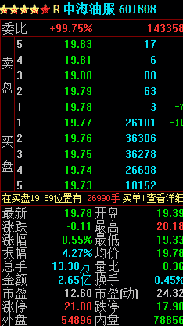

# 4.13 委比 • 实时计算委比

> 来源：https://uqer.io/community/share/55bf0426f9f06c91fc18c62f

最近几个交易日，大盘又是一片惨淡，然而我们发现郭嘉队并没有猛拉指数，转而是对部分股票托底。比如中海油服：



风格的转变，意味着郭嘉队转攻为守，让我们看看都有哪些股票值得郭嘉队托底

```py
# 常量准备
import pandas as pd
from datetime import datetime as dt
from pandas import DataFrame, Series
today = dt.today().strftime('%Y%m%d')   # 获得今天的日期

# DataAPI取所有A股
stocks = DataAPI.EquGet(equTypeCD='A',listStatusCD='L',field='secID,nonrestfloatA',pandas="1")
universe = stocks['secID'].tolist()    # 转变为list格式，以便和DataAPI中的格式符合

# 取所有A股的最新行情
bidask_fields = ['bidBook_volume%s' %i for i in xrange(1, 6)] + ['askBook_volume%s' %i for i in xrange(1, 6)]
fields = ['shortNM','lastPrice','bidBook','askBook','suspension']

def get_data():
    data = DataFrame()
    for i in range(0,len(universe),300):   # 原则上可以性取完的，但是试验中作者发现会报错，估计是运算量太大，所以这里分批次取，每次300个
        t = DataAPI.MktTickRTSnapshotGet(securityID=universe[i:min(i+300,len(universe))],field=fields,pandas="1")
        tmp = DataFrame()
        tmp['secID'] = t['ticker']+'.'+t['exchangeCD']
        tmp[['shortNM','suspension'] + bidask_fields] =t[['shortNM', 'suspension']+bidask_fields]
        data = pd.concat([data,tmp],axis=0)   # 数据拼接

    # 去掉当日停牌的股票 
    data['nonrestfloatA'] = stocks['nonrestfloatA']
    data = data[data['suspension']==0]

    data = data[(data['bidBook_volume1']>0).values & (data['askBook_volume1']>0).values]


    # 去掉没有涨停板的股票
    data['bidBook_volume'] = sum([data['bidBook_volume%s' %i] for i in xrange(1,6)])
    data['askBook_volume'] = sum([data['askBook_volume%s' %i] for i in xrange(1,6)])

    # 计算委比
    data['rate'] = data['bidBook_volume']/(data['askBook_volume']+data['bidBook_volume'])*100   #百分之几
    data = data.sort(columns='rate',ascending=False).reset_index()
    data.drop('index',axis=1,inplace=True)

    # 重命名
    data = data[['secID', 'shortNM', 'bidBook_volume', 'askBook_volume', 'rate']]
    data.columns = ['代码','简称','买量','卖量','委比']
    return data

get_data().head(50)
```


| | 代码 | 简称 | 买量 | 卖量 | 委比 |
| --- | --- | --- | --- | --- | --- |
| 0  |  601336.XSHG |   新华保险 |  14310780 |   24700 |  99.827700 |
| 1  |  600485.XSHG |   信威集团 |   2086200 |    4100 |  99.803856 |
| 2  |  600188.XSHG |   兖州煤业 |  38015538 |   98746 |  99.740921 |
| 3  |  601808.XSHG |   中海油服 |  16845821 |   44700 |  99.735355 |
| 4  |  600362.XSHG |   江西铜业 |  20343390 |   56935 |  99.720911 |
| 5  |  600958.XSHG |   东方证券 |   4069182 |   12972 |  99.682227 |
| 6  |  600340.XSHG |   华夏幸福 |  12797790 |   54800 |  99.573627 |
| 7  |  000951.XSHE |   中国重汽 |   1964684 |    9600 |  99.513748 |
| 8  |  002304.XSHE |   洋河股份 |   2943430 |   15200 |  99.486249 |
| 9  |  600276.XSHG |   恒瑞医药 |   2230015 |   12500 |  99.442590 |
| 10 |  000538.XSHE |   云南白药 |   1798287 |   10200 |  99.435993 |
| 11 |  002143.XSHE |   印纪传媒 |   2813406 |   16335 |  99.422739 |
| 12 |  000800.XSHE |   一汽轿车 |   9174799 |   56199 |  99.391193 |
| 13 |  601958.XSHG |   金钼股份 |  20460168 |  127809 |  99.379206 |
| 14 |  000513.XSHE |   丽珠集团 |    881306 |    5600 |  99.368591 |
| 15 |  603288.XSHG |   海天味业 |   6049140 |   39340 |  99.353862 |
| 16 |  300202.XSHE |   聚龙股份 |   1145291 |    7600 |  99.340788 |
| 17 |  601800.XSHG |   中国交建 |  29915478 |  208100 |  99.309179 |
| 18 |  600403.XSHG |   大有能源 |   8768385 |   61500 |  99.303502 |
| 19 |  601225.XSHG |   陕西煤业 |  57038023 |  406943 |  99.291595 |
| 20 |  601098.XSHG |   中南传媒 |   7902047 |   58400 |  99.266373 |
| 21 |  601226.XSHG |   华电重工 |   4604601 |   35200 |  99.241347 |
| 22 |  600600.XSHG |   青岛啤酒 |   1887900 |   15673 |  99.176654 |
| 23 |  601688.XSHG |   华泰证券 |  11673583 |   97299 |  99.173392 |
| 24 |  000895.XSHE |   双汇发展 |  17718527 |  154080 |  99.137899 |
| 25 |  601555.XSHG |   东吴证券 |  14508868 |  127897 |  99.126194 |
| 26 |  300003.XSHE |   乐普医疗 |   2355404 |   20971 |  99.117521 |
| 27 |  600429.XSHG |   三元股份 |   6761469 |   61600 |  99.097180 |
| 28 |  000333.XSHE |   美的集团 |   9583724 |   89633 |  99.073403 |
| 29 |  600004.XSHG |   白云机场 |   3333050 |   32000 |  99.049048 |
| 30 |  600637.XSHG |   东方明珠 |   2020400 |   19420 |  99.047955 |
| 31 |  600741.XSHG |   华域汽车 |  15412841 |  150590 |  99.032411 |
| 32 |  600166.XSHG |   福田汽车 |  14485200 |  146445 |  98.999121 |
| 33 |  002594.XSHE |    比亚迪 |   2961400 |   29967 |  98.998217 |
| 34 |  000750.XSHE |   国海证券 |  13826732 |  146800 |  98.949442 |
| 35 |  600664.XSHG |   哈药股份 |   7654217 |   81506 |  98.946369 |
| 36 |  601186.XSHG |   中国铁建 |  24479602 |  265911 |  98.925417 |
| 37 |  600519.XSHG |   贵州茅台 |    894254 |    9741 |  98.922450 |
| 38 |  601901.XSHG |   方正证券 |  11906346 |  132861 |  98.896431 |
| 39 |  002081.XSHE |  金 螳 螂 |   6156885 |   69107 |  98.890024 |
| 40 |  600660.XSHG |   福耀玻璃 |   3706300 |   44600 |  98.810952 |
| 41 |  000869.XSHE |  张  裕Ａ |   3073749 |   37483 |  98.795236 |
| 42 |  002431.XSHE |   棕榈园林 |   1556637 |   19100 |  98.787869 |
| 43 |  002221.XSHE |   东华能源 |   2483500 |   30600 |  98.782865 |
| 44 |  000685.XSHE |   中山公用 |   8005948 |  100200 |  98.763901 |
| 45 |  002122.XSHE |   天马股份 |   5874886 |   74210 |  98.752584 |
| 46 |  000600.XSHE |   建投能源 |   8612256 |  109140 |  98.748595 |
| 47 |  002663.XSHE |   普邦园林 |   7862104 |  101141 |  98.729902 |
| 48 |  600823.XSHG |   世茂股份 |   7544949 |   97251 |  98.727448 |
| 49 |  002252.XSHE |   上海莱士 |   1819900 |   23600 |  98.719826 |

可以看到里面不乏贵州茅台，美的集团，张裕A等十几倍市盈率的现金牛企业。这也就反映了个股正处在严重两极分化的过程，郭嘉队和主力更亲睐于优质蓝筹。

由于这里计算委比时，只是针对买卖五档行情，所以有一定的失真，而且在行情软件上按照委比排序，效果更直观。那为什么还要搞得这么复杂呢？

因为不想错过发生过的委比结果，因为还想对当天整个的委比情况做分析。

下面的代码通过一个`while`循环，每隔10秒打印一次委比前30的股票名称：

```py
import time
import datetime

full_data = DataFrame()

while 1:
    now = datetime.datetime.now()
    if now.hour>=15:
        break
    
    data = DataFrame()
    time_str =  '%2s%2s%2s' %(now.hour, now.minute, now.second)
    
    try:
        data = get_data()[:30]
        data['time'] = time_str
    except Exception,e:
        print e

    if data.empty:
        continue
        
    full_data = full_data.append(data)
    print now, ', '.join([ e for e in data['简称'].values])
    
    time.sleep(10)
    
2015-08-03 14:01:36.452456 广发证券, 张  裕Ａ, 江铃汽车, 比亚迪, 兖州煤业, 云南白药, 海天味业, 信威集团, 东华能源, 中集集团, 美邦服饰, 万华化学, 华电国际, 申万宏源, 陕国投Ａ, 环旭电子, 华域汽车, 一汽轿车, 哈药股份, 陕西煤业, 聚龙股份, 日出东方, 誉衡药业, 格力电器, 深圳燃气, 徐工机械, 新 和 成, 建投能源, 康恩贝, 驰宏锌锗
2015-08-03 14:01:48.711193 广发证券, 兖州煤业, 张  裕Ａ, 江铃汽车, 云南白药, 中集集团, 海天味业, 格力电器, 中国西电, 比亚迪, 贵人鸟, 美邦服饰, 东华能源, 万华化学, 哈药股份, 华电国际, 申万宏源, 贵州茅台, 陕国投Ａ, 华域汽车, 陕西煤业, 日出东方, 誉衡药业, 聚龙股份, 新 和 成, 深圳燃气, 建投能源, 驰宏锌锗, 一汽轿车, 国海证券
2015-08-03 14:02:01.886604 广发证券, 兖州煤业, 张  裕Ａ, 中集集团, 东吴证券, 江铃汽车, 华电国际, 海天味业, 云南白药, 中国西电, 万华化学, 申万宏源, 国海证券, 比亚迪, 东华能源, 互动娱乐, 哈药股份, 日出东方, 华域汽车, 环旭电子, 双汇发展, 誉衡药业, 格力电器, 陕国投Ａ, 深圳燃气, 东方能源, 新 和 成, 一汽轿车, 驰宏锌锗, 聚龙股份
2015-08-03 14:02:12.446392 中集集团, 广发证券, 云南白药, 兖州煤业, 张  裕Ａ, 东吴证券, 江铃汽车, 丽珠集团, 信威集团, 金 融 街, 海天味业, 华电国际, 双汇发展, 互动娱乐, 哈药股份, 万华化学, 上海医药, 华域汽车, 新华保险, 日出东方, 国海证券, 贵人鸟, 冠农股份, 申万宏源, 驰宏锌锗, 誉衡药业, 深圳燃气, 上海莱士, 徐工机械, 一汽轿车
2015-08-03 14:02:25.053561 张  裕Ａ, 云南白药, 中集集团, 东吴证券, 兖州煤业, 广发证券, 丽珠集团, 首航节能, 双汇发展, 金 融 街, 海天味业, 万华化学, 华电国际, 东方能源, 互动娱乐, 哈药股份, 日出东方, 中煤能源, 上海医药, 环旭电子, 华域汽车, 国海证券, 誉衡药业, 申万宏源, 贝因美, 深圳燃气, 聚龙股份, 浙大网新, 一汽轿车, 上海莱士
2015-08-03 14:02:36.258301 中集集团, 张  裕Ａ, 云南白药, 兖州煤业, 广发证券, 万华化学, 丽珠集团, 海天味业, 中文传媒, 互动娱乐, 中国西电, 一汽轿车, 东华能源, 哈药股份, 东吴证券, 华电国际, 格力电器, 金 融 街, 日出东方, 华域汽车, 国海证券, 誉衡药业, 申万宏源, 深圳燃气, 科力远, 陕国投Ａ, 二三四五, 上海莱士, 粤电力Ａ, 驰宏锌锗
2015-08-03 14:02:46.940336 中集集团, 张  裕Ａ, 云南白药, 兖州煤业, 中文传媒, 广发证券, 万华化学, 丽珠集团, 贵州茅台, 尚荣医疗, 日出东方, 一汽轿车, 东吴证券, 东方能源, 康恩贝, 哈药股份, 金 融 街, 海天味业, 中国神华, 华域汽车, 中国西电, 互动娱乐, 誉衡药业, 上海医药, 闰土股份, 申万宏源, 深圳燃气, 科力远, 聚龙股份, 二三四五
---------------------------------------------------------------------------
KeyboardInterrupt                         Traceback (most recent call last)
<mercury-input-27-f8d02897ce95> in <module>()
     24     print now, ', '.join([ e for e in data['简称'].values])
     25 
---> 26     time.sleep(10)
     27 

KeyboardInterrupt: 
```

本贴的实现参考于社区高人 @明轩 @jiang.wei 的涨停板帖子。

