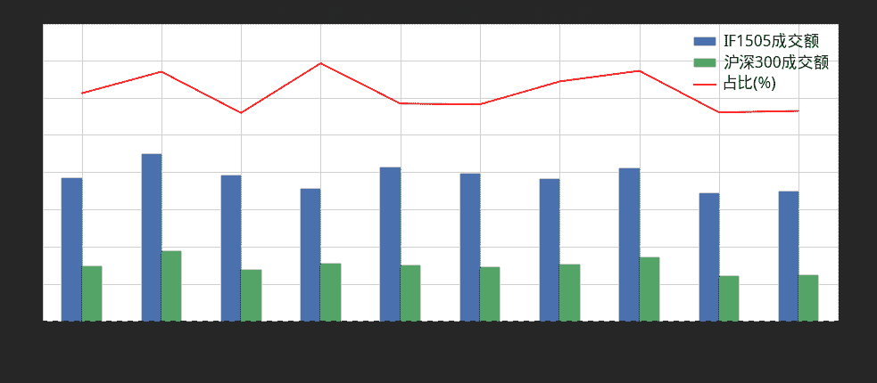
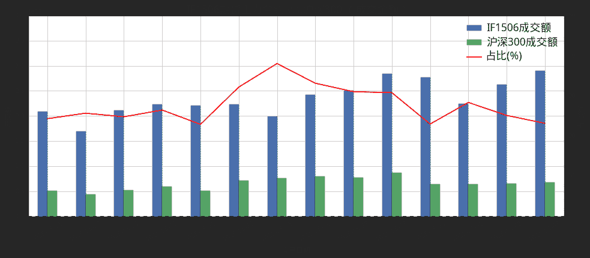
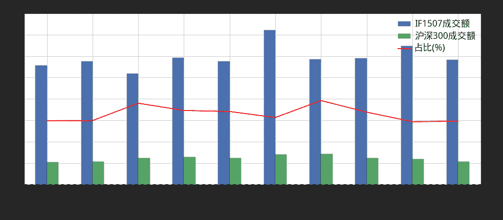
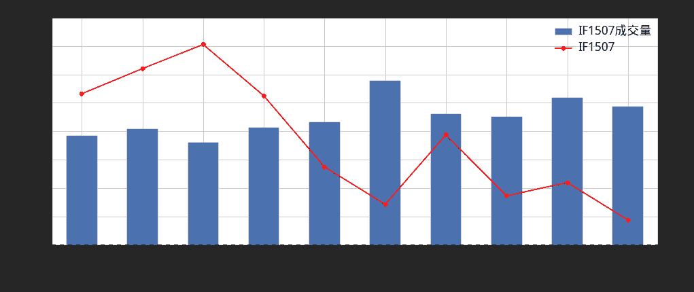

# 4.15 成交量 • 决战之地， IF1507 ！

> 来源：https://uqer.io/community/share/559a44a1f9f06cb5604f1902

> 本文试图通过股指期货主力合约的成交量价分析，找出6月下旬以来暴跌的线索。本文的思路受[癫狂的IF1507成日交易额巨量金融怪兽 远超现货](http://finance.sina.com.cn/money/gzqh/20150704/093822590895.shtml)的启发，但是并不局限于此。
> 
> 链接的文章中，没有考虑期货合约主力切换时对成交量的变化。同时原文中，未能将期指7月合约的成交量与过往主力合约进行对比，使得结论的立据不足。
> 
> 结论仍然含有很多作者本人的猜测。欲得出更可靠的结果，需要精细的分析买卖盘口等深度数据。

```py
import pandas as pd
import seaborn as sns
sns.set_style('white')
from CAL.PyCAL import *
from matplotlib import pylab
```

1. 期货主力合约成交变化趋势

市场参与者猜测在6月下旬开始的暴跌中，股指期货主力合约是罪魁祸首。天量的期货空头，压制了多头的艰难上攻，引发了现货市场一泻千里的惨象。这里我们并不打算讨论这一运行逻辑，只打算从数据出发，分析是否真的在6月市场上出现了期货空头集中出击的局面。

下图中，我们绘制了从2015年4月开始到2015年6月为止的期货主力合约成交金额与现货成交金额对比图：

+ IF150X成交额：当月期货主力合约成交金额；
+ 沪深300成交额：沪深300成分股总成交金额，用于指示现货市场的成交额；
+ 占比(%)：现货市场成交金额占期货市场成交金额比例。

```py
contractMonths = [5,6,7]
allRes = []
for cMonth in contractMonths:
    contractName = 'IF150' + unicode(cMonth)
    beginDate = Date.NthWeekDay(3,Friday,cMonth-1,2015).strftime('%Y%m%d')
    endDate = Date(2015,cMonth,3).strftime('%Y%m%d')
    futRes = DataAPI.MktFutdGet(ticker=contractName, beginDate=beginDate, endDate = endDate, field=['tradeDate','closePrice' ,'turnoverVol','turnoverValue'])
    futRes = futRes.set_index(['tradeDate'])
    idxRes = DataAPI.MktIdxdGet(ticker='000300', beginDate=beginDate, endDate = endDate,field=['tradeDate','closeIndex','turnoverVol','turnoverValue'])
    idxRes = idxRes.set_index(['tradeDate'])
    totalRes = pd.merge(futRes, idxRes, left_index=True, right_index=True)
    totalRes.columns = [contractName, contractName + ' turn over vol', contractName + u' turn over value', u'HS300', u'HS300 turn over vol', u'HS300 turn over value',]
    totalRes[u'Per.(%)'] = totalRes[u'HS300 turn over value'] / totalRes[contractName + u' turn over value'] * 100
    font.set_size(12)
    pylab.figure(figsize = (16,6))
    ax1 = totalRes.plot(y=['Per.(%)'], secondary_y= ['Per.(%)'], style='r')
    ax2 = totalRes.plot(y=[contractName + ' turn over value', 'HS300 turn over value'], kind='bar',legend=False, rot=30)
    patches2, labels2 = ax2.get_legend_handles_labels()
    ax2.set_ylabel(u'成交额', fontproperties=font)
    ax2.set_ylim((0.0,4.0e12))
    ax1.set_ylim((0.0, 50.0))
    ax2.set_xlabel(u'交易日期', fontproperties=font)
    ax1.set_ylabel(u'占比(%)', fontproperties=font)
    patches1, labels1 = ax1.get_legend_handles_labels()
    ax1.legend(patches2 + patches1, [contractName + u'成交额', u'沪深300成交额', u'占比(%)'], prop = font, loc='best')
    font.set_size(18)
    pylab.title(contractName + u'期货主力合约 v.s.沪深300 （成交金额）', fontproperties=font)
    allRes.append(totalRes)
```







可以观察到，在上面3张系列图中，有以下值得关注的变化：

+ 期货主力成交金额显著上升，从日均2万亿上升至日均3万亿；
+ 现货成交量较为稳定，日均在5千亿到1万亿之间；
+ 现货成交与期货成交占比显著下降，从4月份的40%左右，下降至5月份的30%左右，直至6月份的20%左右。

从上面的分析确实可以得出，特别是在6月份，以现货市场的交易为基准，期货主力合约交易显著放大。如果我们假设原先市场是整体中性的，即现货市场与期货市场整体对冲均衡。那么这两个月以来的期货新加入者，很有可能是在6月下旬以来，通过裸卖空等手段，做空市场的主力。

## 2. IF1507期货价量变化趋势

下面的图简单描述了IF1507合约自成为主力合约以来的价量变化趋势。整体来说，IF1507一直呈下跌趋势，而这一趋势中也伴随着整体成交量的上升。

```py
font.set_size(12)
pylab.figure(figsize = (16,6))
ax2 = allRes[-1].plot(y=['IF1507'], secondary_y=['IF1507'], style='ro-', )
ax1 = allRes[-1].plot(y=['IF1507 turn over vol'], kind='bar', rot =30)
ax1.set_ylabel(u'成交量', fontproperties=font)
ax2.set_ylabel('IF1507')
patches, labels = ax1.get_legend_handles_labels()
patches2, labels2 = ax2.get_legend_handles_labels()
ax1.legend(patches + patches2, [u'IF1507成交量', u'IF1507'], prop = font, loc='best')
ax1.set_ylim((0.0,4000000))
ax1.set_xlabel(u'交易日期', fontproperties=font)
font.set_size(18)
pylab.title(contractName + u'IF1507合约走势以及成交量', fontproperties=font)
```



## 3. 结语

本文简单的通过趋势分析，得出来市场的空头6月下旬以来通过期货主力合约IF1507，集中出击，打压大盘的结论。但是这里面也含有作者本人的很多猜测。事实上，我们无法得出新增加的期货参与者，到底是空头还是多头。更准确的市场多空力量角斗图，需要精细化的分析，例如买卖盘口等深度数据。

